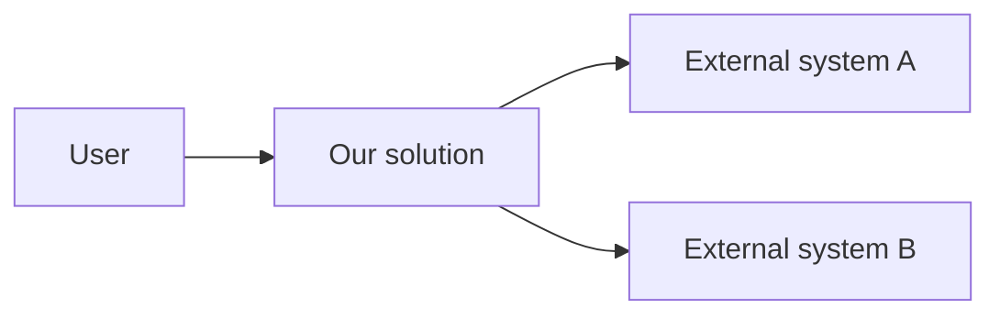

<!--
Scaffolding starter for agents/{agent}/templates/blueprint.template.md.
-->
---
feature-id: {feature-slug}
agent: d365-ce
phase: DESIGN
schema-version: blueprint.v1
gates-passed: [PLAN_CLARIFIED]
---

# Blueprint — {Feature Name}

<!-- TOC AUTO-GENERATED BY doc_lint -->
<!-- /TOC -->

## AI Summary

The architectural picture for this feature: what's added, what's modified, what's referenced.

## 1. System context (C4 Level 1)



Replace placeholders with actuals.

## 2. Containers (C4 Level 2)

Major deployable units this feature touches. Per-platform: solution layers (CE), models (F&O), Function Apps / Logic Apps (integration), workspaces (reporting).

## 3. Components (C4 Level 3)

Inside each container. Per-platform: plugins, JS, BPFs (CE); classes, forms, services (F&O); function-app + LA + topic + APIM (integration); datasets + dataflows + reports (reporting).

## 4. Sequence diagrams

For each cross-component or cross-system interaction.

```mermaid
sequenceDiagram
    Actor->>+ComponentA: action
    ComponentA->>+ComponentB: forward
    ComponentB-->>-ComponentA: result
    ComponentA-->>-Actor: response
```

## 5. Cross-agent dependencies

Diagram showing which other agents this feature consumes outputs from / produces handoffs to.

## 6. Architectural decision references

ADRs that govern decisions visible in this blueprint (link by ID + title).

## 7. Brownfield mode (if applicable)

When `project.config.yaml mode: brownfield`, this section shows the existing architecture (from `_brownfield/docs/`) with the planned additions highlighted.

## Quality self-check appendix

<!-- Populated inline by /blueprint at end of generation per ADR-0001. doc_lint enforces presence. -->

