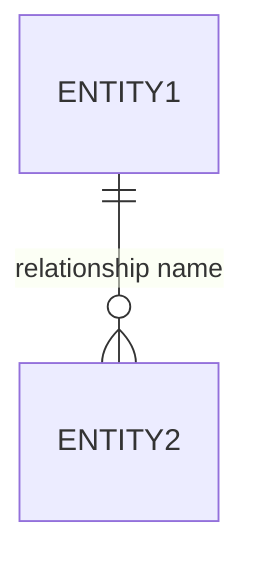

<!--
model-driven.template.md - SUB-PLATFORM PACK
Assembled into _index.template.md by /fdd per ADR-0005 when project.config.yaml has modelDriven in scope.
Sections filled here populate §4 (UI / Functional design) and §7 (Entity Model) of the unified domain FDD.
-->

## §4 UI / Functional design — model-driven sub-platform

### §4.1 Forms (per entity, per feature)

For each in-scope entity, this section lists:
- Form name + form type (Main / Quick Create / Quick View / Card)
- Per-role variant (when role-targeted)
- Tabs + sections + fields (table)
- Mockup link: `fdd-assets/mockups/{entity-form}.html` (HTML mockup produced by [fdd-helpers/form-mockup-generator.prompt.md](../fdd-helpers/form-mockup-generator.prompt.md))

<!-- feature-id: {feature-slug} -->

| Entity | Form | Type | Role | Mockup |
|---|---|---|---|---|

### §4.2 Validation rules (per feature; appended)

Table-shaped section. Every row carries `feature-id` column (hidden from rendered view but present in source). `/alm push --feature X` filters by this column.

| Entity | Field | Rule | Implementation (BR / JS / Plugin) | Severity | feature-id |
|---|---|---|---|---|---|

### §4.3 Business Process Flows

| BPF Name | Primary Entity | Stages | Branching | feature-id |
|---|---|---|---|---|

### §4.4 Views (per feature; appended)

| Entity | View Name | Type (System / Public / Personal) | Columns | Filter | feature-id |
|---|---|---|---|---|---|

### §4.5 Form mockups gallery

Auto-populated by `/fdd` after invoking [fdd-helpers/form-mockup-generator.prompt.md](../fdd-helpers/form-mockup-generator.prompt.md) for each entity in §4.1. Outputs land at `projects/{p}/d365-ce/fdd-assets/mockups/{entity-form}.html` (organised by entity, not by feature, since entities are domain-level).

### §4.6 Process Definitions (per R19 A4)

#### §4.6.1 Classic workflows
| Name | Trigger | Scope | Steps | feature-id |
|---|---|---|---|---|

#### §4.6.2 Business Rules (form-side)
| Entity | Form | Rule | Condition | Action | feature-id |
|---|---|---|---|---|---|

#### §4.6.3 Custom Workflow Activities (CWA)
| Activity Class | Inputs | Outputs | feature-id |
|---|---|---|---|

### §4.7 Power Automate Flows (CE-bound) (per R19 A5)

CE-bound flows live here; standalone Azure Logic Apps live in the integration agent's FDD.

| Flow Name | Trigger | Key Actions | Child Flows? | Error Path | feature-id |
|---|---|---|---|---|---|

### §4.8 Plugins / JS / Custom WF Activities scope listing (per R19 A6)

Scope only — full details in TDD §5.

| Type | Name | Entity | Message | Stage | feature-id |
|---|---|---|---|---|---|

### §4.9 Templates (Email / Word / Excel / Mail-merge) (per R19 A7)

| Template Type | Name | Entity | Purpose | feature-id |
|---|---|---|---|---|

## §7 Entity Model (per R19 A10 — beefed up)

### §7.1 Entity list
| Entity (schema name) | Display Name | Ownership | Activities? | Audit? | feature-id |
|---|---|---|---|---|---|

### §7.2 Per-entity field tables
One sub-section per entity. Fields table: Schema Name | Display Name | Type | Required | Default | feature-id

### §7.3 Relationships

### §7.4 Alternate keys per entity
| Entity | Alternate Key Columns | Purpose | feature-id |
|---|---|---|---|

### §7.5 Plugin / Workflow registrations per entity
| Entity | Plugin / Workflow | Message | Stage | feature-id |
|---|---|---|---|---|

### §7.6 BPF binding per entity
| Entity | BPF | Default? | feature-id |
|---|---|---|---|

### §7.7 Server-side sync rules
(Outlook / Server-Side Sync configuration per entity when applicable)

### §7.8 Duplicate-detection rules per entity
| Entity | Rule Name | Matching Criteria | feature-id |
|---|---|---|---|

### §7.9 Primary form mapping per role / app
| Role | Entity | Primary Form | App | feature-id |
|---|---|---|---|---|
