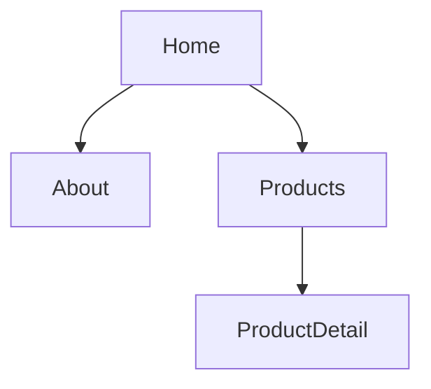

<!--
power-pages.template.md - SUB-PLATFORM PACK
Body content per [constitution/03-power-pages-standards.md].
-->

## §4 UI / Functional design — Power Pages sub-platform

### §4.P.1 Site information

<!-- feature-id: {feature-slug} -->

| Site Name | URL | Identity Providers | Default Language | feature-id |
|---|---|---|---|---|

### §4.P.2 Page hierarchy

| Page | URL Slug | Web Template | Parent | Authenticated? | feature-id |
|---|---|---|---|---|---|

### §4.P.3 Web templates

| Template | Layout Shape | Used by Pages | feature-id |
|---|---|---|---|

### §4.P.4 Content snippets

| Snippet Key | Type (HTML / Text) | Multilingual? | feature-id |
|---|---|---|---|

### §4.P.5 Web files (assets)

| File Path | Type (CSS / JS / Image) | Bundle? | feature-id |
|---|---|---|---|

### §4.P.6 Entity forms / lists

| Form/List Name | Bound Entity | Web Page(s) | Privilege | feature-id |
|---|---|---|---|---|

## §6 Security additions (Power Pages)

### §6.P.1 Web role matrix

| Web Role | Description | Authenticated? | Default for Self-Service? | feature-id |
|---|---|---|---|---|

### §6.P.2 Table permission matrix

| Entity | Web Role | Scope (Contact/Self/Parent/Global) | Privileges (R/W/C/D) | feature-id |
|---|---|---|---|---|

## §9 Multilingual (when `multilingual.portal: true`)

### §9.P.1 Per-language content snippets coverage

| Snippet Key | en-US | other-lang-1 | other-lang-2 | feature-id |
|---|---|---|---|---|

### §9.P.2 RTL languages

When any supported language is RTL: document the per-page layout impact + the language-switcher behaviour.
