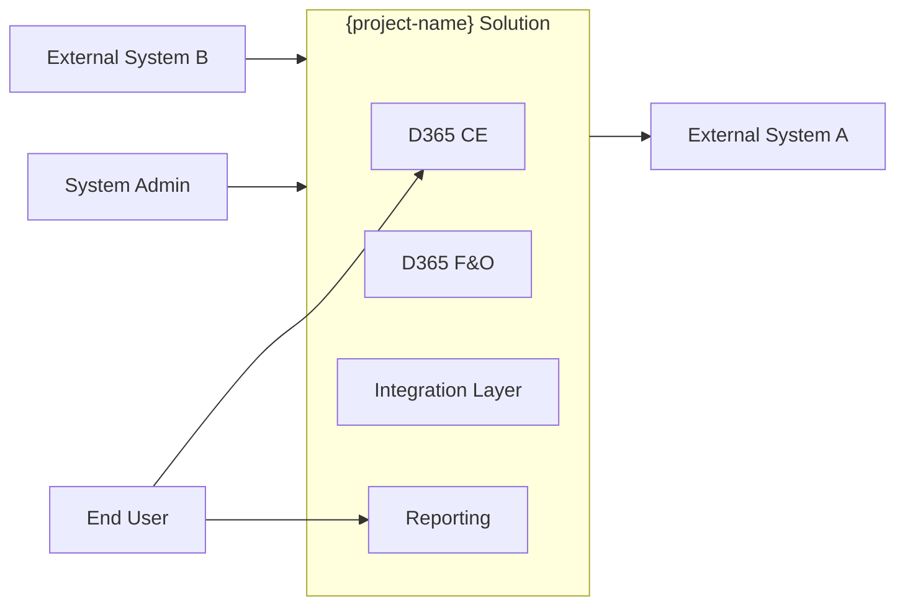
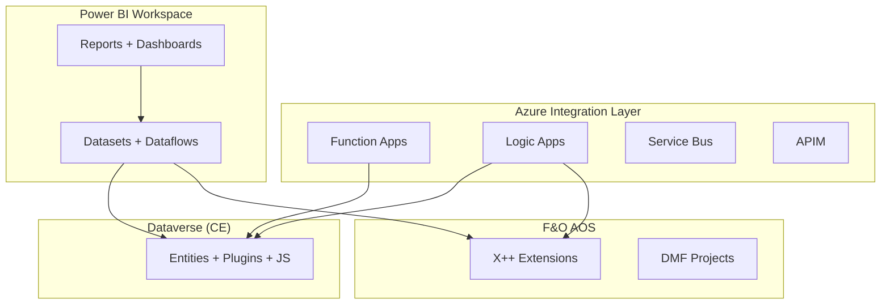

# Solution Blueprint — {project-name}

> Cross-agent unified architecture per [constitution/01-architecture-principles.md](../constitution/01-architecture-principles.md) and [02-aggregation-rules.md](../constitution/02-aggregation-rules.md). Synthesised from per-agent `blueprint.md` files.

## AI Summary

Aggregates {N agents} ({list}). System has {C containers} across {M modules}. Cross-agent integration contracts: {K}. Outstanding gaps from `/solution-review`: {G blockers, W warnings}.

---

## 1. System Context (C4 Level 1)

(Placeholders — populated at run time from per-agent blueprints.)

## 2. Containers (C4 Level 2)

## 3. Components per agent (C4 Level 3)

### 3.1 d365-ce

(Diagram + table from `projects/{p}/d365-ce/blueprint.md`.)

### 3.2 d365-fo

(Diagram + table from `projects/{p}/d365-fo/features/*/blueprint.md`.)

### 3.3 integration

(Diagram + table from `projects/{p}/integration/blueprint.md`.)

### 3.4 reporting

(Diagram + table from `projects/{p}/reporting/blueprint.md`.)

## 4. Cross-agent integration contracts

Per [01-architecture-principles.md § Principle 5](../constitution/01-architecture-principles.md):

| Contract ID | Source agent / artefact | Target agent / consumption | Schema reference | SLA | Retry policy |
|---|---|---|---|---|---|
| C-001 | integration: `LeadCreated` event on Service Bus | d365-ce: `Lead` entity plugin (LeadCreatedHandler) | integration TDD §3.2 | Real-time, < 5s P95 | exponential backoff, max 3 |

## 5. Reconciled NFR matrix

Per [01-architecture-principles.md § Principle 4](../constitution/01-architecture-principles.md):

| Component | NFR | Per-agent target | Reconciled target | Notes |
|---|---|---|---|---|
| CE entity Lead | P95 response | 2000 ms | 2000 ms | OK |
| Integration LeadCreated event | end-to-end latency | 5000 ms | 5000 ms | OK |
| Lead-to-Quote end-to-end journey | P95 | n/a | < 8000 ms | sum: CE 2s + integration 3s + CE 3s |

## 6. ADR list (cross-agent)

| ADR | Title | Cited by |
|---|---|---|
| ADR-0001 | `/review` scoped to spec only | all agents |
| ADR-0006 | docScope: domain vs feature | d365-ce, d365-fo, integration, reporting |

## 7. Brownfield mode (when applicable)

When `project.config.yaml mode: brownfield`, this section renders side-by-side as-is + to-be views per [01-architecture-principles.md § Principle 6](../constitution/01-architecture-principles.md). The as-is content is sourced from `_brownfield/docs-generated/architecture/solution-blueprint.md`.

## 8. Quality self-check

<!-- Populated inline by /solution-blueprint at end of generation. -->

## Cross-references

- Source per-agent blueprints: `projects/{p}/{agent}/blueprint.md` (one per agent per agents-enabled)
- Gap analysis: [Estimation-...-not-applicable — this aggregator's gap report is]: `solution-review-report.md`
- Visual prototype: `solution-prototype/index.html`
