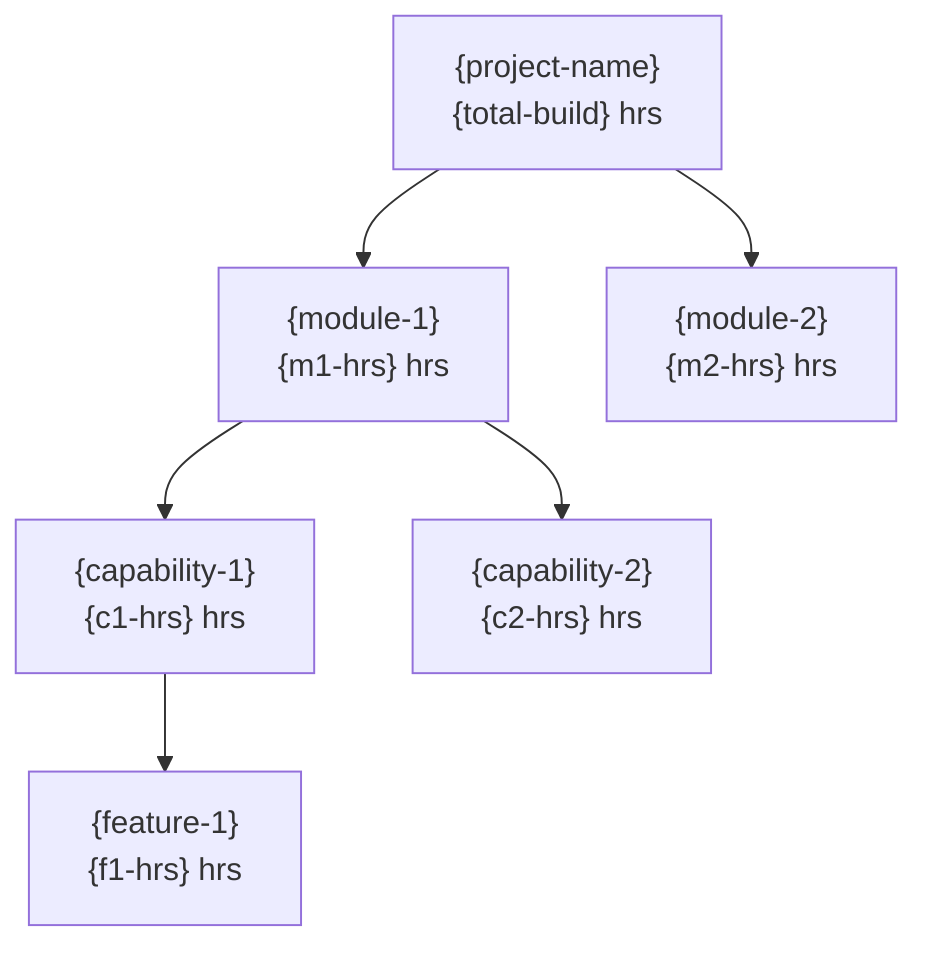

# Module Overall Hours — {project-name}

> **The stakeholder deliverable.** Single comprehensive document that customers sign off. Five sections per [ADR-0009](../../../design/adr/0009-solution-estimate-consolidated.md) and [constitution/01-template-alignment.md](../constitution/01-template-alignment.md) Output 3.

## AI Summary

Total project estimate: **{H} hours** with confidence band **±{P}%**. {N modules}, {R inventory rows}, derived from {M source files}. {one-line headline summary}.

## §1 Module Overall Hours

**Confidence Band: ±{P}%**

*Derivation: {pct1}% of inventory at Fully Detailed (±10%) + {pct2}% at High (±15%) + {pct3}% at Medium (±20%) + {pct4}% at Low (±30%) + {pct5}% at Placeholder (±40%) → weighted ±{P}%.*

*Bands: Placeholder ±40% / Low ±30% / Medium ±20% / High ±15% / Fully Detailed ±10%.*

| Module / Feature | Org Build & UT Hrs | Plan Hrs (×0.07) | Analyze Hrs (×0.21) | Design Hrs (×0.38) | Test Prep Hrs (×0.25) | Test Exe Hrs (×0.35) | Test/Dev Fix Hrs (×0.35) | Deploy Hrs (×0.15) | Total Project Hrs |
|---|---:|---:|---:|---:|---:|---:|---:|---:|---:|
| {module-1} | {build} | {build*0.07} | {build*0.21} | {build*0.38} | {build*0.25} | {build*0.35} | {build*0.35} | {build*0.15} | **{build*2.76}** |
| ... | | | | | | | | | |
| **Total** | **{total-build}** | **{total*0.07}** | **{total*0.21}** | **{total*0.38}** | **{total*0.25}** | **{total*0.35}** | **{total*0.35}** | **{total*0.15}** | **{total-build*2.76}** |

Only `Module Name` and `Org Build & UT Hrs` are entered (the latter from `Estimation-ModuleBuildHrs.md` Grand Summary). The other 8 columns auto-calculate per phase multipliers in [templates/phase-multipliers.yaml](phase-multipliers.yaml).

## §2 Summary Notes

| Metric | Value |
|---|---:|
| Total Requirements | {N} |
| Total Inventory Rows | {R} |
| Total Modules | {M} |
| Total Org Build & UT Hours | {total-build} |
| Total Project Hours (Build × 2.76) | **{total-project}** |
| Confidence Band | **±{P}%** |

## §3 Configuration vs Customization Split

| Fitment | Inventory Rows | Modules Touching | % of Total |
|---|---:|---|---:|
| Out of the Box | {n} | {modules} | {pct}% |
| Configuration | {n} | {modules} | {pct}% |
| Customization | {n} | {modules} | {pct}% |
| Integration | {n} | {modules} | {pct}% |
| Non-Functional | {n} | {modules} | {pct}% |
| Covered in other requirement | {n} | {modules} | {pct}% |
| Out of Scope | {n} | — | {pct}% |
| Deprecated / Not Supported | {n} | — | {pct}% |

### Per-Module Fitment Split

| Module | OOB | Config | Custom | Integration | NF | Other |
|---|---:|---:|---:|---:|---:|---:|
| {module-1} | {n} | {n} | {n} | {n} | {n} | {n} |
| ... | | | | | | |

## §4 Requirement Hierarchy (L1 to L5)

### L1 — Solution

| L1 | Req Count | Inventory Rows | Build Hrs | Total Project Hrs (×2.76) |
|---|---:|---:|---:|---:|
| {project-name} | {N} | {R} | {total-build} | {total-project} |

### L2 — Modules

| L2 (Module) | Req Count | Inventory Rows | Config % | Custom % | Build Hrs | Total Project Hrs |
|---|---:|---:|---:|---:|---:|---:|
| {module-1} | {n} | {r} | {pct}% | {pct}% | {build} | {project} |

### L3 — Capabilities (within each module)

| L3 (Capability) | Parent (L2) | Req Count | Inventory Rows | Build Hrs |
|---|---|---:|---:|---:|
| {cap} | {module} | {n} | {r} | {build} |

### L4 — Features (within each capability)

| L4 (Feature) | Parent (L3) | Req IDs | Inventory Rows | Build Hrs |
|---|---|---|---:|---:|
| {feature} | {cap} | {REQ-001, REQ-002, ...} | {r} | {build} |

### L5 — Inventory Factors (cross-cutting roll-up across all modules)

| L5 (Factor) | Times Used | VS | S | M | C | VC | Total Hrs |
|---|---:|---:|---:|---:|---:|---:|---:|
| {factor} | {n} | {n} | {n} | {n} | {n} | {n} | {total} |

### Hierarchy tree

### Confidence Distribution

## §5 Assumptions, Open Questions & Typed Gaps

### Critical Open Questions (must be resolved before Build phase)

1. {open-q-1}
2. {open-q-2}
3. ...

### Key Assumptions Made

1. {assumption-1}
2. {assumption-2}
3. ...

### Typed Gaps

| Category | Count | Examples (Req IDs) |
|---|---:|---|
| `FITMENT-INFERENCE` | {n} | {req-id-1, req-id-2} |
| `COMPLEXITY-INFERENCE` | {n} | {req-id} |
| `AMBIGUOUS-MODULE` | {n} | {req-id} |
| `MISSING-DETAIL` | {n} | {req-id} |
| `DROPPED-FROM-INVENTORY` | {n} | {req-id} |

#### Gap detail (per row)

| Gap ID | Category | Artefact / Req ID | Reason | What Would Unblock | Severity |
|---|---|---|---|---|---|
| {gap-id} | {category} | {req-id} | {short-reason} | {one-line-unblock} | {blocker/warning/info} |

## Quality self-check

<!-- Populated inline by /estimate at end of generation. Findings from estimate-review.checklist.md (categories: completeness, factor-coverage, fitment-classification correctness, hour-formula consistency, brownfield-multiplier application, confidence-derivation correctness). BLOCKER findings fail the write. -->
