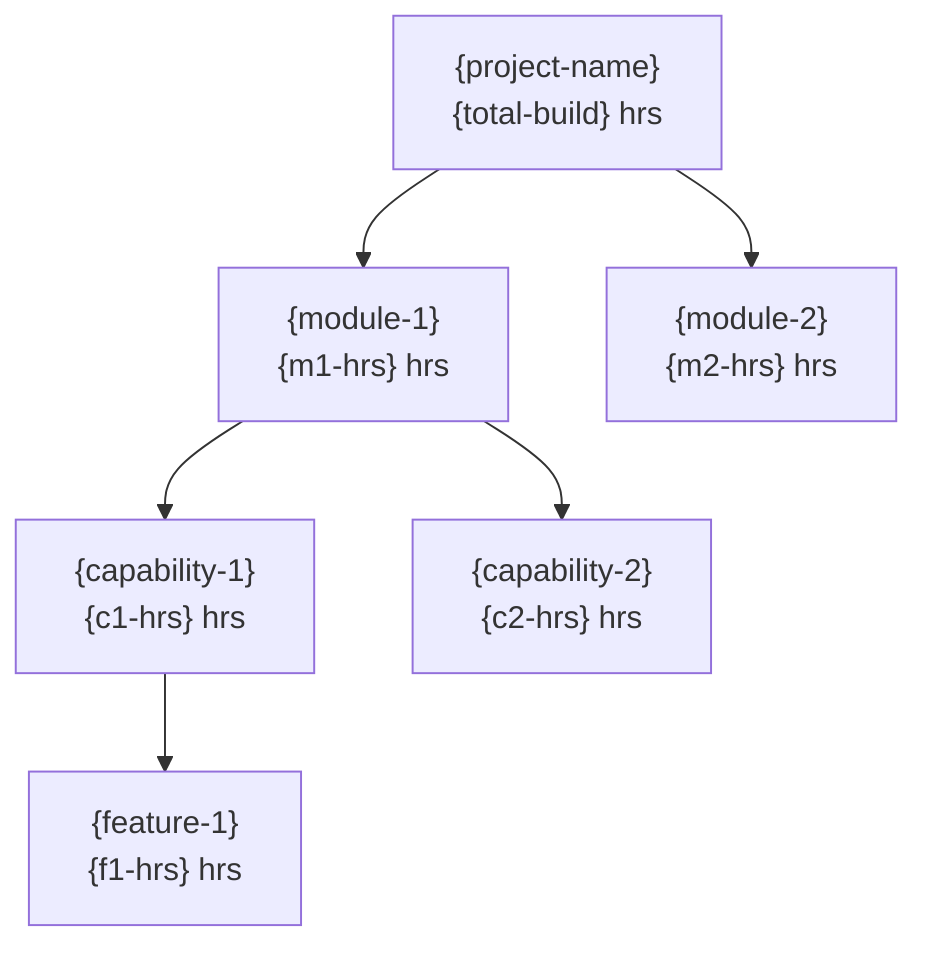

# Module Overall Hours — {project-name}

> **The stakeholder deliverable.** Single comprehensive document that customers sign off. Five sections per [ADR-0009](../../../design/adr/0009-solution-estimate-consolidated.md) and [constitution/01-template-alignment.md](../constitution/01-template-alignment.md) Output 3.

## AI Summary

Total project estimate: **{H} hours** with confidence band **±{P}%**. {N modules}, {R inventory rows}, derived from {M source files}. {one-line headline summary}.

## §1 Module Overall Hours

**Confidence Band: ±{P}%**

*Derivation: {pct1}% of inventory at Fully Detailed (±10%) + {pct2}% at High (±15%) + {pct3}% at Medium (±20%) + {pct4}% at Low (±30%) + {pct5}% at Placeholder (±40%) → weighted ±{P}%.*

*Bands: Placeholder ±40% / Low ±30% / Medium ±20% / High ±15% / Fully Detailed ±10%.*

| Module / Feature | Org Build & UT Hrs | Plan Hrs (×0.07) | Analyze Hrs (×0.21) | Design Hrs (×0.38) | Test Prep Hrs (×0.25) | Test Exe Hrs (×0.35) | Test/Dev Fix Hrs (×0.35) | Deploy Hrs (×0.15) | Total Project Hrs |
|---|---:|---:|---:|---:|---:|---:|---:|---:|---:|
| {module-1} | {build} | {build*0.07} | {build*0.21} | {build*0.38} | {build*0.25} | {build*0.35} | {build*0.35} | {build*0.15} | **{build*2.76}** |
| ... | | | | | | | | | |
| **Total** | **{total-build}** | **{total*0.07}** | **{total*0.21}** | **{total*0.38}** | **{total*0.25}** | **{total*0.35}** | **{total*0.35}** | **{total*0.15}** | **{total-build*2.76}** |

Only `Module Name` and `Org Build & UT Hrs` are entered (the latter from `Estimation-ModuleBuildHrs.md` Grand Summary). The other 8 columns auto-calculate per phase multipliers in [templates/phase-multipliers.yaml](phase-multipliers.yaml).

## §2 Summary Notes

| Metric | Value |
|---|---:|
| Total Requirements | {N} |
| Total Inventory Rows | {R} |
| Total Modules | {M} |
| Total Org Build & UT Hours | {total-build} |
| Total Project Hours (Build × 2.76) | **{total-project}** |
| Confidence Band | **±{P}%** |

## §3 Configuration vs Customization Split

| Fitment | Inventory Rows | Modules Touching | % of Total |
|---|---:|---|---:|
| Out of the Box | {n} | {modules} | {pct}% |
| Configuration | {n} | {modules} | {pct}% |
| Customization | {n} | {modules} | {pct}% |
| Integration | {n} | {modules} | {pct}% |
| Non-Functional | {n} | {modules} | {pct}% |
| Covered in other requirement | {n} | {modules} | {pct}% |
| Out of Scope | {n} | — | {pct}% |
| Deprecated / Not Supported | {n} | — | {pct}% |

### Per-Module Fitment Split

| Module | OOB | Config | Custom | Integration | NF | Other |
|---|---:|---:|---:|---:|---:|---:|
| {module-1} | {n} | {n} | {n} | {n} | {n} | {n} |
| ... | | | | | | |

## §4 Estimation Hierarchy

> Renamed 2026-05-15 from "Requirement Hierarchy (L1 to L5)" per [ADR-0012](../../../design/adr/0012-requirement-level-taxonomy.md). The labels `L1-L5` are now reserved exclusively for the business-process taxonomy (see §4.5 below). This section's hierarchy uses the named labels `Project / Module / Capability / Feature / Inventory Factor`.

### Project — Solution

| Project | Req Count | Inventory Rows | Build Hrs | Total Project Hrs (×2.76) |
|---|---:|---:|---:|---:|
| {project-name} | {N} | {R} | {total-build} | {total-project} |

### Modules

| Module | Req Count | Inventory Rows | Config % | Custom % | Build Hrs | Total Project Hrs |
|---|---:|---:|---:|---:|---:|---:|
| {module-1} | {n} | {r} | {pct}% | {pct}% | {build} | {project} |

### Capabilities (within each module)

| Capability | Parent Module | Req Count | Inventory Rows | Build Hrs |
|---|---|---:|---:|---:|
| {cap} | {module} | {n} | {r} | {build} |

### Features (within each capability)

| Feature | Parent Capability | Req IDs | Inventory Rows | Build Hrs |
|---|---|---|---:|---:|
| {feature} | {cap} | {REQ-001, REQ-002, ...} | {r} | {build} |

### Inventory Factors (cross-cutting roll-up across all modules)

| Factor | Times Used | VS | S | M | C | VC | Total Hrs |
|---|---:|---:|---:|---:|---:|---:|---:|
| {factor} | {n} | {n} | {n} | {n} | {n} | {n} | {total} |

### Hierarchy tree

### Confidence Distribution

## §4.5 Requirement Level Distribution

> **NEW per [ADR-0012](../../../design/adr/0012-requirement-level-taxonomy.md) (2026-05-15)**, in response to DEFECT-001. Rolls up the `Requirement Level` column from the inventory across the **business-process taxonomy** (L1 Category / L2 Process Group / L3 Process / L4 Activity / L5 Task). This is the **answer to "where in the process taxonomy is the bulk of the work?"** for stakeholders.

**Headline:** {narrative one-line, e.g., "63% of requirements are L3 (Process), 22% L4 (Activity), 8% L5 (Task), 5% L2 (Process Group), 2% L1 (Category)."}

### Distribution table

| Level | Name | Description | Req Count | Inventory Rows | Build Hrs | Total Project Hrs (×2.76) | % of Total Hrs |
|---|---|---|---:|---:|---:|---:|---:|
| **L1** | Category / Enterprise View | Top-level value chain / domain | {n} | {r} | {b} | {p} | {pct}% |
| **L2** | Process Group | End-to-end process cycle | {n} | {r} | {b} | {p} | {pct}% |
| **L3** | Process / Sub-Process | Specific process with handoffs + decisions | {n} | {r} | {b} | {p} | {pct}% |
| **L4** | Activity | Single activity within a process | {n} | {r} | {b} | {p} | {pct}% |
| **L5** | Task / Work Instruction | UI action / system task | {n} | {r} | {b} | {p} | {pct}% |
| **Totals** | — | — | **{N}** | **{R}** | **{total-build}** | **{total-project}** | **100%** |

### Requirement Level pie

### Cross-tab: Requirement Level × Module

> How each module distributes across the business-process taxonomy. Surfaces patterns like "Service is mostly L3 + L4 (process-heavy), Marketing is mostly L4 (activity-heavy), Migration is L1 (top-level only)."

| Module | L1 | L2 | L3 | L4 | L5 | Total |
|---|---:|---:|---:|---:|---:|---:|
| {module-1} | {n} | {n} | {n} | {n} | {n} | {n} |
| {module-2} | {n} | {n} | {n} | {n} | {n} | {n} |
| **Totals** | **{n}** | **{n}** | **{n}** | **{n}** | **{n}** | **{N}** |

### Typed Gaps surfaced in this section

If any requirement's Requirement Level was inferred (no explicit marker; agent's heuristic produced the value):

| Req ID | Inferred Level | Confidence | Why | What Would Unblock |
|---|---|---|---|---|
| {req-id} | L{N} | {low/medium/high} | {one-line agent rationale} | "Customer to confirm or override in the requirement frontmatter." |

These are also tracked in §5 Typed Gaps under category `REQUIREMENT-LEVEL-INFERENCE`.

## §5 Assumptions, Open Questions & Typed Gaps

### Critical Open Questions (must be resolved before Build phase)

1. {open-q-1}
2. {open-q-2}
3. ...

### Key Assumptions Made

1. {assumption-1}
2. {assumption-2}
3. ...

### Typed Gaps

| Category | Count | Examples (Req IDs) |
|---|---:|---|
| `FITMENT-INFERENCE` | {n} | {req-id-1, req-id-2} |
| `COMPLEXITY-INFERENCE` | {n} | {req-id} |
| `AMBIGUOUS-MODULE` | {n} | {req-id} |
| `MISSING-DETAIL` | {n} | {req-id} |
| `DROPPED-FROM-INVENTORY` | {n} | {req-id} |
| `REQUIREMENT-LEVEL-INFERENCE` | {n} | {req-id} — new per ADR-0012 (2026-05-15); agent inferred L1-L5 from text/context |
| `REQUIREMENT-LEVEL-NFR-DEFAULT` | {n} | {req-id} — new per ADR-0012; NFR row defaulted to L3 absent explicit marker |

#### Gap detail (per row)

| Gap ID | Category | Artefact / Req ID | Reason | What Would Unblock | Severity |
|---|---|---|---|---|---|
| {gap-id} | {category} | {req-id} | {short-reason} | {one-line-unblock} | {blocker/warning/info} |

## Quality self-check

<!-- Populated inline by /estimate at end of generation. Findings from estimate-review.checklist.md (categories: completeness, factor-coverage, fitment-classification correctness, hour-formula consistency, brownfield-multiplier application, confidence-derivation correctness). BLOCKER findings fail the write. -->
