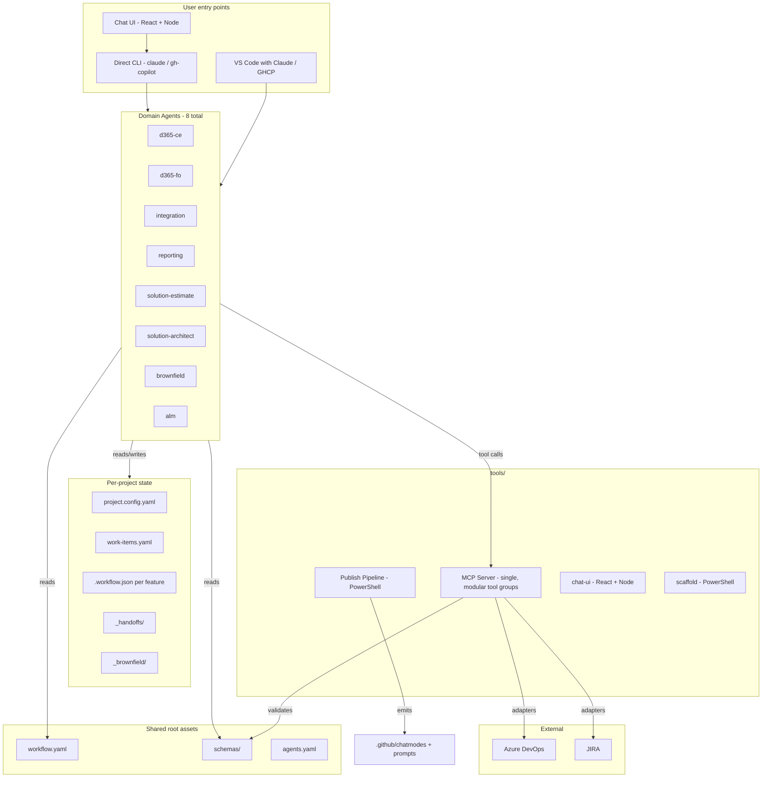

# Platform Overview

> Spec-driven development workflow for Microsoft Dynamics 365 and Power Platform delivery, with eight domain agents, a single MCP server, file-state-based orchestration, and four delivery surfaces (Claude standalone + root-unified, GitHub Copilot standalone + root-unified) generated from a single authored source.

## What this platform is

A workflow that takes a customer requirement from **spec → plan → task → implement** through hard-gated phases, with eight domain agents (CE / F&O / Integration / Reporting / Solution-Estimate / Solution-Architect / Brownfield / ALM) coordinating via a shared filesystem state rather than a central orchestrator. Each agent owns its constitution and templates; cross-agent consistency is enforced by deterministic `doc_lint` code in the MCP server. ALM round-tripping (ADO + JIRA) is bidirectional. Aggregators produce unified architecture diagrams, effort estimates, and clickable HTML solution prototypes. A brownfield agent reverse-engineers existing solutions through a pattern + binding architecture with a self-healing auto-mode loop.

## What this platform is not

- Not a daemon or service. There is no router agent; agents coordinate via filesystem state and the MCP server's tool calls.
- Not an LLM training framework. Agent quality comes from carefully authored constitution and templates per-domain, plus deterministic enforcement of cross-cutting rules.
- Not a runtime template engine. Templates are static markdown with frontmatter and Mermaid; no Handlebars, no conditionals.
- Not a deployment tool. ALM round-tripping and ALM-agent commands handle work-item sync; deployment is left to the platform tooling each agent knows about (Power Platform CLI, F&O LCS, etc.).

## Architecture at a glance

## Design principles

### What the platform keeps

- **Phase 1/2/3 spec-driven workflow** with hard gates via state files. Phases: DEFINE → DESIGN → BUILD. See [04-workflow-gates.md](04-workflow-gates.md).
- **Agent-owned constitution and templates.** Each agent fully owns these; cross-agent consistency comes from MCP `doc_lint` code, not from shared text. See [ADR-0010](adr/0010-templates-agent-owned.md) and [06-templates.md](06-templates.md).
- **Tool-neutral MCP adapters.** `alm_*` tools dispatch to ADO or JIRA based on `project.config.yaml`. See [11-mcp-server.md](11-mcp-server.md).
- **File-state-first orchestration.** No daemon, no router agent. Each agent reads `.workflow.json` and updates it; the MCP `workflow_*` tools provide cross-agent discovery. See [09-orchestration-patterns.md](09-orchestration-patterns.md).
- **Mermaid for all diagrams.** Enforced by `doc_lint`. See [07-doc-rules.md](07-doc-rules.md).
- **OOB-first principle.** Agents prefer configuration over customization. The OOB-first decision is logged per requirement in the FDD.
- **Documentation-as-code.** Every generated doc carries YAML frontmatter for queryability. See [07-doc-rules.md](07-doc-rules.md).
- **Wire contracts at root, mirrored to agents.** `workflow.yaml` and `schemas/` are shared because drift breaks cross-agent orchestration. The publish pipeline mirrors them into each agent so standalone mode works. See [ADR-0004](adr/0004-self-contained-agent-folders.md).

### What the platform cuts (from earlier approaches)

| Anti-pattern | Why it's cut |
|---|---|
| 11 numbered constitution files duplicated per agent | Drift, bloat. Replaced by agent-owned constitution + `doc_lint` for universal rules. |
| 9 folders per agent | Mixes templates with project data. Replaced by 3 folders (`commands/`, `constitution/`, `templates/`). |
| 22 granular ALM commands | Cognitive overload. Replaced by 6 noun/verb commands. |
| Per-domain brownfield agents (e.g., `d365-ce-brownfield`) | Entire agent duplication for a flag. Replaced by standalone Brownfield agent + `mode: brownfield` flag. |
| Prompts/ subfolders separate from `.claude/commands/` | Two trees of prompt content. Replaced by inline prompt content in command markdown. |
| Ad-hoc handoff JSON schemas per agent | No central contract. Replaced by versioned `schemas/*.json` validated by MCP. |
| Inline ALM IDs in markdown AND in YAML | Dual-write drift. `work-items.yaml` is the single source; markdown carries stable section IDs only. |
| Hierarchy hardcoded as Epic/Feature/US/Task | Couples MCP to ADO terminology. Hierarchy declared in `project.config.yaml` as `[L1, L2, L3, L4]` with type mapping. |
| Mandatory re-reading constitution every command | Bloats context. Loaded once per session, cached by hash; clauses cited by ID. |
| No global "what's next" view | User forgot what to run. Replaced by `/next` and `/status` commands backed by MCP `workflow_*` tools. |
| Single Claude command surface | Excludes GHCP users and forces full-platform open. See [ADR-0002](adr/0002-dual-mode-delivery-surfaces.md). |
| Templates `_base/` mirrored into each agent with override semantics | CE and F&O templates share basically no content. See [ADR-0010](adr/0010-templates-agent-owned.md). |
| Constitution `_base/` at root with agent overlay | Asymmetric with templates. Universal rules belong in `doc_lint` code. See [ADR-0010](adr/0010-templates-agent-owned.md). |

## The eight agents (one paragraph each)

- **[d365-ce](agents/d365-ce.md)** — fat agent owning everything on the CE / Power Platform side: model-driven entities/forms/views, JS, plugins, BPF, workflows, BPM, Canvas apps, Power Pages, PCF, all Power Automate. Multi-file sub-platform FDD/TDD with the SW Phoenix shape as the master skeleton (see [ADR-0005](adr/0005-d365-ce-multi-file-sub-platform.md)). Domain-scoped docs.
- **[d365-fo](agents/d365-fo.md)** — F&O autonomous: X++, AOT, deployable packages, LCS, Data Entities, DMF, batch, ER, F&O-SSRS, business events, security keys/duties, SysTest. Constitution + templates ported from a battle-tested predecessor. Feature-scoped docs (FastTrack pattern).
- **[integration](agents/integration.md)** — merged event-driven + batch + data-migration: Azure Functions, Logic Apps, Service Bus, APIM, Event Grid AND ADF, SFTP, SQL staging, bulk Dataverse. Domain-scoped docs.
- **[reporting](agents/reporting.md)** — CE SSRS + Power BI (CE data and BYOD-exposed F&O data). F&O native SSRS stays inside the F&O agent. Domain-scoped docs.
- **[solution-estimate](agents/solution-estimate.md)** — aggregator. Single `/estimate` command, 103-factor catalogue, 8-value Fitment, 7 phases (×2.76 total project), brownfield multipliers, confidence bands, proposed-factors gate. See [ADR-0009](adr/0009-solution-estimate-consolidated.md).
- **[solution-architect](agents/solution-architect.md)** — aggregator. Unified architecture (`/solution-blueprint`), gap analysis across agents (`/solution-review`), clickable HTML cross-agent prototype (`/solution-prototype`).
- **[brownfield](agents/brownfield.md)** — reverse-engineering. Auto-mode with self-healing retry loop, pattern + binding architecture covering ~140+ artifact types, gap log as the single review artefact. See [ADR-0007](adr/0007-brownfield-auto-mode-self-healing.md), [ADR-0008](adr/0008-brownfield-patterns-and-bindings.md).
- **[alm](agents/alm.md)** — workflow-level ALM operations over ADO and JIRA. Six action-first verbs (push / pull / export / import / status / cleanup), bidirectional md↔ALM rich-text converters.

## Project-level state model

Per-project state lives under `projects/{name}/` and is scaffolded by `New-Project.ps1`. See [05-project-layout.md](05-project-layout.md). Key files:

- `project.config.yaml` — single config: agents enabled, mode (greenfield / brownfield), prefixes (publisher / solution / schema), multilingual per-channel, OOB overrides, unit-test policy, NFRs, ALM tool + hierarchy.
- `work-items.yaml` — single ALM traceability source for the project; partitioned by agent + feature. See [08-traceability.md](08-traceability.md).
- `_handoffs/` — cross-agent handoff manifests. See [09-orchestration-patterns.md](09-orchestration-patterns.md).
- `_brownfield/` — populated only if `mode: brownfield` (input, inventory.json, generated docs).

## How to read this design folder

1. **Start with this overview** — you're here.
2. **[01-repo-structure.md](01-repo-structure.md)** for the canonical folder layout at every level.
3. **[02-agent-skeleton.md](02-agent-skeleton.md)** to understand the per-agent contract.
4. **[03-agent-inventory.md](03-agent-inventory.md)** for the 8-agent summary + docScope assignments.
5. **The per-agent docs in [agents/](agents/)** for everything specific to each agent.
6. **The cross-cutting docs (04 through 16)** for system-wide concerns.
7. **[adr/](adr/)** for the rationale behind every load-bearing decision (11 ADRs covering R1–R34 from the legacy revision log).
8. **[backlog.md](backlog.md)** for queued topics and their status.
9. **[../implementation.md](../implementation.md)** for the build roadmap and append-only change log.

## References

- All ADRs: [adr/](adr/)
- Backlog: [backlog.md](backlog.md)
- Implementation Plan + log: [../implementation.md](../implementation.md)
