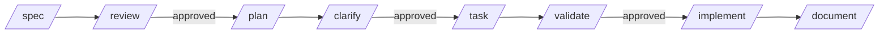

# Orchestration Patterns

> Four patterns. Agents are **autonomous**; coordination is via filesystem state + MCP tools. **No conductor/router agent.**

## Pattern 1 — Intra-agent gate chain (most common)

One agent, one feature. State stays in `.workflow.json`. Each command reads → executes → updates state. Hard gates refuse downstream commands if upstream not approved.

See [04-workflow-gates.md](04-workflow-gates.md) for the gate DAG.



## Pattern 2 — Federation handoff (mixed-domain spec)

When a feature spans multiple agents.

1. `/spec` is drafted in (say) the CE agent.
2. `/review` flags "integration concerns" or "reporting concerns" — categorised handoff candidates.
3. User runs `/split` (or chat UI offers to).
4. `/split` performs three actions:
   - Creates `projects/{p}/_handoffs/{feature}-{target-agent}.handoff.json` (schema `handoff.v1.json`)
   - Bootstraps a skeleton spec at the target agent's per-feature path (per docScope branching in [04-workflow-gates.md](04-workflow-gates.md)):
     - Domain-scoped target: `projects/{p}/{target}/features/{feature}/spec.md`
     - Feature-scoped target: same path (F&O happens to also use `features/{feature}/`)
   - Initialises `.workflow.json` in the new feature with `phase: DEFINE`, `currentStates: [SPEC_DRAFT]`, frontmatter `parent-handoff: {handoff-id}`
5. `MCP handoff_list` shows the new handoff. Chat UI surfaces it under "Ready" for the target agent.
6. The user opens the target agent (or chat UI auto-routes) and continues `/spec` → `/review` → `/plan` etc.

### Handoff manifest schema (`handoff.v1.json`)

```json
{
  "schemaVersion": "1.0",
  "handoff-id": "<uuid>",
  "from": { "agent": "d365-ce", "feature": "case-management", "spec": "spec.md" },
  "to":   { "agent": "integration", "feature": "case-management", "skeleton-spec": "features/case-management/spec.md" },
  "intent": "Customer reported case data needs to sync to SAP via SFTP daily",
  "scope-summary": "Case → SAP batch integration. Out of scope: real-time sync, bidirectional updates.",
  "status": "PENDING | IN_PROGRESS | READY | CANCELLED",
  "created-on": "2026-05-14T10:00:00Z",
  "last-updated": "..."
}
```

## Pattern 3 — Cross-agent dependency

When CE's plan needs integration's blueprint to be approved first.

1. CE `/plan` declares dependencies in its frontmatter:

```yaml
---
feature-id: case-management
agent: d365-ce
requires:
  - { agent: integration, feature: case-management, artifact: blueprint, status: required }
---
```

2. CE `/clarify` calls `MCP handoff_status` — fails if any `required` dependency isn't `READY` (status comes from the target agent's `.workflow.json`).

3. User can override with `--accept-pending-dep` if intentional (e.g., parallel work where the integration blueprint is in progress).

4. The integration agent's `/blueprint` completion writes `READY` to its `.workflow.json` for that feature; subsequent calls to `MCP handoff_status` from CE will pass.

## Pattern 4 — Aggregation (architect, estimate)

Aggregators read from multiple agents' outputs without invoking commands on them.

1. Aggregator command (e.g., `/solution-blueprint` or `/estimate`) calls `MCP handoff_list_blueprints --project acme-d365`.
2. MCP returns array of paths to every agent's `blueprint.md` (or `spec.md` / `plan.md` per the request).
3. Aggregator reads each, synthesises the output.
4. **Live read** — no snapshots required. If an upstream agent's blueprint changes, the next `/solution-blueprint` call reflects it.

See [10-aggregators.md](10-aggregators.md) for the aggregator-specific flows.

## `MCP workflow_next` — the "what's next" surface

- Reads every `.workflow.json` across the project
- Returns ranked list of eligible commands per agent (based on `workflow.yaml parallel-after` + `hard-gates`)
- `/next` (CLI) or chat UI "Ready" tab consume this

Example output:

```
Ready commands:
  d365-ce / case-management: /clarify  (PLAN_DRAFT → PLAN_CLARIFIED)
  integration / case-management: /blueprint  (parallel after PLAN_CLARIFIED)
  reporting / case-management: /test-plan  (parallel after SPEC_APPROVED)
```

## Handoffs are append-only

When new handoffs are created, the existing manifests are not modified. Status updates are appended to a `history` array in the manifest:

```yaml
status: READY
history:
  - { status: PENDING, ts: "2026-05-14T10:00:00Z" }
  - { status: IN_PROGRESS, ts: "2026-05-14T14:30:00Z" }
  - { status: READY, ts: "2026-05-15T09:15:00Z" }
```

## References

- Schemas: `schemas/handoff.v1.json`, `schemas/workflow-state.v1.json`
- Cross-references: [04-workflow-gates.md](04-workflow-gates.md), [10-aggregators.md](10-aggregators.md), [11-mcp-server.md](11-mcp-server.md) (`workflow_*`, `handoff_*` tool groups)
- Backlog: `bk-002` (`/split` detailed semantics, multi-target behavior)
