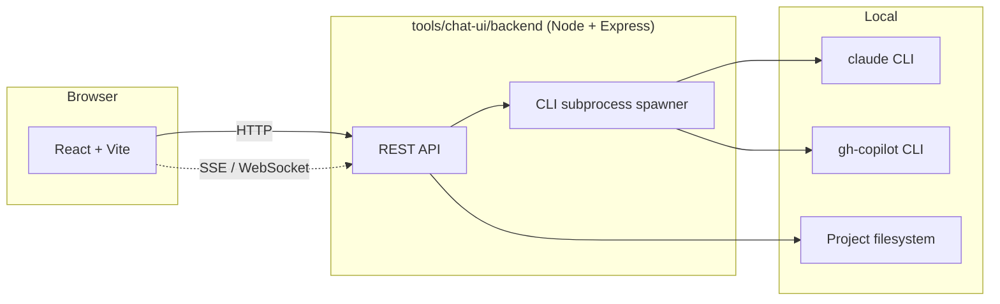

# Chat UI

> Lightweight web UI for users without VS Code. React frontend + Node backend; the backend spawns the Claude CLI as a subprocess and streams output to the browser.

## Why a chat UI

The platform supports three entry surfaces ([00-overview.md](00-overview.md)):

1. VS Code with Claude / GHCP — primary developer experience
2. Direct CLI (`claude` / `gh-copilot`) — power users + automation
3. **Chat UI** — non-developer stakeholders (BAs, PMs, customer reviewers) who need to see spec → review → plan progress without installing VS Code

The chat UI is **not** a replacement for VS Code — it's a thin viewer + invoker that runs in the browser.

## Architecture



## Layout

```
tools/chat-ui/
├── frontend/                           # React (Vite)
│   ├── src/
│   │   ├── pages/
│   │   │   ├── ProjectPicker.tsx       # Pick project from projects/
│   │   │   ├── AgentPicker.tsx          # Pick agent from agents.yaml
│   │   │   ├── ReadyPane.tsx            # Eligible commands per agent (calls workflow_next)
│   │   │   ├── DocumentViewer.tsx       # Read-only viewer for spec / plan / FDD / etc.
│   │   │   ├── CommandRunner.tsx        # Invokes a command; streams output
│   │   │   └── EstimationView.tsx       # Aggregator: solution-estimate output viewer
│   │   ├── components/
│   │   └── api/                        # Backend API client
│   ├── vite.config.ts
│   └── package.json
└── backend/                            # Node + Express
    ├── src/
    │   ├── index.ts                    # Server entry
    │   ├── routes/
    │   │   ├── projects.ts             # GET /api/projects
    │   │   ├── agents.ts               # GET /api/agents
    │   │   ├── workflow.ts             # GET /api/workflow/next, /status
    │   │   ├── docs.ts                 # GET /api/docs/{path}
    │   │   ├── commands.ts             # POST /api/commands/run (spawns CLI subprocess)
    │   │   └── stream.ts               # SSE/WebSocket for command output streaming
    │   ├── cli-spawner.ts              # Subprocess management
    │   └── filesystem.ts               # Read-only project filesystem access
    ├── tsconfig.json
    └── package.json
```

## UX flows

### Project picker

- GET `/api/projects` returns list of folders under `projects/`
- User selects a project → loads project context (`project.config.yaml`)

### Agent picker

- Reads `agents.yaml` filtered by `project.config.yaml agents-enabled`
- User selects an agent → loads agent README + recent activity

### Ready pane

- Calls `MCP workflow_next` (via the backend → MCP server)
- Shows ranked list of eligible commands per agent + feature
- Click invokes the command via `CommandRunner`

### Document viewer

- Read-only markdown rendering of any doc under `projects/{p}/`
- Mermaid renders inline
- Quality self-check appendix (per [07-doc-rules.md](07-doc-rules.md)) highlighted at top
- Frontmatter shown collapsed

### Command runner

- POST `/api/commands/run` with `{ agent, command, args }`
- Backend spawns `claude` CLI as subprocess with the appropriate working directory
- Output streamed back via SSE/WebSocket
- On completion, refreshes `.workflow.json` view

### Estimation view

- Renders the merged `Estimation-ModuleOverallHrs.md` deliverable
- Mermaid pie charts (Config-vs-Custom, Confidence Distribution) render inline
- Drill into BusinessReqDetail or ModuleBuildHrs as needed

## Why CLI-as-subprocess

The chat UI doesn't reimplement Claude or the MCP server — it spawns the existing CLI. Benefits:

- Zero duplication of agent invocation logic
- Authentication / config inherits from the local CLI installation
- Updates to the CLI automatically apply to the chat UI

Tradeoff: the chat UI requires the CLI to be installed locally. For multi-user / hosted deployment, the CLI must be available on the server.

## Authentication

- Local-only deployment (single-user): no authentication
- Hosted deployment: out of scope for v1; queued for future revision

## Security considerations

- Backend runs locally with the same permissions as the user
- Read-only filesystem access (no write endpoints in v1; writes happen via the spawned CLI which has full agent-level capability)
- No remote MCP access; MCP server is invoked via the spawned CLI in the user's local context

## References

- Cross-references: [00-overview.md](00-overview.md), [11-mcp-server.md](11-mcp-server.md), [09-orchestration-patterns.md](09-orchestration-patterns.md) (`workflow_next` feeds the Ready pane)
- Backlog: `bk-019` (Chat UI UX flows detailed design)
