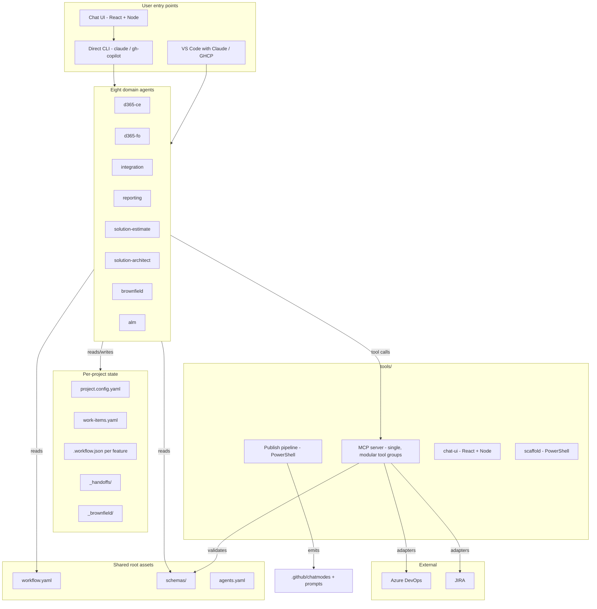

# Architecture — Spec-Driven Development Consolidated Platform

> Human-facing, project-agnostic architecture overview. For the authoritative per-topic design, see [../design/](../design/).

## Goals

- **Spec → plan → task → implement** workflow with hard gates enforceable from `.workflow.json` state, no central orchestrator.
- **Eight domain agents** covering D365 CE, F&O, Integration, Reporting, plus aggregators (estimate, architect) and supporting agents (brownfield, ALM).
- **Single MCP server** with modular tool groups serving all agents.
- **Four delivery surfaces** (Claude standalone + root-unified, GHCP standalone + root-unified) from one authored source.
- **Round-trippable ALM** over ADO and JIRA with bidirectional markdown ↔ rich-text conversion.
- **Brownfield reverse-engineering** with auto-mode and a single gap-log review artefact.

## High-level diagram

## Layered model

| Layer | What it owns |
|---|---|
| **Entry layer** | VS Code (Claude or GHCP), the chat UI, direct CLI |
| **Agent layer** | Eight domain agents, each with constitution + templates + commands |
| **Shared root** | `agents.yaml`, `workflow.yaml`, `schemas/` — wire contracts mirrored into agents per [ADR-0004](../design/adr/0004-self-contained-agent-folders.md) |
| **Project state** | `projects/{p}/` — `project.config.yaml`, `work-items.yaml`, per-feature `.workflow.json`, `_handoffs/`, `_brownfield/` |
| **Tooling** | MCP server, publish pipeline, scaffold scripts, chat UI |
| **External** | ADO, JIRA |

## Key design decisions (ADR index)

| ADR | Topic |
|---|---|
| [ADR-0001](../design/adr/0001-review-scope-spec-only.md) | `/review` scoped to spec only; non-spec checklists consumed inline |
| [ADR-0002](../design/adr/0002-dual-mode-delivery-surfaces.md) | Four delivery surfaces from a single authored source |
| [ADR-0003](../design/adr/0003-single-source-of-truth-commands.md) | Commands authored only in `agents/{a}/.claude/commands/` |
| [ADR-0004](../design/adr/0004-self-contained-agent-folders.md) | Self-contained agent folders + plugin distribution |
| [ADR-0005](../design/adr/0005-d365-ce-multi-file-sub-platform.md) | d365-ce multi-file sub-platform + form-mockup helper |
| [ADR-0006](../design/adr/0006-doc-scope-domain-vs-feature.md) | FDD/TDD/blueprint docScope domain vs feature |
| [ADR-0007](../design/adr/0007-brownfield-auto-mode-self-healing.md) | Brownfield auto-mode + self-healing retry loop |
| [ADR-0008](../design/adr/0008-brownfield-patterns-and-bindings.md) | Brownfield 9 patterns + ~185 bindings + module-detection |
| [ADR-0009](../design/adr/0009-solution-estimate-consolidated.md) | Solution-estimate consolidated `/estimate` + 103 factors |
| [ADR-0010](../design/adr/0010-templates-agent-owned.md) | Templates + constitution agent-owned; `doc_lint` enforces consistency |
| [ADR-0011](../design/adr/0011-publish-pipeline-8-job-model.md) | Publish pipeline 8 jobs + drift checks |

## Diving deeper

For the per-topic detail, see [../design/](../design/) — every architecture concern has a dedicated design doc:

- [design/00-overview.md](../design/00-overview.md) — full overview
- [design/01-repo-structure.md](../design/01-repo-structure.md) — repo layout + config model
- [design/02-agent-skeleton.md](../design/02-agent-skeleton.md) — per-agent contract
- [design/03-agent-inventory.md](../design/03-agent-inventory.md) — agent inventory
- [design/04-workflow-gates.md](../design/04-workflow-gates.md) — workflow + gates
- [design/11-mcp-server.md](../design/11-mcp-server.md) — MCP server design
- [design/12-publish-pipeline.md](../design/12-publish-pipeline.md) — publish pipeline jobs
