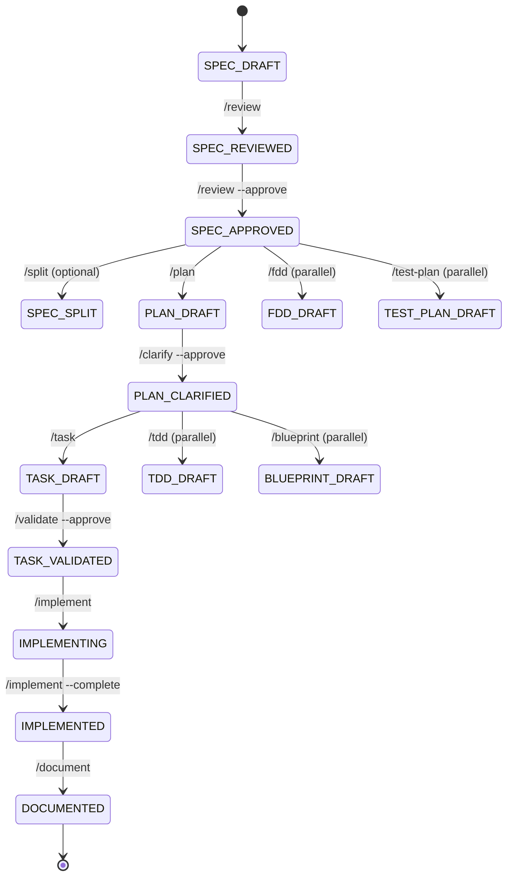

# Orchestration — Spec-Driven Development Consolidated Platform

> How agents coordinate without a central orchestrator. Human-facing overview; authoritative detail in [../design/09-orchestration-patterns.md](../design/09-orchestration-patterns.md).

## Principle: no router agent

Agents are autonomous. Coordination happens via **filesystem state** + **MCP tool calls**. No daemon, no message bus, no router.

The state lives in:

- `projects/{p}/{agent}/features/{f}/.workflow.json` — current state of one feature
- `projects/{p}/_handoffs/*.handoff.json` — cross-agent handoff manifests
- `projects/{p}/work-items.yaml` (per agent) — ALM traceability

Agents read this state, do their thing, and write back. The MCP server's `workflow_*` and `handoff_*` tools provide cross-agent discovery (the "what's next" view across all agents).

## Four orchestration patterns

### Pattern 1 — Intra-agent gate chain (most common)

One agent, within one feature. State stays in `.workflow.json`. Each command reads → executes → updates state. Hard gates refuse downstream commands if upstream not approved.

```
spec → review (gate) → plan → clarify (gate) → tdd / blueprint / task →
  validate (gate) → implement → document → alm-extract
```

### Pattern 2 — Federation handoff (mixed-domain spec)

Spec in one agent flags concerns belonging to another agent → `/split` emits a handoff manifest + skeleton spec in the target agent.

```
/spec in CE  →  /review flags "integration concerns"
  →  /split  →  creates projects/{p}/_handoffs/{feature}-integration.handoff.json
            +  creates projects/{p}/integration/features/{feature}/spec.md
  →  MCP handoff_list shows the new handoff
  →  user opens integration agent (or chat UI "Ready" pane)
```

### Pattern 3 — Cross-agent dependency

One agent's plan declares a `requires:` against another agent's output.

```
CE /plan declares:  requires: [{agent: integration, feature: case-mgmt, artifact: blueprint}]
CE /clarify         → calls MCP handoff_status
                    → fails if dependency status != READY
                    → user waives with --accept-pending-dep if intentional
```

### Pattern 4 — Aggregation (Architect, Estimate)

Aggregator commands call MCP to discover and read every agent's outputs.

```
/solution-blueprint  →  MCP handoff_list_blueprints --project X
                     →  returns array of paths to every agent's blueprint.md
                     →  aggregator reads each, produces unified output
Same pattern for /solution-review, /solution-prototype, /estimate.
```

## The "what's next" surface

Two CLI commands plus a chat UI panel:

- **`/next`** — reads `.workflow.json` + `workflow.yaml`; prints eligible transitions
- **`/status`** — phase + gate matrix + dependencies + recent history
- **Chat UI Ready pane** — same data, surfaced visually across all agents at once

Implemented in MCP as `workflow_next` and `workflow_status` so the chat UI and CLI consume the same source.

## Workflow phases recap



Hard gates (must be APPROVED before downstream commands): `SPEC_APPROVED`, `PLAN_CLARIFIED`, `TASK_VALIDATED`.

Per [ADR-0001](../design/adr/0001-review-scope-spec-only.md): `/review` is **spec-only**. Plan is gated by `/clarify`; task by `/validate`. The byproduct doc types (FDD / TDD / blueprint / test-plan) have no separate `/review`; their checklists are consumed inline by the generating command itself.

## Brownfield exception

Brownfield is the only agent with **no `/review` command at all**. Its `/generate` is the auto pipeline with self-healing retry. The gap log (`projects/{p}/_brownfield/gap-log.json`) is the single review artefact a human looks at. See [../design/agents/brownfield.md](../design/agents/brownfield.md) and [ADR-0007](../design/adr/0007-brownfield-auto-mode-self-healing.md).
