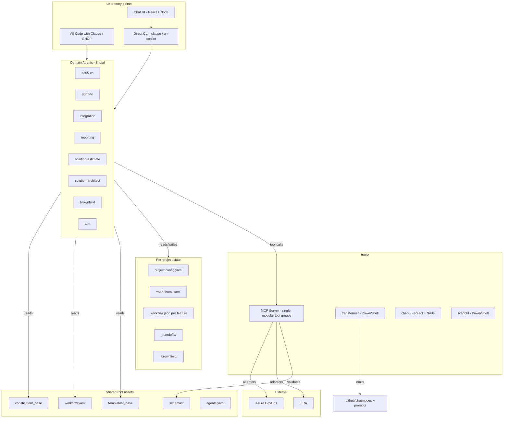
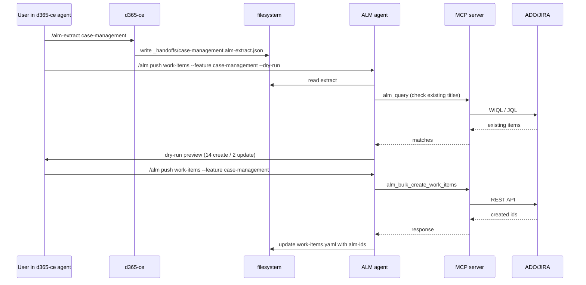

# Spec-Driven Development Workflow — Consolidated Solution Design

> **Status:** Solution design — approved 2026-05-12, revised through 2026-05-13. Do not implement yet; more sections still to be detailed one-by-one.
> **Target repo:** `c:\Users\amit.mudgal\source\repos\aifirstdeliveryconsolidated` (currently empty).
> **Reference repo (not to be copied verbatim):** `c:\Users\amit.mudgal\source\repos\aifirstdelivery`.
> **Revision history at end** (§26).

---

## 🔖 RESUME POINT — 2026-05-14 (R17–R34 applied; one question open)

**Last completed:**
- R17 — d365-ce templates structured as multi-file sub-platform; SW Phoenix FDD shape adopted; SW form-mockup generator ported.
- R18 — Doc scope per agent: **domain-level FDD/TDD/blueprint for CE, Integration, Reporting; feature-level for F&O.** Config-driven via `agents.yaml`. Section + row `feature-id` tagging for per-feature traceability inside domain docs. See §6, §7.1–7.4, §8, §10, §11, §13, §22, §26.
- R19 — 15 FDD content-shape additions to the SW Phoenix base (A1–A15: fix §4.2 dup, add Out-of-Scope, Open-Questions roll-up, Cross-Agent Dependencies, NFR mapping, OOB-first decision log, Multilingual, Glossary, drop §9-12 stubs → Handoffs section, beef up Security + Entity Model, add Process Definitions / Power Automate / Plugins / Templates sub-sections, sub-platform packs). See §7.1, §22, §25, §26.
- R20 — **Brownfield agent ported + improved + auto-mode self-healing.** Constitution + 8 commands + 7 templates ported from reference `aifirstdelivery/templates/d365-ce-brownfield/`. 5 improvement groups (Power Apps depth; P1 doc-depth fixes; pivot from human checklists → MCP validators; generalize beyond CE via platform packs; `/handoff` + gap-log schema). Per-scope retry loop (N=3) with typed gap categories. No `/review` for brownfield — gap log is the single artifact users scan. See §7.7, §16, §18, §22, §26.
- R21 — **Brownfield scan AND generation parity across full ~140+ artifact taxonomy via pattern + binding architecture.** 9 reusable patterns (schema/code/config/process/ui/security/integration/container/catalog-asset) + ~185 small bindings (one ~30-line YAML per artifact type, ~70 CE + ~50 FO + ~40 integration + ~25 reporting). Module-detection rules silent-skip bindings whose module isn't installed (not a gap). 5 PORTED reference templates re-cast as synthesis docs (one per project); 2 re-cast as pattern bodies. New MCP `brownfield-engine/` tool group (binding-loader, pattern-renderer, module-detector, extractor, cross-ref, coverage-tracker, pipeline, synthesis-runner). Coverage guarantee covers every inventoried artifact: documented OR gap-logged OR module-gated-skipped. See §7.7 Group 7, §18, §22, §25, §26.
- R22 — Solution-estimate consolidated to single `/estimate` command + L1-L5 hierarchy + Config-vs-Custom grouping + estimation-traceability.v1 schema. **All R22 inventions superseded by R23.**
- R23 — **Solution-estimate rebuilt to match `Dynamics365AISolution/MasterTemplate/estimation-instructions.md` ground-truth template.** PORTED verbatim: 14-column Business Req Detail inventory (Req ID / Module/Feature / Req Title / Priority / Fitment / Type of Integration / Inventory / S / M / C / VC counts / Solution-Rationale / Assumptions-Comments / Open Questions), 19 specific factors with fixed S/M/C/VC hour rates, 8-value Fitment, fixed phase multipliers (Plan & Design 0.20 / Test Creation 0.25 / Test Execution 0.35 / Dev Fix 0.35 / Deployment 0.15), 7 key rules, 7 execution steps. 3 outputs: BusinessReqDetail / ModuleBuildHrs / ModuleOverallHrs. 2 extensions (R22-preserved): FitmentSummary + Assumptions-and-Gaps. **DROPPED in R23**: L1-L5 estimation hierarchy, 19 invented columns, 9 generic patterns, binary Config/Custom classification, generic risk multipliers, estimation-traceability.v1 schema, ROM/Build mode flag, `--include-factors`/`--review-factors` flags. Single `/estimate [--input <path>] [--fresh] [--export]` — 3 flags only. Factor catalogue extensions (F&O / deeper Integration / deeper Reporting) deferred per §25. See §7.5, §13, §17, §22, §25, §26.
- R24 — **Solution-estimate inventory enriched with 3 new columns + 2-level grouping.** Inventory grows from 14 (R23) to **17 columns**: added (a) **Categorization (L1 > L2 > L3 > L4 > L5)** showing full estimation hierarchy on every row; (b) **Source** — where the requirement lives in our project (file + section); (c) **Original Req Ref** — pointer to system-of-record (JIRA / ADO / customer's own req register / deep link). XLSX export breaks Categorization into 5 separate L1/L2/L3/L4/L5 columns for pivot/filter. Inventory output now uses **two-level grouping**: Module (## headers) → Fitment sub-sections (Configuration / Customization / Integration / Out-of-Scope; ### headers with row counts). Reverses R23 over-correction that dropped L1-L5 entirely. See §7.5, §26.
- R25 — **5-level complexity model introduced (VS added) — sourced from ICICI Bank Effort Data Excel.** R25's structural contribution (5-level VS/S/M/C/VC complexity model, replacing R23's 4-level S/M/C/VC) is **permanent in the design**. R25's data contribution (11 ICICI-specific factor rates) was **superseded by R27** (Internal Project SI Excel). The ICICI Excel itself is **no longer bundled** in `reference/04-factor-catalogues/` — historical only; not load-bearing for ongoing design work. **Inventory column count: 17 → 18** (adds VS count — kept). Module Build Hrs table: 19-row × 4-complexity → 11-row × 5-complexity (later expanded to 95-row × 5-complexity by R27, then 103-row by R28). See §7.5, §26.
- R26 — **Phase multipliers updated: 5 phases → 7 phases; total project ×2.30 → ×2.76 of build.** Plan & Design (×0.20) split into **Plan (×0.07) + Analyze (×0.21) + Design (×0.38)**. Test Creation → Test Prep (×0.25). Dev Fix → Test/Dev Fix (×0.35). Test Execution and Deployment unchanged. Sum of phase multipliers: **1.76** (vs prior 1.30); total project = Build × 2.76. **Module Overall Hrs output: 7 columns → 10 columns** (1 module + 1 build + 7 phase + 1 total). See §7.5, §17, §26.
- R27 — **Factor catalogue overridden: 11 ICICI factors → 95 tool-canonical SI factors from `Internal Project - SI Effort Data.xlsx`.** User: "override all the factors by this new file". Canonical SI catalogue organized into 11 categories (CRM Core Dev, Code/ASP.NET, Reports & Dashboards, Integration & Data Migration, Power Platform, Sales, Service, Marketing, Core Foundation, UI/Navigation, Office/Integration Setup, Security, Process/Workflow/Misc). Hour rates extracted verbatim per VS/S/M/C/VC. Descriptions (475 strings) PORTED into `factor-definitions.md` at agent build time; not duplicated in plan body. Module Build Hrs table grows from 11-row to **95-row** factor list. Prior 11-factor (R25) and 19-factor (R23) catalogues superseded — retained in history for traceability only. See §7.5, §26.
- R28 — **8 factors reintroduced from R23 reference to plug delivery gaps in R27.** Reintroduced per user direction: Azure Function Build & UT, Integration (generic), CRM Master Data Preparation, Model Driven App Changes, PCF Control Development, Excel Report, ExperLogix Report, Hierarchy Security. Rates verbatim from R23 estimation-instructions.md §1.2 (VS column left undefined; was 4-level source). Excluded per user: Email Configuration, HTML WebResource. Factors numbered 96-103 in §7.5. **Active catalogue: 103 factors** (95 SI + 8 reintroduced). Module Build Hrs table: 95-row → **103-row**. See §7.5, §26.
- R29 — **Empty-row suppression in Module Build Hrs output.** Per user "ensure you should not keep empty rows" — each module's factor table renders only factors with non-zero counts in that module. Typical module: 10-30 visible rows instead of 103. Module totals computed across full catalogue (suppressed rows contribute zero). See §7.5, §26.
- R30 — **New output `Estimation-CategorizationSplit.md` — L1-L5 requirement hierarchy rollup.** Per user "I also need Requirement split by L1 to L5". Dedicated output showing the requirement split AT EACH L-level: L1 Solution totals → L2 Modules (with Config%/Custom%/hours) → L3 Capabilities → L4 Features (with Req IDs) → L5 cross-cutting Factor usage. Plus Mermaid hierarchy flowchart. XLSX export gains CategorizationSplit sheet with L1-L5 sub-sheets. Active output count: **6 markdown + 1 optional export**. See §7.5, §22, §26.
- R31 — **Outputs 3, 4, 5, 6 merged into single `Estimation-ModuleOverallHrs.md`.** Per user "Merge 3, 4, 5, 6 in single document". Single comprehensive deliverable with 5 sections (§1 Module Overall Hrs / §2 Summary Notes / §3 Config-vs-Custom Split / §4 Requirement Hierarchy L1-L5 / §5 Assumptions & Gaps). **Markdown output count: 6 → 3** (BusinessReqDetail / ModuleBuildHrs / ModuleOverallHrs). XLSX export sheet structure unchanged. See §7.5, §22, §26.
- R32 — **4 advanced features ported from `aifirstdelivery` solution-estimate reference + L1-L5 naming clash resolved.** Ported: (1) Brownfield component multipliers (NEW 1.0 / EXTEND 0.6 / REPLACE 1.15 / REFERENCED 0.0) applied per inventory row when in brownfield mode; (2) Confidence Band ±X% header in ModuleOverallHrs §1, auto-derived; (3) Confidence Distribution Mermaid pie in §4; (4) `Estimation-Proposed-Factors.md` conditional output when factor catalogue gap detected. L1-L5 clash resolved Option A: keep hierarchy meaning in Categorization column, add separate **Confidence Level** column with 5 bands (Placeholder ±40% / Low ±30% / Medium ±20% / High ±15% / Fully Detailed ±10%). **Inventory: 18 → 20 columns** (adds Confidence Level + Brownfield Status). XLSX gains ConfidenceDistribution + BrownfieldStatus + ProposedFactors sheets. New config files: `brownfield-multipliers.yaml`, `confidence-levels.yaml`. See §7.5, §22, §26.
- R33 — **New `/solution-prototype` command added to solution-architect agent.** User: "I want to introduce new feature in solution architect agent, read the prompt and incorporate `D365_Form_Generation_Prompt.md`". Ports SW Form Generation Prompt as a helper (verbatim; mirrors d365-ce's R17 copy per R5 agent-autonomy). Adds cross-agent UX prototyping templates: persona landings / module hubs / journey flows / dashboards / master shell, plus D365 design-token CSS + interactive JS. Output: clickable HTML solution prototype at `projects/{p}/_aggregator/architecture/solution-prototype/` aggregating personas + modules + entities + journeys from all domain agents. Brownfield mode produces side-by-side as-is/to-be views. New command, new templates, new constitution file `03-prototype-generation-rules.md`. See §7.6, §17, §26.
- R34 — **`/review` clarified to spec-only.** User-flagged inconsistency in `§5` (`/review [spec|plan|task]`) vs `§10` workflow DAG (which already used `/review` only for the spec gate). Plan stays gated by `/clarify`; task by `/validate`. The four byproduct checklists (`fdd-review`, `tdd-review`, `blueprint-review`, `test-plan-review`) are consumed **inline** by their generating command (`/fdd`, `/tdd`, `/blueprint`, `/test-plan`) — findings fold into a "Quality self-check" appendix at doc bottom; `doc_lint` enforces the appendix and surfaces BLOCKER findings as failed writes. `plan-review.checklist.md` consumed by `/clarify`; `spec-review.checklist.md` consumed by `/review`. Six checklist files preserved; only consumers redirected. `task-review.checklist.md` does NOT exist (pre-existing gap, flagged in §25). New §11 subsection *Review checklist consumption* added (consumption table). Five contradictory references fixed across §5, §7.1, §7.7, §13, §16. See §5, §7.1, §7.2, §7.7, §11, §13, §16, §26.

### Open questions to resume from

**✅ CE + Power Apps merge structure — RESOLVED in R17.**
**✅ Integration agent structure — never an open question; locked in R10.** Integration is a single merged agent (event-driven + batch + data migration). No restructure.
**✅ FDD/TDD doc scope — RESOLVED in R18.** Domain for CE/Int/Rep, feature for F&O.
**✅ SW FDD content gaps — RESOLVED in R19.** 15 additions planned in `fdd/_index.template.md` + `fdd/model-driven.template.md`.

1. **Which agents to port now vs defer to upcoming sessions**
   - Option A: Port BASIC agents now (solution-estimate, solution-architect); defer MATURE merges and Reporting/Brownfield ← my recommendation
   - Option B: Port all in next session
   - Option C: Defer all; document only

### Maturity findings (already saved in our discussion, not yet in plan body)
| Reference agent | Templates | Constitution | Review checklists | Maturity |
|---|---|---|---|---|
| power-apps | 6 (FDD 769, TDD 1259 — largest) | 14 files | Yes (77 L, BLOCKER/REQ/WARN) | MATURE |
| d365-ce | 6 (FDD 754, TDD 1038) | 14 files | Yes (67 L) | MATURE |
| integration | 6 (FDD 614, TDD 211 — thin) | 14 files | Yes (70 L) | MATURE |
| data-migration | 3 specialized (no FDD/TDD), 210-line CLAUDE.md | 12 files | Yes (61 L) | MODERATE |
| reporting | 5 (FDD 277, TDD 332 — thin) | 13 files | **None — gap** | MODERATE |
| d365-ce-brownfield | 7 specialized analysis templates | 11 files | **None — gap** | MODERATE |
| solution-architect | 1 (Blueprint 592) | 6 files | **None — gap** | BASIC |
| solution-estimate | 3 estimation worksheets (~50 lines each) | 6 files | **None — gap** | BASIC |

### Port plan mapping (locked from the discussion)
| Our agent | Source | Action |
|---|---|---|
| `d365-ce` (fat) | d365-ce + power-apps + **SW project FDD + Form-Mockup Generator** | ✅ Structure locked (R17); content authoring deferred |
| `d365-fo` | d365-fo | ✅ Done (R16) |
| `integration` (merged) | integration + data-migration | **Merge — structural decision needed (open Q1)** |
| `reporting` | reporting | Straight port + author review checklists (gap) |
| `solution-estimate` | solution-estimate | Straight port (small set) |
| `solution-architect` | solution-architect | Straight port + author review checklist (gap) |
| `brownfield` | d365-ce-brownfield | Generalize for non-CE platforms |
| `alm` | tools/alm-agent (separate) | No template port; already covered |

### How to pick up (machine-agnostic)
1. Open Claude Code in your target consolidated-repo folder (wherever you've placed `aifirstdeliveryconsolidated/` on the new machine).
2. Make sure the **reference bundle** is accessible at a known relative path — see `reference/README.md` in the bundle for the index. Recommended placement: `aifirstdeliveryconsolidated/reference/` (so the spec, agents/, and reference/ all live side by side).
3. Tell Claude: *"Resume from the spec at `reference/00-spec-driven-development-humble-muffin.md` — see RESUME POINT at top. Reference material is under `reference/01-aifirstdelivery/`, `reference/02-sw-project/`, `reference/03-dynamics365-aisolution/`, `reference/04-factor-catalogues/`."*
4. Decide the port-scope question (which agents to build first — see open question below).
5. Continue with whichever decision flows next.

### Other topics still in the queue (§25)
- New-Project / New-Feature / New-Agent scaffold scripts
- MCP tool group detailed APIs
- Chat UI UX flows
- Brownfield doc commands detailed output formats
- `settings.template.json` and `plugin.template.json` schemas
- Hook configurations for hard-gate enforcement
- `agents.yaml` schema and discovery semantics
- `/customize-template` scaffold helper

---

---

## 1. Context

You are building a spec-driven development platform that supports multiple Microsoft Dynamics / Power Platform delivery domains, with a single source of truth for agent prompts (Claude) and a generated GitHub Copilot (GHCP) projection so the same agents can be used by either tool. The previous implementation has drift, duplication, and bloat that this redesign explicitly removes. The platform must support multi-project scaffolding, brownfield projects, ALM round-trips (ADO and JIRA), aggregator views (architecture, estimation), and a lightweight chat UI for users without VS Code.

**Outcome:** A clean, modular workflow where each domain agent is autonomous, the spec → plan → task → implement gates are enforceable, ALM is round-trippable, and adding a new agent is a config change — not a copy-paste.

---

## 2. Architecture Overview



---

## 3. Design Principles — what we keep, what we cut

### Keep (fresh-thinking, not reference-copy)
- **Phase 1/2/3 spec-driven workflow** with hard gates via state files
- **Agent-owned constitution and templates** *(updated 2026-05-13)* — each agent fully owns its constitution and templates; no shared `_base` at runtime. Drift prevention for universal rules moves to **MCP `doc_lint` code**, not shared text. Optional project-level override on top of agent constitution.
- **Tool-neutral MCP adapters** (`alm_*` tools dispatch to ADO or JIRA)
- **File-state-first orchestration** — no daemon, no router agent
- **Mermaid for all diagrams** — enforced by `doc_lint`
- **OOB-first principle** — agents prefer configuration over customization
- **Documentation-as-code** with YAML frontmatter for queryability
- **Wire contracts at root, mirrored to agents** — `workflow.yaml` and `schemas/` are shared because drift breaks cross-agent orchestration; they're code-level contracts, not text guidance.

### Cut from reference repo (explicit anti-patterns)
| Cut | Why |
|---|---|
| 11 numbered constitution files duplicated per agent | Drift, bloat, repeated NFR text. Replaced by layered base + delta. |
| 9 folders per agent | Mixes templates with project data. Replaced by 3 folders per agent (`commands/`, `constitution/`, `templates/`). |
| 22 granular ALM commands | Cognitive overload. Replaced by 6 noun/verb commands. |
| `templates/` + `ghcptemplates/` parallel trees | Dual sources of truth. GHCP is now **generated**, never authored. |
| Per-domain brownfield agents (e.g., `d365-ce-brownfield`) | Entire agent duplication for a flag. Replaced by standalone Brownfield agent + `mode: brownfield` flag. |
| `Prompts/` subfolders separate from `.claude/commands/` | Two trees of prompt content. Replaced by inline prompt content in command markdown. |
| Ad-hoc handoff JSON schemas per agent | No central contract. Replaced by versioned `schemas/*.json` validated by MCP. |
| Inline ALM IDs in markdown AND in YAML | Dual-write drift. Replaced by `work-items.yaml` as single source; markdown carries stable section IDs only. |
| `/spec-alm` as separate command | Doubles command surface. Collapsed into `/spec --source alm|fresh`. |
| Hierarchy hardcoded as Epic/Feature/US/Task | Couples MCP to ADO terminology. Hierarchy declared in `project.config.yaml` as `[L1, L2, L3, L4]` with type mapping. |
| Mandatory re-reading constitution every command | Bloats context. Loaded once per session, cached by hash; clauses cited by ID. |
| No global "what's next" view | User forgot what to run. Replaced by `/next` and `/status` commands backed by MCP `workflow_*` tools. |
| **`templates/_base/` mirrored into each agent with override semantics** *(added 2026-05-13)* | Templates are platform-specific by nature. CE FDD and F&O FDD share basically no content; a shared base is a fiction. **Each agent fully owns its templates.** Cross-agent consistency comes from rules in `constitution/_base/02-doc-rules.md` (frontmatter, TOC, AI Summary, traceability, Mermaid). `templates/_reference/` at root exists only as scaffolding starters for `New-Agent.ps1`. |
| **Standalone agent folders reading from parent (`../../constitution/_base/`)** *(added 2026-05-13)* | Standalone Claude/GHCP opened on `agents/{a}/` cannot reach parent. Breaks dual-mode. **Each agent folder is fully self-contained.** Publish pipeline mirrors `constitution/_base/`, `schemas/`, `workflow.yaml` into each agent folder. Source-of-truth stays at root; mirrored copies are read-only. |
| **Single Claude command surface** *(added 2026-05-13)* | Doesn't support both standalone-agent VS Code sessions AND root-unified sessions. **Four delivery surfaces** generated by the publish pipeline — Claude standalone (`/spec`), Claude root-unified (`/d365-ce:spec`), GHCP standalone (`spec`), GHCP root-unified (`d365-ce-spec`). Authored once in Claude-native location. |
| **Transformer only generates GHCP** *(added 2026-05-13)* | Needs to do more: mirror base assets, render settings, render plugin manifests, build marketplace, drift check. **Renamed Publish Pipeline.** `tools/sync/Publish-Agents.ps1`. |
| **No Claude plugin packaging** *(added 2026-05-13)* | No portable distribution mechanism. **Each agent is also a Claude plugin** (`.claude-plugin/plugin.json`); root carries `.claude-plugin/marketplace.json` listing all 8. Generated by publish pipeline. |
| **Layered constitution with shared `constitution/_base/` at root** *(removed 2026-05-13)* | Asymmetric with templates (which are agent-owned). Created mirroring overhead and an inconsistent mental model. **Now: each agent fully owns its constitution.** Drift prevention for universal rules (Mermaid, frontmatter, TOC, AI Summary) moves to **MCP `doc_lint`** code — programmatic enforcement, not shared text. `constitution/_reference/` at root provides starter content for `New-Agent.ps1` (not read at runtime). |

---

## 4. Root Folder Structure

```
aifirstdeliveryconsolidated/
├── README.md                              # entry README; explains repo
├── agents.yaml                            # agent registry — name, version, commands enabled
├── workflow.yaml                          # declarative DAG of phases, gates, transitions
├── agents/
│   ├── _skeleton/                         # canonical template for new agents
│   │   ├── commands/                      # base command set (12 verbs)
│   │   ├── constitution/                  # placeholder for delta
│   │   ├── templates/                     # placeholder for output templates
│   │   └── README.md                      # per-agent README pattern
│   ├── d365-ce/                           # see §7.1
│   ├── d365-fo/                           # see §7.2
│   ├── integration/                       # see §7.3
│   ├── reporting/                         # see §7.4
│   ├── solution-estimate/                 # see §7.5
│   ├── solution-architect/                # see §7.6
│   ├── brownfield/                        # see §7.7
│   └── alm/                               # see §7.8
├── constitution/
│   └── _reference/                        # SCAFFOLDING ONLY — used by New-Agent.ps1, NOT read at runtime
│       ├── 00-charter.md.example
│       ├── 01-doc-rules.md.example
│       ├── 02-nfr.md.example
│       ├── 03-security.md.example
│       ├── 04-testing.md.example
│       ├── 05-alm.md.example
│       └── ...                            # starter rules; each agent edits its own copy
├── templates/
│   └── _reference/                        # SCAFFOLDING ONLY — used by New-Agent.ps1, NOT read at runtime
│       ├── spec.template.md.example       # generic skeleton with comments showing structure
│       ├── plan.template.md.example
│       ├── tdd.template.md.example
│       └── ...                            # (one .example per doc type)
├── schemas/                               # versioned JSON Schemas
│   ├── handoff.v1.json                    # cross-agent handoff envelope
│   ├── alm-extract.v1.json                # plan/task → ALM extract
│   ├── work-items.v1.json                 # work-items.yaml schema
│   ├── workflow-state.v1.json             # .workflow.json schema
│   ├── brownfield-inventory.v1.json       # brownfield scan output
│   └── project-config.v1.json             # project.config.yaml schema
├── tools/
│   ├── mcp-server/                        # see §18
│   │   ├── src/
│   │   ├── package.json
│   │   └── README.md
│   ├── sync/                              # see §19 — Publish Pipeline (was 'transformer')
│   │   ├── Publish-Agents.ps1             # main entry — mirror + render + transform + drift
│   │   ├── Watch-Agents.ps1               # file-watcher mode
│   │   ├── settings.template.json         # canonical settings.json template
│   │   ├── plugin.template.json           # canonical .claude-plugin/plugin.json template
│   │   ├── chatmode.template.md           # template for GHCP chatmode rendering
│   │   └── README.md
│   ├── scaffold/                          # see §8
│   │   ├── New-Project.ps1
│   │   ├── New-Feature.ps1
│   │   ├── New-Agent.ps1                  # seeds new agent from templates/_reference/
│   │   └── README.md
│   └── chat-ui/                           # see §20
│       ├── frontend/                      # React (Vite)
│       └── backend/                       # Node (Express)
├── .github/                               # ROOT-UNIFIED GHCP SURFACE — all GENERATED
│   ├── chatmodes/                         # one per agent (8 files) — DO NOT EDIT
│   │   ├── d365-ce.chatmode.md
│   │   └── ...
│   ├── prompts/                           # one per agent-command, prefixed namespace — DO NOT EDIT
│   │   ├── d365-ce-spec.prompt.md
│   │   ├── d365-ce-plan.prompt.md
│   │   ├── integration-spec.prompt.md
│   │   └── ...
│   └── workflows/
│       └── check-publish-drift.yml        # CI: fails if any generated file is hand-edited
├── .claude/                               # ROOT-UNIFIED CLAUDE SURFACE
│   ├── commands/                          # GENERATED — subfolder = namespace
│   │   ├── d365-ce/                       # → /d365-ce:spec, /d365-ce:plan, ...
│   │   │   ├── spec.md
│   │   │   └── ...
│   │   ├── d365-fo/
│   │   ├── integration/
│   │   ├── reporting/
│   │   ├── solution-estimate/
│   │   ├── solution-architect/
│   │   ├── brownfield/
│   │   └── alm/
│   └── settings.json                      # GENERATED — registers MCP server, hooks for gate checks
├── .claude-plugin/
│   └── marketplace.json                   # GENERATED — lists all 8 agents as installable plugins
├── docs/                                  # architecture, ADRs (project-agnostic, human-facing)
│   ├── architecture.md
│   ├── orchestration.md
│   └── adr/                               # Architecture Decision Records
└── projects/
    └── {project-name}/                    # per-project scaffolding — see §8
        ├── project.config.yaml
        ├── constitution/                  # project-level overrides only
        ├── work-items.yaml                # single ALM traceability source for project
        ├── _handoffs/                     # cross-agent handoff manifests
        ├── _brownfield/                   # populated only if brownfield mode
        │   ├── input/                     # raw extracted code/zips/docs
        │   ├── inventory.json             # scan output (schema: brownfield-inventory.v1)
        │   └── docs/                      # generated brownfield documentation
        └── {agent-name}/
            └── {feature-name}/
                ├── .workflow.json         # state file — gates, phase, dependencies
                ├── spec.md
                ├── plan.md
                ├── tasks/                 # one .md per task
                ├── fdd.md                 # generated byproduct
                ├── tdd.md                 # generated byproduct
                ├── blueprint.md           # generated byproduct
                ├── test-plan/             # generated byproduct — multi-document folder (see §11)
                │   ├── index.md           #   top-level plan: strategy, suite list, coverage, traceability
                │   ├── suites/            #   one file per suite: NN-{slug}.md, holds all TCs for that suite
                │   ├── coverage-report.md #   auto-generated by doc_lint
                │   └── traceability.yaml  #   machine-readable for ALM sync
                ├── reviews/               # review reports
                │   ├── spec-review.md
                │   ├── clarify-report.md
                │   └── validate-report.md
                ├── templates-override/        # OPTIONAL — per-agent project-level template overrides (R15)
                │   ├── fdd.template.md        # if present, wins over agents/{a}/templates/fdd.template.md
                │   ├── tdd.template.md        # full file replacement; no conditionals or merging
                │   └── ...
                ├── constitution-override/     # OPTIONAL — per-agent project-level constitution overrides (R15)
                │   ├── 02-nfr.md              # if present, wins over agents/{a}/constitution/02-nfr.md
                │   ├── 03-security.md         # full file replacement; per file
                │   └── ...
                └── output/                    # generated code, configs, solution assets
```

---

## 5. Agent Skeleton (parameterized template)

Each agent folder is **fully self-contained** so it works standalone (opening just `agents/{a}/` in VS Code). The publish pipeline mirrors root sources (`constitution/_base/`, `schemas/`, `workflow.yaml`) into each agent. Templates are **agent-owned** — no base template at runtime.

**Three categories of files inside each agent folder:**

| Marker | Edited by | Authority | Examples |
|---|---|---|---|
| **SOURCE** | You, by hand | Owned by this agent | `.claude/commands/*.md`, `constitution/0X-*.md`, `templates/{type}.template.md`, `README.md` |
| **MIRRORED** | Publish pipeline (copied byte-for-byte from root) | Read-only — drift check fails the build | `constitution/_base/*`, `schemas/*`, `workflow.yaml` |
| **GENERATED** | Publish pipeline (transformed from sources) | Read-only — drift check fails the build | `.github/**`, `.claude/settings.json`, `.claude-plugin/plugin.json` |

### Full structure

```
agents/{agent-name}/
├── .claude/                                  # CLAUDE SURFACE
│   ├── commands/                             # SOURCE — Claude-native authoring location
│   │   ├── spec.md                           # /spec [--source fresh|alm] [--feature <name>]
│   │   ├── review.md                         # /review — spec only; gates SPEC_REVIEWED → SPEC_APPROVED (plan via /clarify, task via /validate)
│   │   ├── split.md                          # /split — emits handoffs for mixed-domain specs
│   │   ├── impact.md                         # /impact — brownfield + cross-feature analysis
│   │   ├── fdd.md                            # /fdd — byproduct (parallel after spec approved)
│   │   ├── test-plan.md                      # /test-plan — byproduct
│   │   ├── plan.md                           # /plan
│   │   ├── clarify.md                        # /clarify
│   │   ├── tdd.md                            # /tdd
│   │   ├── blueprint.md                      # /blueprint
│   │   ├── task.md                           # /task — details L4 only
│   │   ├── validate.md                       # /validate
│   │   ├── implement.md                      # /implement
│   │   ├── document.md                       # /document
│   │   ├── alm-extract.md                    # /alm-extract — emits handoff for ALM agent
│   │   ├── next.md                           # /next — reads .workflow.json, suggests next cmd
│   │   └── status.md                         # /status — phase/gate report
│   └── settings.json                         # GENERATED — MCP registration with relative path
│                                             # (../../tools/mcp-server/dist/index.js)
├── .claude-plugin/
│   └── plugin.json                           # GENERATED — makes this agent installable as a plugin
├── .github/                                  # GHCP SURFACE (standalone) — all GENERATED
│   ├── chatmodes/
│   │   └── {agent}.chatmode.md
│   └── prompts/                              # standalone GHCP — non-namespaced
│       ├── spec.prompt.md                    # invoked in GHCP as "spec"
│       ├── plan.prompt.md
│       └── ...                               # (one per command)
├── constitution/                             # SOURCE — fully agent-owned (no _base mirror)
│   ├── 00-charter.md                         # agent purpose, scope, boundaries
│   ├── 01-doc-rules.md                       # how this agent generates docs (Mermaid, TOC, AI Summary)
│   ├── 02-nfr.md                             # NFR shape and platform-specific targets
│   ├── 03-security.md                        # security baseline for this platform
│   ├── 04-testing.md                         # testing standards for this platform's artifacts
│   ├── 05-alm.md                             # ALM mapping for this domain
│   ├── 06-multilingual.md                    # how multilingual applies to this agent's sub-domains
│   ├── 07-oob-first.md                       # OOB-first decision tree with platform examples
│   ├── 08-customization-inventory.md         # what artifacts this agent produces
│   └── ...                                   # sub-domain modules (e.g., CE has model-driven, canvas, power-pages, pcf, power-automate)
├── templates/                                # SOURCE — agent owns all templates outright
│   ├── spec.template.md
│   ├── plan.template.md
│   ├── fdd.template.md                       # platform-shaped (CE FastTrack, F&O FastTrack, etc.)
│   ├── tdd.template.md                       # platform-shaped
│   ├── blueprint.template.md
│   ├── test-plan/                            # multi-doc folder (R12)
│   │   ├── index.template.md
│   │   └── suite.template.md
│   ├── task.template.md
│   ├── review-report.template.md
│   └── checklists/                           # review checklists per doc type (R16; consumption: spec-review by /review, plan-review by /clarify, fdd/tdd/blueprint/test-plan inline by generating command — R34)
│       ├── spec-review.checklist.md
│       ├── plan-review.checklist.md
│       ├── fdd-review.checklist.md
│       ├── tdd-review.checklist.md
│       ├── blueprint-review.checklist.md
│       └── test-plan-review.checklist.md
├── schemas/                                  # MIRRORED from root schemas/
│   ├── handoff.v1.json
│   ├── alm-extract.v1.json
│   ├── work-items.v1.json
│   ├── workflow-state.v1.json
│   ├── brownfield-inventory.v1.json
│   └── project-config.v1.json
├── workflow.yaml                             # MIRRORED from root workflow.yaml
└── README.md                                 # SOURCE — What / How / Details (see §21)
```

### Agents may add commands beyond the base 17
Declared in `agents.yaml`:
```yaml
- name: d365-fo
  base-commands: true
  extra-commands: [lcs-deploy, dmf-package]
```

### Constitution at runtime *(simplified 2026-05-13, R15)*

**Two layers, file-level resolution. First match wins. No merging.**

1. `projects/{project}/{agent}/constitution-override/0X-*.md` — per-file override if `--project <name>` is passed
2. `agents/{agent}/constitution/0X-*.md` — agent default

If a file exists at the project level, it fully replaces the agent's version. If it doesn't exist, the agent's version is used. No conditionals, no patching, no flags.

No shared `_base` layer. Universal rules (Mermaid mandate, frontmatter required, AI Summary required, etc.) are enforced by **MCP `doc_lint`** code, not by shared text — the rule is the code, and the agent's constitution describes it in its own words for guidance.

Standalone mode without `--project` reads only the agent layer. Standalone with `--project <name>` reads `../../projects/{name}/{agent}/constitution-override/` (works only when agent folder is inside the consolidated repo).

### Template resolution at runtime *(simplified 2026-05-13, R15)*

**Two layers, file-level resolution. First match wins. No merging, no conditionals, no flags.**

1. `projects/{project}/{agent}/templates-override/{type}.template.md` — per-file override if present
2. `agents/{agent}/templates/{type}.template.md` — agent default

If neither exists for a doc type, the command **fails with a clear error** (rather than silently generating an empty doc).

**Why simple file-level replacement.** We considered Handlebars conditionals and data-driven flags; both add complexity without the typical benefit. Most project customization is small, occasional, and explicit — a project that wants a different TDD format drops one file. Drift between agent updates and project overrides is detected by `MCP doc_lint` (warns when an override's frontmatter `based-on-template-version` falls behind the current agent template).

**No platform-wide base.** Each agent owns all its templates; cross-agent consistency comes from rules enforced programmatically by **MCP `doc_lint`** (frontmatter, TOC, AI Summary, traceability, Mermaid).

**Customize helper:** `/customize-template <type>` copies the agent's default into the project's `templates-override/` for editing (queued in §25).

### MCP server path trade-off
| Standalone mode | `settings.json` points to | Works? |
|---|---|---|
| Agent folder inside the repo | `../../tools/mcp-server/dist/index.js` | yes |
| Agent folder copied elsewhere | Same relative path — broken | no — use plugin install |
| Root unified | `./tools/mcp-server/dist/index.js` | yes |
| Plugin install from marketplace | Plugin manages its own path | yes |

Plugin mode is the supported "truly portable" path. Pure folder-copy is best-effort.

---

## 6. Agent Inventory — 8 Domain Agents

| # | Agent | Scope | Sub-modules in constitution | Doc scope (FDD/TDD/blueprint) *(R18)* |
|---|---|---|---|---|
| 1 | **d365-ce** (fat) | Model-driven CE/Power Apps + Canvas + Power Pages + PCF + all Power Automate + plugins, JS, BPF, workflows, BPM | model-driven, canvas, power-pages, pcf, power-automate | **domain** |
| 2 | **d365-fo** | X++, AOT, deployable packages, LCS, Data Entities, DMF, batch, ER, F&O-SSRS, business events, security keys/duties, SysTest | core-x++, extensions (CoC), dmf, batch-er, fo-ssrs, lcs-deploy | **feature** (FastTrack pattern) |
| 3 | **integration** (merged) | Event-driven (Functions, Logic Apps, Service Bus, APIM, Event Grid) AND batch (ADF, SFTP, SQL staging, bulk Dataverse, data migration) | event-driven, batch-adf, sql-staging, sftp, data-migration | **domain** |
| 4 | **reporting** | CE SSRS + Power BI (for CE and F&O datasets) | ce-ssrs, power-bi | **domain** |
| 5 | **solution-estimate** | ROM, build hours, rollup across all agents | aggregator | n/a (aggregator) |
| 6 | **solution-architect** | Unified solution diagram from all agents' blueprints | aggregator | project (aggregator) |
| 7 | **brownfield** | Reverse-engineering, inventory, impact analysis | inventory, doc-generation | feature/asset |
| 8 | **alm** | Workflow-level ALM ops over ADO/JIRA | alm-mapping, alm-conventions | n/a |

> **Doc scope** controls where the FDD, TDD, and blueprint live. **Domain** = one file per project per agent (e.g., `projects/{p}/d365-ce/fdd.md`) that accumulates feature-tagged sections across features. **Feature** = one file per feature (e.g., `projects/{p}/d365-fo/features/{f}/fdd.md`). Spec, plan, test-plan, reviews, and tasks are always feature-scoped. The `/fdd`, `/tdd`, and `/blueprint` commands branch on `agents.yaml` `docScope` keys (see §5, §10). Per-feature traceability inside domain docs uses **section-level `feature-id` frontmatter** + **row-level `feature-id` columns** so `/alm push --feature X` operates on just that feature's delta and `/fdd`'s inline self-check (R34; see §11) evaluates only that feature's delta (see §13).

---

## 7. Per-Agent Design

> Every agent README follows the **What / How / Details** structure (§23). Below is the design-level summary of each.

### 7.1 d365-ce (fat agent)

**Scope.** Owns *everything* on the Dynamics 365 Customer Engagement / Power Platform side that the user listed in Goal 1c: model-driven entities/forms/views, JavaScript, plugins (incl. async), business rules, BPF, workflows, BPM, Canvas Apps, Power Pages (portal), PCF controls, custom pages, all Power Automate (cloud + desktop) when tied to CE or standalone.

**Sub-domains inside constitution.** To keep the constitution coherent despite the breadth:
```
agents/d365-ce/constitution/
├── 00-charter.md
├── 01-model-driven-standards.md      # entities, forms, views, plugins, JS, BPF, workflows
├── 02-canvas-app-standards.md         # Power Fx, connectors, components
├── 03-power-pages-standards.md        # Liquid, web roles, portal auth, multilingual portal
├── 04-pcf-standards.md                # TypeScript, lifecycle, npm, test harness
├── 05-power-automate-standards.md     # cloud flows, error handling, child flows
├── 06-publisher-and-solution.md       # solution layering, publisher prefix
├── 07-testing.md                      # FakeXrmEasy, PCF test harness, Power Fx tests
└── 08-multilingual.md                 # which sub-domains are multilingual per project
```

**Project-level config absorbed from `project.config.yaml`**:
- `publisherPrefix` (default candidate: project-derived; e.g., `acme`)
- `solutionName`
- `multilingual`: per-channel — `{ crm: false, portal: true, canvas: false }`
- `oobOverrides`: e.g., `{ businessRules: "prefer-js" }`, `{ complexPlugin: "prefer-azure-function" }`
- `unitTestPolicy`: which artifact types require tests (default: plugin=true, js=true, pcf=true, canvas=optional, portal=true)

**Customization inventory** (what the agent can produce). Each entry maps to a TDD section, a task-generator, and an output sub-folder:
- Entity (table) + columns + relationships
- Forms, views, charts, dashboards
- Business rules, business process flows
- Workflows (classic), Power Automate flows
- Plugins (sync/async), custom workflow activities
- JavaScript web resources
- HTML/XML/Image web resources
- PCF controls
- Canvas apps
- Power Pages site, pages, web templates, web files, web roles, table permissions
- Custom pages
- Security roles, field-level security, hierarchy security
- Solutions, environment variables, connection references
- Azure Function fallback for complex plugins (via Integration agent handoff)

**Commands.** Base 17 (12 verbs + 5 utility) — see §5. No CE-specific extras.

**Work products generated.** spec.md, plan.md, fdd.md, tdd.md, blueprint.md, **`test-plan/` folder** (index + per-suite files + coverage report + traceability.yaml — see §11), **`fdd-assets/mockups/*.html`** (interactive form mockups, one per entity, generated by the form-mockup helper — see Templates subsection below), task cards, output/ code, review reports.

**Doc scope.** *(R18)* `docScope.{fdd, tdd, blueprint} = domain`. One `projects/{p}/d365-ce/fdd.md` per project, growing across features. Spec/plan/test-plan/reviews/tasks remain per-feature under `projects/{p}/d365-ce/features/{f}/`.

**Templates — multi-file sub-platform sources assemble into a single domain FDD output; form-mockup generator is a first-class helper.** *(added 2026-05-13, R17; doc scope refined R18; content additions R19)*

The d365-ce agent owns a multi-file template tree. Each Power Platform sub-platform (model-driven, canvas, power-pages, pcf, power-automate) has its own source file. The `/fdd` command assembles them into a **domain-level** FDD output (one per project), using the **SW Phoenix FDD shape** (project-tested) as the master skeleton. Each feature appends or updates feature-tagged sections/rows within the same FDD. The **Form Mockup Generator** is a separate authoring helper (HTML output, not markdown) under `templates/fdd-helpers/`.

```
agents/d365-ce/templates/
├── fdd/
│   ├── _index.template.md            # SW Phoenix FDD top-level skeleton: §1 Intro, §2 Process,
│   │                                 # §3 User Scenarios, §4 UI Design, §5 Reports, §6 Security,
│   │                                 # §7 Entity Model, §8 Reference Data, §9-12 stubs, Appendices
│   ├── model-driven.template.md      # Sub-platform pack: §4 forms / validation / BPF / views /
│   │                                 # mockups + §7 entity field tables (basis: SW FDD §4 + §7)
│   ├── canvas.template.md            # Canvas screens, Power Fx rules, connectors (content TBD)
│   ├── power-pages.template.md       # Portal pages, web roles, table permissions (content TBD)
│   ├── pcf.template.md               # PCF control I/O, lifecycle, manifest (content TBD)
│   └── power-automate.template.md    # Flows: triggers, actions, error handling (content TBD)
├── fdd-helpers/
│   └── form-mockup-generator.prompt.md   # PORTED VERBATIM from SW D365_Form_Generation_Prompt.md
│                                         # Produces pixel-accurate HTML mockups (Segoe UI, D365
│                                         # design tokens, alternating field rows, timeline,
│                                         # subgrids, save/dirty behaviors, scroll-to-top, QA checklist)
├── tdd/                              # Same multi-file pattern (content authored in later session)
│   ├── _index.template.md
│   ├── model-driven.template.md
│   ├── canvas.template.md
│   ├── power-pages.template.md
│   ├── pcf.template.md
│   └── power-automate.template.md
├── blueprint.template.md
├── test-plan/
│   ├── index.template.md
│   └── suite.template.md
├── spec.template.md
├── plan.template.md
├── review-report.template.md
└── checklists/
    ├── fdd-review.checklist.md       # Authored fresh; CE FDD review categories
    ├── tdd-review.checklist.md
    ├── spec-review.checklist.md
    ├── plan-review.checklist.md
    ├── blueprint-review.checklist.md
    └── test-plan-review.checklist.md
```

**Consumption (R34):** `spec-review.checklist.md` ← `/review`; `plan-review.checklist.md` ← `/clarify`; the four byproduct checklists (`fdd`, `tdd`, `blueprint`, `test-plan`) are consumed **inline** by `/fdd`, `/tdd`, `/blueprint`, `/test-plan` during generation (no separate `/review` invocation). See §11 *Review checklist consumption*.


**`/fdd` assembly flow.** *(domain mode, R18)*
1. Read `agents.yaml` → `docScope.fdd = domain` for d365-ce. Resolve target: `projects/{p}/d365-ce/fdd.md`.
2. If target does not exist → bootstrap from `fdd/_index.template.md` (SW Phoenix FDD shape) with empty feature content.
3. Read `project.config.yaml` → in-scope sub-platforms (`modelDriven`, `canvas`, `powerPages`, `pcf`, `powerAutomate`). For each sub-platform, the corresponding pack (`fdd/model-driven.template.md`, etc.) supplies the section schemas to populate.
4. **For the current feature**, add or update sections in the existing domain FDD:
   - **Structural sections** (new process in §2.2.N, new scenario in §3.N, new entity in §7.N, new sub-platform area in §4.X) → append a self-contained sub-section with `<!-- feature-id: {feature-slug} -->` marker at the top of the block. Frontmatter rules (TOC re-gen, traceability matrix) handled by `doc_lint`.
   - **Table-shaped sections** (validation rules §4.2, views §4.4, security roles §6.3, FLS profiles §6.5, OOB-first decisions §8.2, NFR mapping §5.4) → append new rows. Every row carries a hidden `feature-id` column so `/alm push --feature X` operates on the row subset for that feature. *(Feature-delta FDD inline self-check at /fdd time uses the same feature-id tagging — see §11 Review checklist consumption and §13. R34.)*
5. **Update cross-doc sections** to include the current feature's contributions: §1.5 Open Questions roll-up, §10 Handoffs to Other Agents, Appendix B User Story Reference.
6. For each entity in §4.1 Forms Wireframes (model-driven only — canvas/portal/pcf produce their own mockup formats), invoke `fdd-helpers/form-mockup-generator.prompt.md` with the entity's form spec. Output: interactive HTML at `projects/{p}/d365-ce/fdd-assets/mockups/{entity-form}.html` (organized **by entity**, not by feature, since entities are domain-level). Link from §4.5 of the FDD markdown.
7. Re-generate TOC + global traceability matrix.
8. **Output:** the **same** `projects/{p}/d365-ce/fdd.md` (now larger, with this feature's sections+rows added) plus companion HTML mockups in `fdd-assets/mockups/`.

**Concurrency note.** When multiple features are in flight, disjoint section-blocks don't conflict (each carries its own `feature-id`). For table-shaped sections, appended rows don't conflict. If two features genuinely touch the same section, `doc_lint` flags it and the user resolves explicitly. No automatic three-way merge — keep the framework simple.

**Source attribution.**

| Asset | Source file | Port mode |
|---|---|---|
| `fdd/_index.template.md` | `c:\Users\amit.mudgal\source\repos\SW\Sherwin_Williams_Phoenix_FDD_v1.0_Generated.md` | Abstracted (project-specific content removed; shape and section headings preserved) |
| `fdd/model-driven.template.md` | Same SW FDD §4 + §7 | Abstracted (Account/Contact/Lead specifics → generic placeholders) |
| `fdd-helpers/form-mockup-generator.prompt.md` | `c:\Users\amit.mudgal\source\repos\SW\D365_Form_Generation_Prompt.md` | **Verbatim** (only frontmatter added: source-attribution + last-reviewed date) |
| `fdd/canvas.template.md`, `power-pages`, `pcf`, `power-automate` | Reference repo `power-apps/Prompts/...` | TBD in later session |
| `checklists/fdd-review.checklist.md` | Authored fresh (no SW source) | NEW — review categories: Process completeness, Forms coverage per entity, Validation rules table populated, Entity model ERD present, Security mapped, Open Questions explicit |

**Why Form Generation Prompt is a helper, not a doc template.** Its output is interactive HTML, not markdown, so `doc_lint` rules (frontmatter, TOC, Mermaid-only, traceability) don't apply. Keeping helpers in `fdd-helpers/` separates doc templates from asset-generation prompts — and lets us add more later (dashboard mockup generator, Power Fx formula generator, BPF designer JSON generator) without polluting the doc-template namespace. Project overrides follow the same two-layer rule from R15: `projects/{p}/d365-ce/templates-override/fdd-helpers/form-mockup-generator.prompt.md`.

**Why sub-platform inclusion is by file presence + config scope, not by template-internal flags.** R15 forbids conditionals / Handlebars / flags inside templates. `/fdd` reads `project.config.yaml` scope → loads the matching sub-platform files → merges into the `_index` slots. The output document never contains `{{#if}}` blocks.

**Planned content additions to the SW Phoenix FDD base.** *(R19 — 15 actions)*

The SW Phoenix FDD is a strong skeleton but has known gaps and one source bug. The following 15 actions are baked into the template plan; bodies are authored when the agent is built.

| # | Action | Target file |
|---|---|---|
| A1 | Fix §4.2 duplication (SW source has it twice — keep single occurrence) | `fdd/_index.template.md` |
| A2 | Add **§1.4 Out of Scope** + **§1.5 Open Questions roll-up** (consolidates per-section Open Questions) | `fdd/_index.template.md` |
| A3 | Add **§2.3 Cross-Agent Dependencies** (references `_handoffs/` manifests; per §14 Pattern 2) | `fdd/_index.template.md` |
| A4 | Add **§4.6 Process Definitions** — BPFs as first-class artifacts, classic CE workflows, **business rules** (form-side declarative) | `fdd/model-driven.template.md` |
| A5 | Add **§4.7 Power Automate Flows (CE-bound)** — even though integration is a separate agent, flows tied to a CE entity belong here | `fdd/model-driven.template.md` |
| A6 | Add **§4.8 Plugins / JS / Custom WF Activities (scope listing)** — TDD has full details; FDD scopes them | `fdd/model-driven.template.md` |
| A7 | Add **§4.9 Templates (Email / Word / Excel / Mail-merge)** — common CE artifacts, absent in SW source | `fdd/model-driven.template.md` |
| A8 | Add **§5.4 NFR Mapping per Feature** — links each feature to `constitution/0X-nfr.md` targets | `fdd/_index.template.md` |
| A9 | Beef up **§6 Security** — Privilege matrix per role/entity (CRUD+AAS×scope), Audit configuration, Hierarchy security model details | `fdd/model-driven.template.md` |
| A10 | Beef up **§7 Entity Model** — Alternate keys, Plugin/WF registrations, BPF-to-entity binding, Server-side sync rules, Duplicate-detection rules per entity, Primary form mapping per role/app | `fdd/model-driven.template.md` |
| A11 | Add **§8.2 OOB-first Decision Log** — per requirement: OOB / Config / Customization, and why | `fdd/_index.template.md` |
| A12 | Add **§9 Multilingual Considerations** — per `project.config.yaml` `multilingual: { crm, portal, canvas }`; replaces SW §9 Data Migration stub | `fdd/_index.template.md` |
| A13 | **Drop** SW §9-12 stubs (Data Migration / Integration / Testing / Deployment — belong to other agents); replace with **§10 Handoffs to Other Agents** | `fdd/_index.template.md` |
| A14 | Add **Appendix D: Glossary** (separate from Appendix A: Acronyms) — domain terms with formal definitions | `fdd/_index.template.md` |
| A15 | Author placeholder Canvas / Power Pages / PCF / Power Automate sub-platform packs (R17 commitment) | `fdd/{canvas,power-pages,pcf,power-automate}.template.md` |

**Process flow.**
```mermaid
flowchart LR
    A[/spec] --> B[/review]
    B -->|approved| C{Mixed domain?}
    C -->|yes| D[/split]
    C -->|no| E[/impact if brownfield]
    D --> E
    E --> F[/fdd /test-plan in parallel]
    E --> G[/plan]
    G --> H[/clarify]
    H -->|task-ready| I[/task]
    H --> J[/tdd /blueprint in parallel]
    I --> K[/validate]
    K -->|ready-to-implement| L[/implement]
    L --> M[/document]
    M --> N[/alm-extract]
```

---

### 7.2 d365-fo (autonomous) — *(constitution & templates ported from reference repo, R16)*

**Scope.** Dynamics 365 Finance & Operations — fundamentally different stack from CE. Confirmed not to be a delta of CE.

**Doc scope.** *(R18)* `docScope.{fdd, tdd, blueprint} = feature`. Each feature has its own `fdd.md`, `tdd.md`, `blueprint.md` under `projects/{p}/d365-fo/features/{f}/` — preserves the FastTrack pattern from R16. F&O extensions are discrete per feature (one feature → one set of object-type changes); per-feature docs map cleanly to that delivery shape.

**Constitution — ported largely verbatim from the previous project to preserve battle-tested depth.**
```
agents/d365-fo/constitution/
├── 00-charter.md                          # SOURCE — NEW per skeleton (agent purpose & scope)
├── 01-architectural-principles.md         # PORTED from templates/d365-fo/constitution/00-architectural-principles.md
│                                          # Extension-over-modification, config-first 5-level priority,
│                                          # minimum footprint, batch design, upgrade compatibility
├── 02-governance-and-objects.md           # PORTED from .../01-governance-and-objects.md
│                                          # RACI, object category framework, complexity classification
├── 03-object-type-standards.md            # PORTED from .../02-object-type-standards.md
│                                          # 10 categories: Data Entities, Security, Power Platform,
│                                          # Retail, Workflows, Business Docs, Reports, Integrations, Extensions
├── 04-extension-coding-standards.md       # PORTED from .../03-extension-coding-standards.md
│                                          # Full X++ standards, 32-type extension catalogue, naming
├── 05-development-and-alm.md              # PORTED from .../04-development-and-alm.md
│                                          # Environments, DevOps, source control, release, testing,
│                                          # Key Vault for INT objects
├── 06-documentation-and-change.md         # PORTED from .../05-documentation-and-change.md
│                                          # Mandatory artefacts per category, change control,
│                                          # non-negotiable principles
├── 07-alm-configuration.md                # PORTED from .../10-alm-configuration.md
│                                          # ALM tool, work item hierarchy, field/priority/status maps
└── 08-nfr-targets.md                      # PORTED from .../11-nfr-targets.md
                                           # AOS response, batch throughput, entity import rates,
                                           # availability, error rate targets
```

**Port adaptation per file:** add YAML frontmatter (`source-attribution: ported from aifirstdelivery/templates/d365-fo/constitution/<original>; last-reviewed: 2026-05-13`). Content stays **verbatim** — preserving years of refinement.

**Templates — ported with light adaptation for our framework.**
```
agents/d365-fo/templates/
├── fdd.template.md                        # PORTED from templates/d365-fo/doc-templates/fdd-template.md
│                                          # + frontmatter + AI Summary section
├── tdd.template.md                        # PORTED from .../tdd-template.md
│                                          # + frontmatter + AI Summary section
├── blueprint.template.md                  # PORTED from .../solution-blueprint-template.md
├── test-plan/                             # REFIT to multi-doc structure (R12)
│   ├── index.template.md                  # PORTED from .../test-plan-template.md (top-level)
│   └── suite.template.md                  # PORTED from .../test-case-suite-template.md
├── task.template.md                       # PORTED from .../impl-doc-template.md
├── spec.template.md                       # SOURCE NEW (no reference equivalent — author fresh)
├── plan.template.md                       # SOURCE NEW
├── review-report.template.md              # SOURCE NEW
└── checklists/
    ├── fdd-review.checklist.md            # PORTED from templates/d365-fo/Prompts/fdd-review/checklist.md (verbatim)
    ├── tdd-review.checklist.md            # PORTED from templates/d365-fo/Prompts/tdd-review/checklist.md (verbatim)
    ├── spec-review.checklist.md           # SOURCE NEW
    ├── plan-review.checklist.md           # SOURCE NEW
    ├── blueprint-review.checklist.md      # SOURCE NEW
    └── test-plan-review.checklist.md      # SOURCE NEW

# Consumption (R34): /review consumes spec-review only; /clarify consumes plan-review;
# /fdd, /tdd, /blueprint, /test-plan consume their respective checklists INLINE during generation.
# F&O's BLOCKER/REQUIRED/WARNING classifications (R16) still apply: via /review for spec-review,
# and inline at generation time for the four byproducts. See §11 Review checklist consumption.
```

**F&O-specific authoring conventions preserved from the port** (not imposed on other agents — each agent has its own platform conventions):
- ★ mandatory section markers (gates downstream commands like /tdd)
- "Not Applicable" semantics (explicit handling, never empty/blank)
- Object-ID prefixes (EXT-NNN, BDC-NNN, OPR-NNN, INT-NNN, DEN-NNN, SEC-NNN, WFL-NNN) for FDD→TDD→task traceability
- Content Depth Rules (e.g., "current business process must be full end-to-end, never a single sentence")
- `<TBD>` convention + §5.12 Issues/Open Items roll-up
- Quality Checklist at end of TDD (self-review enforcement)
- Pseudocode requirement on every method in §5.6 / §5.7
- Review classifications: BLOCKER / REQUIRED / WARNING

**Extra commands (beyond base 17):**
- `/lcs-deploy` — generate deployable package, push to LCS
- `/dmf-package` — produce data package zip from DMF project definitions

**Customization inventory.**
- Tables (incl. extensions), EDTs, base enums
- Forms, form extensions, form parts
- Classes (incl. CoC), maps, views, queries
- Number sequences, security keys/duties/privileges
- Batch jobs, recurring data jobs
- Business events
- Data entities, DMF projects
- F&O-style SSRS reports (RDP-driven)
- Electronic reporting configurations
- Workflows (F&O workflow framework, distinct from CE/PA)
- Service classes (SOAP/JSON service endpoints)

**Work products.** Same byproducts as CE but template content is the ported F&O FastTrack format.

**Other agents' template ports deferred.** CE, Integration, Reporting templates will be reviewed in upcoming sessions (see §25). Each agent will follow its own platform's conventions (Microsoft FastTrack CE for CE, Azure Architecture Center for Integration, Power BI guidance for Reporting) — F&O's specific patterns are not imposed platform-wide.

---

### 7.3 integration (merged event + batch + data-migration)

**Scope.** Event-driven *and* batch integration *and* data-migration capability. Confirmed by user as one agent — no merge restructure, no data-migration sub-agent.

**Doc scope.** *(R18)* `docScope.{fdd, tdd, blueprint} = domain`. One `projects/{p}/integration/fdd.md` per project, growing across features as new interfaces (Functions, Logic Apps, Service Bus topics, ADF pipelines, SFTP flows, bulk loaders, migration packages) are added. Same additive-section semantics as d365-ce (see §7.1 `/fdd` flow): structural sections (new interface, new pattern instance) get a `feature-id`-tagged sub-section; table-shaped sections (interface catalogue, throughput targets, error-handling matrix) get appended rows with a `feature-id` column.

**Sub-domains inside constitution.**
```
agents/integration/constitution/
├── 00-charter.md
├── 01-event-driven-patterns.md        # pub-sub, request-reply, webhook, claim-check
├── 02-batch-patterns.md               # bulk-load, CDC, full-vs-delta, reconciliation
├── 03-azure-functions-standards.md    # bindings, isolation, idempotency, retry
├── 04-logic-apps-standards.md         # connectors, error handling, exception management
├── 05-service-bus-and-event-grid.md   # topics, subscriptions, sessions, dead-letter
├── 06-apim-standards.md               # policies, products, throttling
├── 07-adf-standards.md                # pipeline patterns, parameterization, IR selection
├── 08-sql-staging-and-procs.md        # staging table conventions, idempotent procs
├── 09-sftp-and-file-handling.md       # naming, archive, idempotent file processing
├── 10-bulk-dataverse.md               # batch API, ExecuteMultiple, alternate keys
├── 11-iac-and-deployment.md           # Bicep / Terraform standards
└── 12-observability-and-nfr.md        # logging, metrics, latency/throughput targets
```

**Customization inventory.**
- Azure Functions (HTTP, queue, timer, blob, Event Grid triggers)
- Logic Apps (consumption + standard)
- Service Bus topics/queues + subscriptions
- Event Grid topics, subscriptions
- APIM products/APIs/policies
- ADF pipelines (copy, mapping data flow, lookup, foreach)
- SQL staging tables + stored procedures
- SFTP connectors and file watchers
- Bulk Dataverse loaders
- Patterns: SFTP→Dataverse, Dataverse→SFTP, SQL→Dataverse, Dataverse→SQL→reporting, file→staging→F&O DMF
- IaC scripts (Bicep)

**Process flow.** Identical to CE (Phase 1/2/3), but `/blueprint` produces integration architecture diagrams (system context, sequence diagrams for each pattern).

---

### 7.4 reporting

**Scope.** CE SSRS + Power BI (for CE and for F&O data exposed via entity store / BYOD). **F&O native SSRS stays inside d365-fo agent.**

**Doc scope.** *(R18)* `docScope.{fdd, tdd, blueprint} = domain`. One `projects/{p}/reporting/fdd.md` per project, accumulating reports, dashboards, datasets, and dataflow definitions as features add them. Same `feature-id` tagging rules as d365-ce / integration.

**Sub-domains inside constitution.**
```
agents/reporting/constitution/
├── 00-charter.md
├── 01-ce-ssrs-standards.md            # fetchxml vs sql, parameter handling
├── 02-power-bi-standards.md           # datasets, dataflows, semantic model, RLS
├── 03-data-sourcing.md                # Dataverse, BYOD, entity store, lake
├── 04-performance-and-refresh.md
└── 05-multilingual.md                 # localized labels, RTL
```

**Customization inventory.**
- CE SSRS reports (fetchxml or pre-filtered)
- Power BI datasets, dataflows, reports, dashboards, apps
- Power BI Embedded configuration
- RLS / OLS definitions
- Bookmarks, navigation, themes

---

### 7.5 solution-estimate (aggregator) — *(aligned with project-tested template, R23)*

**Scope.** Reads requirement inputs (RFP, requirements doc, spec, plan, Excel HLR) and produces effort estimation aligned with the project-tested **`MasterTemplate/estimation-instructions.md`** template — porting it as the agent's authoring contract.

**Source attribution.** Ported from `c:\Users\amit.mudgal\source\repos\Dynamics365AISolution\`:
- `MasterTemplate/estimation-instructions.md` → canonical authoring rules (factor definitions §1.1, factor rates §1.2, output structures §2.1-2.3, execution steps §3, key rules §4) — ported verbatim into `agents/solution-estimate/constitution/` + `templates/`
- `Estimation/Estimation-BusinessReqDetail.md`, `Estimation-ModuleBuildHrs.md`, `Estimation-ModuleOverallHrs.md` → reference output shapes, used as authoritative examples

**Earlier R22 corrections (R23 reverts these):**
- L1-L5 estimation hierarchy DROPPED — not in real template; flat Module/Feature grouping + Req ID is sufficient
- 19 invented columns DROPPED — replaced with **14 from template**
- 9 generic patterns DROPPED — replaced with **19 specific factors**
- Binary Config/Custom classification DROPPED — replaced with **8-value Fitment**
- Generic risk multipliers DROPPED — replaced with **fixed phase multipliers**
- `estimation-traceability.v1` schema DROPPED — Req ID column IS the traceability
- ROM vs Build mode/flag DROPPED — depth is per-row Solution/Rationale narrative

**Single unified command** *(R22 — replaces 4 prior commands; all flags are optional)*:

```
/estimate [--input <path>] [--fresh] [--export csv|xlsx|json]
          [--include-factors] [--review-factors]
```

| Flag | Behavior |
|---|---|
| `--input <path>` | **OPTIONAL override** — point to a specific file/folder outside the standard input location. Most runs need no `--input` flag (see auto-discovery below). |
| `--fresh` | Force clean rebuild from scratch (rare). **Default: incremental** — when prior output exists, the agent picks up new/changed inputs and preserves prior rows + manual overrides. |
| `--export` | CSV / XLSX (multi-sheet) / JSON |

3 flags only. Bare `/estimate` is the typical invocation. The previous `/estimate-rom`, `/estimate-build`, `/estimate-rollup`, `/factors-review` are **removed**. Earlier `--include-factors` / `--review-factors` flags also dropped — factors are documented in `factor-rates.yaml` (template-owned), not surfaced as separate output files.

**Depth is the agent's job, expressed in per-row Solution/Rationale narratives — not via a mode flag.** The agent categorizes the inventory **as deep as the input content allows**:
- Inputs with only RFP / raw requirements → fewer rows, shorter Solution/Rationale, more entries in Open Questions
- Inputs with spec.md / plan.md → richer inventory, longer Rationale, fewer Open Questions
- Mixed inputs → per-module variation in detail

**Bare-minimum surface for the common case** — most runs need zero flags:
```
/estimate                          # auto-discovered inputs, incremental
/estimate --fresh                  # rare — force clean rebuild
/estimate --export xlsx            # export to file
/estimate --input ./adhoc.docx     # ad-hoc — file outside standard location
```

**Input auto-discovery — `--input` is OPTIONAL.** Without `--input`, the agent walks this hierarchy in order until it finds something:

1. **Standard inputs folder** (the typical case): `projects/{p}/_aggregator/estimation/inputs/*` — user drops any RFP / requirements doc / spec here
2. **Generic project inputs catch-all**: `projects/{p}/_inputs/*` if present
3. **Completed agent handoffs**: `projects/{p}/_handoffs/` (post-domain mode — uses what other agents have already produced)
4. **Per-agent specs and plans**: `projects/{p}/*/features/*/{spec.md,plan.md}` (when handoffs aren't in place yet but agents have run)
5. **Nothing found** → emit "no inputs found" message with hints (drop file at standard inputs folder, or run a domain agent first)

`--input <path>` overrides the hierarchy for ad-hoc usage (estimate a file outside the project layout, or re-estimate from a snapshot).

**Typical workflow** (no `--input` flag needed):
```
1. Drop RFP at projects/{p}/_aggregator/estimation/inputs/rfp.docx
2. /estimate
3. Review outputs in projects/{p}/_aggregator/estimation/
4. Drop additional requirements doc into the same folder
5. /estimate --update
```

**Input type auto-detection** (applies to any discovered or `--input`-supplied file). Identified by content shape, no per-input-type command needed:
- File frontmatter has `feature-id:` + spec/plan template marker → spec or plan
- File is `.docx` / large unstructured `.md` → RFP
- File is `.csv` / `.xlsx` with requirement rows → structured requirements list
- Folder → recursive scan; mixed inputs merged into one estimation tree

## Three outputs — matching the project-tested template

### Output 1 — `Estimation-BusinessReqDetail.md` (per-requirement multi-row inventory)

**Two-level grouping** *(R24 — user feedback)*:
1. **Module** (## headers) — primary grouping
2. Within each module → **Configuration / Customization / Integration / Out-of-Scope** sub-sections (### headers) based on Fitment value

```
## Module: Sales
   ### Configuration (N rows)     — Fitment ∈ {Out of the Box, Configuration, Covered in other req, Non-Functional}
   ### Customization (N rows)     — Fitment = Customization
   ### Integration (N rows)       — Fitment = Integration
   ### Out of Scope / Deprecated  — Fitment ∈ {Out of Scope, Deprecated} (informational, 0 hours)
## Module: Service
   ### Configuration (N rows)
   ### Customization (N rows)
   ...
```

Sub-section headers carry row counts for scannability. Empty sub-sections are omitted. A single Req ID can appear in multiple sub-sections when one requirement needs both Configuration and Customization rows (e.g., a Plugin row in Customization + a Business Rule row in Configuration for the same Req ID).

**20 columns** — 14 PORTED from template §2.1 plus **Categorization (L1-L5 hierarchy)**, **Source**, **Original Req Ref** (R24) plus **VS count** (R25) plus **Confidence Level** + **Brownfield Status** (R32 — ported from `aifirstdelivery` reference + resolves L1-L5 naming clash):

| Column | Description | Allowed Values |
|---|---|---|
| Req ID | Our internal requirement identifier | `REQ-001` / `US-123` |
| **Categorization (L1 > L2 > L3 > L4 > L5)** *(R24 — NEW)* | Full estimation hierarchy path on every row | `Acme D365 CE > Sales > Lead Mgmt > Lead Qualification > CRM Plugin C&UT` |
| **Source** *(R24 — NEW)* | Where the requirement is documented in **our project** — file + section | `RFP.docx §3.2.1` / `HLR.xlsx Sheet:Sales Row:42` / `spec-lead-qual.md#FR-08` |
| **Original Req Ref** *(R24 — NEW)* | Pointer back to the **system-of-record** — JIRA / ADO / customer-owned req register / deep link or external ID. Distinct from `Source` (which is the file in our project) | `PROJ-1234` / `ADO #5678` / `https://acme.atlassian.net/browse/PROJ-1234` / `Customer Req SR-3.2.1` / `Direct from RFP — no upstream system` |
| Module / Feature | Logical functional grouping (template-aligned; equals L2 + L4 conflated) | `Lead Management` / `Case Management` / `Integration – SAP` |
| Req Title | Verbatim requirement statement | "System shall auto-assign cases based on product category and region." |
| Priority | Business priority + delivery phasing | `High` / `Medium` / `Low` / `MVP Phase 1` / `MVP Phase 2` |
| **Confidence Level** *(R32 — NEW; ported from `aifirstdelivery` reference)* | Confidence the agent has in this requirement's estimate; 5 bands derived from input source quality. Distinct from L1-L5 hierarchy (which is in Categorization column). | `Placeholder` (RFP title only) / `Low` (RFP narrative) / `Medium` (Spec with open Qs) / `High` (Spec, no open Qs) / `Fully Detailed` (Plan with full ACs) |
| **Fitment** | How requirement is addressed | `Out of the Box` / `Configuration` / `Customization` / `Integration` / `Non-Functional` / `Covered in other requirement` / `Out of Scope` / `Deprecated / Not Supported` |
| **Brownfield Status** *(R32 — NEW; ported from reference brownfield-aware estimation)* | Applies only when project is in brownfield mode; multiplier applied to hour rates | `NEW` (×1.0 — full effort, new build) / `EXTEND` (×0.6 — partial effort on existing component) / `REPLACE` (×1.15 — overhead of removal + replacement) / `REFERENCED` (×0.0 — no implementation, consumption only) / `N/A` (greenfield mode) |
| Type of Integration | Integration pattern (only when Fitment = Integration; else `NA`) | `Batch` / `Real-time` / `Middleware` / `API based` / `File based` / `NA` |
| **Inventory** | The factor that covers this row's work (= L5 value) | One of the 11 tool-canonical factors below |
| **VS (Very Simple)** *(R25 — NEW)* | Count of items at Very Simple complexity | Integer ≥ 0 |
| Simple | Count of items at Simple complexity | Integer ≥ 0 |
| Medium | Count of items at Medium complexity | Integer ≥ 0 |
| Complex | Count of items at Complex complexity | Integer ≥ 0 |
| Very Complex | Count of items at Very Complex complexity | Integer ≥ 0 |
| Solution / Rationale | Why this factor + complexity were chosen — mandatory | "Plugin required for server-side validation; async assumed." |
| Assumptions / Comments | Estimation assumptions / constraints — mandatory | "Assumes standard security roles already in place." |
| Open Questions | Unresolved clarifications | "Is real-time integration mandatory or can batch suffice?" |

**Categorization (L1-L5) levels** *(R24)*:

| Level | Meaning | Source |
|---|---|---|
| L1 | Solution / Project | From `project.config.yaml` `name:` field |
| L2 | Module | Agent-categorized (Sales / Service / Marketing / Field Service / Integration / Reporting / Migration) — uses shared `module-detection.yaml` |
| L3 | Capability / Sub-Module | Agent-categorized within module (Lead Mgmt / Opportunity Mgmt / Case Mgmt / etc.) |
| L4 | Feature | Agent-categorized within capability (Lead Qualification / Lead Conversion / etc.) — typically corresponds to one or more Req IDs |
| L5 | Inventory factor | = Inventory column value (CRM Plugin C&UT etc.) — duplicated in Categorization for hierarchy completeness |

L1 is the project itself (same value on every row); L2-L4 are agent-derived via heuristics in `agents/solution-estimate/constitution/04-categorization-rules.md`; L5 mirrors the Inventory column.

**XLSX export adds 5 broken-out columns** (L1 / L2 / L3 / L4 / L5) alongside Categorization, so Excel users can pivot / filter / sort by individual level without parsing the path string.

**Key rule: one row per inventory type per requirement.** A single requirement that needs both JS and a Plugin produces TWO rows — never collapsed.

Rows sorted by Module / Feature ascending, then Req ID ascending.

### Output 2 — `Estimation-ModuleBuildHrs.md` (per-module factor rollup)

One section per module. Each section is a **sparse factor table** — only factors with at least one non-zero count in that module are rendered; empty rows are suppressed *(R29 — empty-row suppression per user direction)*. Catalogue is 103 factors total (R28), but typical module will render 10-30 rows. Module totals are computed across the full catalogue (suppressed rows contribute zero). 5-level complexity *(R28)*:

| Factor | VS (Count) | S (Count) | M (Count) | C (Count) | VC (Count) | VS Hrs | S Hrs | M Hrs | C Hrs | VC Hrs | Total Hrs |
|---|---:|---:|---:|---:|---:|---:|---:|---:|---:|---:|---:|
| CRM Existing Table C&UT | 0 | 8 | 4 | 1 | 0 | 0 | 24 | 24 | 14 | 0 | **62** |
| CRM Plugin C&UT | 0 | 0 | 2 | 5 | 1 | 0 | 0 | 48 | 180 | 48 | **276** |
| Add'l Javascript on Entity Build | 0 | 3 | 5 | 2 | 0 | 0 | 6 | 20 | 16 | 0 | **42** |
| Lead Management | 0 | 0 | 1 | 0 | 0 | 0 | 0 | 6 | 0 | 0 | **6** |
| (only factors with non-zero counts — R29) | … | … | … | … | … | … | … | … | … | … | **…** |
| **Module Total** | **0** | **11** | **12** | **8** | **1** | **0** | **30** | **98** | **210** | **48** | **386** |

**Hour formulas (auto-calculated per row):**
- VS Hrs = VS Count × Very Simple rate × Brownfield multiplier (from factor rate table + `brownfield-multipliers.yaml`)
- S Hrs = S Count × Simple rate × Brownfield multiplier
- M Hrs = M Count × Medium rate × Brownfield multiplier
- C Hrs = C Count × Complex rate × Brownfield multiplier
- VC Hrs = VC Count × Very Complex rate × Brownfield multiplier
- Total Hrs = VS Hrs + S Hrs + M Hrs + C Hrs + VC Hrs

**Brownfield multiplier** *(R32 — applied per inventory row based on Brownfield Status column)*:
- `NEW` → ×1.0 (full effort — default in greenfield mode)
- `EXTEND` → ×0.6 (partial effort, extending existing component)
- `REPLACE` → ×1.15 (overhead of removal + replacement)
- `REFERENCED` → ×0.0 (no implementation effort — consumption only)
- `N/A` (greenfield, no brownfield mode) → ×1.0 implicit

Brownfield Status is auto-populated from the brownfield agent's `_brownfield/inventory.json` when project is in `mode: brownfield`; for greenfield projects, all rows default to NEW (×1.0). Stored in `agents/solution-estimate/templates/brownfield-multipliers.yaml`.

**Grand Summary** table at end of file:

| Module | Total Build Hrs |
|---|---:|
| Module A | 43.0 |
| Module B | 17.0 |
| **Grand Total Build Hrs** | **215.5** |

> Only enter counts (S/M/C/VC); never manually override hour columns.

### Output 3 — `Estimation-ModuleOverallHrs.md` — **MERGED comprehensive project deliverable** *(R31)*

Single deliverable document combining what was previously 4 separate files (Module Overall Hrs + Fitment Summary + Categorization Split + Assumptions/Gaps). Stakeholder reviews **one document** for the project estimate, not four. Five sections:

#### §1 — Module Overall Hours

**Confidence Band header** *(R32 — ported from `aifirstdelivery` reference)*. Auto-derived from the weighted Confidence Level distribution across inventory rows:

```
**Confidence Band: ±X%**
Derivation: 60% of inventory at Fully Detailed (±10%) + 25% at High (±15%) + 15% at Medium (±20%) → weighted ±13.5%
Bands: Placeholder ±40% / Low ±30% / Medium ±20% / High ±15% / Fully Detailed ±10%
```

10-column table with 7 phase multipliers applied automatically:

| Module / Feature | Org Build & UT Hrs | Plan Hrs | Analyze Hrs | Design Hrs | Test Prep Hrs | Test Exe Hrs | Test/Dev Fix Hrs | Deploy Hrs | Total Project Hrs |
|---|---:|---:|---:|---:|---:|---:|---:|---:|---:|
| Module A | (from Module Build Hrs Grand Total) | × 0.07 | × 0.21 | × 0.38 | × 0.25 | × 0.35 | × 0.35 | × 0.15 | Build + sum (≈ Build × 2.76) |
| **Total** | … | … | … | … | … | … | … | … | … |

Only `Module Name` and `Org Build & UT Hrs` are entered; the other 8 columns auto-calculate per the phase multipliers from `phase-multipliers.yaml`.

#### §2 — Summary Notes

Total Requirements / Total Inventory Rows / Total Modules / Total Org Build & UT Hours / Total Project Hours.

#### §3 — Configuration vs Customization Split *(was the separate Estimation-FitmentSummary.md before R31)*

```markdown
| Fitment | Inventory Rows | Modules Touching | % of Total |
|---|---:|---|---:|
| Out of the Box | 12 | … | 16% |
| Configuration | 24 | … | 31% |
| Customization | 28 | … | 36% |
| Integration | 7 | … | 9% |
| Non-Functional | 4 | … | 5% |
| Covered in other requirement | 2 | … | 3% |
| Out of Scope | 0 | — | 0% |
| Deprecated / Not Supported | 0 | — | 0% |

(Mermaid pie chart embedded)

### Per-Module Fitment Split
| Module | OOB | Config | Custom | Integration | NF | Other |
|---|---:|---:|---:|---:|---:|---:|
```

#### §4 — Requirement Hierarchy (L1 to L5) *(was the separate Estimation-CategorizationSplit.md before R31)*

```markdown
### L1 — Solution (project-level totals)
| L1 | Req Count | Inventory Rows | Build Hrs | Total Project Hrs (×2.76) |
|---|---:|---:|---:|---:|
| {solution name} | {n} | {n} | {h} | {h × 2.76} |

### L2 — Modules
| L2 (Module) | Req Count | Inventory Rows | Config % | Custom % | Build Hrs | Total Project Hrs |
|---|---:|---:|---:|---:|---:|---:|

### L3 — Capabilities (within each module)
| L3 (Capability) | Parent (L2) | Req Count | Inventory Rows | Build Hrs |

### L4 — Features (within each capability)
| L4 (Feature) | Parent (L3) | Req IDs | Inventory Rows | Build Hrs |

### L5 — Inventory Factors (cross-cutting roll-up across all modules)
| L5 (Factor) | Times Used | VS | S | M | C | VC | Total Hrs |

### Hierarchy tree (Mermaid flowchart TD showing L1→L4 with hour totals on each node)

### Confidence Distribution (Mermaid pie — R32, ported from reference)
Shows % of inventory at each Confidence Level (Placeholder / Low / Medium / High / Fully Detailed) so reviewer sees at a glance how much of the estimate is from RFP guesswork vs spec/plan-grounded.
```

L5 view is cross-cutting (project-wide factor usage across modules). Per-module factor usage stays in `Estimation-ModuleBuildHrs.md` (Output 2).

#### §5 — Assumptions, Open Questions & Gaps *(was the separate Estimation-Assumptions-and-Gaps.md before R31)*

```markdown
### Critical Open Questions (must be resolved before Build phase)
[Numbered list extracted from Open Questions column across all inventory rows, sorted by priority]

### Key Assumptions Made
[Numbered list from Assumptions/Comments column]

### Typed Gaps
| Category | When applied |
|---|---|
| `FITMENT-INFERENCE` | Agent inferred Fitment value from requirement language |
| `COMPLEXITY-INFERENCE` | Agent inferred S/M/C/VC from requirement adjectives |
| `AMBIGUOUS-MODULE` | Requirement could belong to multiple modules |
| `MISSING-DETAIL` | Requirement too thin to size; placeholder row |
| `DROPPED-FROM-INVENTORY` | Requirement couldn't map to any factor |

Each entry: `id / category / artifact / reason / whatWouldUnblock / severity`.
```

XLSX export structure unchanged — still multi-sheet (sheets correspond to logical sections, not separate files): BusinessReqDetail / ModuleBuildHrs / ModuleOverallHrs / FitmentSummary / CategorizationSplit (with L1-L5 sub-sheets) / Assumptions / FactorRates. The XLSX sheet structure mirrors the pre-R31 file layout for downstream tooling compatibility.

---

## Factors and complexity definitions *(R27 + R28 — 95 SI factors from `Internal Project - SI Effort Data.xlsx` + 8 reintroduced from `MasterTemplate/estimation-instructions.md`; total **103 active factors**)*

**5-level complexity model: VS / S / M / C / VC** *(unchanged from R25)*

**95 tool-canonical factors** ported verbatim from the Internal Project SI Effort Data Excel (R27) **+ 8 reintroduced factors** from the R23 MasterTemplate reference (R28) = **103 active factors**. The SI Excel is the canonical Systems Integrator factor catalogue — comprehensive coverage of CRM core development, Sales / Service / Marketing modules, Power Platform, Reports, Security, Integration, and Office setup. The 8 reintroduced factors plug delivery gaps not covered by the SI Excel (Azure Function, generic Integration, Model Driven App Changes, PCF, Excel Report, ExperLogix Report, Hierarchy Security, CRM Master Data Prep). **Replaces the 11-factor ICICI subset from R25** per user "override all the factors by this new file".

Rates are in **hours per item at each complexity level**. A blank (—) means that factor does not define that complexity level in the source Excel — do not assume 0; the rate is undefined.

### CRM Core Development & Customization (17 factors)

| # | Factor | VS | S | M | C | VC |
|---|---|---:|---:|---:|---:|---:|
| 1 | CRM Existing Table C&UT | — | 3 | 6 | 14 | 20 |
| 2 | CRM New Table C&UT | — | 4 | 8 | 16 | 22 |
| 3 | CRM New Relationship C&UT | — | 0.5 | 1 | 1.5 | 2 |
| 4 | CRM Plugin C&UT | 6 | 12 | 24 | 36 | 48 |
| 5 | CRM Workflow Assembly C&UT | 6 | 12 | 24 | 36 | 48 |
| 6 | CRM Web Resource UI C&UT | 6 | 12 | 24 | 36 | 48 |
| 7 | CRM Workflow C&UT | 0.5 | 1 | 4 | 8 | 24 |
| 8 | CRM Staged Workflow C&UT | 0.5 | 2 | 5 | 10 | 26 |
| 9 | CRM Dialog Process C&UT | 0.5 | 1 | 1 | 2 | 3 |
| 10 | CRM Dashboard C&UT | 1 | 3 | 6 | 12 | 18 |
| 11 | CRM Custom Action (C&UT) | 6 | 12 | 24 | 36 | 48 |
| 12 | CRM Modify Report C&UT | 1 | 2 | 4 | 8 | 16 |
| 13 | Additional CRM Form C&UT | 0.5 | 1 | 2 | 4 | 8 |
| 14 | Business Process Flow C&UT | 1 | 2 | 4 | 6 | 10 |
| 15 | Business Rule C&UT | 0.3 | 1 | 1 | 2 | 4 |
| 16 | Add'l Javascript on Entity Build | 1 | 2 | 4 | 8 | 12 |
| 17 | Action C&UT | 1 | 2 | 4 | 8 | 20 |

### Code / ASP.NET / Web Services (6 factors)

| # | Factor | VS | S | M | C | VC |
|---|---|---:|---:|---:|---:|---:|
| 18 | ASP.NET Alternate CRM Page C&UT | 6 | 12 | 24 | 36 | 48 |
| 19 | ASP.NET Page C&UT (CRM) | 12 | 20 | 40 | 80 | 100 |
| 20 | Business Entity Component C&UT (CRM) | — | 8 | 12 | 24 | — |
| 21 | Data Access Component C&UT (CRM) | — | 16 | 32 | 48 | — |
| 22 | System Service C&UT (CRM) | — | 16 | 32 | 64 | — |
| 23 | Web Service C&UT | — | 8 | 16 | 32 | — |

### Reports & Dashboards (5 factors)

| # | Factor | VS | S | M | C | VC |
|---|---|---:|---:|---:|---:|---:|
| 24 | New CRM SSRS / Power BI Report – C&UT | 2 | 4 | 8 | 16 | 24 |
| 25 | New CRM SSRS Report | 3 | 6 | 10 | 16 | 20 |
| 26 | New CRM Report Wizard Report | 0.5 | 1 | 1.5 | 2 | 3 |
| 27 | Modify Existing CRM Report | 4 | 8 | 12 | 16 | 20 |
| 28 | Dashboard Config | 1 | 3 | 6 | 12 | 18 |

### Integration & Data Migration (3 factors)

| # | Factor | VS | S | M | C | VC |
|---|---|---:|---:|---:|---:|---:|
| 29 | Simple ETL Package C&UT (CRM) | 8 | 12 | 24 | 40 | 60 |
| 30 | Data Migration / Integration (SSIS Kingsway) | — | 12 | 24 | 40 | 60 |
| 31 | Data Migration / Integration (ADF) | — | 12 | 24 | 40 | 60 |

### Power Platform (5 factors)

| # | Factor | VS | S | M | C | VC |
|---|---|---:|---:|---:|---:|---:|
| 32 | Power Apps Canvas App Screen | 4 | 8 | 16 | 24 | 40 |
| 33 | Power Automate Flow | 1 | 2 | 4 | 8 | 16 |
| 34 | Dynamics Portal Page (Configuration) | 4 | 8 | 12 | 18 | 24 |
| 35 | Dynamics Portal Page (Styling) | 2 | 4 | 8 | 16 | 24 |
| 36 | Dynamics Portal Web Role | — | — | 2 | — | — |

### Sales Module (15 factors)

| # | Factor | VS | S | M | C | VC |
|---|---|---:|---:|---:|---:|---:|
| 37 | Account Management | — | 3 | 6 | 14 | 20 |
| 38 | Contact Management | — | 3 | 6 | 14 | 20 |
| 39 | Activity, Note and Task Management | — | 3 | 6 | 14 | 20 |
| 40 | Lead Management | — | 3 | 6 | 14 | 20 |
| 41 | Opportunity Management | — | 3 | 6 | 14 | 20 |
| 42 | Quote Management | — | 4 | 7 | 16 | — |
| 43 | Order Management | — | 4 | 7 | 16 | — |
| 44 | Invoice Management | — | 4 | 7 | 16 | — |
| 45 | Competitors | — | 1 | 2 | 4 | 6 |
| 46 | Product Catalog | — | 4 | 7 | 16 | — |
| 47 | Sales Territories | — | — | 3 | — | — |
| 48 | Sales Literature | — | 1 | 2 | 4 | 8 |
| 49 | Sales Custom Entities | — | 4 | 8 | 16 | 22 |
| 50 | Sales Custom Relationships | — | 0.5 | 1 | 1.5 | 2 |
| 51 | Goals and Goal Metrics | 1 | 1 | 2 | 3 | 4 |

### Service Module (10 factors)

| # | Factor | VS | S | M | C | VC |
|---|---|---:|---:|---:|---:|---:|
| 52 | Case Management | — | 3 | 6 | 14 | 20 |
| 53 | Contract Management | — | 4 | 7 | 16 | 22 |
| 54 | Queue Management | — | — | 4 | — | — |
| 55 | Facility/Equipment | — | 3 | 5 | 11 | 16 |
| 56 | Services Setup | — | 3 | 5 | 11 | 16 |
| 57 | Sites Setup | — | 3 | 5 | 11 | 16 |
| 58 | Service Custom Entities | — | 4 | 8 | 16 | 22 |
| 59 | Service Custom Relationships | — | 0.5 | 1 | 1.5 | 2 |
| 60 | Knowledge Base | — | 0.5 | 1 | 2 | 4 |
| 61 | Subject Tree | — | 0.5 | 1 | 2 | 3 |

### Marketing Module (5 factors)

| # | Factor | VS | S | M | C | VC |
|---|---|---:|---:|---:|---:|---:|
| 62 | Campaign | — | 3 | 6 | 14 | 20 |
| 63 | Marketing Custom Entities | — | 4 | 8 | 16 | 22 |
| 64 | Marketing Custom Relationships | — | 0.5 | 1 | 1.5 | 2 |
| 65 | Quick Campaigns | — | 0.5 | 1 | 2 | 3 |
| 66 | Marketing Lists | — | 0.5 | 1 | 2 | 3 |

### Core Foundation (6 factors)

| # | Factor | VS | S | M | C | VC |
|---|---|---:|---:|---:|---:|---:|
| 67 | Core Custom Entities | — | 4 | 8 | 16 | 22 |
| 68 | Core Custom Relationships | — | 0.5 | 1 | 1.5 | 2 |
| 69 | Email | — | 0.5 | 1 | 1.5 | 2 |
| 70 | KB Article | — | 0.5 | 1 | 1.5 | 2 |
| 71 | Mail Merge | — | 0.5 | 1 | 1.5 | 2 |
| 72 | Connections | — | 2 | 3 | 4 | — |

### UI / Navigation (6 factors)

| # | Factor | VS | S | M | C | VC |
|---|---|---:|---:|---:|---:|---:|
| 73 | Site Map | — | 1 | 3 | 5 | 8 |
| 74 | Multi-Currency | — | 1 | 3 | 5 | 8 |
| 75 | Ribbon / Command Bar | — | 1 | 2 | 4 | 8 |
| 76 | Command Bar / Ribbon C&UT | — | 1 | 1.5 | 3 | — |
| 77 | Role-Based Form | — | 1 | 2 | 3 | 4 |
| 78 | Mobile Phone App Form | — | 1 | 2 | 3 | 4 |

### Office / Integration Setup (5 factors)

| # | Factor | VS | S | M | C | VC |
|---|---|---:|---:|---:|---:|---:|
| 79 | Outlook Client Setup | — | — | 16 | — | — |
| 80 | Offline Client Configuration | — | — | 16 | — | — |
| 81 | SharePoint Integration Configuration | 1 | 1 | 1 | 2 | 4 |
| 82 | Activity Feeds Configuration | 1 | 2 | 4 | 8 | 12 |
| 83 | Bing Maps Integration Configuration | — | 1 | 2 | 3 | 4 |

### Security (5 factors)

| # | Factor | VS | S | M | C | VC |
|---|---|---:|---:|---:|---:|---:|
| 84 | Security Role Base Config | 12 | 24 | 36 | 48 | 60 |
| 85 | Business Unit Hierarchy | — | 1 | 3 | 5 | 8 |
| 86 | Field Level Security | — | 1 | 2 | 4 | 6 |
| 87 | User Setup | — | 1 | 3 | 5 | 8 |
| 88 | Access Teams | 0.5 | 0.5 | 0.5 | 0.5 | 0.5 |

### Process / Workflow / Misc (7 factors)

| # | Factor | VS | S | M | C | VC |
|---|---|---:|---:|---:|---:|---:|
| 89 | Workflow | 0.5 | 1 | 4 | 8 | 24 |
| 90 | Action | 1 | 2 | 4 | 8 | 20 |
| 91 | Business Process Flow | 1 | 2 | 4 | 6 | 10 |
| 92 | Business Rule | 0.3 | 1 | 1 | 2 | 4 |
| 93 | Dialogs | — | 1 | 1 | 2 | 3 |
| 94 | Duplicate Detection | — | 1 | 3 | 5 | 8 |
| 95 | Auditing | 1 | 2 | 4 | 6 | 8 |

### Reintroduced from R23 reference (8 factors) — *(R28)*

These factors are NOT in the Internal Project SI Excel (R27) but ARE valid D365 delivery factors. Reintroduced from `MasterTemplate/estimation-instructions.md` §1.2 per user direction. Rates use the 4-level model from the original source; **VS column left undefined (—)** pending another tool reference. Excluded per user: Email Configuration, HTML WebResource.

**Integration & Data Migration extensions (3 factors)**

| # | Factor | VS | S | M | C | VC |
|---|---|---:|---:|---:|---:|---:|
| 96 | Azure Function Build & UT | — | 2 | 5 | 8 | 12 |
| 97 | Integration (generic) | — | 3 | 6 | 10 | 15 |
| 98 | CRM Master Data Preparation | — | 1 | 3 | 5 | 8 |

**Power Platform extensions (2 factors)**

| # | Factor | VS | S | M | C | VC |
|---|---|---:|---:|---:|---:|---:|
| 99 | Model Driven App Changes | — | 1 | 2 | 4 | 6 |
| 100 | PCF Control Development | — | 3 | 6 | 10 | 15 |

**Reports & Dashboards extensions (2 factors)**

| # | Factor | VS | S | M | C | VC |
|---|---|---:|---:|---:|---:|---:|
| 101 | Excel Report | — | 1 | 2 | 3 | 5 |
| 102 | ExperLogix Report | — | 2 | 4 | 7 | 10 |

**Security extension (1 factor)**

| # | Factor | VS | S | M | C | VC |
|---|---|---:|---:|---:|---:|---:|
| 103 | Hierarchy Security | — | 1 | 2 | 4 | 6 |

**Source attribution:** all 8 PORTED from `c:\Users\amit.mudgal\source\repos\Dynamics365AISolution\MasterTemplate\estimation-instructions.md` §1.2. Hour rates verbatim from §1.2 table. Complexity descriptions per factor PORTED from §1.1 of same file (e.g., Azure Function VS-equivalent-S: "Single trigger" / M: "Multiple triggers" / C: "External dependencies" / VC: "State, security, complex processing"; PCF Control Development S: "UI-only" / M: "UI + logic" / C: "Complex interactions" / VC: "High performance, reusable"; etc.). Lives in `factor-definitions.md` + `factor-rates.yaml` like the R27 factors.

**Active factor catalogue total: 103 factors** (95 from R27 SI Excel + 8 reintroduced from R23 reference).

**Module Build Hrs table** *(updated for R28)*: grows from 95-row to **103-row** factor list.

**Complexity descriptions per factor** — PORTED verbatim from the Excel into `agents/solution-estimate/templates/factor-definitions.md` when the agent is built. The plan body does not duplicate all 475 description strings (95 factors × 5 complexity levels); the source Excel `Internal Project - Internal Project - SI Effort Data.xlsx` columns F / I / L / O / R hold the canonical VS / S / M / C / VC descriptions per factor. Sample canonical wording:

- **CRM Plugin C&UT** — VS: "Triggers on ≤2 target attrs, simple logic, no queries, CRUD within target entity scope" / S: "any attrs, simple logic, ≤2 read-only queries, simple CRUD in target" / M: "any attrs, medium logic, multiple queries, simple CRUD in+out target" / C: "any attrs, complex logic, multiple queries, complex CRUD (incl. assign/share)" / VC: "any attrs, complex logic, multiple queries in+out CRM, complex CRUD"
- **CRM Workflow Assembly C&UT** — VS: ≤2 steps / S: 3-5 steps / M: 6-10 steps / C: 11-18 steps / VC: 19-30 steps
- **New CRM SSRS / Power BI Report – C&UT** — VS: Single entity / single chart / predefined styles / no calc / no conditional fmt / S: ≤2 entities, ≤2 charts, predefined styles / M: ≤2 entities, ≤2 charts, customized styles, ≤3 calc, limited conditional fmt, ≤3 parameters / C: ≤5 entities, ≤3 charts, customized styles, calc, conditional fmt, parameters / VC: ≤8 entities, ≤5 charts, customized styles, calc, conditional fmt, parameters, sub reports, pagination

Hour rates live in `factor-rates.yaml`; descriptions live in `factor-definitions.md`. Both PORTED from the Excel; both overridable per project in `project.config.yaml`.

**Module-detection.yaml** still applies — when a domain module (Sales / Service / Marketing) is detected as in-scope, its module-specific factors (rows 37-66) become applicable; if a module isn't in scope, those factors are skipped without being gap-logged.

**Prior factor catalogues now superseded:**
- R23's 19-factor list from `MasterTemplate/estimation-instructions.md` — superseded
- R25's 11-factor list from `ICICI Bank - Effort Data.xlsx` — superseded; the ICICI catalogue was a project-specific subset (mostly overlapping with this SI catalogue but using slightly different naming, e.g., "CRM Existing Table C&UT" matches both)
- Both R23 and R25 are kept in §26 history for traceability but **not in the active catalogue**.

## Phase multipliers *(R26 — updated per user spec)*

| Phase | Formula |
|---|---|
| Plan Hrs | Org Build & UT Hrs × **0.07** |
| Analyze Hrs | Org Build & UT Hrs × **0.21** |
| Design Hrs | Org Build & UT Hrs × **0.38** |
| Test Prep Hrs | Org Build & UT Hrs × **0.25** |
| Test Execution Hrs | Org Build & UT Hrs × **0.35** |
| Test/Dev Fix Hrs | Org Build & UT Hrs × **0.35** |
| Deployment Hrs | Org Build & UT Hrs × **0.15** |
| **Sum of phase multipliers** | **1.76** (= 0.07+0.21+0.38+0.25+0.35+0.35+0.15) |
| **Total Project Hrs** | Org Build & UT Hrs + sum of all phase columns = **Build × 2.76** |

Changes vs R23 (which had 5 phases summing to ×1.30 / total ×2.30):
- Plan & Design (×0.20) split into **Plan (×0.07) + Analyze (×0.21) + Design (×0.38)** — total of these three is ×0.66, dramatically higher than the prior combined ×0.20 (reflects realistic upfront analysis + design effort)
- Test Creation → **Test Prep** (rename, ×0.25 unchanged)
- Test Execution (×0.35 unchanged)
- Dev Fix → **Test/Dev Fix** (rename + scope clarification, ×0.35 unchanged)
- Deployment (×0.15 unchanged)
- **Total project multiplier increased: 2.30× → 2.76×** of build hours

Lives in `agents/solution-estimate/templates/phase-multipliers.yaml` — overridable per project.

## Seven key rules *(PORTED from template §4)*

1. **One row per inventory type per requirement.** Never collapse multiple inventory types into a single row.
2. **Never enter hours manually.** Only supply counts (VS, S, M, C, VC); hours derive from rate table.
3. **Document all open questions.** Unresolved ambiguities go in the Open Questions column — not silently assumed.
4. **Solution / Rationale is mandatory.** Every row must explain why that factor and complexity were chosen.
5. **Fitment must be one of the 8 approved values.** No custom values.
6. **Priority reflects business impact** + delivery phase + dependency order — don't simply copy client labels.
7. **Type of Integration = NA** for all rows where Fitment ≠ Integration.

## Execution flow *(PORTED from template §3)*

1. Ingest the requirement file (Excel / Word / Markdown / text)
2. Group requirements into Modules / Features
3. Build Business Req. Detail inventory — one row per factor per requirement
4. Output Business Req. Detail (markdown + optional XLSX)
5. Aggregate counts per module → Module Build Hrs
6. Populate Module Overall Hrs (Org Build & UT Hrs only; rest auto-calculate)
7. Deliver Module Overall Hrs as the final stakeholder estimation deliverable

## Factor list extensibility *(deferred to §25)*

The 19 factors above are D365 CE / Power Platform centric with light Integration touch (Azure Function, Integration) and light Reporting touch (Excel Report, ExperLogix Report). When estimation is exercised against other domains, the factor list extends:
- **F&O factors**: X++ Class Build, X++ Form Extension, Data Entity, ER Configuration, DMF Project, Batch Job, Retail POS Extension, Print Management Setup, Security Key/Duty/Privilege, etc.
- **Deeper Integration factors**: Logic Apps Consumption / Standard, ADF Pipeline, Service Bus Topic, Event Grid Topic, APIM Policy, Custom Connector, Storage Account Setup, etc.
- **Deeper Reporting factors**: Power BI Dataset, Power BI Report, Dataflow Gen1/Gen2, Paginated Report, RLS Role, OLS Rule, Data Gateway, Synapse Link Config, etc.

Each extension adds rows to `factor-definitions.md` + `factor-rates.yaml`. The template structure (14 columns, 3 outputs, phase multipliers, 7 rules) does not change — only the factor catalogue grows.

## Work products *(all under `projects/{p}/_aggregator/estimation/`)*

- **`Estimation-BusinessReqDetail.md`** — per-requirement multi-row inventory (**20 columns** post-R32; was 18)
- **`Estimation-ModuleBuildHrs.md`** — per-module factor rollup with auto-calculated hours including brownfield multiplier (R32); empty rows suppressed (R29)
- **`Estimation-ModuleOverallHrs.md`** — MERGED comprehensive deliverable (R31) with 5 sections: §1 Module Overall Hours with **Confidence Band ±X% header (R32)** / §2 Summary Notes / §3 Config-vs-Custom Split + Mermaid pie / §4 Requirement Hierarchy L1-L5 + Mermaid hierarchy tree + **Confidence Distribution pie (R32)** / §5 Assumptions, Open Questions & Typed Gaps.
- **`Estimation-Proposed-Factors.md`** *(R32 — CONDITIONAL output; only emitted when the agent encounters a requirement that doesn't fit any existing factor in the 103-factor catalogue)* — proposed new factor definitions with suggested S/M/C/VC rates + complexity criteria + which requirements would use it. User reviews and decides: either accept the new factors into `factor-rates.yaml` permanently OR accept once for this estimate. Ports the `proposed-factors.md` gate workflow from `aifirstdelivery` reference. Optionally blocks the final ModuleOverallHrs.md until reviewed (governed by `factor-review-gate` config flag).
- Export file (`Estimation.csv` / `Estimation.xlsx` multi-sheet / `Estimation.json`) — only when `--export <fmt>`. XLSX sheet structure: BusinessReqDetail / ModuleBuildHrs / ModuleOverallHrs / FitmentSummary / CategorizationSplit (L1-L5 sub-sheets) / ConfidenceDistribution / **BrownfieldStatus** (R32 NEW sheet) / Assumptions / FactorRates / **ProposedFactors** (when present, R32).

**Final markdown output count: 3 always + 1 conditional** = 3 or 4 files.

**Aggregation mode.** Same `/estimate` command without `--input` walks the auto-discovery hierarchy → can aggregate from `_handoffs/` or per-agent specs/plans when those exist. Used post-domain.

---

### 7.6 solution-architect (aggregator)

**Scope.** Reads `blueprint.md` and `tdd.md` from every domain agent for a project and produces a unified solution architecture diagram + ADR list + cross-cutting concerns review. **(R33)** Also produces an interactive HTML solution prototype showcasing the entire solution's UX for stakeholder demos.

**Commands.**
- `/solution-blueprint` — unified Mermaid architecture (system context, container, component levels)
- `/solution-review` — gap analysis across agents (e.g., "Integration plan references entity X but CE plan doesn't define it")
- **`/solution-prototype`** *(R33 — NEW)* — generates a clickable HTML prototype of the entire solution showing persona landing pages, module hubs, key form mockups, and cross-module journey flows. Sales-time / stakeholder-demo deliverable.

**Brownfield mode.** Reads existing solution architecture from `projects/{p}/_brownfield/docs/` and produces an enhanced diagram showing additions. Brownfield-mode prototype includes "as-is vs to-be" view side-by-side.

---

**`/solution-prototype` command** *(R33 — new feature, ports SW Form Generation Prompt to solution-level)*

Ports and extends `c:\Users\amit.mudgal\source\repos\SW\D365_Form_Generation_Prompt.md` (already used by d365-ce per R17 as `fdd-helpers/form-mockup-generator.prompt.md`). For solution-architect, the same form-mockup generator becomes a **helper** inside a larger solution-prototype pipeline that produces cross-module, cross-persona, cross-journey HTML mockups.

**Why this fits solution-architect:** Solution-architect's role is the integrated, cross-agent view. A clickable HTML prototype showing the entire solution UX is the natural cross-agent UX deliverable — just like the blueprint is the natural cross-agent architecture diagram.

**Command surface:**

```
/solution-prototype [--persona <name>] [--module <name>] [--journey <name>] [--include forms|navigation|dashboards|all]
```

| Flag | Behavior |
|---|---|
| `--persona <name>` | Focus on one persona's view (Sales Rep / Service Manager / Field Tech / etc.) |
| `--module <name>` | Focus on one module hub (Sales / Service / Field Service / etc.) |
| `--journey <name>` | Focus on one cross-module journey (Lead-to-Quote / Case-to-Resolution / etc.) |
| `--include` | Limit prototype scope to subset (default: all — full solution prototype) |

Bare `/solution-prototype` generates the full prototype.

**Input sources (aggregated from all domain agents):**

- Personas — from `project.config.yaml` `personas:` list (or auto-detected from spec.md persona sections)
- Modules — from `agents-enabled` + `project.config.yaml`
- Entities — from domain agents' FDD §7 Entity Model sections + brownfield inventory (if brownfield mode)
- Apps — from `agents/d365-ce/...` model-driven app definitions + Canvas/Power Pages
- Journeys — extracted from spec.md user scenarios across all agents

**Output structure** under `projects/{p}/_aggregator/architecture/solution-prototype/`:

```
solution-prototype/
├── index.html                          # Master shell — navigation tree + welcome
├── assets/
│   ├── d365-tokens.css                # PORTED D365 design tokens (Segoe UI, ~30 hex colors)
│   ├── prototype.css                  # Cross-page layout (top nav, sidebar, breadcrumbs)
│   └── prototype.js                   # Interactive behaviors (navigation, tab switching, dirty tracking, scroll-to-top)
├── personas/
│   ├── sales-rep.html                 # Day-1 view for Sales Rep persona
│   ├── service-manager.html
│   └── ... (one per persona detected)
├── modules/
│   ├── sales-hub.html                  # Sales Hub landing — app navigation, key tiles
│   ├── service-hub.html
│   ├── field-service.html
│   └── ... (one per module)
├── forms/
│   ├── lead.html                       # Per-entity form mockup (via form-mockup-generator helper)
│   ├── opportunity.html
│   ├── case.html
│   └── ... (one per entity in scope)
├── dashboards/
│   ├── sales-pipeline.html
│   └── ...
├── journeys/
│   ├── lead-to-quote.html               # Multi-screen journey: Lead form → Opportunity → Quote
│   ├── case-to-resolution.html
│   └── ...
└── README.md                           # How to view the prototype + walkthrough script
```

**Helper:** `agents/solution-architect/templates/helpers/form-mockup-generator.prompt.md` — **PORTED VERBATIM** from SW project (same source as R17's d365-ce helper). Solution-architect mirrors d365-ce's copy because the helper is small and self-contained; alternative would be cross-agent helper sharing, but separation keeps each agent autonomous (R5 principle).

**Templates** under `agents/solution-architect/templates/solution-prototype/`:
- `_index.template.html` — master shell with top nav + sidebar + welcome
- `navigation.template.html` — module navigation tree (left sidebar across all pages)
- `persona-landing.template.html` — per-persona landing page shape (greeting, today's view, key tiles, recent activity)
- `module-hub.template.html` — module home shape (app launcher, KPIs, key entity grids, charts)
- `journey-flow.template.html` — multi-screen journey shape (stepper navigation showing journey state)
- `dashboard.template.html` — dashboard shape (tile grid, charts, PBI tile placeholder)

Forms are generated by the form-mockup-generator helper (per-entity); other prototype pages use the new solution-prototype templates.

**Design tokens** (ported verbatim from SW prompt's "D365 DESIGN SYSTEM — Color Tokens" section):
- `--nav-bg: #1b2a4a`, `--blue: #0078d4`, `--blue-hover: #106ebe`, `--surface: #ffffff`, `--bg: #f3f2f1`, `--border: #e1dfdd`, `--text-primary: #1f1f1f`, etc.
- Segoe UI typography scale across all pages
- 6-layer layout architecture per the SW prompt (top nav fixed 46px + sidebar 200px + command bar 44px + record header + tab bar + scrollable body)
- All component patterns: field rows (alternating bg), sections (collapsible), subgrids, timeline, status pills

**Required JS behaviors** (ported from SW prompt):
- Tab switching, section collapse/expand, scroll-to-top, dirty tracking, save feedback
- Plus solution-prototype-specific: persona switcher, module switcher, journey stepper

**QA checklist** (ported from SW prompt + extended for cross-page consistency):
- All visual fidelity checks from SW prompt §QA Checklist
- Plus: navigation works across all pages, persona switcher updates persona-specific content, module switcher updates module-specific content, journey stepper advances correctly, design tokens consistent across all pages

**Brownfield mode** (R33 + brownfield agent integration):
- When `project.config.yaml mode: brownfield`, prototype includes side-by-side "as-is vs to-be" views per screen
- "As-is" forms generated from brownfield inventory (current customizations)
- "To-be" forms generated from domain agents' approved FDDs

**Folder layout addition for solution-architect:**

```
agents/solution-architect/
├── constitution/
│   ├── 00-charter.md
│   ├── 01-architecture-principles.md
│   ├── 02-aggregation-rules.md
│   └── 03-prototype-generation-rules.md         # NEW (R33) — design token enforcement, persona/journey extraction rules, brownfield as-is-to-be rules
├── templates/
│   ├── blueprint.template.md                    # existing
│   ├── helpers/
│   │   └── form-mockup-generator.prompt.md      # PORTED VERBATIM from SW (R33; mirrors d365-ce R17 copy)
│   └── solution-prototype/                      # NEW (R33)
│       ├── _index.template.html
│       ├── navigation.template.html
│       ├── persona-landing.template.html
│       ├── module-hub.template.html
│       ├── journey-flow.template.html
│       ├── dashboard.template.html
│       └── _assets/
│           ├── d365-tokens.css
│           ├── prototype.css
│           └── prototype.js
└── .claude/commands/
    ├── solution-blueprint.md
    ├── solution-review.md
    └── solution-prototype.md                    # NEW (R33)
```

---

### 7.7 brownfield (standalone agent — not per-domain) — *(ported + improved + auto-mode, R20)*

**Scope.** Reverse-engineering and documentation of an existing solution. Confirmed: one standalone agent. Domain agents read its output via MCP when `mode: brownfield`.

**Auto mode — self-healing, no human review gate.** *(R20)*
Brownfield is the only agent that **must run end-to-end without human review per artifact.** Volume is too high (hundreds of plugins, flows, entities, JS files) for per-doc human review. The agent owns its own quality gate:
- Validators are **machine code** in MCP `brownfield_validators/` (not human markdown checklists). Deterministic, fast, versioned, unit-tested.
- Each doc-generation step runs validators inline → if fail, **agent re-attempts** with a focused fix prompt (max N=3 retries).
- When the agent truly can't recover (binary file with no source, missing input, ambiguous evidence), it logs a **typed gap entry** in `gap-log.json` with category + reason + what-would-unblock — never a silent omission.
- The user reviews the **gap log** (one structured artifact), not the generated docs.
- No `/review` command for brownfield. Other agents (CE / F&O / Integration / Reporting) keep human-in-loop review for **spec only** via `/review`; plan/task gating uses `/clarify`/`/validate`; FDD/TDD/blueprint/test-plan checklists are applied **inline** by the generating command during generation (R34). Brownfield's auto mode skips human-in-loop entirely in favor of machine validators. `/generate` is the auto pipeline.

**Source attribution — ported from reference `aifirstdelivery/templates/d365-ce-brownfield/`** (11 constitution files + 8 commands + 7 templates = 639 lines):
- Constitution `00-architectural-principles.md` (Evidence Over Assumption + flagging conventions) → ported verbatim
- Constitution `02-analysis-rules.md` (source-code mandate, per-function rule, depth-checking, filtering-attributes) → ported verbatim
- Constitution `03-documentation-standards.md` (**No Grouping** rule) → ported verbatim (now machine-enforced by validator)
- Constitution `07-quality-rules.md` (zero-tolerance gate) → ported verbatim
- 7 templates (component-inventory, entity-catalogue, functional-overview, plugin-doc, integration-topology, solution-blueprint, technical-overview) → ported with adaptation
- 8 commands (`/prepare`, `/scan`, `/document`, `/fdd`, `/tdd`, `/blueprint`, `/generate`, `/index`) → ported verbatim

**Five improvement groups added (R20).**

**Group 1 — Power Apps depth** (closes inventory-only coverage in reference):
- `templates/scan/power-apps.template.md` — `.msapp` ZIP extraction rules (screens, controls, data sources, on-start formula, form/gallery bindings)
- `templates/scan/power-pages.template.md` — Site XML (page hierarchy, web template→page binding, web role→entity matrix, table permission scope, anonymous-vs-authenticated, multilingual variants)
- `templates/scan/custom-pages.template.md` — XAML/JSON extraction (bound entity, command bar, formula references)
- New inventory categories: Canvas screens, Canvas data sources, Canvas formulas (in-app), Power Pages site map nodes, web templates, web roles, table permissions, web files, Custom Pages, model-driven app definitions, app navigation (SiteMap XML)

**Group 2 — Doc depth** (closes the 7 P1 gaps from reference's `docs-enhancement-plan.md`):
- `templates/docs/entity-data-dictionary.template.md` — every field defined per entity (closes the "140 attrs, zero documented" gap)
- `templates/docs/form-layout.template.md` — tab/section/field per form (closes the "23 forms, no structure" gap)
- `templates/docs/flow-runbook.template.md` — numbered action sequence, condition branches, error handling (closes the "84 flows at 1 line each" gap)
- `templates/docs/js-function-inventory.template.md` — per-file, every function (enforces **No Grouping** rule; closes the "Other Entity Scripts (~38)" anti-pattern)
- `templates/docs/plugin-logic.template.md` — if-then extracted from Execute(), Dataverse ops table, external HTTP, error messages (closes the "61 classes, zero logic" gap)
- `templates/docs/ssrs-report.template.md` — `<CommandText>` extracted verbatim from RDL, column mappings (closes the SSRS SQL inference gap)
- `templates/docs/integration-contract.template.md` — request/response shapes, status codes, auth, retry, logging (closes the integration payload gap)
- `templates/docs/template-artifacts.template.md` — Word / Excel / Mail-merge inventory + scope (adds NOT-COVERED in reference)
- `templates/docs/knowledge-article-inventory.template.md` — KB metadata + categorization (adds NOT-COVERED)
- `templates/docs/sla-queue-routing.template.md` — Customer Service Hub artifacts (promotes PARTIAL → FULL)
- `templates/docs/sitemap.template.md` — App navigation XML parsed (promotes PARTIAL → FULL)

**Group 3 — REPLACED by Group 6 (machine validators).** No human checklists for brownfield. *(R20 pivot — user requirement: auto mode, no human review)*

**Group 4 — Generalize beyond CE** (per humble-muffin Port plan mapping: "Generalize for non-CE platforms"):
```
agents/brownfield/constitution/
├── 00-charter.md
├── 01-architectural-principles.md     # Evidence Over Assumption (PORTED VERBATIM)
├── 02-documentation-standards.md      # No Grouping rule (VERBATIM, machine-enforced)
├── 03-quality-rules.md                # Zero-tolerance (VERBATIM, machine-enforced)
├── 04-input-file-types-base.md        # Platform-agnostic input rules
└── platforms/
    ├── d365-ce.md                     # PORTED from reference 01-input-file-types + 02-analysis-rules
    ├── d365-fo.md                     # NEW — AOT XML, deployable packages, X++ extension catalog
    ├── integration.md                 # PORTED from reference 04-integration-analysis + 05-adf-analysis
    ├── reporting.md                   # PORTED from reference 06-reporting-analysis (Power BI deepened)
    └── power-platform.md              # NEW — Canvas, Pages, PCF, Custom Pages, Power Automate Desktop
```

**Group 5 — Workflow integration** (consumed by domain agents in brownfield mode per §16):
- New command `/handoff` — publishes `_brownfield/inventory.json` + `_brownfield/impact-map.json` + **`_brownfield/gap-log.json`** so domain agents know what's missing when they consume
- Schema `brownfield-inventory.v1.json` (root `schemas/`)
- Schema `brownfield-gap-log.v1.json` (root `schemas/`) — see §16

**Group 6 — Self-healing loop infrastructure** *(R20 — auto mode requirement)*:

Per-scope retry loop:
```
generate_doc(scope, artifact):
  doc = run_template(scope, artifact)
  for attempt in 1..3:
    issues = run_validators(doc, scope)
    if not issues: write(doc); return
    doc = re_attempt_with_focused_prompt(doc, issues)
  log_gap(artifact, residual_issues)   # honest stop; not silent
  write(doc with KNOWN_GAP markers)
```

MCP tool group `brownfield_validators/` (deterministic code, not LLM judgment):

| Validator | Detects | Self-heal action |
|---|---|---|
| `validate_no_grouping` | "Other X (~N more)" patterns in JS / plugin / flow docs | Re-prompt to author per-file sections |
| `validate_entity_field_dictionary` | Source attribute count ≠ documented field count | Re-prompt with missing-field list + type/required/description requirement |
| `validate_form_layout` | Form doc missing tab/section/field structure | Re-extract form XML; re-prompt with raw XML |
| `validate_flow_runbook` | Flow doc missing numbered actions / branches / error handling | Re-prompt with flow JSON chunks |
| `validate_plugin_logic` | Plugin doc missing if-then / Dataverse ops / error messages | Re-prompt with C# Execute() body verbatim |
| `validate_ssrs_sql` | Report doc has paraphrased SQL, not verbatim `<CommandText>` | Parse RDL; re-prompt with raw SQL/FetchXML |
| `validate_integration_contract` | Integration doc missing request/response/status/auth/retry | Re-prompt with Azure Function code + Logic App definition |
| `validate_power_apps_depth` | Canvas / Pages / Custom Pages at inventory level only | If source present → re-extract; if absent → log BLOCKED-BY-BINARY |
| `validate_evidence_chain` | Claims without source reference (file:line or section) | Re-prompt to add citations |
| `validate_inventory_coverage` | Any of the 30+ artifact categories absent from inventory | List missing categories; re-prompt to scan |

Hybrid validation: **structural validators in MCP** (deterministic gates) + **semantic LLM self-critique** as post-processing improvement (catches vague descriptions, unclear business purpose).

**CI test corpus** — anonymized small D365 solution under `tools/mcp-server/brownfield_validators/test-corpus/`; CI runs the full pipeline on every change; detects regressions when new platform packs are added.

**Coverage guarantee** (revised). The original `/scan-coverage` linter is replaced by the validator-driven loop. Coverage at end of run is: every artifact is either (a) documented and passes all validators, or (b) has a typed entry in `gap-log.json` with category + reason. No silent skips.

**Group 7 — Pattern + Binding architecture for scan AND generation parity** *(R21 — full artifact coverage)*:

The reference repo's 7 templates covered ~12 artifact types directly. Actual D365 surface is **~140+ artifact types** across CE / FO / Integration / Reporting (see expanded taxonomy below). Authoring 140 unique templates is unmaintainable. Solution: **9 reusable patterns + ~185 small bindings.**

**Patterns** (`agents/brownfield/templates/patterns/`) — 9 reusable doc shapes, one per artifact-family:

| Pattern | Used for |
|---|---|
| `schema-asset.template.md` | Tables, EDTs, Classes (with fields), KPIs, Aggregate measurements, Data Entities, Custom APIs (params), Custom Connectors (schema), Cosmos containers, SQL tables |
| `code-asset.template.md` | Plugins (per class), JS (per function), X++ methods, Azure Functions, CWA, Durable Function orchestrators, ADF data flows, stored procs |
| `config-asset.template.md` | Number sequences, Env Variables, Connection References, Currencies, UoMs, Auto-number config, Audit config, Holiday schedules, APIM Named values |
| `process-asset.template.md` | Classic workflows, BPFs, Power Automate flows, Business Rules, Business Events, Duplicate Detection rules, Auto-resolution rules, Convert-to-Case rules, Routing rules, Logic Apps |
| `ui-asset.template.md` | Forms, Views, Charts, Dashboards, Canvas screens, Web pages, Custom Pages, Email templates, Ribbon diffs, SiteMap, Modern command bar, Print management layouts |
| `security-asset.template.md` | Security Roles, FLS Profiles, Teams, Team templates, Table Permissions, Web Roles, FO Duties/Privileges, SoD rules, Hierarchy security |
| `integration-asset.template.md` | Logic Apps (whole-flow), API Connections, Integration Accounts, ADF pipelines, Service Bus topics/subs, Event Grid topics, Event Hubs, APIM products/APIs/policies, Custom Connectors (actions), Dual-write configurations |
| `container-asset.template.md` | Solutions, Patches, Solution dependencies, FO Models, Reference models, Function Apps, Workspaces, Model-driven apps, Power Pages site, ADF Linked Services, Storage accounts |
| `catalog-asset.template.md` | Products / Families / Bundles, Price Lists, Discount lists, Territories, Goals, Marketing lists, Campaigns, Knowledge categories, Reference Groups |

**Bindings** (`agents/brownfield/templates/bindings/{platform}/`) — one ~30-line YAML per artifact type, wires it to a pattern + extractors + cross-refs + validators + output path + optional module-detection gate.

```yaml
# Example: agents/brownfield/templates/bindings/d365-ce/entity.binding.yaml
artifactType: entity
displayName: "Dataverse Table"
pattern: schema-asset
sourcePaths:
  - "Entities/*/Entity.xml"
extractors:
  fields: "Entities/*/Entity.xml > attributes"
  relationships: "Entities/*/Entity.xml > relationships"
  keys: "EntityKeys/*"
  alternateKeys: "EntityKeys/*[type=alternate]"
crossRefs:
  - { type: plugin-step, link: "step.PrimaryEntityName == artifact.name" }
  - { type: form,        link: "form.ObjectTypeCode == artifact.name" }
  - { type: view,        link: "view.ReturnedTypeCode == artifact.name" }
  - { type: flow,        link: "flow.trigger.entity == artifact.name" }
requires: []                          # no module gate; always run
validators: [ validate_entity_field_dictionary, validate_evidence_chain ]
outputPath: "docs-generated/technical/data-model/entities/{name}.md"
```

Module-gated example:
```yaml
# agents/brownfield/templates/bindings/d365-ce/sla.binding.yaml
artifactType: sla
pattern: process-asset
requires: module:customer-service     # skipped (not flagged as gap) if module not detected
...
```

**Synthesis docs** — the 5 PORTED reference templates emit ONCE per project (not per artifact), reading the inventory and the per-artifact docs to produce roll-up views:

| Synthesis doc | Output | Reads |
|---|---|---|
| `synthesis/component-inventory.template.md` | `docs-generated/inventory.md` | Full inventory.json |
| `synthesis/functional-overview.template.md` | `docs-generated/functional/functional-overview.md` | Inventory + per-process docs |
| `synthesis/integration-topology.template.md` | `docs-generated/architecture/integration-topology.md` | All integration-asset docs |
| `synthesis/solution-blueprint.template.md` | `docs-generated/architecture/solution-blueprint.md` | All per-artifact docs + architecture inputs |
| `synthesis/technical-overview.template.md` | `docs-generated/technical/technical-overview.md` | All per-artifact docs |

**Output organization** (per domain — concise):

```
docs-generated/
├── 00-index.md                 # master nav
├── inventory.{json,md}         # full inventory
├── functional/                 # business-facing synthesis (5 synthesis docs)
├── technical/
│   ├── data-model/             # entities, EDTs, ERD
│   ├── code/                   # plugins, JS, X++, Azure Functions, CWA
│   ├── ui/                     # forms, views, charts, dashboards, ribbons, sitemap, apps
│   ├── processes/              # BPFs, workflows, flows, business rules, business events, dup rules
│   ├── power-apps/             # canvas, component libs, custom pages
│   ├── power-pages/            # pages, templates, web roles, permissions, identity providers, content snippets
│   ├── security/               # roles, teams, FLS, hierarchy, audit
│   ├── customer-service/       # SLAs, queues, routing, entitlements, KB, macros (module-gated)
│   ├── sales/ marketing/ field-service/    # (module-gated)
│   ├── reference-data/         # currencies, UoMs, option sets, connection refs, env vars, number seqs, calendars
│   ├── templates/              # email, Word, Excel, mail-merge
│   ├── office-integration/     # server-side sync, Outlook, Teams, SharePoint
│   ├── mobile/                 # offline profiles, mobile-specific JS
│   └── audit-compliance/       # audit config, GDPR, dup detection
├── architecture/               # solution-blueprint, dependency-map, impact-map, topology
├── data-migration/             # source-target maps, reference data, dependency graph, cutover, reconciliation
├── gap-log.{json,md}           # the one artifact users scan after a run
└── coverage-report.md          # auto-generated: % of inventory items documented per category
```

F&O analogue: `technical/aot/`, `technical/batch/`, `technical/data-management/`, `technical/electronic-reporting/`, `technical/business-events/`, `technical/integration/`, `technical/retail/` (module-gated), `technical/localization/`.

Integration analogue: `technical/azure-functions/`, `technical/logic-apps/`, `technical/adf/`, `technical/service-bus/`, `technical/event-grid/`, `technical/event-hubs/`, `technical/apim/`, `technical/custom-connectors/`, `technical/storage/`, `technical/cosmos/`, `technical/sql/`, `technical/identity-auth/`, `technical/networking/`, `technical/monitoring/`, `technical/sftp/`.

Reporting analogue: `technical/power-bi/` (workspaces, datasets, reports, dataflows, paginated, apps, RLS, OLS, gateways, sensitivity, composite models, incremental refresh), `technical/ssrs-ce/`, `technical/excel/`, `technical/dataverse-analytics/` (Synapse Link, long-term retention, data lake export).

**Binding inventory targets** (authored per port-scope priority; bodies deferred):

| Domain | Patterns reused | Bindings to author |
|---|---|---|
| d365-ce | All 9 | ~70 (entity, plugin, JS, plugin-step, custom-API, custom-action, CWA, BPF, classic workflow, business-rule, Canvas app, Canvas component library, custom page, web page, web template, web role, table permission, content snippet, site setting, web file, web form, entity form, entity list, ribbon-diff, sitemap, dashboard, chart, view, form-per-type, email template, Word template, Excel template, mail-merge, SLA, queue, routing rule, entitlement, KB article, macro, productivity pane, security role, FLS profile, team, audit config, dup-detection rule, auto-number, hierarchy security, env variable, connection reference, custom connector, currency, product, price list, territory, goal, marketing list, campaign, customer journey, …) |
| d365-fo | All 9 | ~50 (table, EDT, base-enum, class, view, query, form, menu-item, report, FO-workflow, service-class, data-entity, composite-entity, aggregate-measurement, KPI, business-event, batch-job, DMF project, ER format/model/mapping, security key, role, duty, privilege, workspace, mobile workspace, number sequence, print mgmt, retail extension, channel, hardware profile, payment connector, country feature, tax engine, address book, dual-write config, virtual entity provider, model, reference model, …) |
| integration | All 9 | ~40 (function-app, function-per-trigger, durable-orchestrator, logic-app-consumption, logic-app-standard, API connection, integration account, ADF pipeline/linked-service/dataset/data-flow/trigger/IR, SB topic/sub/queue, EG topic/sub, event-hub, APIM product/API/operation/policy/backend, custom connector, storage account/blob/cosmos/SQL DB, stored proc, app-registration, managed-identity, key-vault, private endpoint, NSG, Application Insights, Log Analytics, diagnostic setting, alert rule, SFTP watcher, …) |
| reporting | All 9 | ~25 (PBI workspace, dataset, report, dataflow-Gen1, dataflow-Gen2, paginated report, app, RLS role, OLS rule, data gateway, sensitivity label, composite model, incremental refresh policy, SSRS report, subscription, snapshot, Excel template, Synapse Link config, long-term retention, …) |

**Generation pipeline** (extends `/document` and `/generate`):

```
1. Load inventory.json
2. detect_modules(inventory) → set of installed modules (sales / customer-service / field-service / marketing / retail / etc.)
3. for each artifactType in inventory:
     binding = load_binding(platform, artifactType)
     if not binding: log gap UNSUPPORTED-PATTERN; continue
     if binding.requires and not in detected_modules: skip silently (correct)
     for each instance of artifactType:
       pattern = load_pattern(binding.pattern)
       data = run_extractors(binding.sourcePaths, binding.extractors, instance)
       cross_refs = compute_cross_refs(binding.crossRefs, instance, inventory)
       doc = render(pattern, data, cross_refs)
       for attempt in 1..3:
         issues = run_validators(binding.validators + global_validators, doc)
         if not issues: write_to(binding.outputPath); break
         doc = re_attempt_with_focused_prompt(doc, issues)
       if still failing: log_gap; write doc with KNOWN_GAP markers
4. emit 5 synthesis docs (read inventory + per-artifact outputs)
5. emit coverage-report.md from coverage-tracker
6. emit gap-log.{json,md} from gap-tracker
```

**Module-detection rules** live in `agents/brownfield/templates/module-detection.yaml`:

```yaml
modules:
  customer-service:
    detected-when: ["entity.name in [sla, queue, routingrule, entitlement, knowledgearticle, msdyn_macro]"]
  sales:
    detected-when: ["entity.name in [opportunity, quote, salesorder, invoice, product, pricelevel]"]
  marketing:
    detected-when: ["entity.name starts-with [msdynmkt_, list]"]
  field-service:
    detected-when: ["entity.name starts-with msdyn_workorder"]
  retail:
    detected-when: ["fo.module.retail.present == true"]
```

**MCP engine code** (new) — `tools/mcp-server/groups/brownfield-engine/`:

```
groups/brownfield-engine/
├── binding-loader.ts         # parses bindings/*.binding.yaml
├── pattern-renderer.ts       # renders patterns with extracted data
├── module-detector.ts        # applies module-detection.yaml to inventory
├── extractor.ts              # runs declarative extractors (XPath/JSONPath/regex)
├── cross-ref.ts              # computes cross-reference tables from inventory
├── coverage-tracker.ts       # records each artifact: documented vs gap-logged
├── pipeline.ts               # orchestrates the generation loop above
└── synthesis-runner.ts       # runs the 5 synthesis templates after per-artifact pass
```

**Coverage guarantee** (revised again for R21). Coverage at end of run is: **every artifact in inventory** is either (a) documented at the depth its binding's validators require AND passes them, or (b) has a typed entry in `gap-log.json`, or (c) belongs to a binding whose `requires:` module is not installed (silent-skip is correct). No artifact is silently dropped.

---

### 7.8 alm (workflow-level ALM operations)

**Scope.** All ALM operations over ADO and JIRA. Adapters live in MCP; this agent owns the *workflows* (parse extract, dry-run, conflict resolution, write-back).

**6 commands (collapsed from 22 in reference, normalized 2026-05-13).** Action-first, artifact-as-arg. Replaces the earlier inconsistent mix of `/alm test`, `/alm wiki` sub-namespaces.

| Verb | Artifacts | Purpose |
|---|---|---|
| `/alm push <artifact>` | `work-items`, `tests`, `wiki`, `pipeline-trigger` | Local → ALM. **Smart upsert by default** (create if missing, update if exists). Flags: `--create-only`, `--update-only`, `--strategy merge\|overwrite\|fail-on-conflict`, `--dry-run`, `--feature <f>`, `--suite <slug>` |
| `/alm pull <artifact>` | `work-items`, `tests`, `wiki` | ALM → local. **Smart merge** by default. Flags: `--overwrite`, `--fail-on-conflict`, `--scope plan\|suite\|case`, `--plan-id <id>`, `--dry-run` |
| `/alm export <artifact>` | `tests`, `work-items` | Local → file. v1 formats: **CSV, XLSX (multi-sheet), JSON**. Flags: `--format`, `--to <path>`, `--include`, `--filter --suite <slug>` |
| `/alm import <artifact>` | `tests`, `work-items` | File → local (then `/alm push` to publish). Auto-detect format. Flags: `--from <path>`, `--format auto\|csv\|xlsx\|json`, `--mode upsert\|create\|update`, `--map <mapping.yaml>`, `--dry-run` |
| `/alm status [<artifact>]` | `work-items`, `tests`, `wiki` | Diff/sync state. Flags: `[--feature <f>] [--domain <d>]` |
| `/alm cleanup <artifact-id>` | `work-item <id>`, `tree <id>`, `test-plan <id>` | Destructive — requires `--confirm` |

### Update behavior — `/alm push tests` upsert semantics

Default = smart upsert: match by stable ID in `traceability.yaml`; fall back to title search within the parent suite when no ALM ID yet recorded.

| Flag | When you'd use it |
|---|---|
| (default upsert) | Iterative work — re-run after every local change |
| `--create-only` | First-time publication; fail if anything pre-exists |
| `--update-only` | Refreshing existing ALM items; fail if anything new |
| `--strategy merge` (default) | ALM may have fields we don't declare; preserve them |
| `--strategy overwrite` | Replace ALM state — including blanking unspecified fields |
| `--strategy fail-on-conflict` | Abort if ALM was edited since last pull (diff report shown) |
| `--dry-run` | Preview with per-item create/update diff |
| `--suite <slug>` | Incremental — push one suite at a time |
| `--feature <f>` | Required |

**Conflict detection.** Before each update, the pipeline fetches current ALM state and hash-compares. The chosen `--strategy` decides resolution. Hash + last-synced timestamp persist in `traceability.yaml`.

### File-format export/import for tests

**Supported v1 formats:**
- **CSV** — flat, one row per TC; steps in a multi-line cell. Universal, opens in Excel.
- **XLSX** — multi-sheet workbook: `Plan` / `Suites` / `Cases` / `Steps` / `Traceability`. Preserves structure; QA-team-friendly.
- **JSON** — programmatic, matches `traceability.yaml` schema; full fidelity for tool-to-tool exchange.

**Out of scope for v1** (deferred to backlog):
- ADO test case XML (native ADO bulk-import format)
- JIRA Xray/Zephyr CSV (JIRA-specific column convention)

**Import flow:** file → local markdown (`test-plan/` folder updated) → user reviews → `/alm push tests --feature <f>` to publish. Import never writes to ALM directly; local stays the source of truth.

**Round-trip example (QA-in-Excel workflow):**
```
/alm export tests --feature x --format xlsx --to qa-review.xlsx     # send to QA
# QA edits and returns the file
/alm import tests --feature x --from qa-review.xlsx --dry-run       # preview merge
/alm import tests --feature x --from qa-review.xlsx                 # update local
/alm push tests --feature x                                         # publish to ALM (smart upsert)
```

### `/alm status tests` example
```
Test plan: Case Management
  Local: 14 suites, 187 test cases
  ALM:   14 suites, 185 test cases
  Diff:  2 cases local-only (need push)
         0 cases ALM-only
         3 cases differ (last pushed 2026-05-10; local edited)
```

**ALM hierarchy is project-config-driven.** No hard-coded Epic/Feature/User Story/Task. `project.config.yaml`:
```yaml
alm:
  tool: ado                    # or jira
  hierarchy: [Epic, Feature, "User Story", Task]      # ADO
  # hierarchy: [Initiative, Epic, Story, "Sub-task"]   # JIRA
  priorityMap: { critical: 1, high: 2, medium: 3, low: 4 }
  options:
    ado: { org: "...", project: "...", areaPath: "...", iterationPath: "..." }
    jira: { baseUrl: "...", projectKey: "..." }
```

**Pull from ALM (Option 1/2/3 from your brief).** A single command `/alm pull work-items --feature <f> --levels L1,L2,L3` covers all three:
- Option 1 (L1+L2+L3 from ALM): `--levels L1,L2,L3 --read-only-levels L1,L2,L3` — locks them
- Option 2 (L1+L2 from ALM, L3 optional): `--levels L1,L2,L3 --read-only-levels L1,L2`
- Option 3 (L2 + optional L3): `--levels L2,L3 --read-only-levels L2`
`read-only-levels` are validated against during /plan — agents cannot create or modify items at those levels.

---

## 8. Project Layout & Scaffolding

Projects live under `projects/{project-name}/`. The scaffolder is a PowerShell tool.

### Commands
```powershell
# Create new project skeleton
.\tools\scaffold\New-Project.ps1 -Name "acme-d365" -Agents d365-ce,integration,alm

# Add a feature to an agent in a project
.\tools\scaffold\New-Feature.ps1 -Project "acme-d365" -Agent d365-ce -Feature "case-management"
```

### `project.config.yaml` (one file controls everything project-wide)
```yaml
name: acme-d365
description: "ACME D365 CE rollout — phase 1"
mode: greenfield                          # or 'brownfield'
brownfieldPath: projects/acme-d365/_brownfield

agents-enabled: [d365-ce, integration, reporting, solution-architect, alm]

prefixes:
  publisher: acme                         # CE solution publisher prefix
  solutionName: AcmeCore
  schemaPrefix: acme

multilingual:                             # per-channel
  crm: false
  portal: true
  canvas: false
  reports: true
  defaultLanguage: en-US
  supportedLanguages: [en-US, fr-FR, ja-JP]

oobOverrides:
  businessRules: prefer-js                # one of: prefer-business-rule | prefer-js
  complexPlugin: prefer-azure-function     # or 'prefer-plugin'

unitTestPolicy:
  plugin: required
  js: required
  pcf: required
  canvas: optional
  portal: required
  ssrs: optional
  power-bi: optional

nfr:
  responseTimeMsP95: 2000
  availability: 99.5
  errorRate: 0.5

alm:
  tool: ado                               # or 'jira'
  hierarchy: [Epic, Feature, "User Story", Task]
  syncOnApprove: true                     # auto-push on /review approve?
  readOnlyLevels: []                      # used in spec-alm Options 1/2/3

estimation: { ... }                       # see §7.5
```

### Per-feature scaffolding (auto-generated by `New-Feature.ps1`)

Layout depends on the agent's `docScope` from `agents.yaml` *(R18)*. Two patterns:

**Domain-scoped agents** (d365-ce, integration, reporting) — domain-level FDD/TDD/blueprint live at the agent root; per-feature folder holds spec/plan/test-plan/reviews/tasks/output only:
```
projects/{p}/{agent}/
├── fdd.md                 # DOMAIN — created on first /fdd, grows over time with feature-tagged sections+rows
├── tdd.md                 # DOMAIN — same
├── blueprint.md           # DOMAIN — same
├── fdd-assets/            # CE: HTML mockups per entity (R17)
├── work-items.yaml        # domain-level traceability (per §13)
├── _handoffs/             # outgoing handoffs to other agents
└── features/
    └── {feature-slug}/
        ├── .workflow.json # initial state: phase=DEFINE, gates=all PENDING
        ├── spec.md        # from agents/{agent}/templates/spec.template.md
        ├── plan.md
        ├── test-plan/     # multi-doc folder (R12)
        ├── reviews/       # populated as gates run; includes fdd-review for THIS feature's delta
        ├── tasks/
        └── output/        # code artifacts
```

**Feature-scoped agents** (d365-fo) — each feature has its own full document set (preserves R16 FastTrack pattern):
```
projects/{p}/d365-fo/
├── work-items.yaml
├── _handoffs/
└── features/
    └── {feature-slug}/
        ├── .workflow.json
        ├── spec.md
        ├── plan.md
        ├── fdd.md         # FEATURE-level
        ├── tdd.md         # FEATURE-level
        ├── blueprint.md   # FEATURE-level
        ├── test-plan/
        ├── reviews/
        ├── tasks/
        └── output/
```

`New-Feature.ps1` reads the agent's `docScope` and lays out the correct skeleton; `/fdd` (and `/tdd`, `/blueprint`) branches at runtime on the same key (see §10).

---

## 9. Configuration Model — Layered

Config and constitution both follow the **base → agent → project** layering. Resolution order at every command run:

```
1. Read constitution/_base/*.md       (shared, single copy)
2. Overlay agents/{agent}/constitution/*.md
3. Overlay projects/{project}/constitution/*.md  (optional)
4. Merge project.config.yaml          (typed config)
5. Hash all layers → cache key
```

A change at any layer invalidates the cache for that session. The MCP `config_resolve` tool returns the merged effective config for any project+agent pair.

---

## 10. Workflow & Gates — Phase 1 / 2 / 3

### `workflow.yaml` (root) — declarative DAG
```yaml
version: 1
phases:
  - name: DEFINE
    states:
      - SPEC_DRAFT
      - SPEC_REVIEWED          # gate
      - SPEC_APPROVED          # hard gate
      - SPEC_SPLIT             # optional, conditional
  - name: DESIGN
    states:
      - PLAN_DRAFT
      - PLAN_CLARIFIED         # hard gate
      - TDD_DRAFT              # parallel-eligible
      - BLUEPRINT_DRAFT        # parallel-eligible
      - FDD_DRAFT              # parallel after SPEC_APPROVED
      - TEST_PLAN_DRAFT        # parallel after SPEC_APPROVED
  - name: BUILD
    states:
      - TASK_DRAFT
      - TASK_VALIDATED         # hard gate
      - IMPLEMENTING
      - IMPLEMENTED
      - DOCUMENTED

transitions:
  SPEC_DRAFT -> SPEC_REVIEWED: command=/review
  SPEC_REVIEWED -> SPEC_APPROVED: command=/review --approve
  SPEC_APPROVED -> SPEC_SPLIT: command=/split           # optional
  SPEC_APPROVED -> PLAN_DRAFT: command=/plan
  SPEC_APPROVED -> FDD_DRAFT: command=/fdd              # parallel
  SPEC_APPROVED -> TEST_PLAN_DRAFT: command=/test-plan  # parallel
  PLAN_DRAFT -> PLAN_CLARIFIED: command=/clarify --approve
  PLAN_CLARIFIED -> TASK_DRAFT: command=/task           # task can start before TDD/blueprint
  PLAN_CLARIFIED -> TDD_DRAFT: command=/tdd
  PLAN_CLARIFIED -> BLUEPRINT_DRAFT: command=/blueprint
  TASK_DRAFT -> TASK_VALIDATED: command=/validate --approve
  TASK_VALIDATED -> IMPLEMENTING: command=/implement
  IMPLEMENTING -> IMPLEMENTED: command=/implement --complete
  IMPLEMENTED -> DOCUMENTED: command=/document

hard-gates:
  - SPEC_APPROVED               # required before /plan
  - PLAN_CLARIFIED              # required before /task
  - TASK_VALIDATED              # required before /implement

parallel-after:
  SPEC_APPROVED: [FDD_DRAFT, TEST_PLAN_DRAFT, PLAN_DRAFT]
  PLAN_CLARIFIED: [TDD_DRAFT, BLUEPRINT_DRAFT, TASK_DRAFT]
```

### `.workflow.json` per feature (schema `workflow-state.v1`)
```json
{
  "schemaVersion": "1.0",
  "project": "acme-d365",
  "agent": "d365-ce",
  "feature": "case-management",
  "phase": "DESIGN",
  "currentStates": ["PLAN_CLARIFIED", "TDD_DRAFT"],
  "gates": {
    "SPEC_APPROVED": { "status": "APPROVED", "ts": "...", "by": "user" },
    "PLAN_CLARIFIED": { "status": "APPROVED", "ts": "...", "by": "user" },
    "TASK_VALIDATED": { "status": "PENDING" }
  },
  "dependencies": [
    { "agent": "integration", "feature": "case-management", "artifact": "blueprint", "status": "READY" }
  ],
  "history": [
    { "command": "/spec --source fresh", "ts": "...", "result": "ok" },
    { "command": "/review --approve", "ts": "...", "result": "ok" }
  ]
}
```

### Gate enforcement
- Every command first reads `.workflow.json`
- If required upstream gate is not `APPROVED`, the command **refuses** with a clear error and a suggested next action
- Override: `--force-skip-gate` flag, logged loudly, surfaces in `/status`

### Doc-scope branching for `/fdd`, `/tdd`, `/blueprint` *(R18)*

These three commands resolve their target path based on `agents.yaml` `docScope`:

| docScope | Target path | Behavior |
|---|---|---|
| `domain` | `projects/{p}/{agent}/{doc}.md` | **Bootstrap** from template on first call; **additive update** with `feature-id`-tagged sections + rows on subsequent feature calls. `/review` operates on the feature's delta. `/alm push --feature {f}` extracts only that feature's contributions. |
| `feature` | `projects/{p}/{agent}/features/{f}/{doc}.md` | **Fresh-create** per feature from template; whole-doc review and push (current R16 behavior for F&O). |

Workflow gates (SPEC_APPROVED → FDD_DRAFT, PLAN_CLARIFIED → TDD_DRAFT, etc.) are unchanged. The branching is internal to the command's file-resolution logic, not visible in the gate DAG.

### `/next` and `/status`
- `/next` reads `.workflow.json` + `workflow.yaml`; computes eligible transitions; prints them as a numbered list
- `/status` shows phase, gate matrix, dependencies status, recent history
- MCP equivalents: `workflow_next`, `workflow_status` — used by chat UI

---

## 11. Templates — Document Shape

**Each agent owns all of its templates outright.** No shared base at runtime — CE TDD and F&O TDD are different documents that happen to share a workflow phase, not variations of one base. Cross-agent consistency is enforced by **rules** in `constitution/_base/02-doc-rules.md`, not by sharing template content.

**Doc scope** *(R18)*. FDD / TDD / blueprint are **domain-scoped** (one file per project per agent) for d365-ce, integration, reporting — they accumulate feature-tagged sections+rows over time. They are **feature-scoped** (one file per feature) for d365-fo. Spec, plan, test-plan, reviews, and tasks are always feature-scoped. The agent's `docScope.{fdd, tdd, blueprint}` keys in `agents.yaml` are the single source of truth; commands branch on them (see §10). The R17 multi-file sub-platform source pattern for d365-ce is unchanged by this — only the *output file location and create-vs-update behavior* differs.

### Where templates live
- **SOURCE (agent-owned, no layering):** `agents/{agent}/templates/{type}.template.md` — the only template read at runtime
- **SCAFFOLDING ONLY (not runtime):** `templates/_reference/{type}.template.md.example` — starter copied by `New-Agent.ps1` when bootstrapping a brand-new agent; never read after that

### Every template must satisfy the doc rules (enforced by `MCP doc_lint`)
- YAML frontmatter (feature-id, agent, phase, schema-version)
- Auto-generated TOC
- Mermaid for all diagrams (no PNG/draw.io)
- Numbered sections (FR-NN, TS-NN) for stable cross-reference
- AI Summary section at top
- Traceability matrix at bottom (for spec/plan/tdd)
- Document Generation Rules block referenced from `constitution/_base/02-doc-rules.md`

The *shape* (frontmatter, TOC, AI Summary, traceability) is universal; the *content* is platform-specific.

### Spec template (`spec.template.md`) sections
1. Header (TOC auto-rendered)
2. **AI Summary** (why this spec exists — required)
3. Business context
4. Personas (numbered)
5. Functional requirements (numbered FR-NN, with sub-bullets)
6. Non-functional requirements (per NFR shape from base)
7. Multilingual considerations (per `project.config.yaml`)
8. Out-of-scope explicitly
9. Open questions
10. Cross-feature impact (read from existing specs in project)
11. Traceability matrix (FR-NN → persona, NFR, related-features)
12. Frontmatter: `{ feature-id, agent, source: fresh|alm, alm-level-locks: [...] }`

### Plan template (`plan.template.md`)
1. Header + TOC
2. Work breakdown by L1/L2/L3/L4 (terminology from `project.config.yaml`)
3. Per-L4: high-level technical approach (detailed in /task later)
4. Inventory: what artifacts (plugins, JS, ADF pipelines, etc.) — pulled from customization-inventory.md
5. OOB-first decision log (for each requirement, did we choose OOB, config, or customization, and why)
6. Risks
7. Dependencies on other agents (handoff manifests referenced)
8. Traceability (L4 → FR-NN)

### TDD template (`tdd.template.md`) — based on Microsoft templates per platform
- D365 CE: FastTrack TDD format
- D365 F&O: F&O TDD format (X++ heavy)
- Integration: Azure Architecture Center patterns
- Reporting: dataset + report layout sections

### FDD, blueprint, test-plan templates — see §7 per agent

For **d365-ce** specifically, the FDD is composed from **multi-file sub-platform source templates** (model-driven / canvas / power-pages / pcf / power-automate) assembled into a single output per feature using the **SW Phoenix FDD shape** as the master skeleton — see §7.1 Templates subsection for the full folder layout and `/fdd` assembly flow. The companion **Form Mockup Generator** helper produces pixel-accurate interactive D365 form HTML mockups (one per entity) linked from §4.5 of the FDD markdown — see `agents/d365-ce/templates/fdd-helpers/form-mockup-generator.prompt.md` (verbatim port from SW project's `D365_Form_Generation_Prompt.md`). This pattern is d365-ce-specific; other agents may adopt similar sub-platform splits but it is not required.

### Review checklist consumption *(R34)*

Review checklists live in `agents/{a}/templates/checklists/`. They are **not** all invoked the same way — `/review` is **spec-only** under R34, and the four byproduct checklists are consumed inline by their generating command:

| Checklist | Consumed by | When |
|---|---|---|
| `spec-review.checklist.md` | `/review` | Spec-approval gate (SPEC_REVIEWED → SPEC_APPROVED) |
| `plan-review.checklist.md` | `/clarify` | Plan-approval gate (PLAN_DRAFT → PLAN_CLARIFIED) |
| `fdd-review.checklist.md` | `/fdd` (inline self-check) | At generation time, applied to the produced FDD before write |
| `tdd-review.checklist.md` | `/tdd` (inline self-check) | Same — applied at generation time |
| `blueprint-review.checklist.md` | `/blueprint` (inline self-check) | Same |
| `test-plan-review.checklist.md` | `/test-plan` (inline self-check) | Same; complements `coverage-report.md` produced by `doc_lint` |

Only `/review` and `/clarify` write a standalone report file (`reviews/spec-review.md`, `reviews/clarify-report.md`). Inline self-checks fold their classified findings (BLOCKER / REQUIRED / WARNING per R16 for F&O; per-agent equivalents elsewhere) into a **Quality self-check** appendix at the bottom of the generated doc. `doc_lint` enforces presence of that appendix and surfaces BLOCKER findings as a failed write. Task validation continues to use `/validate` against the task card; there is no `task-review.checklist.md` (existing gap, not introduced by R34 — flagged in §25 for follow-up).

For domain-scoped docs (CE / Integration / Reporting FDD/TDD/blueprint per R18), the inline self-check evaluates only the **feature-delta** — rows and sections tagged with the current `feature-id` (see §13). The Quality self-check appendix is updated per-feature, not rewritten across the whole domain doc.

### Test plan — **multi-document** (one command, folder output) *(revised 2026-05-13, R12)*

`/test-plan` is a **single command** that produces a **folder** (not a single file). A feature can easily have 100s of test cases; one monolithic markdown is unmanageable. The folder layout is fixed; the agent's `templates/` provides the per-file templates.

```
projects/{project}/{agent}/{feature}/test-plan/
├── index.md                    # top-level plan: strategy, suite list, coverage summary, traceability matrix
├── suites/
│   ├── 01-{suite-slug}.md     # one file per suite — ALL test cases for that suite (no auto sub-split)
│   ├── 02-{suite-slug}.md
│   └── NN-{suite-slug}.md
├── coverage-report.md          # AUTO-GENERATED by doc_lint; not hand-edited
└── traceability.yaml           # machine-readable: TC → FR → ALM ID; updated by /alm test sync
```

**`index.md` template**
- Frontmatter: `{ feature-id, agent, alm-target, schema-version }`
- AI Summary (why this plan)
- Test strategy (scope in/out, approach)
- Suite index table: `# | slug | description | TC count | priority`
- Coverage summary by category (functional, negative mandatory; security/multilingual/perf/etc. optional per `project.config.yaml`)
- Traceability matrix (FR-NN → suites covering → TC count)
- ALM target info

**`suites/NN-{slug}.md` template** (one file per suite, holds all its test cases regardless of count)
- Frontmatter: `{ suite-id, parent-feature, schema-version }`
- Suite description + scope
- Common setup / teardown
- All test case entries inline. Each TC has:
  - **Stable ID:** `S01-TC-001` (per-suite numbering — suite prefix `S{NN}` + `TC-{NNN}`)
  - Title, description, preconditions, test data
  - Numbered steps with **Action + Expected + Data**
  - Priority (1–4 from project.config.yaml priority map), test type, automated Y/N, owner, tags
  - Traceability `TC → FR-NN`
- **ADO/JIRA-export-ready fields** on every TC: priority, area path, iteration, owner, automated, test type, tags

**`coverage-report.md`** — auto-generated, read-only
- Generated by **MCP `doc_lint`** on every `/test-plan` run
- Coverage matrix: each FR-NN → list of TCs covering it (by category)
- Coverage gaps (FRs with zero TCs) — fail `doc_lint` unless `--waive-coverage` was used at generation
- Hand-editing fails the drift check

**`traceability.yaml`** — wire format for ALM sync
- Schema: `{ planId?, suites: [{ suiteId?, slug, testCases: [{ tcId, frRefs: [], almId? }] }] }`
- `/alm test create` writes back `planId`, `suiteId`, `almId` after pushing to ADO/JIRA
- `/alm test sync` reads to detect new/changed TCs for delta updates

**Mandatory test category coverage** *(updated 2026-05-13)*
- **Mandatory** (always required, enforced by doc_lint): Functional + Negative
- **Optional** (per `project.config.yaml`): Security, Multilingual, Performance, Accessibility, E2E, Regression
- Override: `/test-plan --waive-coverage` (logged loudly; surfaces in `/status`)

**ALM sync per suite** — `/alm test create <feature>` iterates the `suites/` folder:
1. Push top-level test plan (from `index.md` metadata)
2. For each suite file → create test suite in ALM
3. For each TC in the suite → create test case under that suite
4. Write IDs back to `traceability.yaml`
5. Supports `--suite <slug>` for incremental push

---

## 12. Documentation Rules

All from `constitution/_base/02-doc-rules.md`:
1. **Diagrams = Mermaid only** (flowchart, sequenceDiagram, classDiagram, erDiagram, stateDiagram, C4-style with `flowchart`)
2. **Frontmatter required** with: feature-id, agent, phase, schema-version, gates-passed
3. **TOC auto-generated** at top of every multi-section doc
4. **Numbered sections** for cross-reference (FR-01, TS-03, TC-07)
5. **Traceability matrix at bottom** of spec, plan, tdd
6. **AI Summary section** at the top of every generated doc explaining why the AI created it (required by user Goal 1)
7. **No inline ALM IDs** — section IDs only; mapping lives in `work-items.yaml`

---

## 13. Traceability — `work-items.yaml` (schema `work-items.v1`)

One file per project, partitioned by agent. Single ALM source of truth.

**Section-level `feature-id` tagging inside domain-scoped docs** *(R18; clarified R34)*. For agents with `docScope = domain` (CE, integration, reporting), every section block in the domain FDD / TDD / blueprint carries a `<!-- feature-id: {feature-slug} -->` HTML comment at the top of the block; every table row in domain-doc tables carries a `feature-id` column. This enables two operations without parsing the whole document:

- **`/alm push --feature {f}`** — extract sections + table rows tagged with `{f}`, push only those to ADO/JIRA
- **`/alm pull --feature {f}`** — when ALM updates come back, apply them only to `{f}`'s sections/rows

*(Feature-delta FDD/TDD self-check is performed **inline** by `/fdd` and `/tdd` during generation against their checklists — no separate `/review` invocation. The same `feature-id` tagging scopes which sections/rows the inline self-check evaluates. See §11 *Review checklist consumption* and R34.)*

`work-items.yaml` itself remains feature-partitioned (no change). The `feature-id` tagging is the runtime mechanism that makes the section/row → feature mapping discoverable inside the domain doc itself. `doc_lint` enforces the tagging rule on every push.

**Estimation traceability** *(R23 — superseded prior R22 design)*. The solution-estimate agent does NOT use an L1-L5 hierarchy. Traceability is via the **Req ID column** on every inventory row, which links directly back to the source requirement document (RFP §, spec FR-NN, US-123, etc.). The Module/Feature column provides the grouping; the Req ID provides the lookup back to source. No separate estimation-traceability YAML is emitted. See §7.5 for the full template-aligned design.

```yaml
schemaVersion: "1.0"
project: acme-d365
agents:
  d365-ce:
    features:
      case-management:
        L1:
          - uid: ce-cm-L1-01
            title: "Case Management Implementation"
            alm-type: Epic
            alm-id: 12345
            section-refs: []
        L2:
          - uid: ce-cm-L2-01
            parent: ce-cm-L1-01
            title: "Case Creation"
            alm-type: Feature
            alm-id: 12346
            section-refs: [FR-01, FR-02]
        L3:
          - uid: ce-cm-L3-01
            parent: ce-cm-L2-01
            title: "Create case from email"
            alm-type: "User Story"
            alm-id: 12347
            section-refs: [FR-01]
        L4:
          - uid: ce-cm-L4-01
            parent: ce-cm-L3-01
            title: "Plugin: parse email subject for category"
            alm-type: Task
            alm-id: 12348
            section-refs: [FR-01]
            task-card: tasks/01-parse-email-plugin.md
            output-path: output/plugins/EmailParse/
  integration:
    features:
      case-management:
        L1: [...]
        L2: [...]
```

---

## 14. Orchestration Patterns

Four patterns. Agents are **autonomous**; coordination is via filesystem state + MCP tools. **No conductor/router agent.**

### Pattern 1 — Intra-agent gate chain (most common)
One agent, within one feature. State stays in `.workflow.json`. Each command reads → executes → updates state. Hard gates refuse downstream commands if upstream not approved.

### Pattern 2 — Federation handoff (mixed-domain spec)
- `/spec` in CE → `/review` flags "integration concerns"
- User runs `/split`
- `/split` creates `projects/{p}/_handoffs/case-management-integration.handoff.json` and a skeleton spec at `projects/{p}/integration/case-management/spec.md`
- `MCP handoff_list` shows the new handoff to integration agent
- User opens integration agent (or chat UI shows it under "Ready")

### Pattern 3 — Cross-agent dependency
- CE `/plan` declares: `requires: [{agent: integration, feature: case-management, artifact: blueprint}]`
- CE `/clarify` calls `MCP handoff_status` — fails if dependency not READY
- User waives with `--accept-pending-dep` if intentional

### Pattern 4 — Aggregation (Architect, Estimate)
- Aggregator's command calls `MCP handoff_list_blueprints --project acme-d365`
- MCP returns array of paths to every agent's blueprint.md
- Aggregator reads each, produces unified output
- Live read — no snapshots required (user already chose live)

### `MCP workflow_next` — the "what's next" surface
- Reads every `.workflow.json` across the project
- Returns ranked list of eligible commands per agent
- `/next` (CLI) or chat UI "Ready" tab consume this

---

## 15. ALM Model (ADO + JIRA, configurable)

### Tool-neutral MCP tools (`alm_*`)
- `alm_create_work_item({type, fields, parent})`
- `alm_bulk_create_work_items({items})`
- `alm_get_work_item({id, expand-children?})`
- `alm_update_work_item({id, fields})`
- `alm_delete_work_item({id})`
- `alm_query({wiql_or_jql})`         # canonical query language abstracted
- `alm_create_test_plan({...})`
- `alm_create_test_suite({...})`
- `alm_create_test_case({...})`
- `alm_pipeline_list/run/status({...})`
- `alm_wiki_push/pull/list({...})`

### Adapter dispatch
MCP reads `project.config.yaml`'s `alm.tool` at every call; routes to:
- `tools/mcp-server/src/adapters/ado.ts`
- `tools/mcp-server/src/adapters/jira.ts`

### Hierarchy mapping (config-driven)
The 4-level abstraction `[L1, L2, L3, L4]` maps to the configured ALM type array. No code change required to switch ADO ↔ JIRA.

### Work item create flow (Pattern 2 from §14)


### `/spec --source alm` (replacing /spec-alm)
- Reads existing ALM L1/L2/L3 via `alm_query`
- Per `project.config.yaml`'s `readOnlyLevels`:
  - Option 1 (L1+L2+L3 read-only): spec section labeled "From ALM (read-only)" — agent cannot suggest changes
  - Option 2 (L1+L2 read-only, L3 optional): L3 may be created or enhanced
  - Option 3 (L2 read-only, L3 optional): L1 will be created locally if missing

### Content conversion — markdown ↔ ALM rich text *(added 2026-05-13, R14)*

ALM tools store rich text natively (ADO = HTML, JIRA Cloud = ADF JSON, JIRA Server = wiki markup). Local docs are markdown. **Bidirectional, lossless-tested conversion** lives in the MCP server as a first-class concern — not bolted on. The agent never touches HTML/ADF directly.

#### Conversion module location
```
tools/mcp-server/src/converters/
├── markdown.ts             # entry — dispatches to per-tool converter from project.config.yaml
├── md-to-html.ts           # ADO push (uses 'marked' with custom renderer)
├── html-to-md.ts           # ADO pull (uses 'turndown' tuned for ADO quirks)
├── md-to-adf.ts            # JIRA Cloud push (Atlassian Document Format JSON)
├── adf-to-md.ts            # JIRA Cloud pull
├── md-to-wiki.ts           # JIRA Server / Confluence wiki markup push
├── mermaid-render.ts       # Mermaid → SVG/PNG via mermaid-cli (headless)
├── attachments.ts          # upload images + rendered diagrams; rewrite refs to ALM URLs
└── round-trip.ts           # convert → ALM-format → back, hash-compare; used by tests + --roundtrip-check
```

#### New MCP tools (additions to §18)
| Tool | Purpose |
|---|---|
| `alm_convert_md_to_alm({ markdown, target, field })` | Markdown → HTML / ADF / wiki, target read from project.config.yaml; field-aware (title/description/AC/steps each have different rules) |
| `alm_convert_alm_to_md({ content, source, format })` | HTML / ADF / wiki → markdown |
| `alm_upload_attachment({ filePath, workItemId })` | Uploads image/rendered diagram to ALM attachment store; returns ALM URL |
| `alm_render_mermaid({ diagram, format })` | Mermaid source → SVG or PNG bytes |
| `alm_roundtrip_check({ markdown, target })` | In-memory `md → ALM-format → md` round-trip; returns hash match + diff |

#### Per-field content-type handling

| ALM field | ADO | JIRA Cloud | Local source |
|---|---|---|---|
| Title | plain text | plain text | Single line, stripped of formatting |
| Description | HTML | ADF | Full body with all features (headings, lists, tables, code, Mermaid, images) |
| Acceptance Criteria | HTML | ADF | AC section block |
| Test Case Steps | ADO Steps XML (special schema) | Xray/Zephyr steps | TC steps table → row-per-step |
| Tags / Labels | comma-separated | array | Frontmatter `tags:` |
| Priority | int 1–4 | name | Mapped via `project.config.yaml` priorityMap |
| Comments | HTML | ADF | (when round-tripping) |

#### Mermaid handling — **default: render-and-attach** (image + source preserved)

```yaml
# project.config.yaml
alm:
  contentConversion:
    mermaid: render-and-attach    # default
    # alternatives: keep-as-code | render-only (lossy) | source-only
    images:
      uploadToAlm: true
      maxSizeMb: 5
      formats: [png, svg]
    preserveFrontmatter: false    # strip on push, regenerate on pull
    preserveToc: false             # strip on push, regenerate on pull
    htmlSanitize: true            # allow-list HTML on pull (drop script/style)
```

| Mode | Push behavior | Pull behavior |
|---|---|---|
| **render-and-attach (default)** | Render Mermaid → PNG + SVG, upload as attachment, embed image in description, **also** preserve source as fenced code block below | Detect image with mermaid hint + adjacent code → restore single Mermaid block |
| keep-as-code | Leave ` ```mermaid` fenced block in description (renders as plain code in ALM) | Restore as Mermaid block |
| render-only | Render + embed image; drop source | Lossy — cannot restore source |
| source-only | Output source as plain code block; no rendering | Restore as Mermaid block |

#### Frontmatter & TOC — stripped on push, regenerated on pull

- Frontmatter is pipeline metadata, not for ALM consumption — **stripped on push**
- TOC is auto-rendered — **stripped on push**
- On pull, publish-pipeline regenerates both from file location + agent + feature
- Round-trip property preserved: `md → ALM → md` produces equivalent (not byte-identical) markdown

#### ADO-specific quirks the converter handles
- Strip empty `<div>` and `<p>&nbsp;</p>` injected by ADO's rich text editor
- Handle ADO's auto-corrected tables (multiple valid HTML shapes)
- ADO Test Case "Steps" field uses a special XML schema (action + expected per row) — separate converter path
- @username mentions and `#123` work-item links — pass through; ID links rewritten to local stable IDs when possible

#### JIRA-specific quirks
- ADF is JSON-typed; the converter produces a typed node tree, not a string
- JIRA Cloud REST v3 → ADF; JIRA Server v2 → wiki markup (tool selected by `alm.tool` and version)
- Xray/Zephyr test step schemas handled by the tests-artifact converter (separate from work-items)

#### Round-trip fidelity — tested, not assumed (**both in-memory and sandbox**)

1. **In-memory test corpus** at `tools/mcp-server/test/fixtures/round-trip/` runs in CI on every converter change:
   - `simple-headings.md`, `nested-lists.md`, `tables.md`, `code-blocks.md`, `mermaid-diagram.md`, `images-and-attachments.md`, `mixed-content.md`, `ado-quirks.md`, `adf-quirks.md`
   - Each fixture: `md → converter → md`, hash-compare. Drift = test failure.
2. **Sandbox test** (on-demand, manual): actually push to an ADO/JIRA sandbox project, pull back, diff. Catches real-tool quirks not visible in pure-converter tests. Run before major releases.
3. **`/alm push --roundtrip-check`** — optional flag that runs the in-memory check before pushing; warns the user if content isn't round-trippable.

#### How this surfaces in the agent UX

```
/alm push tests --feature x --dry-run
  → preview includes: "14 cases, 3 with Mermaid (render-and-attach), 7 with images (1.2 MB)"
  → warnings if any content fails round-trip-check

/alm pull tests --feature x --plan-id 12345
  → fetches HTML/ADF, runs through htmlToMd or adfToMd converter
  → reconstructs Mermaid blocks from attachment + code pairs
  → regenerates frontmatter + TOC
  → writes clean markdown to test-plan/ folder
```

---

## 16. Brownfield Model

### Project-level flag (project.config.yaml)
```yaml
mode: brownfield
brownfieldPath: projects/{project}/_brownfield
```

### How domain agents read brownfield
- Before generating a plan, domain agents call `MCP brownfield_query` with structured queries:
  - `brownfield_query({type: 'entity-exists', name: 'Account'})`
  - `brownfield_query({type: 'plugin-exists', step: 'pre-create-contact'})`
  - `brownfield_query({type: 'flow-impacts', entity: 'Case'})`
- MCP reads `_brownfield/inventory.json` and answers
- `/impact` command produces an impact-analysis report (`reviews/impact-report.md`) that becomes input to `/plan`

### Impact report sections
- Components impacted (with brownfield IDs)
- Components to be reused (with brownfield IDs)
- Components to be replaced (with rationale)
- Risk delta (per NFR)

### Cross-feature impact (even in greenfield)
Same `/impact` command. Reads every other feature's plan.md within the project and reports conflicts (e.g., two features modifying the same entity field).

### Self-healing auto mode *(R20)*

The brownfield agent runs end-to-end without human-in-loop review per artifact (volume too high; hundreds of plugins / flows / entities / JS files per project). The agent is its own QA loop.

**Per-scope retry loop.** For each artifact in scope: generate doc from template → run all applicable validators → if pass, write; if fail, re-attempt with focused fix prompt up to 3 times → if still failing, log a typed gap entry (no silent skip) and write the doc with KNOWN_GAP markers in the affected sections.

**Validators are machine code** in MCP `brownfield_validators/` tool group (see §18) — deterministic, fast, versioned, unit-tested against a CI test corpus. **No human review checklists** for brownfield (unlike CE / F&O / Integration / Reporting, where human checklists exist: `/review` consumes `spec-review.checklist.md`, `/clarify` consumes `plan-review.checklist.md`, and `/fdd`/`/tdd`/`/blueprint`/`/test-plan` consume their respective checklists **inline** during generation — R34).

**Gap log is the one artifact users scan after a run.** Schema `brownfield-gap-log.v1`:

```yaml
schemaVersion: "1.0"
project: acme
agent: brownfield
runId: 2026-05-13T14:23:01Z
totalArtifactsScanned: 472
totalDocsGenerated: 461
gaps:
  - id: gap-001
    category: BLOCKED-BY-BINARY        # one of: BLOCKED-BY-BINARY | MISSING-INPUT | INFERENCE-LOW-CONFIDENCE | EXCEEDED-RETRY-LIMIT | UNSUPPORTED-PATTERN
    artifact: "Canvas App: aic_clinicintake.msapp"
    validator: validate_power_apps_depth
    reason: ".msapp file not unpacked; binary inventory only"
    whatWouldUnblock: "Unzip .msapp source files into input/canvas-apps/<name>/ and re-run"
    severity: REQUIRED                 # BLOCKER | REQUIRED | WARNING
    attempts: 3
```

**Coverage guarantee.** End of run: every artifact is either (a) documented and passes all validators, or (b) has a typed entry in `gap-log.json` with category + reason + what-would-unblock. No silent skips. Domain agents reading brownfield output via `brownfield_query` MCP tool see the gap log and refuse to proceed if `BLOCKER`-severity gaps exist in artifacts they depend on.

---

## 17. Aggregators — Architect & Estimate

### Solution Architect
- `/solution-blueprint` produces:
  - System context (C4-L1) — Mermaid
  - Container diagram (C4-L2)
  - Component diagram per agent (C4-L3) — references each agent's blueprint
  - ADR list (cross-agent)
- Brownfield mode: enhances the existing architecture diagram from `_brownfield/docs/`
- `/solution-review` — cross-agent consistency checks (entity references, NFR alignment, integration contracts)
- **`/solution-prototype`** *(R33 — NEW)* produces an interactive HTML solution prototype showcasing UX across the entire solution. Ports SW Form Generation Prompt as a helper; adds persona / module / journey / dashboard templates for cross-agent prototyping. Output: clickable HTML at `projects/{p}/_aggregator/architecture/solution-prototype/` (master shell + per-persona landings + module hubs + per-entity forms + cross-module journey flows + dashboard mockups). Sales-time / stakeholder-demo deliverable. Brownfield mode produces side-by-side "as-is vs to-be" views. See §7.6 for full design.

### Solution Estimate *(aligned with project-tested template, R23)*
- Single command: **`/estimate [--input <path>] [--fresh] [--export csv|xlsx|json]`** — 3 flags, all optional; bare `/estimate` is the typical invocation
- Accepts any input type (RFP, raw requirements, spec, plan, or empty for post-domain aggregation) — auto-detected
- Three outputs matching the project-tested template (ported from `Dynamics365AISolution/MasterTemplate/estimation-instructions.md`):
  1. **`Estimation-BusinessReqDetail.md`** — per-requirement multi-row inventory (14 columns; one row per factor per requirement)
  2. **`Estimation-ModuleBuildHrs.md`** — per-module 19-factor rollup with auto-calculated hours (counts × rates)
  3. **`Estimation-ModuleOverallHrs.md`** — project deliverable with **7 phase multipliers** (Plan ×0.07 / Analyze ×0.21 / Design ×0.38 / Test Prep ×0.25 / Test Exe ×0.35 / Test/Dev Fix ×0.35 / Deploy ×0.15; sum = 1.76× build; total = 2.76× build per R26) + Summary Notes + Key Assumptions/Open Questions Summary
- Plus 2 extensions: **`Estimation-FitmentSummary.md`** (project-wide Fitment split per user R22 feedback) and **`Estimation-Assumptions-and-Gaps.md`** (typed inference/ambiguity log, always emitted)
- 19 specific factors with fixed S/M/C/VC hour rates (template §1.1, §1.2 PORTED)
- 8-value Fitment classification (Out of the Box / Configuration / Customization / Integration / Non-Functional / Covered in other / Out of Scope / Deprecated)
- 7 key rules enforced (1 row per inventory type per requirement; never enter hours manually; Solution/Rationale + Assumptions mandatory; etc.)
- Earlier R22 invented constructs (L1-L5 hierarchy, 19 invented columns, generic patterns, binary Config/Custom, risk multipliers, estimation-traceability.v1 schema, ROM/Build mode flag) are all **dropped** in favor of template-aligned design
- See §7.5 for full design — replaces prior `/estimate-rom`, `/estimate-build`, `/estimate-rollup`, `/factors-review` commands

---

## 18. MCP Server — Single Server, Modular Tool Groups

### File layout (`tools/mcp-server/`)
```
src/
├── index.ts                              # entry: registers tool groups
├── adapters/
│   ├── ado.ts                            # ADO REST adapter
│   └── jira.ts                           # JIRA REST adapter
├── groups/
│   ├── alm/                              # tool-neutral alm_* tools
│   │   ├── workItems.ts
│   │   ├── tests.ts
│   │   ├── wiki.ts
│   │   └── pipelines.ts
│   ├── workflow/                         # state queries
│   │   ├── status.ts                     # workflow_status
│   │   ├── next.ts                       # workflow_next
│   │   └── config-resolve.ts             # config_resolve
│   ├── handoff/                          # cross-agent
│   │   ├── list.ts                       # handoff_list / handoff_list_blueprints
│   │   ├── get.ts
│   │   └── status.ts
│   ├── brownfield/                       # inventory queries
│   │   ├── query.ts                      # brownfield_query
│   │   └── coverage.ts                   # brownfield_coverage
│   ├── brownfield-validators/            # auto-mode self-healing gates (R20)
│   │   ├── no-grouping.ts                # validate_no_grouping (enforces No Grouping rule)
│   │   ├── entity-field-dictionary.ts    # validate_entity_field_dictionary
│   │   ├── form-layout.ts                # validate_form_layout
│   │   ├── flow-runbook.ts               # validate_flow_runbook
│   │   ├── plugin-logic.ts               # validate_plugin_logic
│   │   ├── ssrs-sql.ts                   # validate_ssrs_sql (extracts <CommandText> verbatim)
│   │   ├── integration-contract.ts       # validate_integration_contract
│   │   ├── power-apps-depth.ts           # validate_power_apps_depth (Canvas .msapp, Pages site XML)
│   │   ├── evidence-chain.ts             # validate_evidence_chain
│   │   ├── inventory-coverage.ts         # validate_inventory_coverage (30+ artifact categories)
│   │   ├── gap-log.ts                    # writes brownfield-gap-log.v1 entries
│   │   ├── retry-loop.ts                 # per-scope re-attempt loop (max N=3)
│   │   └── test-corpus/                  # anonymized D365 fixtures for CI regression testing
│   │       ├── ce-solution-sample/
│   │       ├── fo-deployable-sample/
│   │       └── power-platform-sample/
│   ├── brownfield-engine/                # generation pipeline (R21 — pattern+binding architecture)
│   │   ├── binding-loader.ts             # parses bindings/*.binding.yaml; validates pattern + extractors + crossRefs
│   │   ├── pattern-renderer.ts           # renders 9 patterns with extracted data + cross-refs
│   │   ├── module-detector.ts            # applies module-detection.yaml to inventory (sales/customer-service/marketing/field-service/retail)
│   │   ├── extractor.ts                  # declarative extractors: XPath (XML), JSONPath (JSON), regex (text), zip-walker (.msapp)
│   │   ├── cross-ref.ts                  # computes cross-reference tables from inventory
│   │   ├── coverage-tracker.ts           # records each artifact: documented vs gap-logged vs module-gated-skip
│   │   ├── pipeline.ts                   # orchestrates: for-each-binding → extract → render → validate → write
│   │   ├── synthesis-runner.ts           # runs the 5 synthesis templates after per-artifact pass
│   │   └── coverage-report-writer.ts     # emits docs-generated/coverage-report.md (per-binding coverage %)
│   ├── traceability/                     # work-items.yaml ops
│   │   ├── read.ts                       # traceability_read
│   │   └── update.ts                     # traceability_update
│   └── doc-lint/                         # ENFORCES universal doc rules in CODE (not text)
│       ├── frontmatter.ts                # required fields present?
│       ├── mermaid.ts                    # only Mermaid for diagrams?
│       ├── toc.ts                        # TOC present and matches headings?
│       ├── ai-summary.ts                 # AI Summary section at top?
│       ├── traceability.ts               # traceability matrix at bottom?
│       └── lint.ts                       # doc_lint composite — called by commands before save
├── converters/                           # markdown ↔ ALM rich text (see §15)
│   ├── markdown.ts                       # entry — dispatches by project's alm.tool
│   ├── md-to-html.ts                     # ADO push (uses 'marked' + custom renderer)
│   ├── html-to-md.ts                     # ADO pull (uses 'turndown', tuned for ADO quirks)
│   ├── md-to-adf.ts                      # JIRA Cloud push (Atlassian Document Format JSON)
│   ├── adf-to-md.ts                      # JIRA Cloud pull
│   ├── md-to-wiki.ts                     # JIRA Server / Confluence wiki markup
│   ├── mermaid-render.ts                 # Mermaid → SVG/PNG via mermaid-cli
│   ├── attachments.ts                    # upload images/diagrams to ALM; rewrite URLs
│   └── round-trip.ts                     # md → ALM-format → md hash-compare
├── test/
│   └── fixtures/round-trip/              # corpus for converter round-trip tests
│       ├── simple-headings.md
│       ├── nested-lists.md
│       ├── tables.md
│       ├── code-blocks.md
│       ├── mermaid-diagram.md
│       ├── images-and-attachments.md
│       ├── mixed-content.md
│       ├── ado-quirks.md
│       └── adf-quirks.md
├── schemas/                              # imports from /schemas at root
└── config.ts                             # loads project.config.yaml, alm-tool selection
```

### Registration in `.claude/settings.json` (root)
```json
{
  "mcpServers": {
    "aifd-orchestrator": {
      "command": "node",
      "args": ["./tools/mcp-server/dist/index.js"],
      "env": {
        "ADO_PAT": "${env:ADO_PAT}",
        "JIRA_TOKEN": "${env:JIRA_TOKEN}"
      }
    }
  }
}
```

### Tool count target: ~30 (vs reference's 30+ flat tools)
Same number, but grouped by concern and tool-neutral at the API surface.

---

## 19. Publish Pipeline (PowerShell, formerly Claude → GHCP Transformer)

The publish pipeline does **eight** jobs, not just GHCP translation. Single source-of-truth (agent's `.claude/commands/`) fans out to **four delivery surfaces** plus generated manifests and mirrored base assets.

### Inputs (SOURCE)
- `agents/{agent}/.claude/commands/*.md` — Claude-native command authoring
- `agents/{agent}/constitution/0X-*.md` — agent-owned constitution (no _base layer)
- `agents/{agent}/templates/*.template.md` — agent-owned templates
- `agents/{agent}/README.md` — extracted for chatmode description
- `agents.yaml` — registry; which agents enabled, per-agent extras
- Root `schemas/*.json`, `workflow.yaml` — wire contracts mirrored down (constitution is NOT mirrored)
- `tools/sync/settings.template.json` — canonical settings template
- `tools/sync/plugin.template.json` — canonical plugin manifest template
- `tools/sync/chatmode.template.md` — GHCP chatmode shell

### Jobs
1. **Mirror wire contracts** → into each agent: `schemas/`, `workflow.yaml` (constitution intentionally NOT mirrored — agent-owned)
2. **Render `settings.json`** → per-agent (`agents/{a}/.claude/settings.json`, relative MCP path) + root (`.claude/settings.json`)
3. **Render `plugin.json`** → per-agent `.claude-plugin/plugin.json`
4. **Transform commands for GHCP standalone** → `agents/{a}/.github/prompts/*.prompt.md` + `chatmodes/{a}.chatmode.md`
5. **Aggregate commands for root-unified Claude** → `.claude/commands/{a}/*.md` (subfolder namespace → `/{a}:cmd`)
6. **Aggregate commands for root-unified GHCP** → `.github/prompts/{a}-{cmd}.prompt.md` + `chatmodes/{a}.chatmode.md`
7. **Assemble marketplace** → root `.claude-plugin/marketplace.json` listing all 8 agents
8. **Drift check** → fail if any GENERATED or MIRRORED file's content differs from regen output

### Scripts
- `tools/sync/Publish-Agents.ps1 -Agents <name>` — publish one agent
- `tools/sync/Publish-Agents.ps1 -All` — publish all 8
- `tools/sync/Publish-Agents.ps1 -Watch` — file-watcher mode
- `tools/sync/Publish-Agents.ps1 -CheckDrift` — CI check; exits non-zero on drift

### CI hook
`.github/workflows/check-publish-drift.yml` runs `Publish-Agents.ps1 -CheckDrift` on PR — fails if any generated or mirrored file is hand-edited.

### Command transformation rules (Claude → GHCP)
| Claude concept | GHCP equivalent |
|---|---|
| `agents/{a}/.claude/commands/spec.md` | `agents/{a}/.github/prompts/spec.prompt.md` (standalone) **and** `.github/prompts/{a}-spec.prompt.md` (root) |
| Constitution layer references | Inlined into chatmode header (resolved once at publish time) |
| MCP tool references | Translated to GHCP tool annotations |
| Argument hints | GHCP `mode` and `tools` frontmatter |
| Slash command name `/spec` | Prompt file name `{a}-spec.prompt.md` at root; just `spec.prompt.md` in standalone |

### Diagram

```mermaid
flowchart LR
    subgraph Sources["Sources (you edit)"]
      S1[agents/{a}/.claude/commands/]
      S2[agents/{a}/constitution/0X-*.md]
      S3[agents/{a}/templates/]
      S4[constitution/_base/]
      S5[schemas/]
      S6[workflow.yaml]
      S7[tools/sync/*.template.*]
    end
    subgraph Pipeline["Publish-Agents.ps1 — 8 jobs"]
      P1[1. Mirror wire contracts]
      P2[2. Render settings.json]
      P3[3. Render plugin.json]
      P4[4. GHCP standalone]
      P5[5. Claude root-unified]
      P6[6. GHCP root-unified]
      P7[7. Marketplace]
      P8[8. Drift check]
    end
    subgraph Outputs["Generated outputs"]
      O1[agents/{a}/schemas/ MIRRORED]
      O2[agents/{a}/workflow.yaml MIRRORED]
      O3[agents/{a}/.claude/settings.json]
      O4[.claude/settings.json root]
      O5[agents/{a}/.claude-plugin/plugin.json]
      O6[agents/{a}/.github/]
      O7[.claude/commands/{a}/]
      O8[.github/ root]
      O9[.claude-plugin/marketplace.json]
    end
    Sources --> Pipeline
    P1 --> O1 & O2
    P2 --> O3 & O4
    P3 --> O5
    P4 --> O6
    P5 --> O7
    P6 --> O8
    P7 --> O9
    P8 -.checks every output.-> Outputs
```

---

## 20. Chat UI — React + Node + CLI subprocess

### Topology
```
React SPA (Vite, localhost:5173)
   ↓ HTTP/WebSocket
Node backend (Express + ws, localhost:4000)
   ↓ subprocess spawn
claude CLI  OR  gh copilot CLI  (user's installed license)
   ↓ stdio
Reads agents/ + projects/ + talks to MCP server
```

### Features
- Project picker (lists `projects/*/project.config.yaml`)
- Agent picker (filtered by `agents-enabled` in project config)
- "Ready" pane — calls `MCP workflow_next` periodically, lists eligible commands across project
- Chat window — sends prompt → spawns CLI subprocess with `-p` and the agent context, streams output
- Read-only document viewer — renders spec/plan/tdd/blueprint markdown
- Mermaid diagrams render inline
- Optional server mode (host on internal server, generates docs to user's machine via WebSocket transfer or shared mount)

### Backend endpoints
- `POST /api/session` — start an agent session (spawns CLI subprocess)
- `POST /api/session/:id/message` — send user message
- `GET /api/session/:id/stream` — WebSocket; streams stdout
- `GET /api/workflow/next?project=...` — proxy to MCP `workflow_next`
- `GET /api/project/:p/feature/:f/doc/:type` — serve generated markdown
- `POST /api/scaffold/project` and `POST /api/scaffold/feature` — invoke PowerShell scaffold scripts

### Local-license preserved
The CLI runs with the user's installed Claude / GHCP — no API key needed in the backend.

---

## 21. Per-Agent README — What / How / Details Structure

Every agent ships a README.md with three top-level sections:

```markdown
# {agent-name}

## What
- Purpose: one-paragraph charter
- Scope: bullet list of what it owns
- Out-of-scope: explicit non-scope (handoff to which agent)
- Customization inventory: list of artifact types it can produce

## How
- Process flow (Mermaid)
- Hard gates summary
- Commands list (table: command | input | output | gate-affected)
- Brownfield-mode behavior (if applicable)

## Details
- Sub-domain modules in constitution (with one-line summary each)
- Work product templates list (with location)
- Cross-agent dependencies (typical handoff patterns)
- Configuration knobs from project.config.yaml that this agent reads
- Testing standards
- Extension points (if agent allows extra commands)
```

---

## 22. Critical Files To Be Created

> **Note:** This is a design plan. Files are listed for implementation reference; nothing is created yet.
> Markers: **(S)** = SOURCE (hand-edited), **(M)** = MIRRORED (publish pipeline copies), **(G)** = GENERATED (publish pipeline produces).

### Root assets
- `README.md` **(S)** — repo overview
- `agents.yaml` **(S)** — registry
- `workflow.yaml` **(S)** — wire contract; DAG (mirrored down into each agent)
- `schemas/*.v1.json` **(S)** — wire contracts; versioned schemas (mirrored down into each agent)
- `constitution/_reference/*.md.example` **(S)** — starter constitution files for `New-Agent.ps1` (NOT read at runtime)
- `templates/_reference/*.template.md.example` **(S)** — starter templates for `New-Agent.ps1` (NOT read at runtime)
- `.claude/settings.json` **(G)** — root MCP registration, hooks
- `.claude/commands/{a}/*.md` **(G)** — root-unified Claude (subfolder namespace)
- `.claude-plugin/marketplace.json` **(G)** — lists all 8 plugins
- `.github/chatmodes/{a}.chatmode.md` **(G)** — root-unified GHCP chatmodes
- `.github/prompts/{a}-{cmd}.prompt.md` **(G)** — root-unified GHCP prompts
- `.github/workflows/check-publish-drift.yml` **(S)** — CI drift check

### Per-agent (×8: d365-ce, d365-fo, integration, reporting, solution-estimate, solution-architect, brownfield, alm)
- `agents/{a}/.claude/commands/*.md` **(S)** — single canonical command source
- `agents/{a}/.claude/settings.json` **(G)** — standalone MCP registration
- `agents/{a}/.claude-plugin/plugin.json` **(G)** — plugin manifest for marketplace
- `agents/{a}/.github/chatmodes/{a}.chatmode.md` **(G)** — standalone GHCP chatmode
- `agents/{a}/.github/prompts/*.prompt.md` **(G)** — standalone GHCP prompts
- `agents/{a}/constitution/0X-*.md` **(S)** — agent-owned constitution (no _base layer)
- `agents/{a}/templates/*.template.md` **(S)** — agent-owned templates (no base layering)
- `agents/{a}/schemas/*.v1.json` **(M)** — mirror of root schemas
- `agents/{a}/workflow.yaml` **(M)** — mirror of root workflow
- `agents/{a}/README.md` **(S)** — What/How/Details (see §21)

#### d365-ce templates (R17 — multi-file sub-platform + form-mockup helper)

```
agents/d365-ce/templates/
  fdd/_index.template.md             # SW Phoenix FDD shape, abstracted
  fdd/model-driven.template.md       # SW FDD §4 + §7 content, abstracted
  fdd/canvas.template.md             # placeholder; content TBD
  fdd/power-pages.template.md        # placeholder; content TBD
  fdd/pcf.template.md                # placeholder; content TBD
  fdd/power-automate.template.md     # placeholder; content TBD
  fdd-helpers/form-mockup-generator.prompt.md   # VERBATIM port of SW D365_Form_Generation_Prompt.md
  tdd/_index.template.md             # TBD; multi-file mirror of fdd/
  tdd/model-driven.template.md       # TBD
  tdd/canvas.template.md             # TBD
  tdd/power-pages.template.md        # TBD
  tdd/pcf.template.md                # TBD
  tdd/power-automate.template.md     # TBD
  blueprint.template.md
  test-plan/index.template.md
  test-plan/suite.template.md
  spec.template.md
  plan.template.md
  review-report.template.md
  checklists/fdd-review.checklist.md            # authored fresh
  checklists/tdd-review.checklist.md            # authored fresh
  checklists/spec-review.checklist.md
  checklists/plan-review.checklist.md
  checklists/blueprint-review.checklist.md
  checklists/test-plan-review.checklist.md
```

Project output (R18 — domain-scoped layout for CE):
```
projects/{p}/d365-ce/
  fdd.md                                       # DOMAIN — grows with feature-tagged sections/rows
  tdd.md                                       # DOMAIN
  blueprint.md                                 # DOMAIN
  fdd-assets/mockups/{entity-form}.html        # HTML mockups, per entity (R17)
  work-items.yaml
  _handoffs/
  features/{feature-slug}/
    .workflow.json
    spec.md
    plan.md
    test-plan/
    reviews/                                   # includes fdd-review for this feature's delta
    tasks/
    output/
```

Project output (R18 — feature-scoped layout for F&O):
```
projects/{p}/d365-fo/
  work-items.yaml
  _handoffs/
  features/{feature-slug}/
    .workflow.json
    spec.md
    plan.md
    fdd.md                                     # FEATURE-level (R16 FastTrack pattern)
    tdd.md                                     # FEATURE-level
    blueprint.md                               # FEATURE-level
    test-plan/
    reviews/
    tasks/
    output/
```

### brownfield agent layout *(R20 + R21)*

```
agents/brownfield/
├── constitution/
│   ├── 00-charter.md
│   ├── 01-architectural-principles.md     # PORTED VERBATIM from reference 00-architectural-principles.md (Evidence Over Assumption + flagging conventions)
│   ├── 02-documentation-standards.md      # PORTED VERBATIM (No Grouping rule, machine-enforced)
│   ├── 03-quality-rules.md                # PORTED VERBATIM (zero-tolerance gate, machine-enforced)
│   ├── 04-input-file-types-base.md        # Platform-agnostic input rules
│   └── platforms/
│       ├── d365-ce.md                     # PORTED from reference 01-input-file-types + 02-analysis-rules
│       ├── d365-fo.md                     # NEW — AOT XML, deployable packages, X++ extension catalog
│       ├── integration.md                 # PORTED from reference 04-integration-analysis + 05-adf-analysis
│       ├── reporting.md                   # PORTED from reference 06-reporting-analysis (Power BI deepened)
│       └── power-platform.md              # NEW — Canvas, Pages, PCF, Custom Pages, Power Automate Desktop
├── templates/
│   ├── patterns/                          # 9 reusable doc patterns (R21)
│   │   ├── schema-asset.template.md       # tables, EDTs, classes-with-fields, KPIs, etc.
│   │   ├── code-asset.template.md         # plugins, JS, X++, Azure Functions, CWA
│   │   ├── config-asset.template.md       # number seqs, env vars, currencies, calendars
│   │   ├── process-asset.template.md      # workflows, BPFs, flows, business rules, Logic Apps
│   │   ├── ui-asset.template.md           # forms, views, dashboards, web pages, ribbons
│   │   ├── security-asset.template.md     # roles, FLS, teams, table permissions
│   │   ├── integration-asset.template.md  # logic apps, API conns, ADF pipelines, SB topics, APIM
│   │   ├── container-asset.template.md    # solutions, models, function apps, workspaces, apps
│   │   └── catalog-asset.template.md      # products, price lists, territories, KB categories
│   ├── bindings/                          # ~185 small YAML files (R21) — one per artifact type
│   │   ├── d365-ce/                       # ~70 bindings
│   │   │   ├── entity.binding.yaml
│   │   │   ├── plugin.binding.yaml
│   │   │   ├── js-function.binding.yaml
│   │   │   ├── plugin-step.binding.yaml
│   │   │   ├── custom-api.binding.yaml
│   │   │   ├── custom-action.binding.yaml
│   │   │   ├── cwa.binding.yaml
│   │   │   ├── bpf.binding.yaml
│   │   │   ├── classic-workflow.binding.yaml
│   │   │   ├── business-rule.binding.yaml
│   │   │   ├── canvas-app.binding.yaml
│   │   │   ├── canvas-component-library.binding.yaml
│   │   │   ├── custom-page.binding.yaml
│   │   │   ├── web-page.binding.yaml
│   │   │   ├── web-template.binding.yaml
│   │   │   ├── web-role.binding.yaml
│   │   │   ├── table-permission.binding.yaml
│   │   │   ├── content-snippet.binding.yaml
│   │   │   ├── site-setting.binding.yaml
│   │   │   ├── web-file.binding.yaml
│   │   │   ├── web-form.binding.yaml
│   │   │   ├── entity-form.binding.yaml
│   │   │   ├── entity-list.binding.yaml
│   │   │   ├── ribbon-diff.binding.yaml
│   │   │   ├── sitemap.binding.yaml
│   │   │   ├── dashboard.binding.yaml
│   │   │   ├── chart.binding.yaml
│   │   │   ├── view.binding.yaml
│   │   │   ├── form.binding.yaml
│   │   │   ├── email-template.binding.yaml
│   │   │   ├── word-template.binding.yaml
│   │   │   ├── excel-template.binding.yaml
│   │   │   ├── mailmerge-template.binding.yaml
│   │   │   ├── sla.binding.yaml                    # requires: module:customer-service
│   │   │   ├── queue.binding.yaml                  # requires: module:customer-service
│   │   │   ├── routing-rule.binding.yaml           # requires: module:customer-service
│   │   │   ├── entitlement.binding.yaml            # requires: module:customer-service
│   │   │   ├── knowledge-article.binding.yaml      # requires: module:customer-service
│   │   │   ├── macro.binding.yaml                  # requires: module:customer-service
│   │   │   ├── productivity-pane.binding.yaml      # requires: module:customer-service
│   │   │   ├── security-role.binding.yaml
│   │   │   ├── fls-profile.binding.yaml
│   │   │   ├── team.binding.yaml
│   │   │   ├── audit-config.binding.yaml
│   │   │   ├── dup-detection-rule.binding.yaml
│   │   │   ├── auto-number-config.binding.yaml
│   │   │   ├── hierarchy-security.binding.yaml
│   │   │   ├── env-variable.binding.yaml
│   │   │   ├── connection-reference.binding.yaml
│   │   │   ├── custom-connector.binding.yaml
│   │   │   ├── currency.binding.yaml
│   │   │   ├── product.binding.yaml                # requires: module:sales
│   │   │   ├── price-list.binding.yaml             # requires: module:sales
│   │   │   ├── territory.binding.yaml              # requires: module:sales
│   │   │   ├── goal.binding.yaml                   # requires: module:sales
│   │   │   ├── marketing-list.binding.yaml         # requires: module:marketing
│   │   │   ├── campaign.binding.yaml               # requires: module:marketing
│   │   │   ├── customer-journey.binding.yaml       # requires: module:marketing
│   │   │   ├── work-order.binding.yaml             # requires: module:field-service
│   │   │   ├── bookable-resource.binding.yaml      # requires: module:field-service
│   │   │   └── ... (rest of CE inventory)
│   │   ├── d365-fo/                       # ~50 bindings
│   │   │   ├── table.binding.yaml
│   │   │   ├── edt.binding.yaml
│   │   │   ├── base-enum.binding.yaml
│   │   │   ├── class.binding.yaml
│   │   │   ├── view.binding.yaml
│   │   │   ├── query.binding.yaml
│   │   │   ├── form.binding.yaml
│   │   │   ├── menu-item.binding.yaml
│   │   │   ├── report.binding.yaml
│   │   │   ├── fo-workflow.binding.yaml
│   │   │   ├── service-class.binding.yaml
│   │   │   ├── data-entity.binding.yaml
│   │   │   ├── composite-entity.binding.yaml
│   │   │   ├── aggregate-measurement.binding.yaml
│   │   │   ├── kpi.binding.yaml
│   │   │   ├── business-event.binding.yaml
│   │   │   ├── batch-job.binding.yaml
│   │   │   ├── dmf-project.binding.yaml
│   │   │   ├── er-format.binding.yaml
│   │   │   ├── er-model.binding.yaml
│   │   │   ├── er-mapping.binding.yaml
│   │   │   ├── security-key.binding.yaml
│   │   │   ├── fo-role.binding.yaml
│   │   │   ├── fo-duty.binding.yaml
│   │   │   ├── fo-privilege.binding.yaml
│   │   │   ├── workspace.binding.yaml
│   │   │   ├── number-sequence.binding.yaml
│   │   │   ├── print-mgmt.binding.yaml
│   │   │   ├── retail-extension.binding.yaml       # requires: module:retail
│   │   │   ├── pos-channel.binding.yaml            # requires: module:retail
│   │   │   ├── hardware-profile.binding.yaml       # requires: module:retail
│   │   │   ├── payment-connector.binding.yaml      # requires: module:retail
│   │   │   ├── country-feature.binding.yaml
│   │   │   ├── tax-engine.binding.yaml
│   │   │   ├── address-book.binding.yaml
│   │   │   ├── dual-write-config.binding.yaml
│   │   │   ├── virtual-entity-provider.binding.yaml
│   │   │   ├── fo-model.binding.yaml
│   │   │   ├── reference-model.binding.yaml
│   │   │   └── ... (rest of FO inventory)
│   │   ├── integration/                   # ~40 bindings
│   │   │   ├── function-app.binding.yaml
│   │   │   ├── function-http.binding.yaml
│   │   │   ├── function-queue.binding.yaml
│   │   │   ├── function-topic.binding.yaml
│   │   │   ├── function-blob.binding.yaml
│   │   │   ├── function-event-grid.binding.yaml
│   │   │   ├── function-timer.binding.yaml
│   │   │   ├── function-service-bus.binding.yaml
│   │   │   ├── function-cosmos.binding.yaml
│   │   │   ├── durable-orchestrator.binding.yaml
│   │   │   ├── logic-app-consumption.binding.yaml
│   │   │   ├── logic-app-standard.binding.yaml
│   │   │   ├── api-connection.binding.yaml
│   │   │   ├── integration-account.binding.yaml
│   │   │   ├── adf-pipeline.binding.yaml
│   │   │   ├── adf-linked-service.binding.yaml
│   │   │   ├── adf-dataset.binding.yaml
│   │   │   ├── adf-data-flow.binding.yaml
│   │   │   ├── adf-trigger.binding.yaml
│   │   │   ├── adf-ir.binding.yaml
│   │   │   ├── sb-topic.binding.yaml
│   │   │   ├── sb-subscription.binding.yaml
│   │   │   ├── sb-queue.binding.yaml
│   │   │   ├── eg-topic.binding.yaml
│   │   │   ├── eg-subscription.binding.yaml
│   │   │   ├── event-hub.binding.yaml
│   │   │   ├── apim-product.binding.yaml
│   │   │   ├── apim-api.binding.yaml
│   │   │   ├── apim-operation.binding.yaml
│   │   │   ├── apim-policy.binding.yaml
│   │   │   ├── apim-backend.binding.yaml
│   │   │   ├── custom-connector.binding.yaml
│   │   │   ├── storage-account.binding.yaml
│   │   │   ├── cosmos-container.binding.yaml
│   │   │   ├── sql-database.binding.yaml
│   │   │   ├── stored-proc.binding.yaml
│   │   │   ├── app-registration.binding.yaml
│   │   │   ├── managed-identity.binding.yaml
│   │   │   ├── key-vault.binding.yaml
│   │   │   ├── private-endpoint.binding.yaml
│   │   │   ├── nsg-rule.binding.yaml
│   │   │   ├── app-insights.binding.yaml
│   │   │   ├── log-analytics.binding.yaml
│   │   │   ├── diagnostic-setting.binding.yaml
│   │   │   ├── alert-rule.binding.yaml
│   │   │   └── sftp-watcher.binding.yaml
│   │   └── reporting/                     # ~25 bindings
│   │       ├── pbi-workspace.binding.yaml
│   │       ├── pbi-dataset.binding.yaml
│   │       ├── pbi-report.binding.yaml
│   │       ├── pbi-dataflow-gen1.binding.yaml
│   │       ├── pbi-dataflow-gen2.binding.yaml
│   │       ├── pbi-paginated-report.binding.yaml
│   │       ├── pbi-app.binding.yaml
│   │       ├── pbi-rls-role.binding.yaml
│   │       ├── pbi-ols-rule.binding.yaml
│   │       ├── pbi-data-gateway.binding.yaml
│   │       ├── pbi-sensitivity-label.binding.yaml
│   │       ├── pbi-composite-model.binding.yaml
│   │       ├── pbi-incremental-refresh.binding.yaml
│   │       ├── ssrs-report.binding.yaml
│   │       ├── ssrs-subscription.binding.yaml
│   │       ├── ssrs-snapshot.binding.yaml
│   │       ├── excel-template.binding.yaml
│   │       ├── synapse-link.binding.yaml
│   │       ├── long-term-retention.binding.yaml
│   │       └── data-lake-export.binding.yaml
│   ├── synthesis/                         # 5 PORTED synthesis docs (R21) — one per project
│   │   ├── component-inventory.template.md     # PORTED (96L)
│   │   ├── functional-overview.template.md     # PORTED (79L)
│   │   ├── integration-topology.template.md    # PORTED (87L)
│   │   ├── solution-blueprint.template.md      # PORTED (114L)
│   │   └── technical-overview.template.md      # PORTED (131L)
│   ├── scan/                              # platform-specific scan rules (R20)
│   │   ├── d365-ce.template.md            # all ~70 CE artifact extraction paths
│   │   ├── d365-fo.template.md            # all ~50 FO artifact extraction paths
│   │   ├── integration.template.md        # all ~40 Azure resource extraction paths
│   │   ├── reporting.template.md          # all ~25 PBI/SSRS extraction paths
│   │   ├── power-apps.template.md         # NEW — .msapp ZIP extraction
│   │   ├── power-pages.template.md        # NEW — Site XML, page hierarchy, web roles, table permissions
│   │   └── custom-pages.template.md       # NEW — XAML/JSON extraction
│   ├── module-detection.yaml              # rules to detect installed modules (R21)
│   └── helpers/                           # platform-specific extraction helpers
│       └── (TBD as authoring proceeds)
├── .claude/commands/                       # 8 commands PORTED from reference (verbatim shape)
│   ├── prepare.md                          # /prepare {path}
│   ├── scan.md                             # /scan
│   ├── document.md                         # /document {scope}   — iterates bindings (R21)
│   ├── fdd.md                              # /fdd
│   ├── tdd.md                              # /tdd
│   ├── blueprint.md                        # /blueprint
│   ├── generate.md                         # /generate — full auto pipeline with self-heal loop + binding iteration (R20 + R21)
│   ├── index.md                            # /index
│   └── handoff.md                          # NEW — publishes _brownfield/{inventory,impact-map,gap-log,coverage-report}.json
└── README.md

# NOTE: No templates/checklists/ subfolder for brownfield (unlike CE/FO/Int/Rep). Quality enforcement
# lives in MCP brownfield_validators/ as code, per auto-mode requirement (R20).
```

### solution-estimate agent layout *(R23 — aligned with project-tested template)*

```
agents/solution-estimate/
├── constitution/
│   ├── 00-charter.md
│   ├── 01-estimation-instructions.md          # PORTED VERBATIM from MasterTemplate/estimation-instructions.md
│   │                                          # Contains: factor definitions §1.1, factor rates §1.2,
│   │                                          # output structures §2.1-2.3, execution steps §3,
│   │                                          # 7 key rules §4
│   ├── 02-fitment-classification.md           # 8-value Fitment decision tree (OOB / Config / Custom / Integration /
│   │                                          # Non-Functional / Covered in other / Out of Scope / Deprecated)
│   ├── 03-factor-complexity-criteria.md       # When to assign Simple vs Medium vs Complex vs Very Complex
│   │                                          # for each of the 19 factors (extracted from §1.1)
│   └── 04-input-handling.md                   # How to ingest Excel HLR / Word RFP / Markdown spec / plan
├── templates/
│   ├── factor-definitions.md                  # 103 factors with definitions + complexity criteria (R28)
│   ├── factor-rates.yaml                      # VS/S/M/C/VC hours per factor for 103 factors (R28; overridable per project)
│   ├── phase-multipliers.yaml                 # 7 phases: Plan 0.07 / Analyze 0.21 / Design 0.38 /
│   │                                          # Test Prep 0.25 / Test Exe 0.35 / Test/Dev Fix 0.35 / Deploy 0.15 (R26)
│   ├── brownfield-multipliers.yaml            # NEW 1.0 / EXTEND 0.6 / REPLACE 1.15 / REFERENCED 0.0 (R32, ported from reference)
│   ├── confidence-levels.yaml                 # 5 confidence bands: Placeholder ±40 / Low ±30 / Medium ±20 /
│   │                                          # High ±15 / Fully Detailed ±10 (R32, ported from reference)
│   ├── module-detection.yaml                  # SHARED with brownfield agent — keyword → module mapping
│   ├── business-req-detail.template.md        # Output 1 — 14-column multi-row inventory grouped by Module/Feature
│   ├── module-build-hrs.template.md           # Output 2 — per-module 19-factor table with hour formulas
│   ├── module-overall-hrs.template.md         # Output 3 — phase multipliers + Summary Notes + Key Assumptions/Open Questions
│   ├── fitment-summary.template.md            # Extension — project-level Fitment split + Mermaid pie + per-module table
│   └── assumptions-and-gaps.template.md       # Extension — typed inference/ambiguity log
├── .claude/commands/
│   └── estimate.md                             # single /estimate command
└── README.md

# Note: NO `estimation-traceability.v1` schema (R22 dropped in R23 — Req ID column IS the traceability)
# Note: NO `classification-rules.yaml`, NO `shape-factors.yaml`, NO `risk-multipliers.yaml` from R22
#       — replaced by template-owned factor-rates.yaml + 8-value Fitment column + phase-multipliers.yaml
```

Project layout (R23):
```
projects/{p}/_aggregator/estimation/
├── inputs/                                     # USER-POPULATED — drop RFP / requirements / spec / Excel HLR here
│   ├── rfp.docx                                # example
│   ├── HLR-template.xlsx                       # example (Excel HLR)
│   └── ...                                     # auto-discovered by /estimate (no --input flag needed)
├── Estimation-BusinessReqDetail.md             # Output 1 — Inventory (20 cols; R24+R32)
├── Estimation-ModuleBuildHrs.md                # Output 2 — Per-module factor rollup with brownfield multipliers (R32, R29)
├── Estimation-ModuleOverallHrs.md              # Output 3 — MERGED deliverable (R31):
                                                #   §1 Module Overall Hrs + Confidence Band ±X% header (R32)
                                                #   §2 Summary Notes
                                                #   §3 Config-vs-Custom Split + Mermaid pie
                                                #   §4 Requirement Hierarchy L1-L5 + Mermaid tree
                                                #              + Confidence Distribution pie (R32)
                                                #   §5 Assumptions, Open Questions & Typed Gaps
├── Estimation-Proposed-Factors.md              # Output 4 — CONDITIONAL (R32, only when new factors proposed)
└── Estimation.{csv,xlsx,json}                  # export (when --export <fmt>)
                                                # XLSX sheets: BusinessReqDetail / ModuleBuildHrs / ModuleOverallHrs /
                                                # FitmentSummary / CategorizationSplit (L1-L5 sub-sheets) /
                                                # ConfidenceDistribution / BrownfieldStatus / Assumptions /
                                                # FactorRates / ProposedFactors (when present)
```

### agents.yaml — registry with docScope keys *(R18)*

```yaml
# tools/sync/agents.yaml (root) — canonical agent registry
schemaVersion: "1.0"
agents:
  d365-ce:
    docScope: { fdd: domain, tdd: domain, blueprint: domain }
  d365-fo:
    docScope: { fdd: feature, tdd: feature, blueprint: feature }
  integration:
    docScope: { fdd: domain, tdd: domain, blueprint: domain }
  reporting:
    docScope: { fdd: domain, tdd: domain, blueprint: domain }
  solution-estimate:    {}
  solution-architect:   {}
  brownfield:
    docScope: { fdd: feature }   # or 'asset' for inventory-style docs
  alm:                  {}
```

### Tools
- `tools/mcp-server/{src/...}` **(S)** — single MCP server with modular tool groups (alm, workflow, handoff, brownfield, traceability)
- `tools/sync/Publish-Agents.ps1` **(S)** — publish pipeline (8 jobs)
- `tools/sync/Watch-Agents.ps1` **(S)** — file-watcher mode
- `tools/sync/settings.template.json` **(S)** — canonical settings template
- `tools/sync/plugin.template.json` **(S)** — canonical plugin manifest template
- `tools/sync/chatmode.template.md` **(S)** — GHCP chatmode shell
- `tools/scaffold/{New-Project, New-Feature, New-Agent}.ps1` **(S)**
- `tools/chat-ui/{frontend,backend}/...` **(S)** — React + Node, spawns CLI subprocess

### Docs (human-facing, project-agnostic)
- `docs/architecture.md`, `docs/orchestration.md` **(S)**
- `docs/adr/*.md` **(S)** — Architecture Decision Records

### Future folders (created post-approval, not yet)
- `design/` — detailed design docs to be created one-by-one per upcoming sessions (see Revision History §26)
- `Implementation.md` — implementation progress/issues/backlog tracker (to be created at root)

---

## 23. Verification Plan

End-to-end checks once implementation begins:

1. **Scaffold a project end-to-end.**
   - `.\tools\scaffold\New-Project.ps1 -Name "test-d365" -Agents d365-ce,integration,alm`
   - Confirm `projects/test-d365/project.config.yaml`, `work-items.yaml`, `_handoffs/`, agent subfolders created.

2. **Generate spec → review → plan in CE agent.**
   - `/spec --feature case-management --source fresh` → confirm `spec.md` with frontmatter, TOC, AI Summary, traceability matrix.
   - `/review` → confirm `reviews/spec-review.md`. Run again with `--approve` and confirm `.workflow.json` shows `SPEC_APPROVED`.
   - Try `/plan` without `/review --approve`: confirm hard-gate refusal.
   - Run `/plan` → confirm L1-L4 work breakdown referencing `project.config.yaml` hierarchy terms.

3. **Cross-agent handoff.**
   - In CE: a spec with integration components.
   - Run `/split` → confirm `_handoffs/{feature}-integration.handoff.json` and skeleton spec in integration agent.
   - Run `/next` → confirm output suggests integration agent's `/spec`.

4. **ALM round-trip (ADO).**
   - In CE: `/alm-extract case-management` → confirm extract JSON.
   - In ALM agent: `/alm push work-items --feature case-management --dry-run` → preview.
   - `/alm push work-items --feature case-management` → confirm IDs written into `work-items.yaml`.
   - Verify markdown stays clean (no inline ALM IDs).

5. **JIRA switch.**
   - Change `project.config.yaml`: `alm.tool: jira`, hierarchy/options switched.
   - Re-run `/alm push` → confirm JIRA adapter used (no code change required).

6. **Brownfield flow.**
   - Place sample legacy code in `_brownfield/input/raw/`.
   - Brownfield: `/prepare-input` → `/scan` → confirm `inventory.json` valid against schema.
   - `/doc-all` → confirm every inventory item has a corresponding doc.
   - Switch a domain agent project to `mode: brownfield`; run `/impact` → confirm impact report references brownfield IDs.

7. **Aggregators.**
   - With CE and Integration plans approved, run Solution-Architect `/solution-blueprint` → confirm unified Mermaid renders.
   - Solution-Estimate `/estimate-rollup` → confirm hours roll up across agents.

8. **Transformer.**
   - Modify a command in `agents/d365-ce/commands/spec.md`.
   - Run `.\tools\transformer\Sync-Ghcp.ps1` → confirm `.github/prompts/d365-ce-spec.prompt.md` updates.
   - Hand-edit the generated file; run `.\tools\transformer\Test-Ghcp-Drift.ps1` → confirm CI failure simulation.

9. **Chat UI.**
   - Start backend (`npm run dev` in `tools/chat-ui/backend`), frontend (Vite).
   - Pick a project, pick agent, send prompt → confirm CLI subprocess invoked and output streamed.
   - "Ready" pane updates after gate transitions.

10. **MCP tools.**
    - From any agent session, invoke `workflow_status`, `workflow_next`, `handoff_list`, `traceability_read`, `brownfield_query`, `alm_query` — confirm responses validate against schemas.

11. **Constitution layering.**
    - Modify `constitution/_base/04-nfr-shape.md`.
    - Run any command in any agent → confirm cache invalidated and new content read.
    - Add an override in `projects/{p}/constitution/04-nfr-shape.md` → confirm overlay wins.

---

## 24. Open Items / Future Considerations

- **Localization of generated docs.** The platform supports multilingual *target solutions*, but generated docs (spec/plan/tdd) are currently English-only. Future: per-project doc language.
- **Live cost telemetry.** Not in v1. Could be added as a MCP tool group later.
- **Agent versioning.** `agents.yaml` already carries a version field; semver compat checks for projects pinned to older agent versions are out of scope for v1.
- **Multi-customer constitution registry.** Today projects override base. Future: a shared "customer playbook" layer between agent and project.
- **GHCP-only mode.** Currently we author for Claude and generate GHCP. Could add reverse-transformer if GHCP becomes primary, but not planned.

---

## 25. Topics Still To Be Detailed (going one-by-one in upcoming sessions)

User has flagged more open questions and new implementation suggestions to discuss. These will each get a dedicated design doc when the `design/` folder is created (see §26 — `design/` folder creation deferred per user instruction). Known queued topics:

- User's outstanding open questions (to be shared)
- User's new implementation suggestions (to be shared)
- Per-agent constitution module breakdowns (one design doc per agent)
- Per-agent template detailed contents (one design doc per agent)
- **d365-ce Canvas / Power Pages / PCF / Power Automate sub-platform content packs** (R17 — placeholder template files defined; bodies to be authored from reference repo's `power-apps/Prompts/...` in a later session)
- **d365-ce TDD multi-file pack** (R17 — mirrors the FDD sub-platform pattern; content authoring deferred)
- **d365-ce review checklists** (R17 — `fdd-review.checklist.md` and `tdd-review.checklist.md` authored fresh; categories derived from SW FDD content: Process completeness, Forms coverage per entity, Validation rules populated, Entity model ERD present, Security mapped, Open Questions explicit)
- **d365-ce `fdd/_index.template.md` body with R19 additions A1–A15** — fix §4.2 dup; add §1.4 Out-of-Scope + §1.5 Open Questions roll-up; add §2.3 Cross-Agent Dependencies; add §4.6 Process Definitions, §4.7 Power Automate (CE-bound), §4.8 Plugins/JS/CWA, §4.9 Templates; add §5.4 NFR mapping; beef up §6 Security + §7 Entity Model; add §8.2 OOB-first decision log, §9 Multilingual, §10 Handoffs (replacing dropped SW §9-12 stubs); add Appendix D Glossary
- **agents.yaml authoring** (R18 — registry with docScope keys per agent; consumed by `New-Feature.ps1` for scaffolding and by `/fdd`/`/tdd`/`/blueprint` at runtime)
- **`/fdd`, `/tdd`, `/blueprint` additive-section logic for domain mode** (R18 — implement section-block append with `feature-id` HTML-comment markers; table-row append with `feature-id` column; concurrency conflict detection in `doc_lint`)
- **Brownfield 9 pattern templates authoring** (R21 — schema-asset, code-asset, config-asset, process-asset, ui-asset, security-asset, integration-asset, container-asset, catalog-asset)
- **Brownfield ~185 bindings authoring** (R21 — ~70 for d365-ce, ~50 for d365-fo, ~40 for integration, ~25 for reporting; one YAML per artifact type wiring it to a pattern + extractors + cross-refs + validators + module gate)
- **Brownfield module-detection rules** (R21 — `module-detection.yaml` covering customer-service, sales, marketing, field-service, retail and other module signals)
- **Brownfield engine code** (R21 — `tools/mcp-server/groups/brownfield-engine/`: binding-loader, pattern-renderer, module-detector, extractor (XPath/JSONPath/regex/zip-walker), cross-ref, coverage-tracker, pipeline, synthesis-runner, coverage-report-writer)
- **Brownfield scan templates with full artifact taxonomy** (R21 — expand `scan/{d365-ce,d365-fo,integration,reporting}.template.md` to enumerate ALL ~185 artifact types' extraction paths)
- **Solution-estimate `/estimate` single command authoring** (R23 — input-type auto-detection; module/feature grouping logic; 19-factor classification heuristics; one-row-per-factor-per-requirement rule; PORTED constitution from estimation-instructions.md; factor-rates.yaml + phase-multipliers.yaml authoring; module-detection.yaml shared with brownfield; templates for 3 outputs + 2 extensions; XLSX multi-sheet exporter)
- **Solution-estimate factor catalogue extensions** (R23 — F&O factors: X++ Class, X++ Form Extension, Data Entity, ER Configuration, DMF Project, Batch Job, Retail POS Extension, Print Mgmt Setup, Security Key/Duty/Privilege; deeper Integration factors: Logic Apps Consumption/Standard, ADF Pipeline, Service Bus Topic, Event Grid Topic, APIM Policy, Custom Connector, Storage Account Setup; deeper Reporting factors: Power BI Dataset, Power BI Report, Dataflow Gen1/Gen2, Paginated Report, RLS Role, OLS Rule, Data Gateway, Synapse Link Config — each with S/M/C/VC criteria + hour rates; template structure unchanged)
- MCP tool group detailed APIs (signatures, schemas, error contracts)
- Chat UI UX flows (project picker, agent picker, ready pane, document viewer)
- `New-Project` / `New-Feature` / `New-Agent` scaffold scripts — detailed behavior
- Brownfield doc commands — detailed output formats per artifact type
- `settings.template.json` and `plugin.template.json` schemas
- Hook configurations for hard-gate enforcement
- `agents.yaml` schema and discovery semantics
- ADR list for the design folder (initial set of 11 ADRs identified)

**Process from here:** go one by one. Each topic gets its own design doc, drafted and reviewed before moving to the next. The design folder and Implementation.md will be created when the user gives the go-ahead.

---

## 26. Revision History

### 2026-05-13 — Post-approval refinements (this update)

The originally approved plan (2026-05-12) has been revised to incorporate decisions made during follow-up discussions. The plan body above has been updated inline; this log records what changed and why.

| # | Topic | Change | Why |
|---|---|---|---|
| R1 | **Dual-mode delivery surfaces** | Replaced single-surface model with **four delivery surfaces**: Claude standalone (`/spec`), Claude root-unified (`/d365-ce:spec`), GHCP standalone (`spec`), GHCP root-unified (`d365-ce-spec`). | User's primary requirement: each agent must work both standalone (folder opened directly) and from root, in both Claude and GHCP. |
| R2 | **Source-of-truth model: Option B** | Commands authored ONLY in `agents/{a}/.claude/commands/*.md` (Claude-native). Three other surfaces are generated by the publish pipeline. | Standalone Claude needs no build step. GHCP + root-unified are mechanical transformations. |
| R3 | **Settings.json generated** | `tools/sync/settings.template.json` is canonical; publish pipeline renders both per-agent and root `settings.json`. | One edit to settings, nine outputs in sync. |
| R4 | **Claude plugin packaging** | Each agent also published as a Claude plugin (`.claude-plugin/plugin.json`). Root carries `.claude-plugin/marketplace.json` listing all 8. | Portable distribution; supports `/plugin install` from marketplace. |
| R5 | **Self-contained agent folders** | Publish pipeline mirrors `constitution/_base/`, `schemas/`, `workflow.yaml` into each agent folder. Standalone agents read no parent paths. | Standalone mode breaks if agent has to reach `../../`. Source-of-truth stays at root; mirrored copies are read-only and drift-checked. |
| R6 | **Templates are agent-owned (no base)** | Dropped `templates/_base/` from runtime. Each agent fully owns its templates. Added `templates/_reference/` at root as scaffolding-only starters for `New-Agent.ps1`. | CE TDD and F&O TDD have basically no overlap. A shared base is a fiction. Cross-agent consistency comes from doc rules in `constitution/_base/02-doc-rules.md`, not shared content. |
| R7 | **Transformer → Publish Pipeline** | Renamed and expanded. `tools/sync/Publish-Agents.ps1` now performs 8 jobs (mirror, render settings, render plugin, GHCP standalone, Claude root-unified, GHCP root-unified, marketplace, drift check). | Job grew beyond Claude→GHCP translation. New name reflects scope. |
| R8 | **MCP path trade-off documented** | Standalone agent's `settings.json` uses relative `../../tools/mcp-server/dist/index.js`. Works in-repo; breaks if folder is copied elsewhere. Plugin install is the supported portable path. | Acknowledged constraint; documented in README. |
| R9 | **Standalone + `--project` flag** | Standalone agent can read `projects/{name}/` via `--project` flag (works only when agent folder is inside the consolidated repo). | Lets standalone mode operate on real project data, not just author/test the agent. |
| R10 | **Verified agent inventory** | CE stays fat (includes Canvas, Power Pages, PCF, all PA per user's Goal 1c). Integration stays merged (event-driven + batch per user's Goal 2). F&O autonomous. F&O SSRS inside F&O agent; Reporting owns CE-SSRS + Power BI. | User confirmed against my recommendation to split CE and Integration; F&O confirmed as independent stack, not a CE delta. |
| R11 | **Removed shared `constitution/_base/` at root; each agent fully owns its constitution** | Symmetric with templates (which are agent-owned). Dropped from runtime and from publish-pipeline mirroring. Added `constitution/_reference/` at root as scaffolding-only starters for `New-Agent.ps1` (not read at runtime). Universal-rule drift prevention moved into **MCP `doc_lint`** tool group (code, not text). `workflow.yaml` and `schemas/` stay at root and continue to be mirrored — they're wire contracts whose drift breaks orchestration. | User chose full agent-ownership for consistency with templates. Code-based lint is stronger than text-based rule sharing. |
| R12 | **`/test-plan` now produces a multi-document folder, not a single `test-plan.md`** | Feature can easily have 100s of test cases; one monolithic file is unreviewable. Folder layout: `test-plan/index.md` + `suites/NN-{slug}.md` (one file per suite, all TCs inline regardless of count) + auto-generated `coverage-report.md` + `traceability.yaml` for ALM sync. Test cases use **per-suite numbering** (`S01-TC-001`). Mandatory coverage: **Functional + Negative** only; security/multilingual/perf/etc. are optional per `project.config.yaml`. Coverage gaps fail `doc_lint` unless `--waive-coverage`. ALM sync iterates per suite. | Multi-doc keeps each file reviewable; per-suite numbering avoids ripple renumbering; coverage rules in `doc_lint` code (not text) prevent drift. |
| R13 | **ALM command surface normalized to 6 action-first verbs; added `/alm export` and `/alm import` for file formats; smart-upsert is the default for `/alm push`** | Replaces inconsistent `/alm test create\|sync\|get` and `/alm wiki push\|pull\|sync` sub-namespaces. New surface: **`/alm push \| pull \| export \| import \| status \| cleanup <artifact>`** (artifacts: work-items, tests, wiki, pipeline-trigger). **Push default = smart upsert** (create if missing, update if exists by stable ID; `--create-only` and `--update-only` for strict modes; `--strategy merge\|overwrite\|fail-on-conflict` for conflicts). **Export/import to files in v1: CSV, XLSX (multi-sheet), JSON**. ADO-XML and JIRA-Xray-CSV deferred to backlog. Import lands in local files; user then runs `/alm push` to publish. | Uniform verb shape; covers QA-in-Excel workflow without inventing new commands; upsert default matches typical iterative work; file-format scope kept minimal for v1. |
| R14 | **Bidirectional markdown ↔ ALM rich-text conversion is first-class in MCP** | Reference repo had only one-way markdown → HTML for ADO. New design: full bidirectional, multi-tool (**ADO HTML, JIRA Cloud ADF, JIRA Server wiki**). New MCP module `converters/` with 5 new tools (`alm_convert_md_to_alm`, `alm_convert_alm_to_md`, `alm_upload_attachment`, `alm_render_mermaid`, `alm_roundtrip_check`). Per-field handling (title/description/AC/test steps each have different rules). **Mermaid default = render-and-attach** (image embedded in ALM + source preserved as code block below → lossless round-trip). **Frontmatter & TOC stripped on push, regenerated on pull**. Round-trip fidelity tested **both ways**: in-memory test corpus on every CI run + occasional sandbox test against real ADO/JIRA. `/alm push --roundtrip-check` flag warns before push if content isn't round-trippable. ADO test case "Steps" XML schema and JIRA Xray/Zephyr step schemas handled as separate converter paths. | Reference repo's one-way conversion was a hidden source of data loss on pull. First-class, tested bidirectional conversion makes ALM truly round-trippable. Preserves the "good parts" from reference (markdown → HTML for ADO) and extends to the gaps (HTML → markdown, JIRA ADF, Mermaid attachments, round-trip tests). |
| R15 | **Project-level overrides for both templates and constitution; two-layer file-level resolution; no conditionals** | Each agent owns its templates and constitution as default. Projects can override **per file** at `projects/{p}/{a}/templates-override/{type}.template.md` and `projects/{p}/{a}/constitution-override/0X-*.md`. **Two-layer model: project-override wins, agent default is fallback. No merging, no conditionals, no flags, no Handlebars.** Earlier alternatives (data-driven flags, prompt-driven conditionals, Handlebars syntax) were rejected as too complex. Templates also gain a `based-on-template-version` frontmatter field so `doc_lint` warns when overrides drift from the agent's current version. New scaffolding command `/customize-template <type>` (queued §25) copies the agent default into the project's override folder. | Matches the user's brief ("project wants to update template"); per-agent scope avoids ambiguity; file-level replacement is the simplest mental model. Drift detection via `based-on-template-version` is enough; explicit conditionals add complexity without payoff in practice. |
| R16 | **F&O constitution + templates + review checklists ported largely verbatim from reference repo `aifirstdelivery`; `checklists/` subfolder added to agent skeleton; F&O-specific authoring conventions documented as F&O-only (not platform-wide)** | User flagged the reference project's F&O FDD/TDD templates and reviews as very good — porting preserves years of refinement (32-type extension catalogue, X++ standards, NFR throughput targets, ★ mandatory section markers, Object-ID prefixes, Content Depth Rules, Quality Checklist, BLOCKER/REQUIRED/WARNING review classifications). Constitution ported with minimal adaptation (frontmatter source-attribution only). Templates adapted: frontmatter + AI Summary; test-plan refit to multi-doc folder. Agent skeleton now has `templates/checklists/` for review checklists separate from review-report template. `/review <doc-type>` reads target doc + matching checklist + project context → produces classified findings. F&O-specific patterns (★, Object-IDs, Section Behaviour Rules) preserved with F&O only — other agents follow their own platform's conventions (Microsoft FastTrack CE for CE, Azure Architecture Center for Integration, Power BI guidance for Reporting). Other agents' template ports deferred to upcoming sessions. Universal doc-rules (frontmatter, TOC, AI Summary, Mermaid, traceability) stay in `MCP doc_lint` code. | User's question on constitution depth: porting preserves it; authoring from scratch would lose it. Templates/constitution stay agent-owned per R11/R15. F&O conventions are platform-specific, not platform-universal — respects each agent's own guiding principles. |
| R17 | **d365-ce templates structured as multi-file per sub-platform; SW Phoenix FDD shape adopted as `fdd/_index.template.md`; SW form-mockup generation prompt ported verbatim to `fdd-helpers/form-mockup-generator.prompt.md`; Q1 resolved** | User confirmed the SW project's D365 CE FDD shape (§1 Intro → §2 Process → §3 User Scenarios → §4 UI Design (Forms / Validation / BPF / Views / Mockups) → §5 Reports → §6 Security → §7 Entity Model → §8 Reference Data → §9-12 stubs → Appendices) is project-tested and excellent — porting preserves the proven structure. Multi-file source per sub-platform (model-driven, canvas, power-pages, pcf, power-automate) lets each Power Platform sub-domain be authored / maintained / overridden independently while the FDD output stays a single reviewable document (SW review style is monolithic with TOC). `/fdd` reads `project.config.yaml` scope → loads matching sub-platform files → merges into `_index` slots (§4 UI + §7 Entity Model + §5/§6/§8 where applicable). No template-internal flags or conditionals — sub-platform inclusion is by file presence + config scope, consistent with R15. The SW Form Generation Prompt is a separate authoring helper because its output is interactive HTML (D365 design tokens, Segoe UI, alternating field rows, timeline, subgrids, status pills, save/dirty behaviors, scroll-to-top), not markdown — `doc_lint` rules don't apply. Helpers live under `templates/fdd-helpers/` and are project-overridable on the same two-layer model (R15). Companion HTML mockups land at `projects/{p}/d365-ce/{f}/fdd-assets/mockups/` linked from §4.5 of the FDD markdown. Canvas / Power Pages / PCF / Power Automate sub-platform content packs and the TDD multi-file pack are placeholders only — bodies authored in later sessions. | User shared SW assets (`D365_Form_Generation_Prompt.md` + `Sherwin_Williams_Phoenix_FDD_v1.0_Generated.md`) as the basis for d365-ce FDD — these are project-tested, working in excellent manner. Multi-file source pattern was Q1 Option A (recommended); SW shape + form-mockup helper fold in naturally. Helper-vs-template separation respects output type (HTML vs markdown) and `doc_lint` boundary. |
| R18 | **Doc scope per agent: domain-level FDD/TDD/blueprint for d365-ce, integration, reporting; feature-level for d365-fo. Config-driven via `agents.yaml` `docScope` keys. Section + row `feature-id` tagging inside domain docs.** | User design call: making FDD/TDD per-feature for CE/Int/Rep is overkill — the SW Phoenix FDD is a project-wide document covering all CE entities, processes, and security in one. F&O genuinely needs per-feature docs (FastTrack pattern, R16). New layout: domain-scoped agents have `projects/{p}/{agent}/{fdd,tdd,blueprint}.md` at the agent root, with per-feature subfolders for spec/plan/test-plan/reviews/tasks/output only; feature-scoped agents (F&O) keep R16 layout. `/fdd`, `/tdd`, `/blueprint` commands branch on `agents.yaml` `docScope`: domain mode does bootstrap-on-first-call + additive-update on subsequent feature calls (sections tagged with `<!-- feature-id: {slug} -->`; table rows carry a `feature-id` column); feature mode is fresh-create per feature. `/review` and `/alm push` operate on per-feature deltas using the same tagging. Solution-architect aggregates domain blueprints across agents (one blueprint per CE/Int/Rep) + iterates F&O feature blueprints. Blueprint scope confirmed domain for CE/Int/Rep, feature for F&O. Concurrency: disjoint section-blocks don't conflict; table-row appends don't conflict; same-section conflicts surfaced by `doc_lint`. | Per-feature CE FDDs would be churn (entities and security accumulate naturally across features). Domain doc + feature tagging gives both: one reviewable doc + per-feature traceability for ALM and reviews. Config-driven so each agent picks its scope — preserves R16 for F&O without forcing a uniform model. |
| R19 | **15 content-shape additions to the SW Phoenix FDD base (`fdd/_index.template.md` + `fdd/model-driven.template.md`): fix §4.2 dup; add Out-of-Scope, Open-Questions roll-up, Cross-Agent Dependencies; add Process Definitions, Power Automate (CE-bound), Plugins/JS/CWA, Templates sub-sections; add NFR mapping, OOB-first decision log, Multilingual; drop SW §9-12 stubs and replace with Handoffs to Other Agents; beef up Security + Entity Model; add Glossary appendix; author Canvas/Pages/PCF/PA sub-platform packs** | SW Phoenix FDD is a strong skeleton but had documented gaps and one source bug (§4.2 appears twice). User reviewed the 15 actions and approved ("ok fix them"). Bodies authored when d365-ce agent is built; template plan in §7.1 captures the additions as commitments. Stubs §9-12 in SW source (Data Migration / Integration / Testing / Deployment) belong to other agents in our framework — replaced with a Handoffs section that references `_handoffs/` manifests (per §14 Pattern 2). NFR mapping ties features back to `constitution/0X-nfr.md` (framework principle). Glossary separated from Acronyms for cross-team clarity. | Preserves the proven SW shape while plugging real gaps (NFR coverage, multilingual, OOB-first surfacing in FDD, plugin/flow/template scope listings, cross-agent handoffs). Avoids data duplication between agents (stubs dropped). |
| R20 | **Brownfield agent ported with improvements + auto-mode self-healing.** Constitution (11 files) and 8 commands ported from reference `aifirstdelivery/templates/d365-ce-brownfield/`; 7 templates ported with adaptation. **5 improvement groups:** (1) Power Apps depth (Canvas .msapp, Pages site XML, Custom Pages — closes inventory-only coverage); (2) 7 new doc templates closing P1 gaps in reference (entity field dictionary, form layout, flow runbook, JS per-file, plugin logic, SSRS SQL verbatim, integration contract) + Word/Excel/Mail-merge/KB/SLA/queue/routing/sitemap (closes NOT-COVERED in reference); (3) **pivoted from human checklists to machine validators** in MCP `brownfield_validators/`; (4) generalized constitution into platform-agnostic core + per-platform packs (CE / FO / Integration / Reporting / Power Platform); (5) `/handoff` command + `brownfield-gap-log.v1` schema for domain agents to consume. **Auto-mode self-healing loop:** per-scope retry (N=3), validators in MCP code (deterministic, fast, unit-tested + CI test corpus), typed gap-log categories (BLOCKED-BY-BINARY / MISSING-INPUT / INFERENCE-LOW-CONFIDENCE / EXCEEDED-RETRY-LIMIT / UNSUPPORTED-PATTERN) with what-would-unblock guidance. No `/review` command for brownfield. **Gap log is the single artifact users scan after a run.** Hybrid validation: structural validators in MCP (gates) + semantic LLM self-critique (post-processing improvement). | User requirement: brownfield must run in auto mode — volume too high for per-doc human review. Self-healing means agent owns its quality gate. Honest gap logging (no silent skips) makes the user's review surface a single structured artifact, not hundreds of generated docs. The reference's `docs-enhancement-plan.md` identified 7 P1 gaps (matching user's observation that "first time docs were poor; later improved") — folding fixes into the port means we start with the iterated quality, not the initial quality. Power Apps depth (user's flagged concern) addressed by dedicated scan templates + paired validators. |
| R21 | **Brownfield scan AND generation parity across full artifact taxonomy (~140+ artifact types) via pattern+binding architecture.** Replaces R20's per-template approach (which only covered ~12 types) with **9 reusable patterns** (schema-asset, code-asset, config-asset, process-asset, ui-asset, security-asset, integration-asset, container-asset, catalog-asset) and **~185 small YAML bindings** (~70 CE + ~50 FO + ~40 integration + ~25 reporting). Each binding (~30 lines) wires an artifact type to a pattern + source paths + extractors (XPath/JSONPath/regex/zip-walker) + cross-refs + validators + output path + optional `requires: module:<name>` gate. **Module-detection** rules in `module-detection.yaml` (customer-service / sales / marketing / field-service / retail signals) gate module-specific bindings — bindings whose `requires` is not detected are silent-skipped (correct, not a gap). 5 PORTED reference templates re-cast as **synthesis docs** emitted once per project (component-inventory, functional-overview, integration-topology, solution-blueprint, technical-overview). 2 PORTED reference templates (entity-catalogue, plugin-doc) re-cast as **pattern bodies** (schema-asset, code-asset). New MCP tool group `brownfield-engine/` (binding-loader, pattern-renderer, module-detector, extractor, cross-ref, coverage-tracker, pipeline, synthesis-runner, coverage-report-writer). Generation pipeline iterates inventory → looks up binding → runs extractors → renders pattern → runs validators → self-heal-retry → writes or gap-logs. **Coverage guarantee** (revised): every artifact is either (a) documented and passes validators, (b) gap-logged with reason, or (c) module-gated-skipped. Full output-folder organization documented per domain (functional, technical/data-model, technical/code, technical/ui, technical/processes, technical/power-apps, technical/power-pages, technical/security, technical/customer-service|sales|marketing|field-service [module-gated], technical/reference-data, technical/templates, technical/office-integration, technical/mobile, technical/audit-compliance, architecture, data-migration). | User flagged that scan without generation is useless and R20's coverage was inadequate — actual D365 surface is ~140+ artifact types, not the ~30 I enumerated. Authoring 140 unique templates is unmaintainable. Pattern+binding architecture means each new artifact type is a 30-line YAML, not a 200-line template — ~6× less code. Module-detection ensures we don't false-positive gap-log Marketing artifacts when Marketing isn't installed. R21 makes the brownfield agent's coverage promise honest: every inventoried artifact gets a doc OR a typed gap entry OR is module-skipped. No silent drops. |
| R22 | **Solution-estimate agent consolidated to single `/estimate` command + module-level effort + Config-vs-Customization grouping + end-to-end traceability.** Replaces 4 prior commands (`/estimate-rom`, `/estimate-build`, `/estimate-rollup`, `/factors-review`) with **one unified `/estimate`** that accepts any input type (RFP, raw requirements, spec, plan, or empty for post-domain aggregation) and auto-detects type by content shape. Auto-categorizes into **L1 Solution → L2 Module → L3 Capability → L4 Feature → L5 Customization Item** hierarchy (distinct from work-items.yaml's L1-L4 ALM hierarchy; both schemas now documented in §13). **Inventory has no Build Hours column** — effort calculated at **module (L2) level** using shape factors per item type + risk multipliers, not per inventory line. Per-module output groups **Configuration and Customization separately** with subtotals. Project-level **Config-vs-Customization split summary** (table + Mermaid pie chart + per-module split table). **End-to-end traceability** via new schema `estimation-traceability.v1`: every L5 inventory item links back to its source requirement refs (RFP §, spec FR-NN, etc.) through the L1-L5 chain — enables "click any inventory line → see why it's there." Classification ruleset (machine-applied per item type), shape factors, risk multipliers, and module-detection rules live in `agents/solution-estimate/templates/` as YAML data files (overridable in `project.config.yaml`). ROM mode stops at L4 (feature-level); Build mode goes to L5 (per-item rolled up at module). `--include-factors` and `--review-factors` flags replace standalone factor-review command. Module-detection.yaml is **shared with brownfield agent** (R21) — same keyword → module mapping ruleset. | User feedback on solution-estimate: (1) single command regardless of input type; (2) end-to-end traceability requirement → inventory; (3) too many commands — consolidate; (4) no Build Hours column in inventory — effort at module level; (5) Configuration and Customization grouped separately per module; (6) project-level config-vs-custom summary. All six points addressed. The 4→1 command consolidation matches the framework's R13 normalization principle (action-first single-verb surface) for alm. Module-level effort rollup is more stable than per-item shape estimates (small variance averages out at module scale). |

| R23 | **Solution-estimate rebuilt to match the project-tested `Dynamics365AISolution/MasterTemplate/estimation-instructions.md` ground-truth template.** R22 was invented from general principles and missed concrete shape; user pointed at project-tested files. This revision PORTS the template verbatim and DROPS R22's invented constructs: L1-L5 hierarchy DROPPED (template uses flat Module/Feature + Req ID); 19 invented inventory columns DROPPED (replaced with 14 from template §2.1); 9 generic patterns DROPPED (replaced with 19 specific factors from §1.1 — CRM Existing Entity C&UT, CRM New Entity C&UT, CRM Plugin C&UT, Business Rule C&UT, Command Bar/Ribbon C&UT, Add'l Javascript on Entity, Power Automate C&UT, Azure Function Build & UT, Integration, Model Driven App Changes, PCF Control Development, Excel Report, HTML WebResource, Security Role, Hierarchy Security, Site Map, CRM Master Data Preparation, Email Configuration, ExperLogix Report); binary Config/Custom classification DROPPED (replaced with **8-value Fitment**: OOB / Configuration / Customization / Integration / Non-Functional / Covered in other requirement / Out of Scope / Deprecated); generic risk multipliers DROPPED (replaced with **fixed phase multipliers**: Plan & Design ×0.20, Test Creation ×0.25, Test Execution ×0.35, Dev Fix ×0.35, Deployment ×0.15); `estimation-traceability.v1` schema DROPPED (Req ID column IS the traceability); ROM/Build mode flag DROPPED (depth is per-row Solution/Rationale narrative); `--include-factors`/`--review-factors` flags DROPPED. Three outputs match template exactly: **`Estimation-BusinessReqDetail.md`** (14-column multi-row inventory; one row per factor per requirement), **`Estimation-ModuleBuildHrs.md`** (per-module 19-factor table with auto-calculated hours), **`Estimation-ModuleOverallHrs.md`** (project-level with phase multipliers + Summary Notes + Key Assumptions/Open Questions Summary). Plus 2 extensions preserved from R22: `Estimation-FitmentSummary.md` (user-requested) and `Estimation-Assumptions-and-Gaps.md` (gap-log mirror, always emitted). 7 key rules from template §4 enforced. Single `/estimate [--input <path>] [--fresh] [--export csv|xlsx|json]` command — 3 flags only. Factor catalogue is CE-centric with light Integration/Reporting touch; F&O / deeper Integration / deeper Reporting factor extensions deferred per §25. | User: "you are building from your mind go though the solid output that i want example estimated files are present here" — pointed at ground-truth template at `c:\Users\amit.mudgal\source\repos\Dynamics365AISolution\`. Read both `MasterTemplate/estimation-instructions.md` and 3 example output files. Massive course-correction: ported the template verbatim; dropped all R22 inventions that didn't match. Lesson: when user points at project-tested artifacts, port them — don't invent parallel designs from training data. |

| R24 | **Solution-estimate inventory enriched with Categorization (L1-L5) column + Source column + Original Req Ref column + Config/Custom/Integration sub-grouping within each module.** Inventory grows from 14 columns (R23 template baseline) to **17 columns**. New columns: **Categorization (L1 > L2 > L3 > L4 > L5)** — single column showing full estimation hierarchy path on every row (L1 = Solution from project.config.yaml, L2 = Module agent-derived, L3 = Capability/Sub-Module agent-derived, L4 = Feature agent-derived, L5 = mirrors Inventory factor); **Source** — where the requirement is documented in our project (file + section, e.g., `RFP.docx §3.2.1`); **Original Req Ref** — pointer back to system-of-record (JIRA / ADO ticket ID, customer's own req number, or deep link) for upstream change-management traceability. XLSX export additionally breaks Categorization into 5 separate L1/L2/L3/L4/L5 columns for Excel pivot/filter use. **Two-level grouping in inventory output**: Module (## headers) → Fitment sub-sections (Configuration / Customization / Integration / Out-of-Scope, ### headers) with row counts in headers; same Req ID can appear in multiple sub-sections when one requirement spans multiple Fitments. Empty sub-sections omitted. | User reasserted L1-L5 categorization (originally requested before R23 template alignment dropped it); also requested traceability to actual requirement (Source column) and to original system-of-record (Original Req Ref column — distinct from Source because Source is where we ingested it, Original Req Ref is where it was first authored); also requested config/custom grouping inside the inventory itself, not just in the summary. All four user adjustments applied in a single R24. |

| R25 | **Factor catalogue + complexity model rebuilt from tool-canonical ICICI Bank Effort Data Excel.** User pointed at `Downloads\ICICI Bank - ICICI Bank Additional Requirement - Effort Data.xlsx` as the tool's authoritative factor reference. Two structural changes: (1) **complexity goes 4-level → 5-level** by adding **VS (Very Simple)** as the lowest tier (was VS/S/M/C/VC in the Excel; R23 used the simplified 4-level S/M/C/VC from estimation-instructions.md); (2) **factor catalogue replaced** — 11 tool-canonical factors with their hour rates and per-complexity descriptions extracted verbatim from the Excel: CRM Existing Table C&UT (S=3, M=6, C=14), CRM New Table C&UT (M=8, C=16, VC=22), CRM Plugin C&UT (VS=6, S=12, M=24, C=36, VC=48), Additional CRM Form C&UT (M=2), Add'l Javascript on Entity Build (S=2, M=4, C=8, VC=12), CRM Web Resource UI C&UT (VS=6, S=12, M=24, C=36, VC=48), C&UT of relationships between entities (C=8), Azure Function (VS=4, S=8, M=16, C=24), Security Role Base Config (S=24), Power Apps Canvas App Screen (C=24), MOSS/WSS Custom Site Template Creation (S=4, M=8, C=16, VC=32). Rates marked TBD where ICICI project didn't exercise that complexity level — to be confirmed from another tool reference. Complexity DESCRIPTIONS per factor PORTED verbatim from Excel (what qualifies as VS/S/M/C/VC for each factor). The 19-factor list from R23 (estimation-instructions.md §1.1) was a simplified reference — 8 of its factors don't appear in the tool-canonical Excel (Business Rule, Command Bar/Ribbon, Power Automate, Integration (generic), Model Driven App Changes, PCF Control Development, Excel Report, HTML WebResource, Hierarchy Security, Site Map, CRM Master Data Preparation, Email Configuration, ExperLogix Report) — these are downgraded to **candidate extensions** pending tool-source reconciliation, NOT in the active catalogue. **Inventory column count: 17 → 18** (adds VS count column). Module Build Hrs table: 19-row × 4-complexity → 11-row × 5-complexity. The dramatic hour increase (e.g., Plugin C went from 8 hrs in estimation-instructions.md to 36 hrs in ICICI Excel) reflects the tool-canonical truth for real banking project complexity vs. the simplified reference. | User: "the following excel has tool specified factors its defination, complexity based Hrs can you update factor defination based on this sheet". Excel is the tool-canonical source; R23's estimation-instructions.md was a simplified write-up. Extracted via PowerShell unzip + XML parse: 11 factors with 5-level rates + complexity descriptions. Lesson: same as R23 — when user points at project-tested artifacts, port them; the estimation-instructions.md was an intermediate simplification that we mistook for the source of truth. **POST-SUPERSESSION NOTE (R27 + bundle cleanup):** R25's 11-factor data was fully superseded by R27 (Internal Project SI 95-factor catalogue). The ICICI Excel is **no longer bundled in `reference/04-factor-catalogues/`** — historical only. R25's structural contribution (5-level VS/S/M/C/VC model) remains permanent in the design. |

| R26 | **Phase multipliers updated per user spec — 5 phases → 7 phases; total project multiplier 2.30× → 2.76× of build.** Plan & Design (R23 ×0.20) split into three: **Plan (×0.07) + Analyze (×0.21) + Design (×0.38)**. Test Creation renamed to **Test Prep (×0.25 unchanged)**. Test Execution (×0.35 unchanged). Dev Fix renamed to **Test/Dev Fix (×0.35 unchanged)**. Deployment (×0.15 unchanged). Sum of phase multipliers: 1.76. Total Project Hrs = Build × (1 + 1.76) = Build × 2.76 (vs R23's 2.30×). Reflects realistic upfront analysis + design effort — the Plan+Analyze+Design combined ×0.66 is dramatically more than R23's combined ×0.20, because real-world delivery requires explicit Analyze (21%) phase between Plan and Design plus a bigger Design phase (38%) for D365 / Power Platform work. **Module Overall Hrs output column count: 7 → 10** (1 module + 1 build + 7 phase + 1 total). Phase multipliers live in `agents/solution-estimate/templates/phase-multipliers.yaml` — overridable per project. | User specified: "Plan as 7% of build, Analyze 21% build, Design 38% of build, Test Prep 25%, Test Exe 35%, Test/Dev Fix 35% and deploy 15%". Direct application — no inference needed. |

| R27 | **Factor catalogue overridden — 11 ICICI factors (R25) replaced with 95 tool-canonical SI factors from `Internal Project - Internal Project - SI Effort Data.xlsx`.** User: "override all the factors by this new file". The Internal Project Excel is the **canonical Systems Integrator (SI) factor catalogue** — vastly broader than the ICICI project-specific subset. **95 unique factors** (97 rows in the Excel; 2 duplicates de-duped: `CRM Modify Report C&UT` and `Sales Territories`) organized into 11 categories: CRM Core Development & Customization (17), Code/ASP.NET/Web Services (6), Reports & Dashboards (5), Integration & Data Migration (3), Power Platform (5), Sales Module (15), Service Module (10), Marketing Module (5), Core Foundation (6), UI/Navigation (6), Office/Integration Setup (5), Security (5), Process/Workflow/Misc (7). Hour rates extracted verbatim per VS/S/M/C/VC. Per-factor complexity descriptions remain in the source Excel (475 strings = 95 × 5) — PORTED into `factor-definitions.md` when the agent is built; not duplicated in plan body. Sample canonical descriptions shown for CRM Plugin C&UT, CRM Workflow Assembly, New CRM SSRS Report. The 5-level complexity model (R25) and module-detection gating are unchanged. Inventory column count unchanged at 18 (still includes VS count). Module Build Hrs table grows from 11-row to **95-row** factor list. **R23's 19-factor list and R25's 11-factor list are superseded** — kept in revision history for traceability but not in the active catalogue. | User explicitly overrode with the canonical SI Excel; this is the tool's authoritative factor catalogue, vastly broader than any prior reference. |

| R28 | **8 factors reintroduced from R23 reference to plug delivery gaps not covered by the R27 SI Excel.** User confirmed gaps after comparing R27 against R23: 8 of R23's 19 factors are missing from R27 with no equivalent. Reintroduced (with R23 hour rates verbatim) per user direction: **Azure Function Build & UT** (S=2/M=5/C=8/VC=12), **Integration (generic)** (3/6/10/15), **CRM Master Data Preparation** (1/3/5/8), **Model Driven App Changes** (1/2/4/6), **PCF Control Development** (3/6/10/15), **Excel Report** (1/2/3/5), **ExperLogix Report** (2/4/7/10), **Hierarchy Security** (1/2/4/6). Excluded per user: Email Configuration (likely covered by R27 "Email" factor) and HTML WebResource (likely covered by R27 "CRM Web Resource UI C&UT"). VS column undefined for all 8 (R23 was 4-level S/M/C/VC; awaiting another tool reference for VS rates). Factors numbered 96-103 in §7.5, grouped into the existing categories (Integration & Data Migration: 96-98; Power Platform: 99-100; Reports & Dashboards: 101-102; Security: 103). **Active factor catalogue total: 103 factors.** Module Build Hrs table grows from 95-row to **103-row**. | User: "ignore Email configuration and HTML webresoruces" — confirmed the other 8 should be reintroduced. The SI Excel (R27) is comprehensive for CRM core + modules but doesn't cover Azure-side integration, Power Platform components (PCF, model-driven app changes), Excel/ExperLogix reports, or hierarchy security — all real delivery factors that need coverage. |

| R29 | **Empty-row suppression in `Estimation-ModuleBuildHrs.md`.** Per user direction: "When you generate module wise Hrs, ensure you should not keep empty rows." With 103 factors in the catalogue (R28), a typical module exercises only 10-30 factors — rendering the full 103 rows per module produces an unscannable wall of zeros. Fix: **only render factors that have at least one non-zero count in that module's scope**; empty factor rows are suppressed. Module totals are still computed across the full catalogue (suppressed rows contribute zero — no effort lost). XLSX export keeps the same suppression rule (sheets are per-module, sparse). The Grand Summary table at end of file remains unchanged. | Direct user instruction. Same principle as brownfield's module-detection silent-skipping — don't show rows that have no contribution. Reviewer scans only relevant factors per module. |

| R30 | **New output `Estimation-CategorizationSplit.md` — L1-L5 requirement hierarchy rollup.** User: "I also need Requirement split by L1 to L5 this was there I hope you have retained?" The Categorization column on every inventory row (R24) carries the L1→L5 path inline, but there was no dedicated rollup output showing the requirement split AT EACH L-level. Adding it now as the 6th markdown output (5th extension). Format: one table per level — L1 (Solution totals), L2 (Modules with Config%/Custom%/hours), L3 (Capabilities within each module), L4 (Features within each capability, with Req IDs), L5 (cross-cutting Factor usage across all modules — note L5 differs from `ModuleBuildHrs` which is per-module; this view is project-wide factor usage). Plus a Mermaid hierarchy flowchart showing L1→L4 with hour totals on each node. XLSX export gains a **CategorizationSplit** sheet with L1/L2/L3/L4/L5 sub-sheets for pivot use. Active output count: 6 markdown + 1 optional export (was 5 + 1). | User explicitly requested. The hierarchy data was already in the inventory's Categorization column (R24) but never aggregated into a standalone output. R30 makes the requirement split readable at each level. |

| R31 | **Outputs 3, 4, 5, 6 merged into single `Estimation-ModuleOverallHrs.md` deliverable.** Per user "Merge 3, 4, 5, 6 in single document". Previously: Output 3 (Module Overall Hrs with phases) + Output 4 (Fitment Summary) + Output 5 (Categorization Split / L1-L5) + Output 6 (Assumptions and Gaps) were 4 separate markdown files. Now: a single comprehensive `Estimation-ModuleOverallHrs.md` with **5 sections**: §1 Module Overall Hours (10-col table with 7 phase multipliers totaling ×2.76) / §2 Summary Notes / §3 Configuration vs Customization Split (table + Mermaid pie + per-module Fitment split) / §4 Requirement Hierarchy L1-L5 (one table per level + Mermaid hierarchy flowchart) / §5 Assumptions, Open Questions & Typed Gaps (consolidated from inventory rows + categorized: FITMENT-INFERENCE / COMPLEXITY-INFERENCE / AMBIGUOUS-MODULE / MISSING-DETAIL / DROPPED-FROM-INVENTORY). **Markdown output count: 6 → 3** (BusinessReqDetail / ModuleBuildHrs / ModuleOverallHrs). XLSX export sheet structure unchanged (still has separate FitmentSummary / CategorizationSplit / Assumptions sheets for spreadsheet pivot use) — only markdown was merged. Stakeholder workflow simplified: review one comprehensive deliverable instead of three separate files. | User direct instruction. Aligns with R23 single-deliverable principle (the template's `Module Overall Hrs` was the stakeholder deliverable; R22 extensions split it across multiple files; R31 re-consolidates while preserving all content). |

| R32 | **4 advanced features ported from `aifirstdelivery` solution-estimate reference + L1-L5 naming clash resolved.** After comparison: reference is BASIC (3 worksheets, 26 factors, 4-level complexity, 5 phases ×2.30, 6 separate commands) vs our design's comprehensive surface (103 factors, 5-level complexity, 7 phases ×2.76, single command, 3 markdown outputs after R31 merge). Our design is significantly more advanced overall, but reference has 4 features worth porting: (1) **Brownfield component classification multipliers** — `NEW ×1.0 / EXTEND ×0.6 / REPLACE ×1.15 / REFERENCED ×0.0`. Applied per inventory row at hour-calculation time when project is in brownfield mode. Auto-populated from brownfield agent's `_brownfield/inventory.json`. New config: `brownfield-multipliers.yaml`. New inventory column: **Brownfield Status**. (2) **Confidence Band header** in `Estimation-ModuleOverallHrs.md` §1 — explicit ±X% accuracy disclosure (Placeholder ±40% / Low ±30% / Medium ±20% / High ±15% / Fully Detailed ±10%). Auto-derived from weighted Confidence Level distribution across inventory rows. New config: `confidence-levels.yaml`. New inventory column: **Confidence Level**. (3) **Confidence Distribution Mermaid pie** added to §4 of merged deliverable — shows % of inventory at each confidence band so reviewer sees at a glance how much of the estimate is RFP-guess vs spec/plan-grounded. (4) **`Estimation-Proposed-Factors.md` conditional output** — when agent encounters a requirement that doesn't fit any factor in the 103-factor catalogue, emits proposed new factors with suggested rates + complexity criteria + requirements that would use them. User accepts permanently (add to `factor-rates.yaml`) or once. Optionally blocks final deliverable until reviewed (`factor-review-gate` config flag — ports reference's FACTORS APPROVED gate). **L1-L5 naming clash resolution (Option A)** — Reference uses L1-L5 for **confidence** (Placeholder→Fully Detailed); our design uses L1-L5 for **hierarchy** (Solution→Module→Capability→Feature→Inventory Factor). KEEP hierarchy meaning in Categorization column; ADD separate Confidence Level column with 5 bands. Both concepts captured in distinct columns; no naming churn. **Inventory column count: 18 → 20** (adds Confidence Level + Brownfield Status). XLSX export gains 2 new sheets: ConfidenceDistribution + BrownfieldStatus, plus ProposedFactors (when present). Markdown output count: 3 always + 1 conditional. | User: "make sense fix it" — direct approval after seeing the comparison. The 4 features fill real gaps; the L1-L5 clash needed resolving cleanly. Option A (add second column) is the lower-churn option; the reference's confidence-level concept is genuinely useful so preserving it as a distinct column is the right call. |

| R33 | **New `/solution-prototype` command added to solution-architect agent. Ports SW Form Generation Prompt as a helper + adds cross-agent UX prototyping (personas / modules / journeys / dashboards).** User: "I want to introduce new feature in solution architect agent, read the prompt and incorporate `C:\Users\amit.mudgal\source\repos\SW\D365_Form_Generation_Prompt.md`". The SW Form Generation Prompt was already PORTED to d365-ce in R17 as `fdd-helpers/form-mockup-generator.prompt.md` (per-entity HTML form mockup generator); R33 ports the same prompt to solution-architect as `templates/helpers/form-mockup-generator.prompt.md` (verbatim, mirrors d365-ce's copy per R5 agent-autonomy principle). Solution-architect uses it as a HELPER inside a larger solution-prototype pipeline. New templates under `templates/solution-prototype/`: `_index.template.html` (master shell), `navigation.template.html` (left-sidebar nav), `persona-landing.template.html` (per-persona day-1 view), `module-hub.template.html` (Sales Hub / Service Hub etc. landing), `journey-flow.template.html` (multi-screen cross-module journeys), `dashboard.template.html` (tile-grid dashboards), plus `_assets/` (d365-tokens.css with PORTED ~30 D365 design tokens, prototype.css for cross-page layout, prototype.js for navigation+persona-switcher+journey-stepper behaviors). Output structure at `projects/{p}/_aggregator/architecture/solution-prototype/`: master shell + per-persona landings + module hubs + per-entity forms (via helper) + journeys + dashboards. Inputs aggregated from all domain agents: personas from project.config.yaml, modules from agents-enabled, entities from domain FDDs §7, apps from CE model-driven app definitions, journeys from spec.md user scenarios. **Brownfield mode** adds side-by-side "as-is vs to-be" views per screen — as-is from brownfield inventory, to-be from domain agents' approved FDDs. New command surface: `/solution-prototype [--persona <name>] [--module <name>] [--journey <name>] [--include forms\|navigation\|dashboards\|all]`. Constitution gains `03-prototype-generation-rules.md` (design token enforcement, persona/journey extraction rules, as-is/to-be rules). | User direct request. The SW form-generation prompt is genuinely solution-level — at d365-ce it serves FDD authoring (per-entity), at solution-architect it serves stakeholder demos (cross-agent, persona-focused). Same prompt, different containing pipeline. Clickable solution prototype is a much stronger sales/demo tool than just an architecture diagram — addresses the persistent gap between "architecture document" and "what will this actually look like for users". |

| R34 | **`/review` scope clarified to spec-only; per-doc-type review collapsed into inline self-checks for byproducts and into `/clarify`/`/validate` for plan/task.** Resolves an internal contradiction: §5 listed `/review [spec\|plan\|task]` but §10 workflow DAG only used `/review` for the spec gate (SPEC_REVIEWED → SPEC_APPROVED); plan was already gated by `/clarify --approve`, task by `/validate --approve`. §13 also referenced `/review fdd --feature X` which had no corresponding command definition. Under R34: `/review` runs on spec only and consumes `spec-review.checklist.md`. `plan-review.checklist.md` is consumed by `/clarify`. The four byproduct checklists (`fdd-review`, `tdd-review`, `blueprint-review`, `test-plan-review`) are consumed **inline** by their generating command (`/fdd`, `/tdd`, `/blueprint`, `/test-plan`) and the findings fold into a "Quality self-check" appendix at the bottom of the generated doc; `doc_lint` enforces the appendix's presence and surfaces BLOCKER findings as failed writes. Six checklist files in `templates/checklists/` are preserved unchanged — only the consuming command changes. F&O's BLOCKER/REQUIRED/WARNING classifications from R16 still apply: via `/review` for spec, and inline at generation time for the four byproducts. For domain-scoped docs (CE/Int/Rep per R18), the inline self-check evaluates only the feature-delta tagged with the current `feature-id`. **`task-review.checklist.md`** does NOT exist — pre-existing gap, neither introduced nor resolved by R34; flagged in §25 for follow-up. Affected sections: §5 (agent skeleton command list + checklists folder header), §7.1 d365-ce (drop `/review fdd --feature X` reference; add consumption note under checklists block), §7.2 d365-fo (add consumption note under checklists block), §7.7 brownfield (reword `/review` contrast against other agents), §11 Templates (NEW *Review checklist consumption* subsection with table), §13 Traceability (three operations → two operations; remove `/review fdd --feature {f}`), §16 Brownfield Model (reword machine-validators contrast parenthetical), §26 Revision History (this row). No code/agent build impact (none built yet). | User-flagged inconsistency: "`/review [spec\|plan\|task]` … review must only run on spec?" — confirmed contradiction across §5, §10, §13. Option A (strict — `/review` is spec-only) selected over Option B (advisory `/review {doc}` for byproducts) and Option C (collapse `/clarify`+`/validate` into `/review`). Option A best aligns with the existing workflow DAG (which already used `/review` only for spec), uses no new advisory-mode semantics, and matches the natural division: spec needs explicit human sign-off (it's the contract), while byproducts are mechanical derivations whose quality is best enforced where they're produced. |

### Files affected by R1–R34
- §3 Design Principles — updated "Keep" list (agent-owned constitution + templates; wire contracts at root); added 6 new "Cut" rows (R1, R4, R5, R6, R7, R11)
- §4 Root Folder Structure — added `.claude/commands/{a}/`, `.claude-plugin/marketplace.json`, renamed `tools/transformer/` → `tools/sync/`, replaced `templates/_base/` with `templates/_reference/`, **removed `constitution/_base/`** and added `constitution/_reference/`, added GHCP root chatmodes + prompts (R1, R3, R4, R6, R7, R11); **`test-plan.md` replaced by `test-plan/` folder in per-feature project tree** (R12); **added per-feature `templates-override/` and `constitution-override/` folders** (R15)
- §5 Agent Skeleton — major rewrite for self-contained agent folder; SOURCE / MIRRORED / GENERATED markers; MCP path trade-off table; constitution and template resolution **simplified to two-layer: project-override → agent default; no conditionals or merging** (R1, R2, R5, R8, R9, R11, R15); **added `templates/checklists/` subfolder for review checklists** (R16)
- §7.1 d365-ce — Work products list updated to reference `test-plan/` folder (R12)
- §7.2 d365-fo — **constitution and templates ported largely verbatim from reference repo to preserve depth; F&O authoring conventions (★ markers, Object-IDs, etc.) preserved F&O-only** (R16)
- §7.8 alm agent — **6-command table normalized to action-first verbs; export/import added; upsert semantics detailed** (R13)
- §11 Templates — rewrite for agent-owned, no base (R6); **test-plan rewritten as multi-document folder structure** (R12); **simplified project-override mechanism (file-level, no conditionals)** (R15); **review checklists added; /review uses target + checklist + report** (R16)
- §15 ALM Model — **new "Content conversion" subsection** with bidirectional md ↔ rich-text design, Mermaid handling, round-trip testing (R14)
- §18 MCP Server — added **`doc-lint`** tool group (R11); **added `converters/` module + test corpus + 5 new MCP tools** (R14)
- §19 Publish Pipeline — renamed and expanded with 8-job diagram; **constitution mirror job removed** (R7, R11)
- §22 Critical Files — restructured with SOURCE/MIRRORED/GENERATED markers; constitution at root replaced with `_reference/` (R1–R7, R11); per-feature override folders listed (R15); **F&O port file list added** (R16); **d365-ce template file list added (multi-file sub-platform + form-mockup helper + checklists)** (R17)
- §7.1 d365-ce — **added "Templates" subsection with multi-file sub-platform layout, `/fdd` 5-step assembly flow, source-attribution table to SW project files** (R17); work products now include `fdd-assets/mockups/` HTML companion files; **added "Doc scope" line (`docScope = domain`); rewrote `/fdd` flow to additive-section semantics with `feature-id` tagging; added "Concurrency note" subsection** (R18); **added "Planned content additions (R19 — A1–A15)" table enumerating the 15 fixes/additions to the SW Phoenix FDD base** (R19)
- §6 Agent Inventory — **added "Doc scope" column with values per agent; added paragraph explaining domain vs feature scope, `agents.yaml docScope` mechanism, and section/row `feature-id` tagging** (R18); integration row updated to reflect data-migration capability is part of the merged agent (clarification)
- §7.2 d365-fo — **added "Doc scope" line (`docScope = feature`) preserving R16 FastTrack pattern** (R18)
- §7.3 integration — **added "Doc scope" line (`docScope = domain`) with additive-section semantics; clarified data-migration capability is part of this agent (no separate agent)** (R18)
- §7.4 reporting — **added "Doc scope" line (`docScope = domain`)** (R18)
- §8 Project Layout — **replaced single-pattern per-feature scaffolding with dual layout: domain-scoped agents (CE/Int/Rep) have FDD/TDD/blueprint at agent root + per-feature subfolders for spec/plan/test-plan/reviews/tasks/output; feature-scoped agents (F&O) keep R16 layout** (R18)
- §10 Workflow & Gates — **added "Doc-scope branching for /fdd, /tdd, /blueprint" subsection with target-path resolution table** (R18)
- §11 Templates — added d365-ce-specific paragraph describing the multi-file sub-platform assembly + Form Mockup Generator helper (R17); **added "Doc scope" paragraph explaining domain vs feature scope and pointing to `agents.yaml docScope` keys** (R18)
- §13 Traceability — **added "Section-level `feature-id` tagging" subsection with HTML-comment markers + table-row column rule; explained per-feature `/alm push --feature`, `/review fdd --feature`, `/alm pull --feature` operations** (R18; `/review fdd --feature` removed in R34 — three operations → two operations; feature-delta FDD/TDD review now performed inline by `/fdd`/`/tdd` per §11 Review checklist consumption)
- §22 Critical Files — d365-ce template list reflects multi-file sub-platform layout (R17); **added "Project output (domain-scoped layout for CE)" and "Project output (feature-scoped layout for F&O)" trees; added `agents.yaml` registry block with `docScope` keys per agent** (R18)
- §7.7 brownfield — **major expansion: ported from reference repo with 5 improvement groups + auto-mode self-healing infrastructure; source-attribution table; generalized constitution layout (platform-agnostic core + per-platform packs); machine validators in MCP replace human checklists; per-scope retry loop with typed gap categories** (R20); **added Group 7 — Pattern + Binding architecture: 9 reusable patterns + ~185 bindings (~70 CE + ~50 FO + ~40 integration + ~25 reporting); module-detection gating; 5 PORTED templates re-cast as synthesis docs; 2 PORTED templates re-cast as pattern bodies; generation pipeline iterates bindings; coverage guarantee covers all ~140+ artifact types; output-folder organization per domain enumerated** (R21)
- §16 Brownfield Model — **added "Self-healing auto mode" subsection with retry loop, validator-in-code design, gap-log schema (`brownfield-gap-log.v1`), coverage guarantee rewritten** (R20)
- §18 MCP Server — **added `brownfield-validators/` tool group with 10 validators + retry-loop + gap-log writer + CI test corpus** (R20); **added `brownfield-engine/` tool group with binding-loader, pattern-renderer, module-detector, extractor (XPath/JSONPath/regex/zip-walker), cross-ref, coverage-tracker, pipeline, synthesis-runner, coverage-report-writer** (R21)
- §22 Critical Files — **added "brownfield agent layout" subsection with constitution platforms/ subfolder, scan/ + docs/ template trees enumerated, helpers/ + 8 `.claude/commands/` listed (PORTED markers); explicit note that no `templates/checklists/` for brownfield per auto-mode (R20)**; **layout refreshed with `templates/patterns/` (9 patterns), `templates/bindings/{d365-ce,d365-fo,integration,reporting}/` (~185 bindings enumerated with module-gate annotations), `templates/synthesis/` (5 PORTED), and `module-detection.yaml`** (R21); **added "solution-estimate agent layout" subsection with constitution (5 files), templates (classification-rules, shape-factors, risk-multipliers, module-detection [shared with brownfield], inventory, per-module-estimate, config-vs-custom-summary, estimation-rollup, factor-review, traceability), single /estimate command, estimation-traceability.v1 schema; project output tree under `_aggregator/estimation/`** (R22)
- §7.5 solution-estimate — **major rewrite: 4 commands → 1 unified `/estimate` with flags; L1-L5 estimation hierarchy distinct from work-items L1-L4; classification ruleset (Config vs Custom decision table); shape factors table per item type; per-module Config / Custom separation with subtotals; project-level Config-vs-Customization summary; estimation-traceability.v1 schema for end-to-end requirement → L5 traceability; input-type auto-detection** (R22); **R23 REPLACED — rebuilt to match `Dynamics365AISolution/MasterTemplate/estimation-instructions.md` ground-truth template; 14-column inventory; 19 specific factors with fixed S/M/C/VC hour rates; 8-value Fitment classification; fixed phase multipliers (0.20/0.25/0.35/0.35/0.15); 3 outputs (Business Req Detail / Module Build Hrs / Module Overall Hrs) + 2 extensions; L1-L5 hierarchy, invented columns, generic patterns, binary classification, risk multipliers, estimation-traceability.v1 schema, ROM/Build mode flag ALL DROPPED** (R23)
- §13 Traceability — **added "Two distinct hierarchies — do not conflate" subsection comparing work-items.v1 (L1-L4 ALM) vs estimation-traceability.v1 (L1-L5 effort)** (R22); **R22 estimation hierarchy reverted in R23 — section now notes estimation uses flat Module/Feature + Req ID for traceability** (R23)
- §17 Aggregators — Solution Estimate section rewritten to reference single `/estimate` command + new outputs (R22); **updated R23 to reflect 3 template-aligned outputs + 2 extensions + 19-factor model** (R23)
- §22 Critical Files — solution-estimate agent layout (R22); **layout refreshed for R23 template alignment: constitution PORTED from estimation-instructions.md, templates list 19-factor catalogue + phase-multipliers + 3 output templates + 2 extension templates; estimation-traceability.v1 schema removed** (R23)
- §25 Topics — **added solution-estimate factor catalogue extensions (F&O / deeper Integration / deeper Reporting factors)** (R23)
- New §25 — queued topics for upcoming sessions (now includes `/customize-template` scaffold helper; **other agents' template ports** added; **d365-ce Canvas/Pages/PCF/PA content, TDD multi-file pack, review checklists added** at R17); **added `fdd/_index.template.md` body with R19 A1–A15 additions; `agents.yaml` authoring (R18); `/fdd`+`/tdd`+`/blueprint` additive-section logic for domain mode** (R18+R19); **brownfield validator authoring + test-corpus seeding + platform pack bodies** (R20)
- New §26 — this revision history
- **R34 affected:** §5 Agent Skeleton (command list comment + checklists folder header); §7.1 d365-ce (drop `/review fdd --feature X`; add consumption note under checklists block); §7.2 d365-fo (add consumption note under checklists block); §7.7 brownfield (reword `/review` contrast); §11 Templates (NEW *Review checklist consumption* subsection); §13 Traceability (3 ops → 2 ops; remove `/review fdd --feature {f}`); §16 Brownfield Model (reword machine-validators parenthetical); §26 Revision History (R34 row) + RESUME POINT (R17–R34 applied; R34 bullet added).

### Future revisions
Append entries here when the plan body is updated. Format: `### YYYY-MM-DD — Title`, then a similar table.

---

## End of plan
