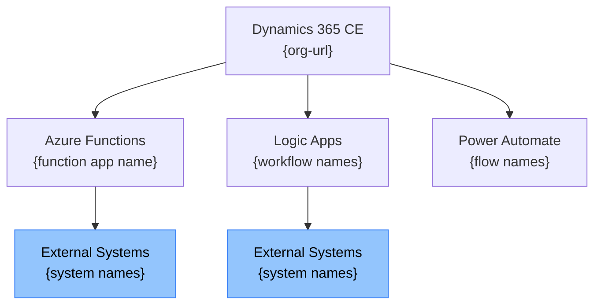
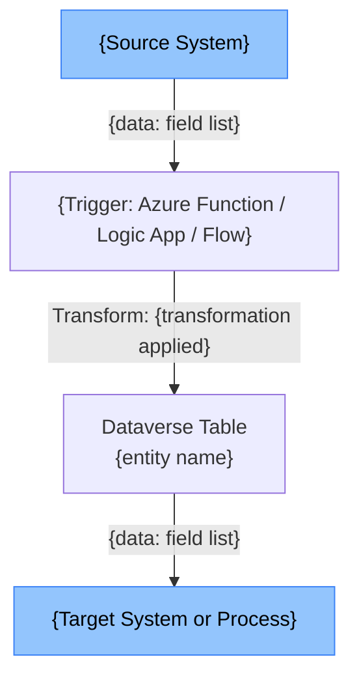

# {Solution Display Name} — Integration Topology

| Property | Value |
|---|---|
| Solution | {solution-name} v{version} |
| Generated | {date} |
| Status | DRAFT — for integration architect review |
| Source | Azure Function source, Logic App definitions, plugin source, flow definitions |

---

## §1 System Landscape

---

## §2 Integration Channel Register

| # | Channel Name | Technology | Direction | Trigger | External System | Data Exchanged |
|---|---|---|---|---|---|---|
| INT-001 | {Channel Name} | Azure Function | Outbound | HTTP POST from Plugin | {System} | {data} |
| INT-002 | {Channel Name} | Logic App | Inbound | Timer (hourly) | {System} | {data} |

---

## §3 Azure Function Details

### {FunctionApp Name}

**Hosting:** {Consumption / Premium / Dedicated}
**Runtime:** {.NET 8 / Node.js 18 / Python 3.11}
**Repository:** {path in input folder}

| Function Name | Trigger | Route / Queue / Schedule | D365 CE Operations | Auth |
|---|---|---|---|---|
| {FunctionName} | HttpTrigger | POST /api/{route} | Create contact | Managed Identity |
| {FunctionName} | ServiceBusTrigger | leads-queue | None (outbound only) | SAS / Managed Identity |

---

## §4 Logic App Details

### {WorkflowName}

**Type:** Consumption / Standard
**Trigger:** {trigger type and details}

**Action sequence:**
1. Trigger: {trigger description}
2. {Action}: {connector — operation name} — {purpose}
3. Condition: {condition logic}
   - True: {action}
   - False: {action}
4. {Action}: {description}

**Connections used:** {list connection references}
**Error handling:** {scope-level catch / none — flag missing as ⚠ TECHNICAL DEBT}

---

## §5 Authentication and Credential Summary

| Component | Auth Method | Credential Storage | Assessment |
|---|---|---|---|
| {Function} | Managed Identity | N/A | ✓ Recommended |
| {Function} | Client Credentials | Key Vault | ✓ Acceptable |
| {Logic App} | API Key | App Settings | ⚠ REVIEW — move to Key Vault |
| {Plugin} | Hard-coded | In source code | ⚠ SECURITY RISK |

---

## §6 Data Flow Diagrams

### {Process Name} Data Flow

---

## §7 SLA and Resilience

| Channel | Trigger Type | Expected Latency | Retry Policy | DLQ / Error Queue |
|---|---|---|---|---|
| INT-001 | Real-time HTTP | <2s | 3 retries, exponential backoff | None detected |
| INT-002 | Scheduled batch | <30 min | 1 retry | {queue name or "None"} |

---

## Documentation Gaps

| Component | Gap | Reason |
|---|---|---|
| {component} | Authentication method unknown | Config files not in input |
