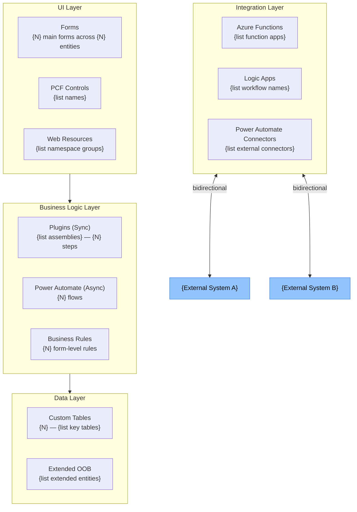
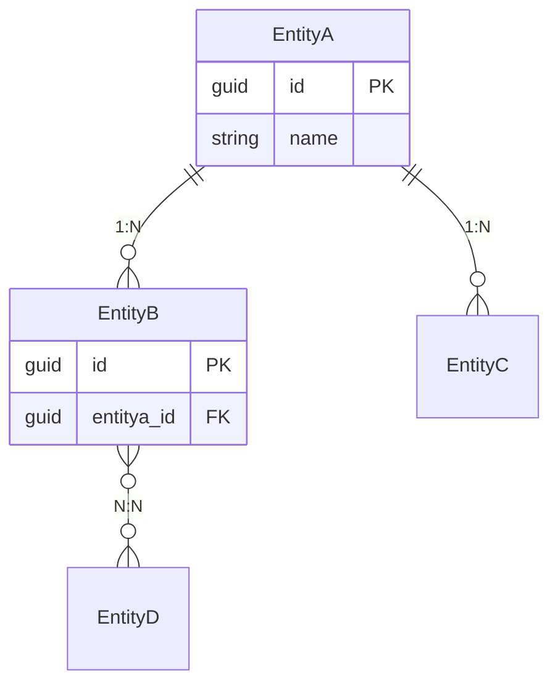

# {Solution Display Name} — Architecture Blueprint

| Property | Value |
|---|---|
| Solution | {solution-name} v{version} |
| Generated | {date} |
| Status | DRAFT — for architect review |
| Architecture Pattern | {Pattern X — Name} |

---

## §1 Architecture Overview

### Pattern Classification

**Primary pattern:** {Pattern X — Name}
**Rationale:** {justification based on component analysis}
**Secondary pattern (if applicable):** {Pattern Y — Name}

### Key Architectural Decisions Evidenced

| Decision | Evidence | Assessment |
|---|---|---|
| Synchronous validation via Pre-Op plugins | {N} Pre-Op plugin steps on critical entities | Appropriate for data integrity |
| Async notifications via Power Automate | {N} automated flows for notifications | Appropriate pattern |

---

## §2 Component Architecture



---

## §3 Data Architecture

### Entity Relationship Map



### Data Flow Summary

| Data Flow | Source | Target | Transform | Frequency |
|---|---|---|---|---|
| Lead → Opportunity | Lead (manual convert) | Opportunity | Copy fields | On-demand |
| Order → ERP | D365 CE Order | ERP System | Map + enrich | Real-time |

---

## §4 Security Architecture

| Actor | Authentication | Access Model |
|---|---|---|
| Sales Users | Azure AD (D365) | User-owned records, BU-level read |
| Integration Service | App Registration / MI | Application user, scoped role |
| External Web | API Key / OAuth | Read-only API access |

---

## §5 Environment and ALM Architecture

### Deployment Order

```
1. {SolutionName}_Base        (publisher + shared components)
2. {SolutionName}_Core        (entities + security roles)
3. {SolutionName}_Logic       (plugins + web resources + flows)
4. {SolutionName}_Config      (environment variables + connection references)
```

---

## §6 Non-Functional Profile

| Characteristic | Assessment | Supporting Evidence |
|---|---|---|
| Performance | Risk: sync plugins on high-volume entities | {N} Pre-Op steps on account |
| Scalability | Flow-based async handles notification volume | Async patterns in {N} flows |
| Maintainability | Mixed: modern patterns + legacy JS | Deprecated API in {N} JS files |
| Upgrade Risk | Moderate | Sync HTTP calls, deprecated APIs |
| Security | Moderate | Hard-coded credentials in {N} locations |

---

## §7 Architectural Findings

### Critical

| # | Component | Finding | Recommendation |
|---|---|---|---|
| C-001 | {Component} | {finding} | {recommendation} |

### High

| # | Component | Finding | Recommendation |
|---|---|---|---|
| H-001 | {Component} | {finding} | {recommendation} |

### Medium

| # | Component | Finding | Recommendation |
|---|---|---|---|
| M-001 | {Component} | {finding} | {recommendation} |

### Informational

| # | Component | Finding |
|---|---|---|
| I-001 | {Component} | {observation} |
