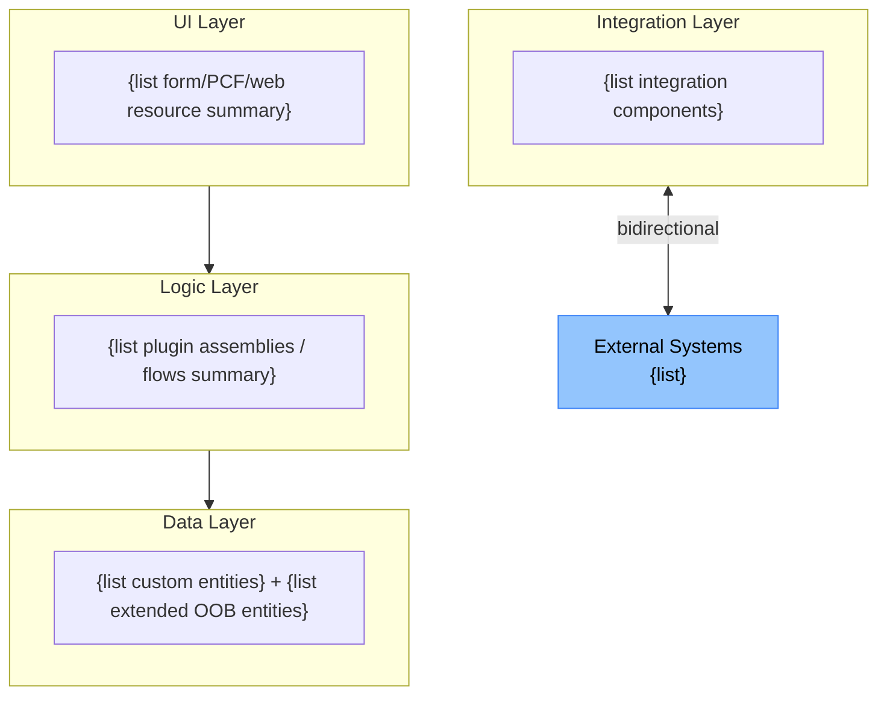
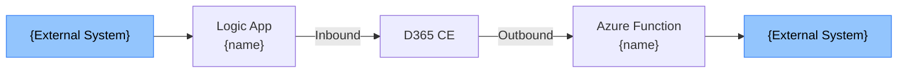

# {Solution Display Name} — Technical Overview

| Property | Value |
|---|---|
| Solution | {solution-name} v{version} |
| Publisher Prefix | {prefix} |
| Generated | {date} |
| Status | DRAFT — for developer review |
| Source artefacts | {list: solution XML, plugin source, web resources, flows, etc.} |

---

## §1 Solution Architecture Overview

### Technology Stack

| Layer | Technology | Count |
|---|---|---|
| Server-side Logic | C# Plugins | {N} steps across {N} assemblies |
| Async Automation | Power Automate | {N} flows |
| Client-side Logic | JavaScript Web Resources | {N} files |
| UI Extension | PCF Controls | {N} controls |
| Integration | Azure Functions | {N} functions |
| Integration | Logic Apps | {N} workflows |

### Architecture Diagram

### Solution Structure

| Solution | Version | Managed | Depends On |
|---|---|---|---|
| {SolutionName} | {version} | No | {dependencies or "None"} |

---

## §2 Data Architecture

### Custom Entities

| Schema Name | Display Name | Ownership | Primary Key Type | Audit Enabled |
|---|---|---|---|---|
| `pub_example` | Example | User | Standard GUID | Yes |

### Key Relationships

| Relationship Name | Parent | Child | Type | Cascade Delete |
|---|---|---|---|---|
| `pub_account_pub_example` | account | pub_example | N:1 | Restrict |

### Environment Variables

| Schema Name | Type | Default | Purpose |
|---|---|---|---|
| `pub_ExternalApiUrl` | String | https://api.example.com | Base URL for external API calls |

---

## §3 Plugin Architecture

### Registered Steps Summary

| Assembly | Plugin Class | Entity | Message | Stage | Mode | Filtering |
|---|---|---|---|---|---|---|
| MyPlugin | AccountPlugin | account | Create | Pre-Op | Sync | — |

### Technical Patterns

- **Depth checking:** {Present / Missing — flag missing as ⚠ UPGRADE RISK}
- **Pre-image usage:** {list plugins that use pre-images and which attributes}
- **External HTTP calls:** {list or "None"}
- **Key Vault integration:** {present / absent}

---

## §4 JavaScript Architecture

### File Inventory

| Schema Name | Namespace | Events Handled | Deprecated APIs |
|---|---|---|---|
| `pub_/js/account_form.js` | pub | OnLoad (account), OnChange (pub_taxcode) | None |

### WebApi Usage

| File | Operation | Target Table | Notes |
|---|---|---|---|
| account_form.js | `retrieveMultipleRecords` | pub_pricelist | Async/await pattern |

---

## §5 Power Automate Architecture

### Connection References

| Connection Reference | Connector | Used By Flows |
|---|---|---|
| `pub_Dataverse` | Microsoft Dataverse | Flow A, Flow B |
| `pub_Office365Outlook` | Office 365 Outlook | Flow C |

### Premium Connectors

{List any premium connectors used — these require additional licensing.}

---

## §6 Integration Architecture

### Integration Topology

### Authentication Patterns

| Component | Authentication | Assessment |
|---|---|---|
| {FunctionApp} | Managed Identity | ✓ Recommended pattern |
| {LogicApp} | API Key in config | ⚠ REVIEW — ensure backed by Key Vault |

---

## §7 Security Architecture (Technical)

### Role Privilege Matrix — Custom Entities

| Role | {pub_example} Create | Read | Write | Delete | Access Level |
|---|---|---|---|---|---|
| Sales Representative | ✓ | ✓ | ✓ | — | User |
| Sales Manager | ✓ | ✓ | ✓ | ✓ | Business Unit |

### Field Security Profiles

| Profile Name | Protected Column | Read | Update |
|---|---|---|---|
| Sensitive Data Profile | pub_taxcode | Restricted | Restricted |

---

## §8 Technical Debt and Risks

| Component | Risk Type | Description | Recommended Action |
|---|---|---|---|
| `account_form.js` | ⚠ TECHNICAL DEBT | Uses deprecated `Xrm.Page` API | Migrate to `formContext` |
| `SyncPlugin` | ⚠ UPGRADE RISK | Sync Post-Op HTTP call | Convert to async or use Azure Function |

---

## Documentation Gaps

| Section | Gap | Reason |
|---|---|---|
| §3 Plugins | `LegacyAssembly.dll` not fully documented | Source code not available |
