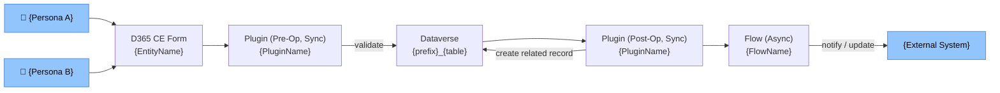
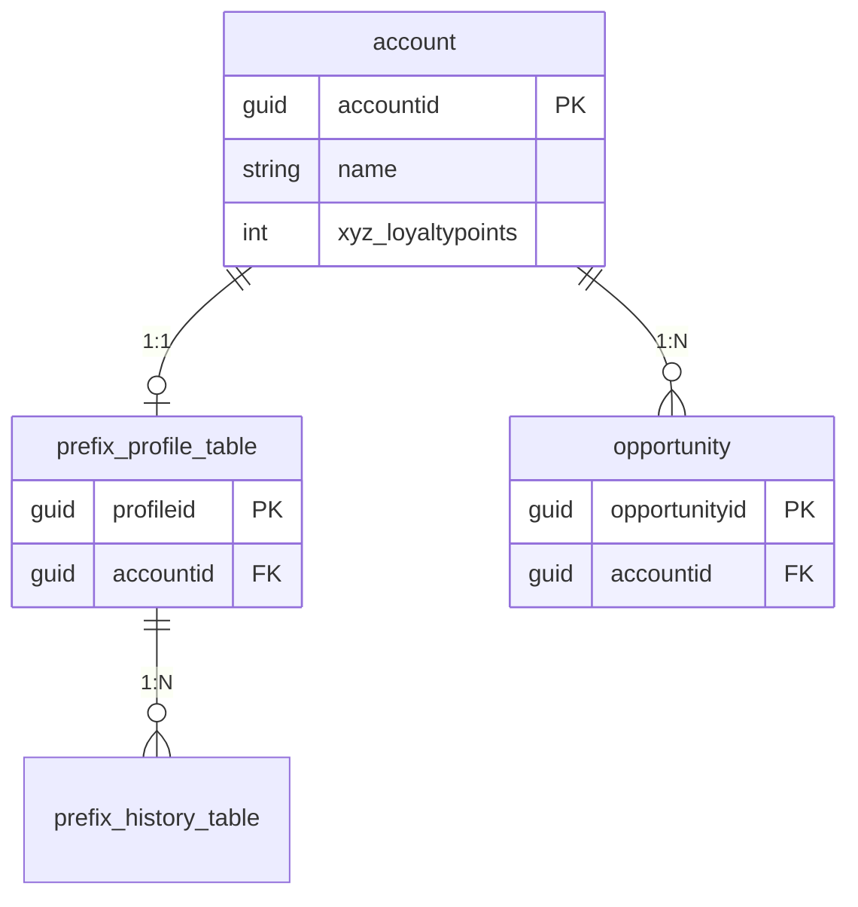
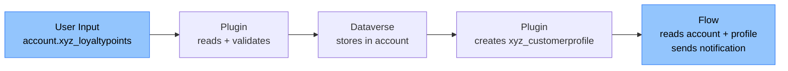
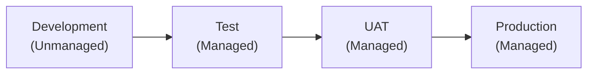

# Solution Blueprint — {Feature Display Name}

> **Purpose:** High-level architecture view for solution architects and technical leads.
> This document captures the architectural decisions, patterns, and rationale before detailed design begins.
> It is the bridge between the functional spec and the TDD.

---

## Document Control

| Version | Date | Author | Changes |
|---|---|---|---|
| 1.0 | {YYYY-MM-DD} | Claude Code (/blueprint) | Initial draft |

---

## Table of Contents

- [1. Architecture Pattern](#1-architecture-pattern)
- [2. Component Architecture](#2-component-architecture)
- [3. D365 CE Extension Point Decisions](#3-d365-ce-extension-point-decisions)
- [4. Data Architecture](#4-data-architecture)
- [5. Security Architecture](#5-security-architecture)
- [6. Integration Architecture](#6-integration-architecture)
- [7. ALM Architecture](#7-alm-architecture)
- [8. Non-Functional Requirements Coverage](#8-non-functional-requirements-coverage)
- [9. Technical Risks and Mitigations](#9-technical-risks-and-mitigations)
- [10. Open Architecture Decisions](#10-open-architecture-decisions)

---

## 1. Architecture Pattern

**Selected Pattern:** {Pattern Letter + Name}
*(e.g., Pattern C — Hybrid: Plugin + Flow)*

### Rationale
{Why this pattern was selected. Refer to task inventory complexity, SLA requirements, and constitution rules.}

### Alternatives Considered
| Pattern | Why Rejected |
|---|---|
| {Pattern A} | {Reason — e.g., synchronous validation required, flows cannot guarantee pre-save execution} |
| {Pattern B} | {Reason} |

---

## 2. Component Architecture



---

## 3. D365 CE Extension Point Decisions

| Capability | Extension Point | Justification | Constitution Ref |
|---|---|---|---|
| Pre-save validation | Plugin (Pre-Operation, Sync) | Must prevent save on invalid data | 02-plugin-standards §Stage |
| Post-create automation | Plugin (Post-Operation, Sync) | Needs access to created record ID | 02-plugin-standards §Images |
| Async notification | Power Automate Flow | Non-blocking, async OK, involves external service | 02-plugin-standards §Sandboxed |
| Client-side show/hide | Business Rule | Simple condition, no code needed | 04-javascript-standards §When to use JS |
| Custom field rendering | PCF Control | Standard control insufficient | 05-pcf-standards §Component Types |

---

## 4. Data Architecture

### Key Entities and Relationships



### Data Flow



### Data Volume and Retention
| Entity | Expected Volume | Growth Rate | Retention Policy |
|---|---|---|---|
| `account` | {N} records | {X/month} | Indefinite |
| `{prefix}_{table}` | {N} records | {X/month} | {N years} |

---

## 5. Security Architecture

### Authentication Model
- All users authenticate via **Azure AD** → D365 CE security roles
- Integration access via **Application User** with dedicated security role
- No service accounts using named user credentials

### Security Role Structure

| Persona | Security Role(s) Assigned |
|---|---|
| Sales Rep | XYZ CE — Opportunity Full, XYZ CE — Account Read |
| Sales Manager | XYZ CE — Opportunity Full, XYZ CE — Account Full, XYZ CE — Reports Read |
| Integration User | XYZ CE — Integration (minimal privilege) |

### Data Access Boundaries
| Persona | Account Access | Related Entity Access | Notes |
|---|---|---|---|
| Sales Rep | Own + shared | Own | Cannot see others' data |
| Sales Manager | Organisation-wide | Organisation-wide | |

---

## 6. Integration Architecture *(if applicable)*

| Interface | Direction | Protocol | Auth | Pattern |
|---|---|---|---|---|
| {System name} | Outbound | HTTPS | Managed Identity | Async (Service Bus) |

---

## 7. ALM Architecture

### Environment Strategy



### Solution Structure
```
{prefix}_{SolutionName} (v1.0.0.0)
  ├─ Tables: {prefix}_{table}
  ├─ Plugins: XYZ.SalesEnhancements.Plugins
  ├─ Web Resources: xyz_account_main_loyalty.js
  └─ Security Roles: {SolutionName} — *
```

### Pipeline Stages
| Stage | Trigger | Gate |
|---|---|---|
| CI | PR to main | Solution Checker (0 Critical/High), Unit tests pass |
| Deploy to Test | Merge to main | Automated |
| Deploy to UAT | Manual trigger | Test sign-off |
| Deploy to Production | Manual trigger | UAT sign-off + change approval |

---

## 8. Non-Functional Requirements Coverage

| NFR | Target | Design Approach |
|---|---|---|
| Plugin performance | < 500ms per execution | Synchronous validation only — no external calls |
| Scalability | Supports 10,000 accounts | No full-table queries in plugin |
| Availability | 99.9% (platform SLA) | No custom infrastructure to maintain |
| Maintainability | Constitution-compliant | Single responsibility per plugin |

---

## 9. Technical Risks and Mitigations

| Risk ID | Risk | Likelihood | Impact | Mitigation |
|---|---|---|---|---|
| TR-001 | {Risk description} | H / M / L | H / M / L | {Mitigation approach} |

---

## 10. Open Architecture Decisions

| Decision ID | Question | Options | Target Date | Owner |
|---|---|---|---|---|
| AD-001 | {Question to resolve} | {Option A / Option B} | {YYYY-MM-DD} | {Name} |
