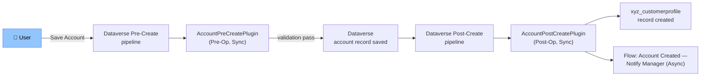

# Technical Design Document — {Feature Display Name}

> **Purpose:** Definitive technical reference for developers and release engineers.
> Assumes the reader has read the FDD. Business context is in the FDD — this document covers HOW.

---

## Document Control

| Version | Date | Author | Reviewed By | Changes |
|---|---|---|---|---|
| 1.0 | {YYYY-MM-DD} | Claude Code (/tdd) | {Reviewer Name} | Initial draft |

---

## Table of Contents

- [1. Technical Architecture Overview](#1-technical-architecture-overview)
- [2. Dataverse Schema Design](#2-dataverse-schema-design)
- [3. Plugin Technical Specifications](#3-plugin-technical-specifications)
- [4. Power Automate / Cloud Flow Technical Specifications](#4-power-automate--cloud-flow-technical-specifications)
- [5. JavaScript Technical Specifications](#5-javascript-technical-specifications)
- [6. PCF Control Technical Specifications](#6-pcf-control-technical-specifications)
- [7. Custom API / Custom Action Technical Specifications](#7-custom-api--custom-action-technical-specifications)
- [8. Ribbon / Command Bar Technical Specifications](#8-ribbon--command-bar-technical-specifications)
- [9. Business Rule Technical Specifications](#9-business-rule-technical-specifications)
- [10. Email / Notification Template Technical Specifications](#10-email--notification-template-technical-specifications)
- [11. Report / Dashboard Technical Specifications](#11-report--dashboard-technical-specifications)
- [12. Duplicate Detection Rule Technical Specifications](#12-duplicate-detection-rule-technical-specifications)
- [13. Security Technical Design](#13-security-technical-design)
- [14. Solution and ALM Design](#14-solution-and-alm-design)
- [15. Integration Technical Design](#15-integration-technical-design)
- [16. Automated Test Specification](#16-automated-test-specification)
- [17. NFR Compliance](#17-nfr-compliance)
- [18. Technical Risks](#18-technical-risks)
- [19. Constitution Exceptions](#19-constitution-exceptions)
- [20. Author Completion Checklist](#20-author-completion-checklist)

---

## 1. Technical Architecture Overview

### Architecture Pattern
**Selected:** {Pattern name from /blueprint} — see [solution-blueprint.md](solution-blueprint.md)

### FDD-to-TDD Traceability

Every Object-ID from FDD §5 must appear in this table with a status of Designed before the TDD is submitted for review.

| FR Reference | Object-ID | Object Name | Object Type | TDD Section | Status |
|---|---|---|---|---|---|
| FR-NNN | CE-001 | `{prefix}_{tablename}` | Custom Table | §2 | Designed |
| FR-NNN | CE-002 | `{prefix}_{columnname}` | Custom Column | §2 | Designed |
| FR-NNN | CE-003 | `{prefix}_{PluginName}` | Plugin | §3 | Designed |
| FR-NNN | CE-004 | `{prefix}_{FlowName}` | Cloud Flow | §4 | Designed |
| FR-NNN | CE-005 | `{prefix}_{WebResourceName}` | Web Resource | §5 | Designed |
| FR-NNN | CE-006 | `{prefix}_{ControlName}` | PCF Control | §6 | Designed |
| FR-NNN | CE-007 | `{prefix}_{CustomApiName}` | Custom API | §7 | Designed |
| FR-NNN | CE-008 | `{prefix}_{ButtonId}` | Ribbon Button | §8 | Designed |

### Configuration-First Assessment

Document the evaluation of each extension point tier before reaching pro-code. Flag any tier that was skipped as a constitution risk (see `00-architectural-principles.md` §1).

| Requirement | OOB / Business Rule | Low-Code (Flow / Power Fx) | Pro-Code (Plugin / PCF / JS) | Selected Tier | Justification |
|---|---|---|---|---|---|
| {FR-001: description} | {Evaluated? Yes/No — why not sufficient} | {Evaluated? Yes/No — why not sufficient} | {Required because…} | {Tier} | {Constitution ref} |

### Architecture Decision Log

| Decision | Options Considered | Decision Made | Constitution Rule | Rationale |
|---|---|---|---|---|
| Sync vs Async processing | Plugin (sync), Flow (async) | Plugin (sync) | 02-plugin-standards §Execution | Must validate before save |
| Early vs late-bound | Late-bound, Early-bound | Early-bound | 02-plugin-standards §Execute | Type safety + IntelliSense |

### Component Interaction



---

## 2. Dataverse Schema Design

### New Tables

#### `{prefix}_{tablename}` — {Display Name}

| Property | Value |
|---|---|
| Schema Name | `{prefix}_{tablename}` |
| Display Name | {Display Name} |
| Plural Display Name | {Plural Name} |
| Ownership | User or Team |
| Description | {Description} |

**Columns:**

| Schema Name | Display Name | Type | Length / Precision | Required | PII / Financial | Description |
|---|---|---|---|---|---|---|
| `{prefix}_name` | Name | Single Line Text | 200 | Business Required | No | Primary name |
| `{prefix}_loyaltypoints` | Loyalty Points | Whole Number | — | Optional | No | Customer accumulated points |

**Relationships:**

| Schema Name | Type | Related Table | Cascade (Delete) | Description |
|---|---|---|---|---|
| `{prefix}_{parent}_{child}` | N:1 | `account` | Restrict | Links profile to account |

**Alternate Keys:**

| Key Name | Columns | Purpose |
|---|---|---|
| `{prefix}_{table}_AK_ExternalId` | `{prefix}_externalid` | Integration deduplication |

**Expected Data Volume:**

| Dimension | Estimate | Notes |
|---|---|---|
| Initial row count | {N} | Flag if > 1,000,000 — see `11-nfr-targets.md` |
| Annual growth | {N rows/year} | |
| Archiving policy | {None / Archive after N years} | |

---

### Views

*Repeat for each custom or modified view in scope. State "N/A" if no views are in scope.*

#### View: `{prefix}_{entityname}_{viewpurpose}` — {Display Name}

| Property | Value |
|---|---|
| Schema Name | `{prefix}_{entityname}_{viewpurpose}` |
| Display Name | {Display Name} |
| View Type | Public / Quick Find / Lookup / Associated / Advanced Find |
| Entity | {entity schema name} |
| Default Sort Column | `{column schema name}`, ASC / DESC |

**Columns (in order):**

| Column Schema Name | Display Name | Width (px) |
|---|---|---|
| `{prefix}_name` | Name | 300 |
| `{prefix}_status` | Status | 150 |

**FetchXML Filter:**

```xml
<filter type="and">
  <condition attribute="{prefix}_statecode" operator="eq" value="0" />
</filter>
```

---

### Forms

*List every custom form or form extension included as a solution component. Detailed field layout is in FDD §10.1 — this section records technical registration only.*

| Form Name | Entity | Form Type | Object-ID | JS Events Registered | FDD Reference |
|---|---|---|---|---|---|
| {Form Display Name} | {entity schema name} | Main / Quick Create / Card / Mobile | CE-{NNN} | {Function names from §5, or None} | FDD §10.1 |

---

## 3. Plugin Technical Specifications

*(None — if no plugins are required, state "None" and remove sub-headings.)*

### Plugin: `{Entity}{Pre|Post}{Operation}Plugin`

| Property | Value |
|---|---|
| Class Name | `AccountPreCreatePlugin` |
| Namespace | `XYZ.SalesEnhancements.Plugins.Account` |
| Assembly | `XYZ.SalesEnhancements.Plugins.dll` |
| Test Class | `AccountPreCreatePluginTests` |
| Test Project | `XYZ.SalesEnhancements.Plugins.Tests` |

**Registration:**

| Property | Value |
|---|---|
| Entity | `account` |
| Message | `Create` |
| Stage | `Pre-Operation` (20) |
| Mode | `Synchronous` |
| Rank | `1` |
| Filtering Attributes | `xyz_loyaltypoints` |

**Execution Context:**

| Property | Value |
|---|---|
| Runs As | User context (`context.UserId`) |
| System Context Used | No — if Yes, document justification here per `06-security-model.md` §Plugin Security Context |

**Pre-Image:**

*(State "Not required" if no pre-image is needed. When required, list only the columns needed — never register all attributes.)*

| Alias | Attribute Schema Name | Reason Required |
|---|---|---|
| `PreImage` | `{prefix}_fieldname` | {Why this field is needed — e.g., compare old vs new value to detect change} |

**Post-Image:**

*(State "Not required" if no post-image is needed.)*

| Alias | Attribute Schema Name | Reason Required |
|---|---|---|
| `PostImage` | `{prefix}_fieldname` | {Why needed — e.g., read calculated value set by platform after save} |

**Logic:**
1. Extract `xyz_loyaltypoints` from `context.InputParameters["Target"]`
2. If null — skip validation (field is optional)
3. If value < 0 or > 99999 — throw `InvalidPluginExecutionException`: "Loyalty Points must be between 0 and 99,999."
4. Trace: `"[AccountPreCreatePlugin] Validation passed. Points: {value}"`

**Idempotency Mechanism:**

| Property | Value |
|---|---|
| Has Dataverse writes / outbound calls | No — validation only |
| Idempotency approach | N/A — no side effects |
| Guard condition (if applicable) | {Describe the check that prevents duplicate execution, e.g., alternate key lookup, status flag} |

**Service Calls:** None — validation only, no Dataverse reads/writes

**Error Messages:**

| Condition | User-Facing Message | Technical Trace Detail |
|---|---|---|
| Points out of range | `"Loyalty Points must be between 0 and 99,999."` | `[AccountPreCreatePlugin] Validation failed. Value: {value}` |

---

## 4. Power Automate / Cloud Flow Technical Specifications

*(None — if no flows are required, state "None" and remove sub-headings.)*

### Flow: `{FlowName}`

| Property | Value |
|---|---|
| Display Name | `{Flow display name}` |
| Trigger Type | Automated / Instant / Scheduled |
| Trigger Source | Dataverse row added/modified / Manual / Recurrence |
| Synchronous (Real-Time) | Yes / No |
| Max Execution Time | {Expected duration — must be ≤ 5s if called synchronously from a plugin} |

**Trigger Configuration:**

| Property | Value |
|---|---|
| Column Filter (trigger only when changed) | {Comma-separated schema names — or "All columns" with justification} |
| Filter Rows (FetchXML condition) | {FetchXML filter expression — or "None"} |
| Run As | {Connection owner / Flow owner / Invoking user} |
| Run Only Users | {Not configured / Specific users or roles} |

**Connection References:**

| Connection Reference Schema Name | Connector | Auth Method | Uses Managed Identity |
|---|---|---|---|
| `{prefix}_{ConnectionRef}` | Dataverse | Azure AD | Yes |

**Actions Summary:**

| Step | Action | Description |
|---|---|---|
| 1 | {Action type} | {What it does} |

**Error Handling:**

| Scenario | Handling Strategy | DLQ / Retry |
|---|---|---|
| Transient failure | Retry up to 3× with exponential backoff | Yes — DLQ required for async flows per `11-nfr-targets.md` |
| Permanent failure | Send failure notification / log to custom table | {Details} |

**Idempotency Mechanism:** {How the flow avoids duplicate side-effects on re-trigger}

---

## 5. JavaScript Technical Specifications

*(None — if no JavaScript / web resources are required, state "None" and remove sub-headings.)*

### Web Resource: `{prefix}_{entity}_{form}_{purpose}.js`

| Property | Value |
|---|---|
| Schema Name | `xyz_xyz_account_main_loyalty` |
| Type | Script (JScript) |
| Language | TypeScript (compiled) / JScript |
| Namespace | `XYZ.Account.Main` |
| Description | Form script for Loyalty Points on Account Main form |

**Event Registrations:**

| Entity | Form | Event | Function | Pass Execution Context |
|---|---|---|---|---|
| account | Account — Main | OnChange of `xyz_loyaltypoints` | `XYZ.Account.Main.onLoyaltyPointsChange` | Yes |

**Functions:**

| Function | Parameters | Logic Summary | Attributes Read | Attributes Written |
|---|---|---|---|---|
| `onLoyaltyPointsChange(executionContext)` | executionContext | Read `xyz_loyaltypoints` value; if > 99999 show notification | `xyz_loyaltypoints` | None |

---

## 6. PCF Control Technical Specifications

*(None — if no PCF controls are required, state "None" and remove sub-headings.)*

### Control: `{ControlName}Control`

| Property | Value |
|---|---|
| Namespace | `XYZ.PCF.{ControlName}` |
| Control Type | `standard` (field) |
| Bound Property | `{prefix}_{column}` of type {TypeScript type} |

---

## 7. Custom API / Custom Action Technical Specifications

*(None — if no Custom APIs or Custom Actions are required, state "None" and remove sub-headings.)*

### Custom API: `{prefix}_{customapiname}`

| Property | Value |
|---|---|
| Unique Name | `{prefix}_{customapiname}` |
| Display Name | {Display Name} |
| Type | Action / Function |
| Binding Type | Global / Entity / Entity Collection |
| Bound Entity | {entity schema name — or N/A if Global} |
| Is Private | Yes / No |
| Allowed Custom Processing Step Type | None / Async Only / Sync Only / Both |
| Privilege Required | {Privilege schema name — or None} |
| FDD Reference | FDD §10.6 |

**Request Parameters:**

| Schema Name | Display Name | Type | Is Optional | Description |
|---|---|---|---|---|
| `{prefix}_{paramname}` | {Display Name} | {String / EntityReference / Integer / Boolean / Decimal / DateTime} | Yes / No | {Purpose and validation rules} |

**Response Properties:**

| Schema Name | Display Name | Type | Description |
|---|---|---|---|
| `{prefix}_{propname}` | {Display Name} | {Type} | {What this returns and under what conditions} |

**Executing Plugin:**

| Property | Value |
|---|---|
| Plugin Class | {Class name from §3 that handles this message} |
| Message | `{prefix}_{customapiname}` |
| Stage | Post-Operation (90) — Custom APIs execute in Post-Operation |
| Mode | Synchronous / Asynchronous |

**Logic:**
1. {Step 1 — extract and validate request parameters}
2. {Step 2 — business logic}
3. {Step 3 — set response properties}

**Error Messages:**

| Condition | User-Facing Message | HTTP / Plugin Error Code |
|---|---|---|
| {Missing required parameter} | `"{Message}"` | `InvalidPluginExecutionException` |
| {Business rule violation} | `"{Message}"` | `InvalidPluginExecutionException` |

---

*(Repeat Custom API sub-section for each additional Custom API)*

---

## 8. Ribbon / Command Bar Technical Specifications

*(None — if no ribbon or command bar customisations are required, state "None" and remove sub-headings.)*

### Button: `{prefix}.{Entity}.{ButtonName}.Button`

| Property | Value |
|---|---|
| Button ID | `{prefix}.{Entity}.{ButtonName}.Button` |
| Command ID | `{prefix}.{Entity}.{ButtonName}.Command` |
| Entity | {entity schema name} |
| Location | Form command bar / View command bar / Sub-grid toolbar |
| Label | {Display label — must match FDD §10.9} |
| Tooltip | {Tooltip text} |
| Icon | {Web resource schema name — or OOB icon reference} |
| FDD Reference | FDD §10.9 |

**Enable Rule:**

| Rule ID | Type | Logic |
|---|---|---|
| `{prefix}.{Entity}.{ButtonName}.EnableRule` | JavaScript Function | `{Namespace}.{functionName}(primaryControl)` — returns bool |
| *or* | FetchXML | `<fetch>...</fetch>` — button enabled when records returned |

**Display Rule:**

| Rule ID | Type | Condition |
|---|---|---|
| `{prefix}.{Entity}.{ButtonName}.DisplayRule` | FormState Rule | New / Existing / ReadOnly / Disabled / BulkEdit |
| *or* | JavaScript Function | `{Namespace}.{functionName}(primaryControl)` — returns bool |

**Command Action:**

| Property | Value |
|---|---|
| Type | JavaScript Function / Flow (via Custom API) / Navigate URL |
| Function / Target | {JS function full qualified name — or Custom API unique name} |
| CRM Parameters Passed | `PrimaryEntityTypeCode`, `FirstPrimaryItemId`, etc. |

**Web Resource:** `{prefix}_{entity}_{buttonname}_ribbon.js` — see §5 for JS spec.

---

*(Repeat Button sub-section for each additional ribbon button)*

---

## 9. Business Rule Technical Specifications

*(None — if no Business Rules are in scope, state "None" and remove sub-headings.)*

### Business Rule: `{BR-001 — Rule Name}`

| Property | Value |
|---|---|
| Display Name | {Display Name — must match FDD §10.2} |
| Entity | {entity schema name} |
| Scope | Entity (Server + Client) / All Forms (Client) / Specific Form (Client-only) |
| Status | Active |
| Implementation Decision | Declarative Business Rule / Plugin (§3) / JavaScript (§5) |
| Justification if not Declarative | {Why a standard Business Rule is insufficient — e.g., requires cross-record lookup only possible server-side; complex conditional logic exceeding BR capability} |
| FDD Reference | FDD §10.2, BR-{NNN} |

*If implementation is Declarative Business Rule, populate the tables below. If implemented via Plugin or JS, reference the relevant section and leave the tables blank.*

**Conditions:**

| Field Schema Name | Operator | Value / Field Reference | Logical Connector |
|---|---|---|---|
| `{prefix}_fieldname` | equals / does not equal / contains / greater than / is null | {Value or `{prefix}_otherfield`} | AND / OR |

**Actions:**

| Action | Target Field Schema Name | Value / Message |
|---|---|---|
| Show error message | — | `"{Exact error message text}"` |
| Set field value | `{prefix}_fieldname` | {Value} |
| Lock / Unlock field | `{prefix}_fieldname` | — |
| Show / Hide field | `{prefix}_fieldname` | — |

---

*(Repeat Business Rule sub-section for each additional rule)*

---

## 10. Email / Notification Template Technical Specifications

*(None — if no email templates or notification rules are in scope, state "None" and remove sub-headings.)*

### Email Template: `{Template Name}`

| Property | Value |
|---|---|
| Template Category | {Account / Contact / Case / Global} |
| Language (LCID) | 1033 — English (or {LCID}) |
| Subject | {Subject line with dynamic tokens in `{!EntityType:FieldName;}` syntax} |
| FDD Reference | FDD §10.7 |

**Token Mapping:**

| Display Token | Entity Type | Field Schema Name | Data Type | Fallback if Null |
|---|---|---|---|---|
| `{!Account:Name;}` | account | `name` | String | (blank) |
| `{!Contact:emailaddress1;}` | contact | `emailaddress1` | String | (blank) |

**Body Summary:** {High-level description of body content — full HTML/text body maintained in solution}

---

### Alert Rule: `{Alert Name}`

*(Only populate if using Dataverse system alerts — not Power Automate notifications.)*

| Property | Value |
|---|---|
| Entity | {entity schema name} |
| Delivery Method | Email / In-app notification / Both |
| Recipient(s) | {Role / specific user field schema name} |
| FDD Reference | FDD §10.7 |

**Condition FetchXML:**

```xml
<fetch>
  <entity name="{entity}">
    <filter type="and">
      <condition attribute="{prefix}_statecode" operator="eq" value="{value}" />
    </filter>
  </entity>
</fetch>
```

---

*(Repeat sub-sections for each additional email template or alert rule)*

---

## 11. Report / Dashboard Technical Specifications

*(None — if no reports or dashboards are in scope, state "None" and remove sub-headings.)*

---

### Report: `{ReportName}` ({SSRS / System Chart / Power BI Embedded})

| Property | Value |
|---|---|
| Display Name | {Display Name — must match FDD §10.8} |
| Report Type | SSRS (Fetch-based) / System Chart / Power BI Embedded |
| Entity | {Primary entity schema name} |
| Access Path | {Navigation path or embedded on form/dashboard} |
| Security Role(s) | {Roles that can run this report} |
| FDD Reference | FDD §10.8 |

**Dataset / Chart Query (FetchXML):**

```xml
<fetch aggregate="{true/false}">
  <entity name="{entity}">
    <attribute name="{prefix}_fieldname" alias="{alias}" aggregate="{count/sum/avg/N/A}" />
    <filter type="and">
      <condition attribute="{prefix}_statecode" operator="eq" value="0" />
    </filter>
  </entity>
</fetch>
```

**Parameters:**

| Parameter Name | Data Type | Mandatory | Default | FetchXML Binding |
|---|---|---|---|---|
| {ParameterName} | {String / DateTime / Integer} | Yes / No | {Default} | `<condition attribute="..." operator="eq" value="@{ParameterName}" />` |

**Column / Visual Mapping:**

| Field Schema Name | Report Column / Chart Series | Aggregation | Notes |
|---|---|---|---|
| `{prefix}_fieldname` | {Column header or series label} | Count / Sum / Average / None | |

---

### Dashboard: `{Dashboard Name}`

| Property | Value |
|---|---|
| Display Name | {Display Name — must match FDD §10.8} |
| Dashboard Type | System Dashboard / Personal (N/A for solution deployment) |
| Layout | {2-column / 3-column / custom} |
| FDD Reference | FDD §10.8 |

**Components:**

| Position | Component Type | Name / Schema Name | Entity | Notes |
|---|---|---|---|---|
| {Row/Col} | Chart / List View / Web Resource / iFrame | {Name} | {Entity} | {Configuration notes} |

---

*(Repeat sub-sections for each additional report or dashboard)*

---

## 12. Duplicate Detection Rule Technical Specifications

*(None — if no duplicate detection rules are in scope, state "None" and remove sub-headings.)*

### Duplicate Detection Rule: `{Rule Name}`

| Property | Value |
|---|---|
| Rule Name | {Rule Name — must match FDD §10.10} |
| Base Record Type | {entity schema name} |
| Matching Record Type | {entity schema name — same entity for same-type duplicates} |
| Rule Status | Active |
| Apply during | Dataverse import / Manual duplicate detection job / Both |
| FDD Reference | FDD §10.10 |

**Match Criteria:**

| Field Display Name | Schema Name | Match Type | Criteria | Case Sensitive |
|---|---|---|---|---|
| {Field} | `{prefix}_fieldname` | Exact Match / Same First N Characters / Same Last N Characters / Sounds Like | {N characters — or N/A for Exact/Sounds Like} | Yes / No |

**Exclusion Conditions:**

| Condition | Description |
|---|---|
| {e.g., Status = Inactive} | {Records matching this condition are excluded from duplicate checking} |

---

*(Repeat sub-section for each additional duplicate detection rule)*

---

## 13. Security Technical Design

### Security Roles

#### Role: `{SolutionName} — {Module} {Level}`

| Table | Create | Read | Write | Delete | Append | AppendTo |
|---|---|---|---|---|---|---|
| `account` | User | Org | User | None | User | User |
| `{prefix}_{table}` | User | User | User | None | None | None |

### Field Security Profiles

*(None — if no field-level security is required, state "None". Apply only for PII, financial, or credential columns per `06-security-model.md` §Field-Level Security.)*

| Profile Name | Column | Can Read | Can Update | Business Justification | Assigned To |
|---|---|---|---|---|---|
| `{prefix}_Sensitive_FSP` | `{prefix}_{sensitive_column}` | With Profile | With Profile | {Why this column requires field-level security} | {Role Name} |

### Application User

*(None — if no application/integration user is required, state "None". Required whenever an integration or background service authenticates to Dataverse.)*

| Property | Value |
|---|---|
| Name | `{SolutionName} Integration User` |
| App Registration | `{Azure App Registration Name}` |
| Security Role | `{SolutionName} — Integration` |
| Least-Privilege Justification | {List only the tables/messages this user needs} |

### Key Vault References

*(None — if no secrets are used, state "None". No secrets may be stored in solution files, environment variable plain-text values, or code — see `06-security-model.md` §Secret Management.)*

| Secret Name | Purpose | Environment Variable Schema Name | Key Vault URI |
|---|---|---|---|
| `{SecretName}` | {What it authenticates or accesses} | `{prefix}_{EnvVarName}` (type: Secret) | `https://{vault}.vault.azure.net/secrets/{name}` |

### Managed Identity

| Service Connection | Target Service | Managed Identity Used | App Registration (if not MI) | Justification |
|---|---|---|---|---|
| `{ConnectionRef}` | {Azure Service / Dataverse} | Yes / No | {App Reg name if no MI} | {Why MI is or is not applicable} |

### Audit Configuration

*(Required for every custom table containing PII, financial, or compliance data — see `06-security-model.md` §Dataverse Auditing.)*

| Table / Column | Audit Level | Retention | Business Justification |
|---|---|---|---|
| `{prefix}_{table}` (table-level) | Create, Update, Delete | 7 years | Contains PII / financial data |
| `{prefix}_{table}.{prefix}_{column}` (column-level) | Update | 7 years | Status transition / financial amount field |

---

## 14. Solution and ALM Design

| Property | Value |
|---|---|
| Solution Name | `{prefix}_{SolutionName}` |
| Publisher | `{prefix}` |
| Version | `1.0.0.0` |
| Feature Branch | `feature/{ticket-id}-{short-description}` |

**Components Included:**

| Component Type | Schema Name | Notes |
|---|---|---|
| Table | `{prefix}_{table}` | New |
| Plugin Assembly | `XYZ.SalesEnhancements.Plugins` | New |
| Web Resource | `xyz_xyz_account_main_loyalty.js` | New |
| Security Role | `{SolutionName} — {Module} Full` | New |

**Environment Variables:**

| Schema Name | Type | Default Value | Description |
|---|---|---|---|
| `{prefix}_{ConfigKey}` | String | `{default}` | {Purpose} |

**Dependent Solutions:**

| Solution | Version | Type |
|---|---|---|
| {Dependency} | {≥ version} | Managed |

**Deployment Sequence:**

Each step must complete and be verified before the next begins.

| Step | Action | Artifact / Package | Depends On | Target Environments |
|---|---|---|---|---|
| 1 | Deploy dependency solution | {DependencySolutionName}_managed.zip | None | All |
| 2 | Deploy this solution (managed) | `{prefix}_{SolutionName}_managed.zip` | Step 1 | Test / UAT / Prod |
| 3 | Import configuration / reference data | `{ConfigDataPackage}.zip` | Step 2 | Test / UAT / Prod |
| 4 | Run post-deployment validation | See Post-Deployment Validation below | Step 3 | All |

**Environment Configuration Matrix:**

Values that differ per environment — Dev uses defaults, other rings require explicit configuration.

| Schema Name | DEV | TEST | UAT | PROD |
|---|---|---|---|---|
| `{prefix}_{EndpointUrl}` | `{dev-url}` | `{test-url}` | `{uat-url}` | *(Key Vault secret — do not record here)* |
| `{prefix}_{FeatureFlag}` | `true` | `true` | `false` | `false` |

**Pipeline Gates:**

| Gate | Tool / Check | Pass Criterion |
|---|---|---|
| Static analysis | Solution Checker | Zero Critical / High issues before merge to main |
| Unit tests | `{SolutionName}.Plugins.Tests` | 0 failures, ≥ 80% line coverage |
| Peer review | Pull Request | Minimum 1 approver on PR to `main` |

**Configuration Data Migration:**

*(None — if no reference/config data migration is required, state "None".)*

| Data Set | Entity / Table | Tool | Schema Version-Controlled | Import Order | Notes |
|---|---|---|---|---|---|
| {Config dataset name} | {entity schema name} | Configuration Migration Tool | Yes | {1 — must import before dependent data} | {What reference data is included} |

**Post-Deployment Validation:**

Execute these steps in order after deploying to each environment. Record Pass / Fail.

| Step | Action | Expected Result | Owner |
|---|---|---|---|
| 1 | {Navigate to entity list / run flow manually / open form} | {Form loads in < 2s; no JS errors in browser console} | Developer |
| 2 | {Create a test record triggering FR-NNN} | {Plugin fires; record saved; downstream record created} | Developer |
| 3 | {Verify integration message sent / received} | {Message appears in integration log / target system} | Developer |
| 4 | {Run smoke test for key UAT scenario} | {AC from FDD §6.x.5 satisfied} | Tester |

**Rollback Procedure:**

| Step | Action |
|---|---|
| 1 | Re-deploy previous managed solution version via release pipeline |
| 2 | {Any data rollback steps — e.g., deactivate records created by this release} |
| 3 | Verify by running smoke test on {key scenario} |

---

## 15. Integration Technical Design

*(None — if no integrations are required, state "None" and remove sub-headings. Every external endpoint is an Integration Point per `00-architectural-principles.md` §2.)*

### Outbound Integration: `{IntegrationName}`

| Property | Value |
|---|---|
| Direction | Outbound |
| Trigger | {Plugin post-operation / Flow / Scheduled} |
| Endpoint | `{URL or service name — no secrets here}` |
| Auth Method | Managed Identity / OAuth 2.0 (app registration) |
| Environment Variable (endpoint) | `{prefix}_{EndpointEnvVar}` |
| Payload Format | JSON / XML |
| Idempotency Key | {Field used to deduplicate — e.g., `{prefix}_externalid`} |

**Field Transformation / Mapping:**

| Source Field (Schema Name) | Source System | Source Type | Transformation Rule | Target Field | Target System | Target Type |
|---|---|---|---|---|---|---|
| `{prefix}_fieldname` | D365 CE | {String / Int / Lookup / OptionSet} | {Direct map / Format as ISO-8601 / Map option value to code / Concatenate with `_`} | `{targetFieldName}` | {External system} | {String / Integer / etc.} |
| `{prefix}_accountid.name` | D365 CE | Lookup (expanded) | Extract `.name` property | `accountName` | {External system} | String |

**Payload Schema:**

```json
{
  "field": "value"
}
```

**Retry Policy:**

| Scenario | Retries | Backoff | DLQ |
|---|---|---|---|
| Transient (5xx, timeout) | 3 | Exponential (2s, 4s, 8s) | Yes |
| Permanent (4xx) | 0 | N/A | Yes — with error detail |

### Inbound Integration: `{IntegrationName}`

| Property | Value |
|---|---|
| Direction | Inbound |
| Trigger Mechanism | Dataverse Custom API / Azure Service Bus / Webhook |
| Message Format | JSON |
| Validation Rules | {Schema validation, required fields, business key checks} |
| Duplicate Handling | Upsert via alternate key `{prefix}_{table}_AK_ExternalId` |
| Error Response | HTTP 400 with structured error body |

**Field Transformation / Mapping:**

| Source Field | Source System | Source Type | Transformation Rule | Target Field (Schema Name) | Target Entity | Target Type |
|---|---|---|---|---|---|---|
| `{sourceFieldName}` | {External system} | {String / Integer / etc.} | {Direct map / Parse ISO-8601 to DateTime / Map code to option value} | `{prefix}_fieldname` | {entity} | {D365 CE type} |

---

## 16. Automated Test Specification

### Test Strategy

| Component Type | Test Type | Framework / Tool | Coverage Target | Notes |
|---|---|---|---|---|
| Plugin | Unit | NUnit / MSTest + FakeXrmEasy / XrmUnitTest | ≥ 80% line coverage | Tests run in CI pipeline — gate on merge |
| Cloud Flow | Functional | Power Automate Test Studio / manual trigger with verified outcome | Key positive + negative scenarios | No automated CI gate — verified in dev ring before promotion |
| JavaScript / TypeScript | Unit | Jest | ≥ 70% line coverage | Jest config in `package.json` |
| PCF Control | Unit | Jest | ≥ 70% line coverage | |
| Custom API | Integration | Postman collection / HTTP step in test flow | All request/response paths | Run against Dev environment |

### Mock / Fake Strategy

| Dependency | Mock Approach | Setup Notes |
|---|---|---|
| `IOrganizationService` | FakeXrmEasy `XrmFakedContext` / `OrganizationServiceFake` | Seed with entity records needed per test |
| `IPluginExecutionContext` | `XrmFakedContext.GetDefaultPluginContext()` | Set `UserId`, `PrimaryEntityName`, `MessageName`, `Stage`, `InputParameters["Target"]` |
| `ITracingService` | `XrmFakedContext` built-in / `NullTracingService` | Capture trace output in assertions where needed |
| External HTTP calls | Moq / injected `IHttpClientFactory` | Return canned responses — do not hit real endpoints in unit tests |

### Plugin Test Cases

*One positive and one negative test case minimum per business rule. Reference BR-NNN from FDD §10.2.*

| Test Class | Test Method | Type | Scenario | Mock Setup | Expected Outcome | FR / BR Reference |
|---|---|---|---|---|---|---|
| `{PluginClass}Tests` | `{MethodName}_Valid_{Condition}_ShouldPass` | Positive | {What valid input is tested} | {Entity fields set, service returns, etc.} | No exception thrown; output parameters set correctly | FR-NNN / BR-NNN |
| `{PluginClass}Tests` | `{MethodName}_Invalid_{Condition}_ShouldThrow` | Negative | {What invalid input is tested} | {Entity fields set to invalid state} | `InvalidPluginExecutionException` with message `"{Expected message}"` | FR-NNN / BR-NNN |

### Flow Test Cases

*Verify in Dev environment before promoting to Test.*

| Flow Name | Test Scenario | Type | Precondition | Trigger Action | Expected Outcome | FR Reference |
|---|---|---|---|---|---|---|
| {Flow Display Name} | {Scenario description} | Positive / Negative | {Record state or data setup} | {Create / Update record / Manual trigger} | {Downstream record created / email sent / error logged} | FR-NNN |

---

## 17. NFR Compliance

Document how this feature's design meets or flags against the targets in `11-nfr-targets.md`.

### Performance

| NFR Target | Design Response | Status |
|---|---|---|
| Plugin execution ≤ 2s | {Validation-only, no Dataverse reads — expected < 50ms} | Met |
| Form save ≤ 3s (sync plugin chain) | {Single pre-operation plugin; no additional sync plugins on this entity} | Met |
| Form load ≤ 2s | {No on-load plugins; JS on-load uses delegation-safe queries} | Met |
| Sync Flow ≤ 5s end-to-end | {Not applicable / Flow is async} | N/A |

### Data Volume

| Table | Expected Rows (Year 1) | Expected Rows (Year 3) | Archiving Required | Flag |
|---|---|---|---|---|
| `{prefix}_{table}` | {N} | {N} | Yes / No | {Flag if > 1M rows} |

### Availability and Reliability

| NFR Target | Design Response |
|---|---|
| Graceful degradation on external dependency failure | {Integration failures isolated — core CE save does not block if external call fails} |
| Unhandled plugin exception rate < 0.1% | {All code paths return explicit result or throw typed exception; no bare catch-all} |
| Flow failure rate (unrecoverable) < 0.5% | {Retry + DLQ configured as per §4} |
| Integration message loss = zero | {DLQ configured; poison messages routed to `{prefix}_integration_error` table} |

### Security NFRs

| NFR Target | Design Response |
|---|---|
| No secrets in solution / env var plain-text | All secrets in Key Vault — see §13 Key Vault References |
| PII fields encrypted at rest + field security | PII columns listed in §13 Field Security Profiles |
| Audit on all PII / financial tables | Audit configuration in §13 Audit Configuration |

---

## 18. Technical Risks

| Risk ID | Description | Likelihood | Impact | Mitigation |
|---|---|---|---|---|
| TR-001 | {Risk} | H/M/L | H/M/L | {Mitigation} |

---

## 19. Constitution Exceptions

| Exception ID | Rule | Reason | Approval Required |
|---|---|---|---|
| CE-001 | {Rule} | {Justification} | Solution Architect |

*(None — if no exceptions, state "None".)*

---

## 20. Author Completion Checklist

Complete this checklist before submitting the TDD for review. Every unchecked item is a blocker.

**Traceability**
- [ ] FDD-to-TDD Traceability table (§1) completed — every Object-ID from FDD §5 has status "Designed"
- [ ] Every FR from the FDD is addressed by at least one component in this TDD

**Architecture**
- [ ] Configuration-First Assessment completed for every FR (§1)
- [ ] Architecture Decision Log references constitution rules by filename and section
- [ ] Component Interaction diagram covers all extension points

**Schema**
- [ ] Expected data volume documented for every new table
- [ ] PII / Financial flag set on every column (Yes or No)
- [ ] Alternate keys defined for all integration-facing tables
- [ ] Views: FetchXML filter documented for every custom view
- [ ] Forms: solution component listing complete with JS event registrations noted

**Plugins**
- [ ] Test class name and test project specified for every plugin
- [ ] Execution context (user vs system) documented with justification
- [ ] Pre-image and post-image columns explicitly listed when required (not left as "Not required" if images are used)
- [ ] Idempotency mechanism documented for every plugin with writes or outbound calls
- [ ] All user-facing error messages are business-readable (no raw exception messages)

**Flows**
- [ ] Trigger column filter documented (not left as "All columns" without justification)
- [ ] Run As / Run Only Users configuration documented
- [ ] DLQ / retry policy documented for every async flow
- [ ] Execution time assessed against ≤ 5s NFR target for any sync flow

**JavaScript**
- [ ] Attributes Read and Written populated for every function

**Custom APIs**
- [ ] Custom API section completed or explicitly marked "None"
- [ ] Executing plugin referenced for every Custom API
- [ ] All request parameters and response properties typed and documented

**Ribbon / Command Bar**
- [ ] Ribbon section completed or explicitly marked "None"
- [ ] Enable and Display rules documented for every button
- [ ] Web resource containing enable/display/action functions referenced in §5

**Business Rules**
- [ ] Business Rule section completed or explicitly marked "None"
- [ ] Scope (Entity / All Forms / Specific Form) documented for every rule
- [ ] If not declarative — plugin or JS section referenced with justification

**Email / Notification Templates**
- [ ] Email / Notification Template section completed or explicitly marked "None"
- [ ] Token mapping documented for every template

**Reports / Dashboards**
- [ ] Report / Dashboard section completed or explicitly marked "None"
- [ ] FetchXML query documented for every SSRS report and system chart

**Duplicate Detection**
- [ ] Duplicate Detection Rule section completed or explicitly marked "None"
- [ ] Match criteria and exclusion conditions documented

**Security**
- [ ] Key Vault References section completed or explicitly marked "None"
- [ ] Managed Identity section completed for every service connection
- [ ] Audit Configuration section completed or explicitly marked "None" with justification
- [ ] Field Security Profiles section completed or explicitly marked "None"
- [ ] Application User section completed or explicitly marked "None"

**ALM**
- [ ] Feature branch name recorded
- [ ] Deployment sequence documented with dependencies
- [ ] Environment Configuration Matrix completed for all environment variables
- [ ] Post-deployment validation steps documented
- [ ] Rollback procedure documented
- [ ] Pipeline gates listed

**Integration**
- [ ] Integration Technical Design completed or explicitly marked "None"
- [ ] Field transformation / mapping table completed for every integration
- [ ] Every outbound call has idempotency key and retry/DLQ policy

**Testing**
- [ ] Automated Test Specification completed (§16)
- [ ] Mock / Fake strategy documented
- [ ] Minimum one positive and one negative test case per business rule

**NFR Compliance**
- [ ] All applicable NFR targets addressed in §17
- [ ] Any target that cannot be met is flagged as a Constitution Risk in §19
