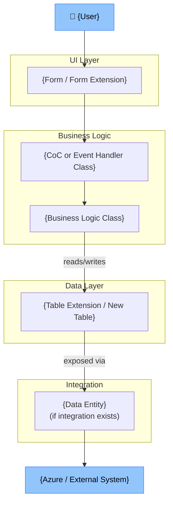
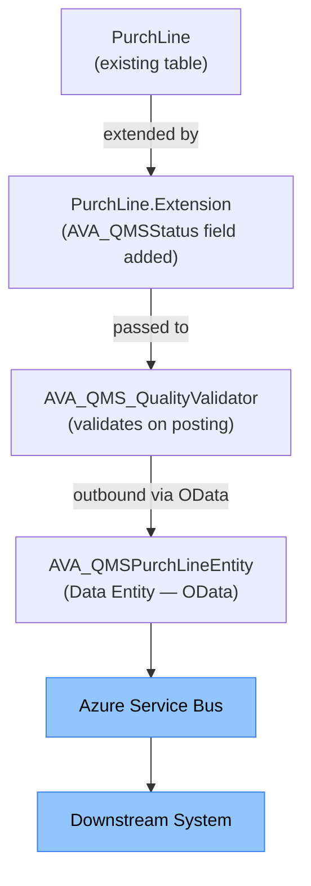
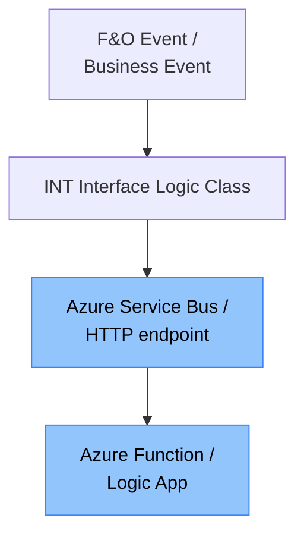
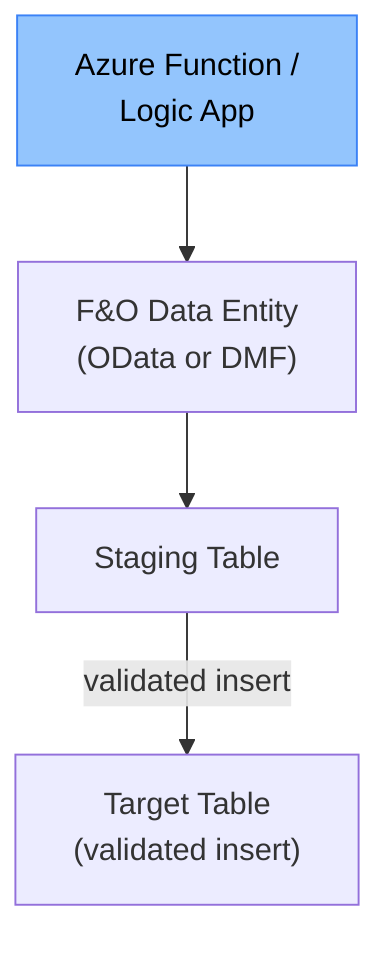

# Solution Blueprint — {Requirement Display Name}

> **Document type:** Architecture Blueprint (generated by `/blueprint`)
> **Pre-requisite:** TDD APPROVED
> **Audience:** Solution Architect, Tech Lead, Project Manager, Integration Lead

---

## Document Control

### Version History

| Version | Date | Author | Changes |
|---|---|---|---|
| 1.0 | {YYYY-MM-DD} | Claude Code (/blueprint) | Initial draft |

### Approvals

| Role | Name | Signature | Date | Status |
|---|---|---|---|---|
| Business Owner | | | | Pending |
| IT Lead | | | | Pending |
| Solution Architect | | | | Pending |
| Project Manager | | | | Pending |

---

## Table of Contents

- [1. Architecture Pattern and Rationale](#1-architecture-pattern-and-rationale)
- [2. Component Architecture](#2-component-architecture)
- [3. Data Architecture](#3-data-architecture)
- [4. Security Architecture](#4-security-architecture)
- [5. Integration Architecture](#5-integration-architecture)
- [6. Extension Model Decisions](#6-extension-model-decisions)
- [7. ALM and Deployment Architecture](#7-alm-and-deployment-architecture)
- [8. Technical Risks and Mitigations](#8-technical-risks-and-mitigations)
- [9. Non-Functional Coverage](#9-non-functional-coverage)

---

## 1. Architecture Pattern and Rationale

**Selected Pattern:** Pattern {X} — {Pattern Name}

**Justification:**
{Explain why this pattern was selected based on the object inventory and business requirement.}

**Alternatives Considered:**

| Pattern | Reason Rejected |
|---|---|
| Pattern {Y} | {reason} |

**Key Architectural Decisions:**

| Decision | Choice | Rationale |
|---|---|---|
| Extension vs New Object | {choice} | {rationale} |
| CoC vs Event Handler | {choice} | {rationale} |
| Sync vs Async Integration | {choice} | {rationale} |

---

## 2. Component Architecture

**Object inventory summary:**

| Category | Object-IDs | Count |
|---|---|---|
| Extensions (EXT) | {EXT-001, EXT-002, …} | {N} |
| Data Entities (DEN) | {DEN-001, …} | {N} |
| Security (SEC) | {SEC-001, …} | {N} |
| Workflows (WFL) | {WFL-001, …} | {N} |
| Integrations (INT) | {INT-001, …} | {N} |
| Other | {…} | {N} |
| **Total** | | **{N}** |

---

## 3. Data Architecture

### Object Model

| Object | Type | New Fields / Extensions | EDT / Enum |
|---|---|---|---|
| {TableName.Extension} | Table Extension | {field list} | {EDT names} |
| {AVA_TableName} | New Table | {all fields} | {EDT names} |

### Data Flow

> Describe where data enters, transforms, and lands. Include staging tables for Data Entities.

### Data Volume and Archiving

{Note any expected data volumes for new tables; reference SysTableLog or archival requirements.}

---

## 4. Security Architecture

### Security Model Matrix

| Role | Duty | Privilege | Entry Point | Access Level |
|---|---|---|---|---|
| {Role name} | {Duty name} | {Priv name} | {Menu item / Form / Data Entity} | {Read / Update / Create / Delete} |

### Segregation of Duties

| SoD Risk | Conflicting Duties | Control |
|---|---|---|
| {Risk description} | {Duty A} + {Duty B} | {Control or mitigation} |

### Integration User

{Describe the service account or Managed Identity scope if applicable; otherwise "Not applicable."}

---

## 5. Integration Architecture

> *Include this section only if INT objects are in scope. Otherwise: "Not applicable — no integration objects."*

### Integration Summary

| Integration | Direction | Protocol | F&O Side | External Side |
|---|---|---|---|---|
| {Name} | Outbound (F&O → Azure) | Service Bus | INT Interface Class | Azure Function |
| {Name} | Inbound (Azure → F&O) | DMF / OData | Data Entity (DEN) | Azure Logic App |

### Outbound Pattern (F&O → Azure)

- **Authentication:** {Key Vault secret / Managed Identity / Service Principal}
- **Error handling:** {retry policy, dead letter queue, alert}
- **Key Vault reference:** `constitution/10-alm-configuration.md`

### Inbound Pattern (Azure → F&O)

- **Authentication:** {OAuth2 / AAD App Registration}
- **Validation:** {describe entity-level validation rules}
- **Error handling:** {staging error log, notification}

---

## 6. Extension Model Decisions

| Object | Extension Approach | Decision | Rationale |
|---|---|---|---|
| {ClassName} | CoC (`_Extension`) | {choice} | {e.g., method override needed; single ISV in chain} |
| {ClassName} | Event Handler | {choice} | {e.g., post-event; multiple handlers safe} |
| {TableName} | Table Extension | {choice} | {fields only; no method change needed} |

---

## 7. ALM and Deployment Architecture

### Model Structure

| Model | Layer | Contains |
|---|---|---|
| `AVA_{Module}` | ISV | All custom objects for this requirement |
| {Base Model} | Application Suite | Extended standard objects |

### Environment Pipeline

| Environment | Purpose | Deployment Trigger |
|---|---|---|
| DEV | Development + unit tests | Manual (developer) |
| TEST | SIT — functional + integration | Auto on merge to main |
| UAT | User acceptance testing | Manual (release manager) |
| PROD | Production | Manual (post-sign-off) |

### Branching Strategy

Per `constitution/04-development-and-alm.md`:
- Branch per object: `feature/{Object-ID}-{short-description}`
- Include Object-ID in all commit messages
- PR review required before merge

---

## 8. Technical Risks and Mitigations

| Risk | Likelihood | Impact | Mitigation |
|---|---|---|---|
| {Risk description} | High / Medium / Low | High / Medium / Low | {mitigation action} |

---

## 9. Non-Functional Coverage

| Requirement | Design Response |
|---|---|
| **Performance** | {how the design handles load — batch processing, pagination, async} |
| **Scalability** | {how the design scales — stateless classes, Data Entity pagination} |
| **Availability** | {retry logic, idempotency for integrations, no blocking sync calls} |
| **Maintainability** | {extension-first approach, no base object modification, AVA naming} |
| **Testability** | {SysTestCase unit tests for all logic classes; test data isolation} |
