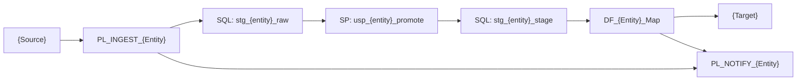

Generate the ADF Pipeline Design Document for a migration.

## Usage

```
/data-migration-pipeline {migration-id}
```

## Pre-condition

- `specs/{migration-id}/review.md` must be **APPROVED**.
- `docs-generated/{migration-id}/field-mapping.md` should exist (use spec if not yet available).

## Steps

1. Read ALL files in `constitution/`.
2. Verify review is APPROVED.
3. Read `specs/{migration-id}/spec.md` and `docs-generated/{migration-id}/field-mapping.md`.
4. Determine direction from spec.
5. Generate `docs-generated/{migration-id}/pipeline-design.md`.

## pipeline-design.md Structure

### Header

```markdown
# Pipeline Design — {migration-id}

**Version:** 1.0
**Date:** {today}
**Author:** Data Migration Agent
**Status:** DRAFT
**Direction:** {direction}

---
```

### Section 1 — Architecture Diagram

Produce a Mermaid flowchart showing the full pipeline topology:



Adapt for the actual direction (SFTP_TO_DATAVERSE, DATAVERSE_TO_SFTP, etc.).

### Section 2 — Linked Service Catalogue

| Name | Type | Authentication | Secret Names |
|---|---|---|---|
| `LS_{System}_{Env}` | {type} | Managed Identity / Service Principal | `kv-{secret-name}` |

### Section 3 — Dataset Catalogue

| Name | Linked Service | Format | Parameters |
|---|---|---|---|
| `DS_{System}_{Entity}_{Format}` | `LS_{System}_{Env}` | {format} | fileName, folderPath |

### Section 4 — Pipeline Catalogue

| Pipeline Name | Type | Triggered By | Description |
|---|---|---|---|
| `PL_ORCH_{Entity}` | Orchestrator | Trigger / Manual | Parent pipeline |
| `PL_INGEST_{Entity}_Raw` | Ingest | Orchestrator | Source → SQL Raw |
| `PL_TRANSFORM_{Entity}_Stage` | Transform | Orchestrator | SQL Stage → Target |
| `PL_NOTIFY_{Entity}` | Notify | On success / failure | Audit + Alert |

### Section 5 — Data Flow Catalogue

| Name | Source Dataset | Sink Dataset | Transformations |
|---|---|---|---|
| `DF_{Entity}_Map` | `DS_{src}_{Entity}_{fmt}` | `DS_{tgt}_{Entity}` | Derive, Cast, Lookup, Filter |

### Section 6 — Pipeline Parameters

For each pipeline, list all parameters:

#### PL_ORCH_{Entity}

| Parameter | Type | Default | Description |
|---|---|---|---|
| `runId` | String | `@pipeline().RunId` | Tracing ID |
| `environment` | String | `dev` | Target environment |
| `batchDate` | String | `@utcNow('yyyy-MM-dd')` | Processing date |
| `sourceFilePath` | String | `/incoming/{entity}/` | SFTP source folder |
| `sourceFileName` | String | *(required)* | Specific file name or wildcard |

### Section 7 — Trigger Configuration

| Trigger Name | Type | Schedule / Event | Pipeline | Branch |
|---|---|---|---|---|
| `TR_{Entity}_Schedule_Daily` | Schedule | `0 2 * * *` (02:00 UTC) | `PL_ORCH_{Entity}` | main |
| `TR_{Entity}_Storage_{Event}` | Storage Event | SFTP file arrival on `{path}` | `PL_ORCH_{Entity}` | main |

### Section 8 — Activity Detail

For each pipeline, describe the activities in order:

#### PL_INGEST_{Entity}_Raw

| Step | Activity Type | Name | Description |
|---|---|---|---|
| 1 | SetVariable | Set_RunId | Assign `pipeline().RunId` to variable |
| 2 | CopyActivity | Copy_SFTP_to_SQL | Copy source file → `stg.{entity}_raw` |
| 3 | StoredProcedure | SP_Promote | Call `stg.usp_{entity}_promote` |
| 4 | IfCondition | Check_Errors | If ErrorCount > threshold → route to failure |
| 5 | ExecutePipeline | Call_Transform | Execute `PL_TRANSFORM_{Entity}_Stage` |
| 6 | WebActivity | Audit_Log | Update `audit.migration_run` status |

### Section 9 — Error Routing

Describe the `onFailure` paths for each critical activity and how failures are surfaced.

### Section 10 — Monitoring and Alerting

- ADF Monitor dashboard configuration
- Log Analytics workspace (if applicable)
- Alert rule thresholds
- Notification webhook URL / Teams channel

### Section 11 — Deployment Steps

Step-by-step for publishing the ADF artefacts to each environment.
Reference `output/{migration-id}/adf/deploy.ps1`.

### Section 12 — Open Items

| # | Item | Owner | Due |
|---|---|---|---|

---

## Output

Write `docs-generated/{migration-id}/pipeline-design.md`.

Print:

```
PIPELINE DESIGN WRITTEN — {migration-id}
════════════════════════════════════════
File       : docs-generated/{migration-id}/pipeline-design.md
Pipelines  : {N}
Datasets   : {N}
Data Flows : {N}
Triggers   : {N}
Open Items : {N}

Next step: /data-migration-testplan {migration-id}
```
