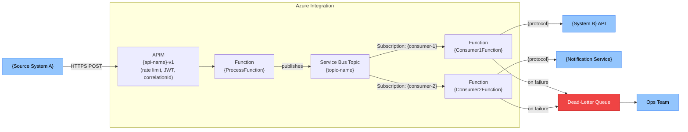

# Solution Blueprint — {Feature Display Name}

---

## Document Control

### Version History

| Version | Date | Author | Changes |
|---|---|---|---|
| 1.0 | {YYYY-MM-DD} | Claude Code (/blueprint) | Initial draft |

### Approvals

| Role | Name | Signature | Date | Status |
|---|---|---|---|---|
| Business Owner | | | | Pending |
| IT Lead | | | | Pending |
| Solution Architect | | | | Pending |
| Project Manager | | | | Pending |

---

## Table of Contents

- [1. Architecture Pattern](#1-architecture-pattern)
- [2. Integration Topology](#2-integration-topology)
- [3. Data Architecture](#3-data-architecture)
- [4. Security Architecture](#4-security-architecture)
- [5. Resilience Architecture](#5-resilience-architecture)
- [6. Scalability Architecture](#6-scalability-architecture)
- [7. ALM Architecture](#7-alm-architecture)
- [8. Technical Risks](#8-technical-risks)

---

## 1. Architecture Pattern

**Selected:** {Pattern Letter — Name}
*(e.g., Pattern A — Event-Driven Async)*

### Rationale
{Why this pattern, referencing volume, SLA, decoupling needs, and constitution rules.}

### Alternatives Considered
| Pattern | Why Rejected |
|---|---|
| Request/Response | Caller does not need immediate confirmation; async decoupling reduces coupling |

---

## 2. Integration Topology



---

## 3. Data Architecture

### Data Flow with Transformation Points
```
{System A field: AccountName}
  → [APIM: pass-through]
  → [ProcessFunction: map to message schema]
  → [Service Bus: crm.account.created v1.0]
  → [Consumer1Function: map to ERP format]
  → [System B field: CustomerName]
```

### Schema Versioning Strategy
- Schema version in message envelope: `"schemaVersion": "1.0"`
- Breaking change → new version: `"schemaVersion": "2.0"`
- Consumers specify version subscription filter
- Old version supported for {N months} before deprecation

### Data Retention
| Store | Retention | Reason |
|---|---|---|
| Service Bus messages | 7 days (lock) | Platform default |
| Dead-letter queue | 14 days | Time to investigate and replay |
| Application Insights logs | 90 days | Operational monitoring |

---

## 4. Security Architecture

### Authentication Map
| Hop | Auth Method | Identity |
|---|---|---|
| Source → APIM | Subscription key + OAuth2 | Source system app registration |
| APIM → Function | Managed Identity | APIM managed identity |
| Function → Service Bus | Managed Identity | Function App system identity |
| Function → Target API | OAuth2 client credentials | Dedicated app registration |
| Function → Key Vault | Managed Identity | Function App system identity |

### Network Perimeter
| Resource | Public Access | VNet Integration | Private Endpoint |
|---|---|---|---|
| Service Bus | Disabled (prod) | Yes | Yes |
| Function App | Via APIM only | Yes | No (outbound VNet) |
| Key Vault | Disabled (prod) | Yes | Yes |

---

## 5. Resilience Architecture

### Retry Topology
| Component | Retry | Backoff | DLQ |
|---|---|---|---|
| Service Bus consumer | Platform (max delivery count = 5) | Exponential | Yes |
| HTTP calls to target | Polly: 3 retries, 2s–30s | Exponential | Via function throw |

### Circuit Breaker
- Applied to outbound HTTP calls via Polly
- Open after 5 failures in 30s window
- Half-open probe after 30s

### DLQ Strategy
- Every subscription has DLQ monitoring alert
- Replay process: fix root cause → use Service Bus Explorer or replay function

---

## 6. Scalability Architecture

| Component | Scale Trigger | Max Instances |
|---|---|---|
| ProcessFunction | HTTP request queue depth | 100 |
| Consumer Functions | Service Bus queue depth | 10 per subscription |

---

## 7. ALM Architecture

### IaC Structure (Bicep)
```
infrastructure/
├── main.bicep              ← orchestrator
├── modules/
│   ├── servicebus.bicep
│   ├── functions.bicep
│   ├── keyvault.bicep
│   └── monitoring.bicep
└── parameters/
    ├── parameters.dev.json
    ├── parameters.test.json
    └── parameters.prod.json
```

### Pipeline Stages
| Stage | Gate |
|---|---|
| CI | Build + unit tests + contract tests |
| Deploy Test | IaC deploy + smoke test |
| Deploy UAT | Integration test sign-off |
| Deploy Prod | UAT sign-off + change approval |

---

## 8. Technical Risks

| Risk ID | Risk | Likelihood | Impact | Mitigation |
|---|---|---|---|---|
| TR-001 | Target API rate-limited during peak | Medium | High | Back-pressure via SB concurrency + alerting |
| TR-002 | Schema breaking change in source | Low | High | Schema versioning + consumer version filters |
