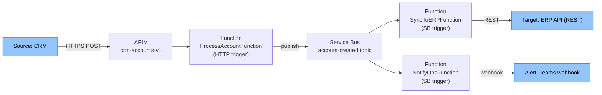

# Technical Design Document — {Feature Display Name}

---

## Document Control

### Version History

| Version | Date | Author | Changes |
|---|---|---|---|
| 1.0 | {YYYY-MM-DD} | Claude Code (/tdd) | Initial draft |

### Approvals

| Role | Name | Signature | Date | Status |
|---|---|---|---|---|
| Business Owner | | | | Pending |
| IT Lead | | | | Pending |
| Solution Architect | | | | Pending |
| Project Manager | | | | Pending |

---

## Table of Contents

- [1. Technical Architecture Overview](#1-technical-architecture-overview)
- [2. Azure Function Specifications](#2-azure-function-specifications)
- [3. Logic App Workflow Specifications](#3-logic-app-workflow-specifications)
- [4. Message Schema Definitions](#4-message-schema-definitions)
- [5. API Contract (APIM)](#5-api-contract-apim)
- [6. Infrastructure Design](#6-infrastructure-design)
- [7. Monitoring Design](#7-monitoring-design)

---

## 1. Technical Architecture Overview

**Pattern:** {Pattern from blueprint} — see [solution-blueprint.md](solution-blueprint.md)

### Component Interaction



---

## 2. Azure Function Specifications

### Function: `{PurposeFunction}`

| Property | Value |
|---|---|
| Class Name | `{PurposeFunction}` |
| Namespace | `{OrgPrefix}.Integration.{Domain}.Functions` |
| Trigger | `{HttpTrigger / ServiceBusTrigger / TimerTrigger}` |
| Trigger Config | `{Queue/Topic name, route, schedule expression}` |
| Input Binding | `{e.g., Service Bus message as string}` |
| Output Binding | `{e.g., Service Bus output binding to topic-x}` |
| Managed Identity | System-assigned |
| RBAC Role | `Azure Service Bus Data Receiver` on `{namespace}` |
| Timeout | `functionTimeout: 00:05:00` in host.json |
| Retry Policy | Exponential backoff: 3 retries, 2s–30s |

**Logic:**
1. Deserialise input to `{DtoClassName}`
2. Validate: {validation rules}
3. Apply transformation: {transformation logic}
4. Call target: `{TargetApiClient.SendAsync()}`
5. On success: complete message
6. On failure: throw → SDK handles retry → DLQ after max delivery

**Error Handling:**
| Error Type | Response |
|---|---|
| Validation failure | Log + throw (DLQ) |
| Target 4xx | Log + throw (DLQ, not retriable) |
| Target 5xx / timeout | Throw (retriable) |
| Unknown exception | Log full stack + throw (DLQ) |

---

## 3. Logic App Workflow Specifications *(if applicable)*

### Workflow: `{purpose}-workflow`

| Property | Value |
|---|---|
| Name | `{purpose}-workflow` |
| Type | Logic App Standard |
| Trigger | `{When a message is received in Service Bus}` |
| Schedule | N/A |

**Actions:**
| Step | Action Name | Type | Connector | Purpose |
|---|---|---|---|---|
| 1 | Parse Message Body | Parse JSON | Built-in | Deserialise message |
| 2 | Check Account Status | Condition | Built-in | Route based on status |
| 3 | Send to ERP | HTTP | Built-in HTTP | POST to ERP API |
| 4 (error) | Send Failure Alert | HTTP | Teams | Notify ops on failure |

**Retry Policy on Step 3:** Exponential, 4 retries, 5s–60s
**Error Scope:** `Configure run after` = Failed, Skipped, TimedOut

---

## 4. Message Schema Definitions

### Topic: `{topic-name}` — Message: `{domain}.{entity}.{action}`

```json
{
  "$schema": "http://json-schema.org/draft-07/schema",
  "title": "{domain}.{entity}.{action}",
  "type": "object",
  "required": ["messageId", "correlationId", "source", "eventType", "timestamp", "schemaVersion", "payload"],
  "properties": {
    "messageId":     { "type": "string", "format": "uuid" },
    "correlationId": { "type": "string", "format": "uuid" },
    "source":        { "type": "string", "enum": ["{source-system}"] },
    "eventType":     { "type": "string", "enum": ["{domain}.{entity}.{action}"] },
    "timestamp":     { "type": "string", "format": "date-time" },
    "schemaVersion": { "type": "string", "enum": ["1.0"] },
    "payload": {
      "type": "object",
      "required": ["{required_field}"],
      "properties": {
        "{field}": { "type": "string", "description": "{Business meaning}" }
      }
    }
  }
}
```

---

## 5. API Contract (APIM) *(if applicable)*

Full OpenAPI 3.0 spec — embed or reference `output/{feature}/src/APIM/openapi.yaml`

**Key operations:**
| Operation ID | Method | Path | Auth | Rate Limit |
|---|---|---|---|---|
| `{OperationId}` | POST | `/api/v1/{resource}` | OAuth2 (Azure AD) | 100 req/min |

**APIM Policies applied:**
- JWT validation
- Rate limiting
- `correlationId` header forwarding
- Error normalisation (RFC 7807)

---

## 6. Infrastructure Design

### Azure Resources
| Resource | Name | Type | SKU | Region |
|---|---|---|---|---|
| Service Bus | `sb-{project}-{env}` | Namespace | Standard | {region} |
| Function App | `func-{project}-{purpose}-{env}` | Function App | P1v3 | {region} |
| Key Vault | `kv-{project}-{env}` | Key Vault | Standard | {region} |

### Managed Identity Role Assignments
| Identity | Role | Scope (Resource) |
|---|---|---|
| `func-{project}-{purpose}-{env}` (system) | Azure Service Bus Data Receiver | `sb-{project}-{env}` |
| `func-{project}-{purpose}-{env}` (system) | Key Vault Secrets User | `kv-{project}-{env}` |

### Key Vault Secrets
| Secret Name | Purpose | Rotation Period |
|---|---|---|
| `{target-api-key}` | Auth to target API | 90 days |

---

## 7. Monitoring Design

| Alert | Condition | Threshold | Action Group |
|---|---|---|---|
| DLQ message count | `> 0` | Immediate | Ops team email + Teams |
| Function error rate | `> 5% over 5 min` | 5 min window | Ops team |
| End-to-end latency | `> {SLA}s P95` | 5 min window | Ops team |
