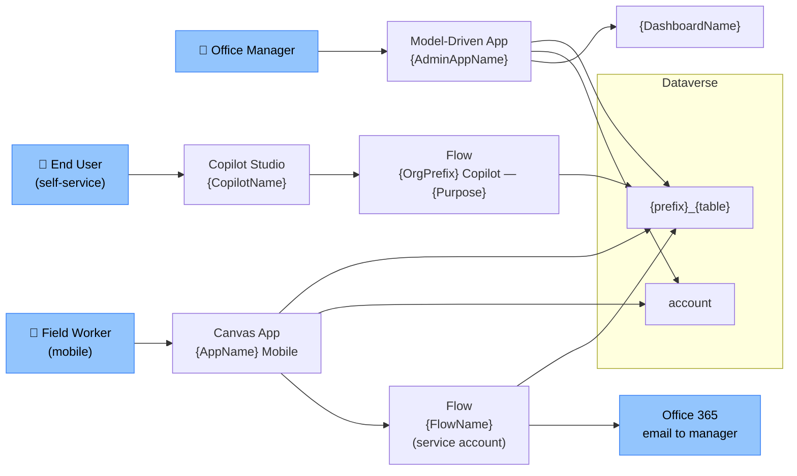
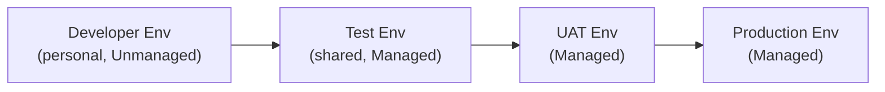

# Solution Blueprint — {Feature Display Name}

---

## Document Control

### Version History

| Version | Date | Author | Changes |
|---|---|---|---|
| 1.0 | {YYYY-MM-DD} | Claude Code (/blueprint) | Initial draft |

### Approvals

| Role | Name | Signature | Date | Status |
|---|---|---|---|---|
| Business Owner | | | | Pending |
| IT Lead | | | | Pending |
| Solution Architect | | | | Pending |
| Project Manager | | | | Pending |

---

## Table of Contents

- [1. Architecture Pattern](#1-architecture-pattern)
- [2. Component Architecture](#2-component-architecture)
- [3. Data Architecture](#3-data-architecture)
- [4. Security Architecture](#4-security-architecture)
- [5. Integration Architecture](#5-integration-architecture)
- [6. ALM Architecture](#6-alm-architecture)
- [7. Power Platform CoE Alignment](#7-power-platform-coe-alignment)
- [8. Technical Risks](#8-technical-risks)

---

## 1. Architecture Pattern

**Selected:** {Pattern Letter — Name}
*(e.g., Pattern C — Hybrid: Canvas + Model-Driven)*

### Rationale
{Why this pattern — reference persona needs, UX requirements, data volume, constitution rules.}

### Alternatives Considered
| Pattern | Why Rejected |
|---|---|
| Canvas-only | Complex security model and large dataset management better suited to MDA |
| MDA-only | Mobile field workers need custom offline UX not achievable in MDA |

---

## 2. Component Architecture



---

## 3. Data Architecture

### Key Entities
| Entity | New/Existing | Canvas App Bound | MDA Forms | Flow Access |
|---|---|---|---|---|
| `account` | Existing | Yes | Yes | Yes |
| `{prefix}_{table}` | New | Yes | Yes | Yes |

### Delegation Boundaries
| Canvas App Screen | Filter Expression | Delegable | Mitigation if Not |
|---|---|---|---|
| `scrAccountList` | `Filter(Accounts, StatusCode=1)` | Yes | N/A |
| `scrSearch` | `Search(Accounts, txt_Search.Text, "name")` | Yes (StartsWith) | N/A |

### Data Volume
| Entity | Records | Growth | Impact |
|---|---|---|---|
| `account` | {N} | {X/month} | Gallery pagination required if > 2000 |

---

## 4. Security Architecture

### Authentication
- All apps: Azure AD authentication enforced
- Copilot: Azure AD sign-in required before accessing personal data
- Flows: run as dedicated service account, not flow creator

### Security Role Structure

| Persona | Security Role(s) Assigned |
|---|---|
| Field Worker | {SolutionName} — Mobile Full, {SolutionName} — Account Read |
| Office Manager | {SolutionName} — Admin Full, {SolutionName} — Account Full |
| Read-Only | {SolutionName} — View Only |

### App Sharing
| App | Shared With | Via |
|---|---|---|
| {Canvas AppName} | {Field Workers Group} | Azure AD Group |
| {MDA AppName} | {Office Managers Group} | Azure AD Group + Security Role |

---

## 5. Integration Architecture *(if applicable)*

| Connector | Used In | Purpose | Connection Reference |
|---|---|---|---|
| Dataverse | Canvas App, Flows | CRUD operations | `{OrgPrefix} Dataverse Connection` |
| Office 365 Outlook | Flow | Email notifications | `{OrgPrefix} O365 Connection` |

---

## 6. ALM Architecture

### Environment Strategy



### Solution Structure
```
{prefix}_{SolutionName} (1.0.0.0)
├── Tables: {prefix}_{table}
├── Canvas App: {AppName}
├── Model-Driven App: {AdminAppName}
├── Flows: {FlowName}
├── Copilot: {CopilotName}    ← if applicable
├── Security Roles
├── Connection References
└── Environment Variables
```

### DLP Policy Impact
| Connector | Tier | Impact |
|---|---|---|
| Dataverse | Business | Allowed with Business connectors |
| Office 365 | Business | Allowed with Business connectors |
| {Premium Connector} | Premium | Requires Premium licence per user |

### Licensing
| Persona | Licence Required | Reason |
|---|---|---|
| Field Worker | Power Apps Premium | Canvas app + Dataverse |
| Office Manager | Power Apps Premium | MDA + Dataverse |
| Copilot users | Copilot Studio (per session or per user) | Copilot Studio |

---

## 7. Power Platform CoE Alignment

| CoE Policy | Compliance Status | Notes |
|---|---|---|
| All apps owned by service account | Compliant | Service account set as co-owner |
| No personal connections in flows | Compliant | Connection references used |
| DLP policy respected | Compliant | Only Business-tier connectors |
| Solution-first deployment | Compliant | All components in named solution |

---

## 8. Technical Risks

| Risk ID | Risk | Likelihood | Impact | Mitigation |
|---|---|---|---|---|
| TR-001 | Canvas delegation failure on {table} > 500 rows | High | Medium | Paginate gallery, use server-side views |
| TR-002 | Premium licence cost for all personas | Medium | High | Confirm budget; review if MDA alone covers some personas |
