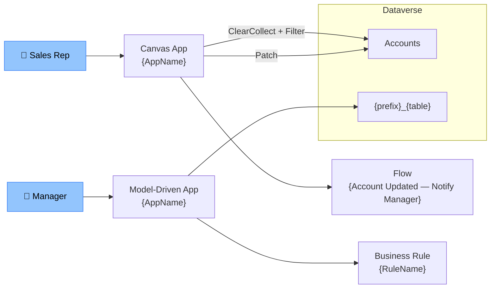

# Technical Design Document — {Feature Display Name}

---

## Document Control

### Version History

| Version | Date | Author | Changes |
|---|---|---|---|
| 1.0 | {YYYY-MM-DD} | Claude Code (/tdd) | Initial draft |
| {x.y} | {YYYY-MM-DD} | {Author} | {Summary of change — reference section(s) updated and reason} |

### Reviewers

| Role | Name | Date | Comments |
|---|---|---|---|
| Technical Lead | | | |
| Security Lead | | | |
| Data Architect | | | |

### Approvals

| Role | Name | Signature | Date | Status |
|---|---|---|---|---|
| Business Owner | | | | Pending |
| IT Lead | | | | Pending |
| Solution Architect | | | | Pending |
| Project Manager | | | | Pending |

---

## Table of Contents

- [1. Technical Architecture Overview](#1-technical-architecture-overview)
- [2. Non-Functional Requirements](#2-non-functional-requirements)
- [3. Dataverse Schema Design](#3-dataverse-schema-design)
- [4. Canvas App Technical Specifications](#4-canvas-app-technical-specifications)
- [5. Power Automate Flow Technical Specifications](#5-power-automate-flow-technical-specifications)
- [6. Model-Driven App Technical Specifications](#6-model-driven-app-technical-specifications)
- [7. Copilot Studio Technical Specifications](#7-copilot-studio-technical-specifications)
- [8. Custom Connectors and External APIs](#8-custom-connectors-and-external-apis)
- [9. Plugins, Custom APIs, and PCF Controls](#9-plugins-custom-apis-and-pcf-controls)
- [10. Ribbon / Command Bar Technical Specifications](#10-ribbon--command-bar-technical-specifications)
- [11. Error Handling and Logging Strategy](#11-error-handling-and-logging-strategy)
- [12. Security Technical Design](#12-security-technical-design)
- [13. Environment Variables](#13-environment-variables)
- [14. Solution and ALM Design](#14-solution-and-alm-design)
- [15. Testing Strategy](#15-testing-strategy)
- [16. NFR Compliance](#16-nfr-compliance)
- [17. Architecture Decision Records](#17-architecture-decision-records)
- [18. Constitution Exceptions](#18-constitution-exceptions)
- [19. Licensing Requirements](#19-licensing-requirements)
- [20. Author Completion Checklist](#20-author-completion-checklist)
- [21. Glossary](#21-glossary)

---

## 1. Technical Architecture Overview

**Pattern:** {Pattern from blueprint} — see [solution-blueprint.md](solution-blueprint.md)

**FDD Reference:** {FDD section(s) this design implements, e.g. FDD §3.1–§3.4}

### FDD-to-TDD Traceability

Every Object-ID from FDD ★ §5 must appear in this table with status "Designed" before the TDD is submitted for review.

| FR Reference | Object-ID | Object Name | Object Type | TDD Section | Status |
|---|---|---|---|---|---|
| FR-NNN | PA-001 | `{AppName}` | Canvas App | §4 | Designed |
| FR-NNN | PA-002 | `{AppName}` | Model-Driven App | §6 | Designed |
| FR-NNN | PA-003 | `{prefix}_TableName` | Custom Table | §3 | Designed |
| FR-NNN | PA-004 | `{prefix}_ColumnName` | Custom Column | §3 | Designed |
| FR-NNN | PA-005 | `{FlowName}` | Cloud Flow — Automated | §5 | Designed |
| FR-NNN | PA-006 | `{FlowName}` | Cloud Flow — Scheduled | §5 | Designed |
| FR-NNN | PA-007 | `{AgentName}` | Copilot Studio Agent | §7 | Designed |
| FR-NNN | PA-008 | `{TopicName}` | Copilot Topic | §7 | Designed |
| FR-NNN | PA-009 | `{prefix}_{EnvVarName}` | Environment Variable | §13 | Designed |
| FR-NNN | PA-010 | `{OrgPrefix} {Service} Connection` | Connection Reference | §12 | Designed |
| FR-NNN | PA-011 | `{ConnectorName}` | Custom Connector | §8 | Designed |

### Component Interaction



### Component Inventory

| Object-ID | Component | Type | Technology | Purpose |
|---|---|---|---|---|
| PA-001 | `{AppName}` | Canvas App | Power Apps | {Purpose} |
| PA-002 | `{AppName}` | Model-Driven App | Power Apps | {Purpose} |
| PA-005 | `{FlowName}` | Automated Flow | Power Automate | {Purpose} |
| PA-007 | `{BotName}` | Copilot Agent | Copilot Studio | {Purpose} |
| PA-011 | `{ConnectorName}` | Custom Connector | Power Platform | {Purpose} |

---

## 2. Non-Functional Requirements

### Performance

| Requirement | Target | Measurement Method |
|---|---|---|
| App load time (cold start) | < {x} seconds | Manual timing / Azure Monitor |
| Screen navigation time | < {x} seconds | Manual timing |
| Gallery load (delegated query) | < {x} seconds for {n} rows | Manual timing |
| Flow execution time (P95) | < {x} minutes | Flow run history |
| Custom API response time | < {x} ms | APIM / custom telemetry |

### Scalability

| Dimension | Current Estimate | 12-Month Projection | Design Limit |
|---|---|---|---|
| Concurrent users | {n} | {n} | {n} |
| Rows in `{prefix}_{table}` | {n} | {n} | {n} |
| Flows triggered per day | {n} | {n} | {n} |

### Availability

| Component | SLA Target | Planned Maintenance Window |
|---|---|---|
| Canvas App | {x}% | {window} |
| Power Automate Flows | {x}% | {window} |
| Dataverse | Inherits M365 SLA ({x}%) | N/A |

### Data Volume and Retention

| Table | Estimated Row Count | Annual Growth | Retention Period | Archival Approach |
|---|---|---|---|---|
| `{prefix}_{table}` | {n} | {n} rows/year | {x} years | {Delete / Archive / Soft-delete} |

---

## 3. Dataverse Schema Design

### Naming Conventions

| Element | Convention | Example |
|---|---|---|
| Table schema name | `{prefix}_{noun}` | `xyz_workorder` |
| Column schema name | `{prefix}_{noun}` | `xyz_duedate` |
| Choice schema name | `{prefix}_{noun}` | `xyz_priority` |
| Relationship schema name | `{prefix}_{parent}_{child}` | `xyz_account_workorder` |

> **Prefix used in this solution:** `{prefix}` — registered in `{publisher}` publisher.

### New Tables

#### `{prefix}_{tablename}` — {Display Name}

**FDD Requirement:** {FDD §x.x}

| Schema Name | Display Name | Type | Required | PII / Financial | Description |
|---|---|---|---|---|---|
| `{prefix}_name` | Name | Single Line (200) | Business Required | No | Primary name |
| `{prefix}_{column}` | {Display Name} | {Type} | {Required} | Yes / No | {Description} |

**Calculated Columns:**

| Schema Name | Formula | Purpose |
|---|---|---|
| `{prefix}_{column}` | `{formula}` | {Purpose} |

**Rollup Columns:**

| Schema Name | Related Table | Aggregate | Filter | Purpose |
|---|---|---|---|---|
| `{prefix}_{column}` | `{table}` | {Count/Sum/Max/Min} | `{filter}` | {Purpose} |

**Relationships:**

| Schema Name | Type | Related Table | Cascade Delete | Purpose |
|---|---|---|---|---|
| `{prefix}_{parent}_{child}` | N:1 | `{table}` | Restrict | {Purpose} |

**Alternate Keys:**

| Key Name | Columns | Purpose |
|---|---|---|
| `{prefix}_{table}_AK_ExternalId` | `{prefix}_externalid` | Integration deduplication / upsert idempotency |

**Indexes / Search:**

| Column(s) | Type | Reason |
|---|---|---|
| `{prefix}_{column}` | Simple | Delegation filter — high-frequency lookup |
| `{prefix}_{col1}`, `{prefix}_{col2}` | Composite | {Reason} |

**Expected Data Volume:**

| Dimension | Estimate | Notes |
|---|---|---|
| Initial row count | {N} | Flag if > 1,000,000 |
| Annual growth | {N rows/year} | |
| Archiving policy | {None / Archive after N years} | |

---

### Choices (Option Sets)

#### Global Choices

| Schema Name | Display Name | Options (Value — Label) | Used By |
|---|---|---|---|
| `{prefix}_{choice}` | {Display Name} | 1 — Active, 2 — Inactive, 3 — Pending | `{table}.{column}` |

#### Local Choices

| Table | Column Schema Name | Options (Value — Label) |
|---|---|---|
| `{prefix}_{table}` | `{prefix}_{column}` | 1 — {Label}, 2 — {Label} |

---

## 4. Canvas App Technical Specifications

### App: {App Name}

**FDD Reference:** {FDD §x.x}
**Object-ID:** PA-{NNN}

#### App-Level Settings

| Setting | Value | Reason |
|---|---|---|
| Screen size / orientation | {Tablet 16:9 / Phone / Custom WxH} | {Reason} |
| Scale to fit | {On / Off} | {Reason} |
| Responsive layout | {On / Off} | {Reason} |
| App.Formula (Named Formulas) | {Enabled / Disabled} | {Reason} |
| Offline capable | {Yes / No} | {Reason — if Yes, see Offline Collection Strategy below} |
| Theme | {Custom theme file / Default} | {Branding reference} |
| Component libraries | `{LibraryName}` v{x.y} | {Purpose} |

#### App.OnStart / Named Formulas

| Name | Type | Formula | Purpose |
|---|---|---|---|
| `{FormulaName}` | Named Formula | `{formula}` | {Purpose — evaluated once, cached} |
| `{varName}` | OnStart variable | `Set({varName}, {value})` | {Purpose} |

**Data Sources:** `{Table1}`, `{Table2}`, `{ConnectionName}`

---

#### Offline Collection Strategy

*(State "N/A" if Offline capable = No. Required when Offline capable = Yes — document every collection persisted to local device storage.)*

| Collection Name | Dataverse Table / Source | Filter Applied | Max Row Limit | Sync Trigger | Conflict Resolution |
|---|---|---|---|---|---|
| `col{EntityName}` | `{prefix}_{table}` | {FetchXML / OData filter — or "Active records only"} | {N — must be within delegation limit} | App.OnStart / Explicit user action ({Button label}) | {Last-write-wins / Prompt user / Server wins} |

**Offline sync error handling:** {What the app shows when sync fails — banner message, retry button, or graceful read-only mode}

---

#### Screen: `{ScreenName}`

**FDD Requirement:** {FDD §x.x}

**Named Formulas / Variables:**

| Name | Type | Formula / Initial Value | Purpose |
|---|---|---|---|
| `colAccountList` | Collection | `ClearCollect(colAccountList, Filter(Accounts, StatusCode=1))` | Local cache of active accounts |
| `gblCurrentAccount` | Global variable | `{}` | Selected account record |
| `locIsLoading` | Local variable | `false` | Loading state for gallery |

**Delegation Analysis:**

| Formula | Delegable? | Table Row Limit Impact | Mitigation |
|---|---|---|---|
| `Filter(Accounts, StatusCode=1)` | Yes (Dataverse) | N/A | None needed |
| `Filter(Accounts, StartsWith(name,"A"))` | Yes | N/A | None needed |
| `Filter(Accounts, Text(createdon)=...)` | No | 500 row limit | Use date column type comparison |

**Key Control Properties:**

| Control Name | Type | Key Property | Value |
|---|---|---|---|
| `gal_AccountList` | Gallery | Items | `colAccountList` |
| `btn_Save` | Button | OnSelect | `Patch(Accounts, gblCurrentAccount, {xyz_field: txt_Field.Text}); Navigate(scrConfirmation)` |

**Accessibility:**

| Control | ARIA / Accessibility Property | Value |
|---|---|---|
| `{control}` | AccessibleLabel | `"{Descriptive label for screen reader}"` |
| `{control}` | TabIndex | `{0 / -1}` |

---

## 5. Power Automate Flow Technical Specifications

*(None — if no flows are required, state "None" and remove sub-headings.)*

### Flow: {Flow Display Name}

**FDD Requirement:** {FDD §x.x}
**Object-ID:** PA-{NNN}

| Property | Value |
|---|---|
| Trigger | `When a row is added, modified or deleted` |
| Table | `{prefix}_{table}` |
| Condition | Row created / Updated columns: `{column}` |
| Connection Reference | `{OrgPrefix} Dataverse Connection` |
| Run As | Service account: `{account@org.com}` |
| Concurrency control | {On — {n} parallel runs / Off} |
| Retry policy | Exponential — {n} retries, {n}s initial interval |
| Error handling | Scope action with Configure run after: Failed, TimedOut |

**Trigger Configuration:**

| Property | Value |
|---|---|
| Column Filter (trigger only when changed) | {Comma-separated schema names — or "All" with justification} |
| Filter Rows (OData condition) | {Condition — or "None"} |
| Async / Sync | Async / Sync (must complete ≤ 5s if called synchronously) |
| Expected Volume / Frequency | {N executions per day / hour / event} |

**Idempotency Mechanism:**

| Property | Value |
|---|---|
| Has Dataverse writes / outbound calls | Yes / No |
| Idempotency approach | {Alternate key upsert / Status flag check / Correlation ID lookup / N/A — read-only flow} |
| Guard condition | {Describe the check that prevents duplicate side-effects on re-trigger — e.g., check `{prefix}_processed` flag before writing; upsert on alternate key `{prefix}_externalid`} |

**Action Table:**

| Step | Action Name | Type | Connector | Key Config |
|---|---|---|---|---|
| 1 | Get triggering record | Get a row by ID | Dataverse | Table: `{table}`, ID: `triggerOutputs()` |
| 2 | Check condition | Condition | Built-in | `{field}` is not null |
| 3 (yes) | Send email notification | Send an email (V2) | Office 365 | To: manager, Subject: template |
| 4 (no) | Terminate | Terminate | Built-in | Status: Succeeded |
| Error | Send alert | Post message | Teams | Channel: Ops Alerts |

**Environment Variables consumed:**

| Variable Schema Name | Purpose |
|---|---|
| `{prefix}_{ConfigKey}` | {Purpose} |

---

*(Repeat Flow sub-section for each additional flow)*

---

## 6. Model-Driven App Technical Specifications

### App: {MDA App Name}

**FDD Reference:** {FDD §x.x}
**Object-ID:** PA-{NNN}

---

### Form: `{Entity} — {Form Name}` (Main)

**FDD Requirement:** {FDD §x.x}

**Tabs and Fields:**

| Tab | Section | Column Schema Name | Display Name | Required | Editable | Notes |
|---|---|---|---|---|---|---|
| General | Details | `{prefix}_{column}` | {Display Name} | Yes | Yes | |

**Business Rules:**

| Rule Name | Scope | Condition | Action |
|---|---|---|---|
| `{Rule Display Name}` | Entity | `{prefix}_{column}` contains data | Show `{other column}` |

---

### Form: `{Entity} — Quick Create` (Quick Create)

*(State "N/A" if no Quick Create form is in scope.)*

**Purpose:** {Minimal field set for rapid record creation — e.g., from sub-grid or global create button.}
**FDD Requirement:** {FDD §x.x}

| Column Schema Name | Display Name | Required | Notes |
|---|---|---|---|
| `{prefix}_{column}` | {Display Name} | Yes / No | {Why included in Quick Create} |

---

### Form: `{Entity} — Card` (Card Form)

*(State "N/A" if no Card form is in scope. Card forms appear in sub-grid tiles and Related panels.)*

**Purpose:** {What this card displays — used in sub-grid or timeline.}
**FDD Requirement:** {FDD §x.x}

| Slot | Column Schema Name | Display Name | Notes |
|---|---|---|---|
| Primary (header) | `{prefix}_{column}` | {Display Name} | Bold title field |
| Secondary | `{prefix}_{column}` | {Display Name} | Sub-title |
| Tertiary | `{prefix}_{column}` | {Display Name} | Additional detail |
| Image | `{prefix}_{column}` | {Display Name} | Image column — or N/A |

---

### Mobile / Tablet Layout Considerations

*(State "N/A" if no mobile or tablet-specific layout changes are required.)*

| Form | Mobile Consideration | Mitigation / Configuration |
|---|---|---|
| `{Entity} — Main` | {e.g., Sub-grids hidden on mobile to reduce scroll} | {Remove sub-grid from phone layout; retain on tablet} |
| `{Entity} — Quick Create` | {e.g., Default shown on mobile} | {No change required} |

---

### Views

| View Schema Name | Columns | Filter | Sort |
|---|---|---|---|
| `{prefix}_{entity}_Active` | name, {col1}, {col2}, modifiedon | `statecode = 0` | modifiedon DESC |

### Business Process Flows

| BPF Name | Entity | Stages | Purpose |
|---|---|---|---|
| `{BPF Display Name}` | `{prefix}_{table}` | Stage 1: {Name} → Stage 2: {Name} → Stage 3: {Name} | {Purpose} |

**BPF Stage Detail:**

| Stage | Step Fields | Required | Condition to advance |
|---|---|---|---|
| {Stage Name} | `{prefix}_{column}`, `{prefix}_{column}` | {Yes/No} | {Condition} |

### Dashboards and Charts

| Name | Type | Components | Purpose |
|---|---|---|---|
| `{Dashboard Name}` | System / Personal | {Chart 1}, {View 1} | {Purpose} |

---

## 7. Copilot Studio Technical Specifications

*(None — if no Copilot Studio agent is in scope, state "None" and remove sub-headings.)*

### Bot Configuration

| Property | Value |
|---|---|
| Bot name | `{BotName}` |
| Object-ID | PA-{NNN} |
| Language | {en-us / other} |
| Authentication | {No authentication / Microsoft (AAD) / Manual (OAuth2)} |
| Auth scope / Entra permission | {e.g., `user_impersonation` on `{Resource App}` — or N/A for anonymous} |
| Service principal / App registration | {App Registration name used for authenticated actions — or N/A} |
| Published channels | {Teams / Website / {other}} |
| Generative answers | {Enabled / Disabled} |
| Fallback behaviour | {Escalate / Message} |
| Fallback topic | {Topic name — or "System Fallback"} |

### Knowledge Sources *(if Generative Answers enabled)*

| Source Type | Name / URL | Scope / Filter | Refresh Frequency |
|---|---|---|---|
| SharePoint | `{site-url}/sites/{site}` | `{library or folder}` | {Real-time / Scheduled} |
| Dataverse | `{table}` | `{columns exposed}` | Real-time |
| Public website | `{url}` | All pages | {Scheduled} |

---

### Topic: `{TopicName}`

**FDD Requirement:** {FDD §x.x}
**Object-ID:** PA-{NNN}

**Trigger phrases:** {phrase 1}, {phrase 2}, {phrase 3}, {phrase 4}, {phrase 5}

**Variables:**

| Name | Scope | Type | Source |
|---|---|---|---|
| `tp_AccountName` | Topic | String | User input |
| `tp_AccountData` | Topic | Record | Flow output |

**Node breakdown:**

| Node | Type | Config |
|---|---|---|
| 1 | Question | "What is the account name?" → `tp_AccountName` (text) |
| 2 | Action | Call flow `{OrgPrefix} Copilot — Get Account` → output `tp_AccountData` |
| 3 | Condition | `tp_AccountData` is not empty |
| 4 (yes) | Message | "Here is the account information: {tp_AccountData}" |
| 5 (no) | Message | "I couldn't find that account. Would you like me to escalate?" |
| 6 | Escalate | `Escalate` topic |

**Action / Flow Invocations:**

Document the parameter contract for every flow or Custom API called from this topic.

| Node | Flow / Custom API Display Name | Object-ID | Input Parameters (Name → Variable) | Output Properties (Name → Variable) | FDD Reference |
|---|---|---|---|---|---|
| 2 | `{OrgPrefix} Copilot — Get Account` | PA-{NNN} | `AccountName` → `tp_AccountName` | `AccountRecord` → `tp_AccountData` | FDD §x.x |

**Escalation:**

| Condition | Destination |
|---|---|
| User requests human agent / topic confidence < threshold | {Teams live agent queue / {channel name}} |
| Topic cannot resolve after N turns | {Fallback topic name} |

---

*(Repeat Topic sub-section for each additional topic)*

---

## 8. Custom Connectors and External APIs

### Custom Connector: `{ConnectorName}`

*(State "N/A" if no custom connector is required.)*

**Object-ID:** PA-{NNN}

| Property | Value |
|---|---|
| Base URL | `{https://api.example.com/v1}` |
| Authentication | {OAuth 2.0 / API Key / Basic / No auth} |
| Auth endpoint | `{url}` |
| Token endpoint | `{url}` |
| Scope | `{scope}` |
| Throttling limit | {n} calls per minute |

**Actions:**

| Action Name | Method | Endpoint | Key Parameters | Response Schema |
|---|---|---|---|---|
| `{ActionName}` | GET | `/resource/{id}` | `id` (path, required) | `{schema or $ref}` |
| `{ActionName}` | POST | `/resource` | body: `{schema}` | `{schema}` |

**Response Field Mapping:**

Document how each response property maps to a Dataverse column or Canvas App variable for every consuming flow or app screen.

| JSON Response Property | Data Type | Consumed By (Flow / App) | Maps To | Target Schema Name | Transformation Rule |
|---|---|---|---|---|---|
| `{responseField}` | {String / Integer / Boolean / Array} | {Flow name / Screen name} | Dataverse Column / Canvas Variable | `{prefix}_{column}` / `var_{name}` | {Direct map / Parse ISO-8601 / Map code to option value / N/A} |

**Connection Reference name:** `{OrgPrefix} {ConnectorName} Connection`

---

### External API Integrations

| System | Protocol | Auth Method | Data Exchanged | Owner / Contact |
|---|---|---|---|---|
| {System name} | REST / SOAP | {method} | {what is sent/received} | {team or person} |

---

## 9. Plugins, Custom APIs, and PCF Controls

### Dataverse Plugin

*(State "N/A" if no plugins are required.)*

#### Plugin: `{Namespace}.{PluginName}`

| Property | Value |
|---|---|
| Class Name | `{PluginClassName}` |
| Namespace | `{Namespace}` |
| Assembly | `{Namespace}.dll` |
| Test Class | `{PluginClassName}Tests` |
| Test Project | `{Namespace}.Tests` |

**Registration:**

| Property | Value |
|---|---|
| Entity | `{prefix}_{table}` |
| Message | `{Create / Update / Delete / Retrieve / RetrieveMultiple / {CustomAPI}}` |
| Stage | `{Pre-Validation / Pre-Operation / Post-Operation}` |
| Mode | `{Synchronous / Asynchronous}` |
| Filtering Attributes | `{prefix}_{column}`, `{prefix}_{column}` |
| Rank | `{1}` |

**Execution Context:**

| Property | Value |
|---|---|
| Runs As | User context (`context.UserId`) / System |
| System Context Used | No — if Yes, document justification here |

**Pre-Image:**

*(State "Not required" if no pre-image is needed. When required, list only the columns needed — never register all attributes.)*

| Alias | Attribute Schema Name | Reason Required |
|---|---|---|
| `PreImage` | `{prefix}_fieldname` | {Why needed — e.g., compare old vs new value to detect change} |

**Post-Image:**

*(State "Not required" if no post-image is needed.)*

| Alias | Attribute Schema Name | Reason Required |
|---|---|---|
| `PostImage` | `{prefix}_fieldname` | {Why needed — e.g., read calculated value set by platform after save} |

**Logic summary:** {Brief description of what the plugin does and why it must be server-side}

**Idempotency Mechanism:**

| Property | Value |
|---|---|
| Has Dataverse writes / outbound calls | Yes / No |
| Idempotency approach | {N/A — validation only / Alternate key upsert / Status flag check} |
| Guard condition | {Describe the check that prevents duplicate execution — or N/A} |

**Error Messages:**

| Condition | User-Facing Message | Technical Trace Detail |
|---|---|---|
| {Validation failure} | `"{Exact business-readable message}"` | `[{PluginName}] {Trace log entry}` |

---

### Custom API

*(State "N/A" if no Custom APIs are required.)*

#### Custom API: `{prefix}_{ApiName}`

| Property | Value |
|---|---|
| Unique Name | `{prefix}_{apiname}` |
| Display Name | {Display Name} |
| Type | Action / Function |
| Binding Type | {Global / Entity / EntityCollection} |
| Bound Entity | `{prefix}_{table}` (if entity-bound — or N/A) |
| Is Private | Yes / No |
| Allowed Custom Processing Step Type | None / Async Only / Sync Only / Both |
| Privilege Required | {None / any security role with Execute on Custom API} |
| Executing Plugin | {Plugin class name from Plugin section above} |
| FDD Reference | {FDD §x.x} |

**Request Parameters:**

| Schema Name | Display Name | Type | Is Optional | Description |
|---|---|---|---|---|
| `{prefix}_{paramName}` | {Display Name} | {String / Integer / EntityReference / Boolean} | Yes / No | {Purpose and validation rules} |

**Response Properties:**

| Schema Name | Display Name | Type | Description |
|---|---|---|---|
| `{prefix}_{propName}` | {Display Name} | {Type} | {What this returns and under what conditions} |

**Error Messages:**

| Condition | User-Facing Message |
|---|---|
| {Missing required parameter} | `"{Exact message}"` |
| {Business rule violation} | `"{Exact message}"` |

---

### PCF Control

*(State "N/A" if no PCF controls are required.)*

| Property | Value |
|---|---|
| Control name | `{namespace}.{ControlName}` |
| Control type | {Field / Dataset} |
| Target property type | {SingleLine.Text / Whole.None / DateAndTime.DateOnly / …} |
| Used on | `{prefix}_{table}` — `{column}` / `{View name}` |
| Frameworks used | {React / no-framework} |
| Virtual control | {Yes / No} |

---

## 10. Ribbon / Command Bar Technical Specifications

*(None — if no ribbon or command bar customisations are required for Model-Driven App, state "None" and remove sub-headings.)*

### Button: `{prefix}.{Entity}.{ButtonName}.Button`

**FDD Reference:** {FDD §x.x — Button in Screen/Form spec}
**Object-ID:** PA-{NNN}

| Property | Value |
|---|---|
| Button ID | `{prefix}.{Entity}.{ButtonName}.Button` |
| Command ID | `{prefix}.{Entity}.{ButtonName}.Command` |
| Entity | {entity schema name} |
| Location | Form command bar / View command bar / Sub-grid toolbar |
| Label | {Display label — must match FDD} |
| Tooltip | {Tooltip text} |
| Icon | {Web resource schema name — or OOB icon reference} |

**Enable Rule:**

| Rule ID | Type | Logic |
|---|---|---|
| `{prefix}.{Entity}.{ButtonName}.EnableRule` | JavaScript Function | `{Namespace}.{functionName}(primaryControl)` — returns bool |
| *or* | FetchXML | `<fetch>...</fetch>` — button enabled when records returned |

**Display Rule:**

| Rule ID | Type | Condition |
|---|---|---|
| `{prefix}.{Entity}.{ButtonName}.DisplayRule` | FormState Rule | New / Existing / ReadOnly / Disabled / BulkEdit |
| *or* | JavaScript Function | `{Namespace}.{functionName}(primaryControl)` — returns bool |

**Command Action:**

| Property | Value |
|---|---|
| Type | JavaScript Function / Flow (via Custom API) / Navigate URL |
| Function / Target | {JS function fully qualified name — or Custom API unique name} |
| CRM Parameters Passed | `PrimaryEntityTypeCode`, `FirstPrimaryItemId`, etc. |

---

*(Repeat Button sub-section for each additional ribbon button)*

---

## 11. Error Handling and Logging Strategy

### Canvas App

| Error Type | Detection | User Experience | Logging |
|---|---|---|---|
| Patch failure | `IfError()` / `Errors()` | Show notification: "{friendly message}" | `Collect(colErrorLog, {…})` |
| Delegation warning | Design-time mitigation | N/A | N/A |
| Connection unavailable | `If(IsEmpty(DataSourceName), …)` | Show offline banner | None (transient) |
| Unhandled | `App.OnError` | "An unexpected error occurred. Please contact support." | `Collect(colErrorLog, {error, user, timestamp})` |

> **App.OnError formula:** `Collect(colErrorLog, {Message: FirstError.Message, Source: FirstError.Source, User: User().Email, Time: Now()})`

### Power Automate Flows

| Failure Mode | Handling Mechanism | Notification | Retry |
|---|---|---|---|
| Action failure | Scope + Configure run after (Failed, TimedOut) | Post to Teams `{channel}` / send alert email | {Yes — exponential / No} |
| Trigger failure | N/A (platform-managed) | Platform email to flow owner | Platform-managed |
| Business rule violation | Terminate (Failed) with message | {None / Notify user via email} | No |

**Standard error scope pattern:**

```
Scope: Try
  [main actions]
Scope: Catch (runs after Try if failed or timed out)
  Compose: error details
  Post to Teams / Send email
  Terminate: Failed — with error message
```

**DLQ — Dead Letter Handling:**

| Failure Type | DLQ Table | Schema Name | Key Fields Written | Retry Mechanism |
|---|---|---|---|---|
| Permanent flow failure | `{prefix}_flow_error` | `{prefix}_flowerror` | Flow name, run ID, error message, timestamp, triggering record ID | Manual reprocessing / scheduled retry flow |
| Integration outbound failure | `{prefix}_integration_error` | `{prefix}_integrationerror` | Payload, target system, error code, timestamp | Scheduled retry flow reading unprocessed rows |

### Logging and Observability

| Log Type | Mechanism | Location | Retention |
|---|---|---|---|
| Flow run history | Built-in | Power Automate portal | 28 days (default) / Extended via Log Analytics |
| App telemetry | Application Insights connector | Azure Application Insights `{resource}` | {x} days |
| Custom audit events | Write to `{prefix}_auditlog` table | Dataverse | {x} years |
| Dataverse audit log | Dataverse built-in audit | Dataverse audit history | {x} years |

**Alerting thresholds:**

| Metric | Warning | Critical | Alert Channel |
|---|---|---|---|
| Flow failure rate | > {n}% in 1 hour | > {n}% in 1 hour | Teams: `{channel}` |
| Custom API error rate | > {n}% | > {n}% | {channel} |

---

## 12. Security Technical Design

### Security Roles

| Role Name | Table | Create | Read | Write | Delete | Level |
|---|---|---|---|---|---|---|
| `{SolutionName} — {Module} Full` | `{prefix}_{table}` | ✓ | ✓ | ✓ | ✓ | User |
| `{SolutionName} — {Module} Read` | `{prefix}_{table}` | ✗ | ✓ | ✗ | ✗ | Org |

**Role assignment:**

| Azure AD Group | Security Role(s) Assigned | Justification |
|---|---|---|
| `{GroupName}` | `{SolutionName} — {Module} Full` | {Reason} |

### Column-Level Security *(if applicable)*

| Column Schema Name | Profile Name | Read | Update | Create |
|---|---|---|---|---|
| `{prefix}_{column}` | `{SolutionName} — Sensitive Fields` | Selected users | Selected users | All |

### Connection References

| Name | Connector | Service Account | Permissions needed |
|---|---|---|---|
| `{OrgPrefix} Dataverse Connection` | Dataverse | `{service-account}@{org}.com` | System Customizer or custom role |
| `{OrgPrefix} Office 365 Connection` | Office 365 Outlook | `{service-account}@{org}.com` | Exchange mailbox access |

### Dataverse Auditing

| Table | Audit Enabled | Columns Audited | Reason |
|---|---|---|---|
| `{prefix}_{table}` | {Yes / No} | All / `{col1}`, `{col2}` | {Compliance / traceability requirement} |

### DLP Policy Alignment

| Connector | Current DLP Tier | Required Tier | Action Required |
|---|---|---|---|
| Dataverse | Business | Business | None |
| Office 365 Outlook | Business | Business | None |
| `{CustomConnector}` | {Non-business / N/A} | Business | Raise DLP change request |

### Data Classification

| Data Element | Classification | Handling Requirement |
|---|---|---|
| `{prefix}_{column}` | {Public / Internal / Confidential / Restricted} | {Requirement} |

### Data Retention and Purge

| Table | Retention Period | Purge Mechanism | Approved By |
|---|---|---|---|
| `{prefix}_{table}` | {x} years | {Bulk delete job / Flow / Manual} | {Role} |

---

## 13. Environment Variables

| Schema Name | Display Name | Type | Default Value | Dev Value | Test Value | Prod Value | Purpose |
|---|---|---|---|---|---|---|---|
| `{prefix}_{ConfigKey}` | {Display Name} | {String / Number / Boolean / JSON / Data Source} | {value} | {value} | {value} | *(Key Vault ref — do not record)* | {Purpose} |

> All environment variables must be included in the solution. Populate per-environment values during pipeline deployment via `{tool: azure devops variable groups / github secrets / pac env put}`. Secret-type variables must reference Azure Key Vault — never store raw values.

---

## 14. Solution and ALM Design

### Solution Structure

| Solution Schema Name | Type | Components |
|---|---|---|
| `{prefix}_{SolutionName}` | Managed (non-dev) / Unmanaged (dev) | Tables, Canvas App, Flows, Security Roles, Connection References, Env Vars, PCF, Plugins |

**Managed vs. Unmanaged strategy:**
- Development environment: Unmanaged — all customisations made here.
- All other environments (Test, UAT, Prod): Managed — deployed via pipeline only. No direct customisation.

### Environments

| Environment | Purpose | Managed Solution | URL |
|---|---|---|---|
| Dev | Active development | Unmanaged | `{url}` |
| Test | Integration and system testing | Managed | `{url}` |
| UAT | User acceptance testing | Managed | `{url}` |
| Prod | Production | Managed | `{url}` |

### Deployment Sequence

Each step must complete and be verified before the next begins.

| Step | Action | Artifact / Package | Depends On | Target Environments |
|---|---|---|---|---|
| 1 | Deploy dependency solution | `{DependencySolution}_managed.zip` | None | All |
| 2 | Deploy this solution (managed) | `{prefix}_{SolutionName}_managed.zip` | Step 1 | Test / UAT / Prod |
| 3 | Import configuration / reference data | `{ConfigDataPackage}.zip` | Step 2 | Test / UAT / Prod |
| 4 | Activate flows | Manual activation via maker portal or `pac flow enable` | Step 2 | Test / UAT / Prod |
| 5 | Authorise Connection References | Manual — connection owner signs in | Step 2 | Test / UAT / Prod |
| 6 | Run post-deployment validation | See Post-Deployment Validation below | Steps 3–5 | All |

### Deployment Pipeline

| Stage | Tool | Trigger | Approver |
|---|---|---|---|
| Export & pack | {Azure DevOps / GitHub Actions} | PR merge to `main` | Automated |
| Deploy to Test | {pipeline name/file} | Automated after pack | Automated |
| Deploy to UAT | {pipeline name/file} | Manual / Test pass | {IT Lead} |
| Deploy to Prod | {pipeline name/file} | Manual | {Solution Architect} |

**Pipeline tool:** `{Azure DevOps — pipeline: {pipeline-name} / GitHub Actions — workflow: {filename}}`

### Branching Strategy

| Branch | Purpose | Merge Target |
|---|---|---|
| `main` | Stable, deployable | — |
| `feature/{name}` | Feature development | `main` via PR |
| `hotfix/{name}` | Production fixes | `main` via PR |

### Post-Deployment Validation

Execute in order after deploying to each environment. Record Pass / Fail before promoting to the next ring.

| Step | Action | Expected Result | Owner |
|---|---|---|---|
| 1 | Open Canvas App and reach home screen | App loads < 3s; no JS/formula errors | Developer |
| 2 | Open MDA and load Main form for `{entity}` | Form loads < 2s; all tabs visible | Developer |
| 3 | Create a test record triggering FR-NNN | Record saved; downstream flow triggered; record appears in active view | Developer |
| 4 | Verify flow execution | Flow run history shows Succeeded within expected duration | Developer |
| 5 | Check Copilot topic responds to trigger phrase | Expected response returned; no escalation on happy path | Tester |
| 6 | Run smoke test for key UAT scenario | AC from FDD §6.x.5 satisfied | Tester |

### Rollback Plan

| Scenario | Rollback Action | Time to Recover | Owner |
|---|---|---|---|
| Failed Prod deployment | Re-deploy previous managed solution version from pipeline artifact | < {n} hours | {Role} |
| Data corruption | Restore from Dataverse backup (RPO: {x} hours) | < {n} hours | {Role} |
| Flow misconfiguration | Turn off flow, re-deploy previous version | < {n} minutes | {Role} |

---

## 15. Testing Strategy

### Test Scope

| In Scope | Out of Scope |
|---|---|
| {Component / feature} | {Component / feature} |

### Mock / Fake Strategy

| Component | Dependency Mocked | Mock Approach | Notes |
|---|---|---|---|
| Plugin | `IOrganizationService` | FakeXrmEasy `XrmFakedContext` / `OrganizationServiceFake` | Seed with entity records needed per test case |
| Plugin | `IPluginExecutionContext` | `XrmFakedContext.GetDefaultPluginContext()` | Set `UserId`, `PrimaryEntityName`, `MessageName`, `Stage`, `InputParameters["Target"]` |
| Plugin | `ITracingService` | Built-in FakeXrmEasy trace / `NullTracingService` | Capture trace output in assertions where needed |
| Flow | External HTTP / connector calls | Canned response JSON in test run config | Do not call real endpoints in automated tests |
| Canvas App | Dataverse connector | Power Apps Test Studio with mock data | Named formula tests use hardcoded collections |

### Unit Testing

| Component | What to Test | Tool / Approach | Coverage Target |
|---|---|---|---|
| Canvas App formulas | Named formulas, delegation, patch logic | Manual walkthrough + Power Apps Test Studio | Key positive + negative scenarios |
| Power Automate Flow | Individual action outputs with mock inputs | Flow checker + manual test runs | Key scenarios |
| Plugin | Core logic, boundary conditions, error paths | FakeXrmEasy / XrmUnitTest + NUnit / MSTest | ≥ 80% line coverage |
| PCF | Render and input handling | Jest / React Testing Library | ≥ 70% line coverage |

### Integration Testing

| Test Case ID | FDD Req | Scenario | Type | Input | Expected Output | Test Data Required | Pass/Fail |
|---|---|---|---|---|---|---|---|
| IT-001 | {FDD §x.x} | {Scenario description} | Positive | {Input} | {Expected} | {Seed records needed} | |
| IT-002 | {FDD §x.x} | Flow triggered on record create | Positive | Create `{table}` row with `{field}` set | Email sent to manager within 2 min | Active `{table}` record; manager user with email | |
| IT-003 | {FDD §x.x} | {Negative / error scenario} | Negative | {Invalid input} | {Error message / blocked action} | {Seed records} | |

### User Acceptance Testing (UAT)

| Test Case ID | FDD Req | Persona | Steps | Expected Result | Test Data Required |
|---|---|---|---|---|---|
| UAT-001 | {FDD §x.x} | {Persona} | {Steps} | {Expected} | {Seed records; user signed in as {Persona}} |

### Performance Testing

| Test Case | Tool | Target | Pass Criteria |
|---|---|---|---|
| Gallery load with {n} rows | Manual / {tool} | < {x} seconds | All rows visible, no delegation warning |
| Concurrent user load ({n} users) | {tool} | < {x} seconds response | No errors, response within SLA |
| Flow throughput ({n} triggers/hour) | Pipeline test | Flow queue drain < {x} minutes | No failures |

### Security Testing

| Test | Approach | Pass Criteria |
|---|---|---|
| Role-based access control | Log in as each persona, verify access | User can only see/edit data per role matrix |
| Column-level security | Attempt to read restricted columns via API | Returns null / access denied |
| DLP policy | Attempt to use non-business connector in flow | Flow creation blocked by DLP |

### Regression / Smoke Tests

After each deployment to UAT and Prod, run the following smoke tests:

| ID | Check | Expected |
|---|---|---|
| SM-001 | App loads and home screen renders | No errors |
| SM-002 | Gallery displays records | Records visible |
| SM-003 | Save action patches record | Record updated in Dataverse |
| SM-004 | Trigger flow manually | Flow completes successfully |

---

## 16. NFR Compliance

Map each NFR target from §2 to the design response that meets or flags against it. Flag any unmet target as a Constitution Risk in §18.

### Performance

| NFR Target | Design Response | Status |
|---|---|---|
| App load time < {x}s | {Named formulas used; OnStart collections minimised; App.Formulas for heavy queries} | Met / Flagged |
| Screen navigation < {x}s | {Navigate uses lightweight screens; no OnVisible data loads on transition} | Met / Flagged |
| Gallery load < {x}s for {n} rows | {Delegation-safe filter on server-indexed column; no client-side sort on large table} | Met / Flagged |
| Flow execution (P95) < {x} min | {Flow is async; no synchronous dependency on user action; DLQ configured} | Met / Flagged |
| Custom API response < {x}ms | {No Dataverse reads in plugin hot path; validation-only for sync APIs} | Met / N/A |

### Scalability

| NFR Target | Design Response | Status |
|---|---|---|
| Concurrent users: {n} | {Canvas App is stateless; no server-side session; Dataverse scales horizontally} | Met / Flagged |
| Rows in `{prefix}_{table}`: {n} | {Table indexed on delegation filter columns; archiving policy defined in §3} | Met / Flagged |
| Flows triggered per day: {n} | {Concurrency control set; retry policy configured; DLQ prevents message loss} | Met / Flagged |

### Availability and Reliability

| NFR Target | Design Response | Status |
|---|---|---|
| App SLA {x}% | {Inherits Dataverse / M365 SLA; no custom infrastructure dependency} | Met / Flagged |
| Graceful degradation on flow failure | {Core app save does not depend on flow success; flow failure logged to DLQ; no blocking} | Met / Flagged |
| Integration message loss = zero | {DLQ table `{prefix}_integration_error` configured; retry flow scheduled} | Met / Flagged |

### Security NFRs

| NFR Target | Design Response | Status |
|---|---|---|
| No secrets in solution / env var plain-text | All Secret-type env vars reference Key Vault — see §13 | Met / Flagged |
| PII fields with column-level security | PII columns listed in §12 Column-Level Security | Met / N/A |
| Audit on all PII / financial tables | Audit configuration in §12 Dataverse Auditing | Met / Flagged |
| No personal connections in flows | All flows use Connection References — see §12 Connection References | Met / Flagged |

---

## 17. Architecture Decision Records

### ADR-001: {Short Title}

| Field | Value |
|---|---|
| **Date** | {YYYY-MM-DD} |
| **Status** | {Accepted / Superseded / Deprecated} |
| **FDD Requirement** | {FDD §x.x} |

**Context:** {What situation or constraint led to this decision?}

**Decision:** {What was decided?}

**Alternatives considered:** {What else was evaluated and why was it rejected?}

**Consequences:** {What does this decision make easier or harder?}

---

### ADR-002: {Short Title}

| Field | Value |
|---|---|
| **Date** | {YYYY-MM-DD} |
| **Status** | {Accepted} |
| **FDD Requirement** | {FDD §x.x} |

**Context:** {Context}

**Decision:** {Decision}

**Alternatives considered:** {Alternatives}

**Consequences:** {Consequences}

---

## 18. Constitution Exceptions

Document every place where this design intentionally deviates from a rule in the Solution Constitution. Each exception requires Solution Architect approval before the TDD is approved.

| Exception ID | Constitution Rule (file §section) | Reason for Exception | Risk | Approval Required | Status |
|---|---|---|---|---|---|
| EX-001 | `{filename}` §{section} — {Rule summary} | {Business or technical justification} | {What risk this exception introduces} | Solution Architect | Pending |

*(None — if no constitution rules are violated, state "None".)*

---

## 19. Licensing Requirements

| Component | Licence Required | Per User or Per App | Quantity | Notes |
|---|---|---|---|---|
| Canvas App | {Power Apps Premium / Per App} | {Per user / Per app} | {n} | Required for premium connectors |
| Model-Driven App | {Power Apps Premium} | Per user | {n} | |
| Power Automate Flow (premium connector) | {Power Automate Premium} | Per user | {n} | Required if using premium connectors |
| Copilot Studio | {Copilot Studio licence} | Per tenant session-based | {n sessions/month} | |
| Dataverse | Included with {Power Apps Premium / D365} | N/A | N/A | |
| {Custom Connector} | Power Apps / Power Automate Premium | Per user | {n} | Required per API consumer |

**Licence owner / procurement contact:** {Name or team}

---

## 20. Author Completion Checklist

Complete this checklist before submitting the TDD for review. Every unchecked item is a blocker.

**Traceability**
- [ ] FDD-to-TDD Traceability table (§1) completed — every Object-ID from FDD ★ §5 has status "Designed"
- [ ] Every FR from the FDD is addressed by at least one component in this TDD

**Architecture**
- [ ] Component Interaction diagram covers all extension points in scope
- [ ] Configuration-First approach documented — no pro-code used where low-code suffices
- [ ] Architecture Decision Records written for all significant design choices (§17)

**Schema**
- [ ] PII / Financial flag set on every new column (Yes or No)
- [ ] Alternate keys defined for all integration-facing tables
- [ ] Expected data volume documented for every new table
- [ ] Choices (option sets) documented with all values

**Canvas App**
- [ ] Delegation Analysis completed for every gallery and collection formula
- [ ] Named Formulas / Variables documented for every screen
- [ ] Accessibility properties documented for interactive controls
- [ ] Offline Collection Strategy completed or explicitly marked "N/A"

**Power Automate Flows**
- [ ] Trigger column filter documented (not "All" without justification)
- [ ] Idempotency Mechanism documented for every flow with writes or outbound calls
- [ ] DLQ / retry policy documented for every flow
- [ ] Error scope pattern documented (Try / Catch)
- [ ] Connection References referenced — no personal connections

**Model-Driven App**
- [ ] Quick Create form documented or explicitly marked "N/A"
- [ ] Card form documented or explicitly marked "N/A"
- [ ] Mobile / tablet layout considerations documented or explicitly marked "N/A"
- [ ] All views have FetchXML filter documented
- [ ] BPF stage detail documented or explicitly marked "N/A"

**Copilot Studio**
- [ ] Bot authentication and Entra permission documented
- [ ] Action / Flow Invocations table completed for every topic action node
- [ ] Fallback topic technically specified
- [ ] Knowledge sources documented or explicitly marked "N/A"

**Custom Connectors**
- [ ] Response Field Mapping table completed for every action
- [ ] Throttling limit and auth method documented

**Plugins / Custom APIs / PCF**
- [ ] Test class and test project specified for every plugin
- [ ] Execution context (user vs system) documented with justification
- [ ] Pre-image and Post-image columns explicitly listed when required
- [ ] Idempotency mechanism documented for every plugin with writes or outbound calls
- [ ] All user-facing error messages are business-readable
- [ ] Custom API: Is Private, Allowed Processing Step Type, executing plugin documented

**Ribbon / Command Bar**
- [ ] Ribbon section completed or explicitly marked "None"
- [ ] Enable and Display rules documented for every button

**Error Handling and Logging**
- [ ] App.OnError formula documented
- [ ] DLQ table schema names documented for all async flows
- [ ] Alerting thresholds set

**Security**
- [ ] Security roles documented with table-level privileges
- [ ] Column-level security section completed or explicitly marked "N/A"
- [ ] Connection References documented with service accounts
- [ ] Dataverse Auditing section completed
- [ ] DLP Policy Alignment section completed
- [ ] Data Retention and Purge documented

**Environment Variables**
- [ ] All env vars included in solution component list
- [ ] Secret-type variables reference Key Vault — no raw values documented

**ALM**
- [ ] Deployment sequence documented with step dependencies
- [ ] Post-deployment validation steps documented
- [ ] Pipeline stages and approvers documented
- [ ] Rollback procedure documented
- [ ] Constitution Exceptions section completed or explicitly marked "None" (§18)

**Testing**
- [ ] Mock / Fake strategy documented for plugin tests
- [ ] Test data requirements documented per integration test case
- [ ] Smoke tests documented in regression section

**NFR Compliance**
- [ ] All NFR targets from §2 addressed in §16 with design response and status
- [ ] Any target that cannot be met is flagged as a Constitution Exception in §18

**Licensing**
- [ ] Licence requirements documented for all personas and system flows

---

## 21. Glossary

| Term | Definition |
|---|---|
| `{prefix}` | The Dataverse publisher prefix used by this solution (e.g., `xyz`). All custom schema names are prefixed with this value. |
| `{OrgPrefix}` | Short organisation name used to namespace Connection References (e.g., `Contoso`). |
| ALM | Application Lifecycle Management — the process of managing environments, deployments, and versioning. |
| BPF | Business Process Flow — a guided multi-stage process overlaid on a Dataverse table in a Model-Driven App. |
| Canvas App | A Power Apps application built by placing controls on a blank canvas. |
| Connection Reference | A solution-aware wrapper around a connector that allows connection credentials to differ per environment. |
| Delegation | The ability for Power Apps to push data filtering to the data source (Dataverse) rather than fetching all rows. |
| DLP | Data Loss Prevention policy — an admin-configured rule controlling which connectors can be used together. |
| DLQ | Dead-Letter Queue — a mechanism for capturing failed or unprocessable messages for later inspection and retry. |
| Environment Variable | A solution component that stores configuration values that vary per environment. |
| MDA | Model-Driven App — a Power Apps application driven by the Dataverse data model and metadata. |
| Named Formula | A re-usable formula defined in `App.Formulas` that is evaluated lazily and cached. |
| PCF | PowerApps Component Framework — allows custom UI components built with code (TypeScript/React). |
| {term} | {definition} |
