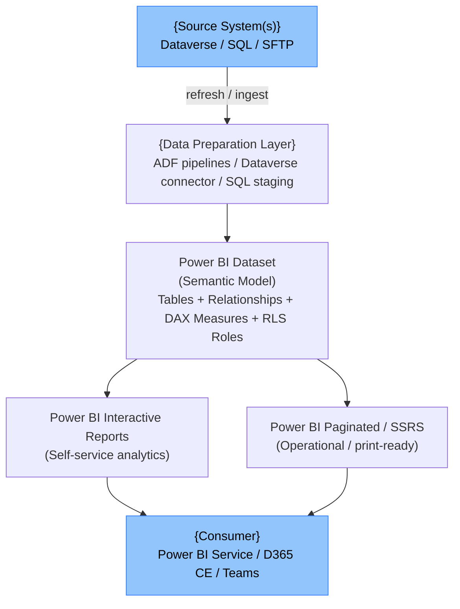
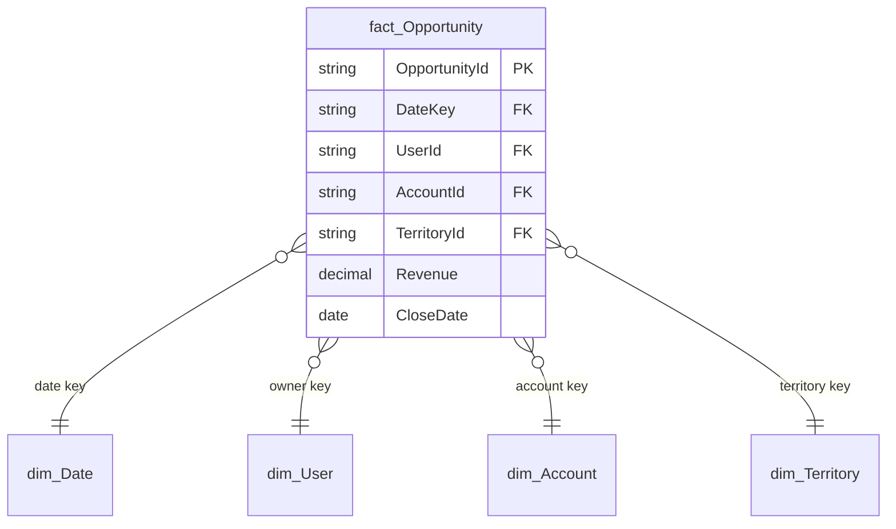

# Solution Blueprint — {Feature Display Name}

> **Purpose:** High-level architecture view for solution architects and BI leads.
> Captures the architectural decisions, patterns, and rationale before detailed design begins.
> Bridge between the functional spec and the TDD.

---

## Document Control

| Version | Date | Author | Changes |
|---|---|---|---|
| 1.0 | {YYYY-MM-DD} | Claude Code (/blueprint) | Initial draft |

---

## Table of Contents

- [1. Architecture Pattern](#1-architecture-pattern)
- [2. Component Architecture](#2-component-architecture)
- [3. Reporting Layer Decisions](#3-reporting-layer-decisions)
- [4. Data Architecture](#4-data-architecture)
- [5. Security Architecture](#5-security-architecture)
- [6. Workspace and ALM Architecture](#6-workspace-and-alm-architecture)
- [7. Integration Architecture](#7-integration-architecture)
- [8. Non-Functional Requirements Coverage](#8-non-functional-requirements-coverage)
- [9. Technical Risks and Mitigations](#9-technical-risks-and-mitigations)
- [10. Open Architecture Decisions](#10-open-architecture-decisions)

---

## 1. Architecture Pattern

**Selected Pattern:** {Pattern name}
*(e.g., Import-Mode Star Schema with Dynamic RLS)*

### Rationale
{Why this pattern was selected. Reference report types, audience size, refresh requirements, and RLS complexity.}

### Alternatives Rejected

| Pattern | Reason Rejected |
|---|---|
| {DirectQuery} | {Latency unacceptable for 50+ concurrent users} |
| {Composite Model} | {Unnecessary complexity — all data from single source} |

---

## 2. Component Architecture

### Component Inventory

| Component | Type | Deliverable | Owner |
|---|---|---|---|
| {Sales Dataset} | {Power BI Dataset} | {TMDL files} | {Reporting agent} |
| {Revenue Measures} | {DAX Measure Set} | {.dax file} | {Reporting agent} |
| {Territory RLS} | {RLS Roles} | {RLS definition} | {Reporting agent} |
| {Sales Dashboard} | {Power BI Report} | {Report spec} | {Reporting agent} |
| {Invoice Report} | {Paginated Report} | {RDL spec + SP} | {Reporting agent} |

---

## 3. Reporting Layer Decisions

| Decision | Options | Choice | Rationale |
|---|---|---|---|
| Storage mode | Import / DirectQuery / Composite | {Import} | {Performance} |
| Measure location | Dataset / Report | {Dataset} | {Reuse across reports} |
| RLS type | Static / Dynamic | {Dynamic} | {USERPRINCIPALNAME()} |
| Report distribution | App / Direct share / Embed | {App} | {Governed access} |
| Paginated reports | Power BI Report Builder / SSRS | {Power BI Paginated} | {Consistent ALM} |

---

## 4. Data Architecture

### Source-to-Dataset Flow

| Source | Entity / Table | Key Fields | Transform | Dataset Table |
|---|---|---|---|---|
| {Dataverse} | {Opportunity} | {Revenue, CloseDate, OwnerId} | {Currency normalisation} | {fact_Opportunity} |
| {SQL Staging} | {stg_account} | {AccountId, Region} | {None} | {dim_Account} |

### Star Schema Design

### Data Volume Estimates

| Table | Row Count | Refresh Mode | Notes |
|---|---|---|---|
| {fact_Opportunity} | {~50,000} | {Incremental} | {3-year archive} |
| {dim_Date} | {~3,650} | {Full} | {10-year date range} |

---

## 5. Security Architecture

### RLS Design Summary

| Role | Scope | Filter Mechanism |
|---|---|---|
| {Sales Rep} | {Own records} | {Dynamic — USERPRINCIPALNAME()} |
| {Territory Manager} | {Assigned territories} | {Lookup via dim_Territory} |
| {Executive} | {All data} | {No filter} |

### Workspace Access

| Role | DEV | UAT | PROD |
|---|---|---|---|
| BI Developer | {Admin} | {Contributor} | {Viewer} |
| QA / Tester | {Viewer} | {Contributor} | {—} |
| Business User | {—} | {Viewer} | {App viewer} |

---

## 6. Workspace and ALM Architecture

| Stage | Workspace | Deployment Method |
|---|---|---|
| DEV | `{ProjectName}-Reports-DEV` | {Manual publish from Power BI Desktop} |
| UAT | `{ProjectName}-Reports-UAT` | {Deployment pipeline — promote from DEV} |
| PROD | `{ProjectName}-Reports-PROD` | {Deployment pipeline — promote from UAT after sign-off} |

**Service Principal:** `svc-pbi-deploy@{tenant}` — used for deployment pipeline and gateway.
**Source Control:** TMDL files committed to `output/{feature}/tmdl/`; report specs in `output/{feature}/report-specs/`.

---

## 7. Integration Architecture

| Integration | Direction | Type | Dependency |
|---|---|---|---|
| {ADF Staging} | {ADF → SQL → Dataset} | {Scheduled pre-refresh} | {Dataset refresh triggers after ADF pipeline completes} |
| {Dataverse Connector} | {Dataverse → Dataset} | {Direct import} | {Service principal read access} |

---

## 8. Non-Functional Requirements Coverage

| NFR | Target | How Met |
|---|---|---|
| Load time | < 3 seconds | {Import mode + VertiPaq compression} |
| Data freshness | Daily by 07:00 UTC | {Scheduled refresh 06:00 UTC} |
| Concurrent users | {50} | {Power BI Premium capacity} |
| RLS correctness | 100% | {Automated RLS test suite} |
| Paginated render | < 10 seconds | {Indexed SP + parameter-driven query} |

---

## 9. Technical Risks and Mitigations

| Risk | Likelihood | Impact | Mitigation |
|---|---|---|---|
| {Refresh failure — Dataverse throttling} | {Medium} | {High} | {Retry policy in gateway; alert on failure} |
| {RLS bypass via calculated tables} | {Low} | {Critical} | {Constitution rule — no calculated tables without RLS review} |
| {Dataset size exceeds Premium capacity limit} | {Low} | {High} | {Monitor model size; add aggregations if >10 GB} |

---

## 10. Open Architecture Decisions

| # | Decision Needed | Options | Target Date | Owner |
|---|---|---|---|---|
| OA-001 | {Premium capacity vs Premium Per User licensing} | {P1 SKU / PPU} | {YYYY-MM-DD} | {Platform team} |
