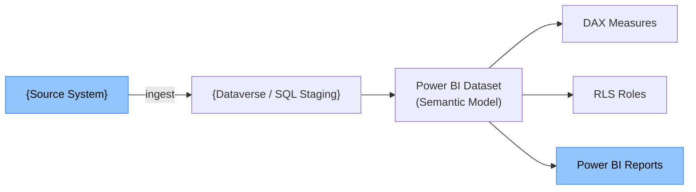

# Technical Design Document — {Feature Display Name}

> **Purpose:** Definitive technical reference for BI developers and release engineers.
> Assumes the reader has read the FDD. Business context is in the FDD — this document covers HOW.

---

## Document Control

| Version | Date | Author | Reviewed By | Changes |
|---|---|---|---|---|
| 1.0 | {YYYY-MM-DD} | Claude Code (/tdd) | {Reviewer Name} | Initial draft |

---

## Table of Contents

- [1. Technical Architecture Overview](#1-technical-architecture-overview)
- [2. Dataset / Data Model Technical Design](#2-dataset--data-model-technical-design)
- [3. DAX Measure Technical Specifications](#3-dax-measure-technical-specifications)
- [4. RLS Technical Design](#4-rls-technical-design)
- [5. Power BI Report Technical Specifications](#5-power-bi-report-technical-specifications)
- [6. Paginated / SSRS Report Technical Specifications](#6-paginated--ssrs-report-technical-specifications)
- [7. Workspace and ALM Design](#7-workspace-and-alm-design)
- [8. Data Refresh and Incremental Refresh Design](#8-data-refresh-and-incremental-refresh-design)
- [9. Security Technical Design](#9-security-technical-design)
- [10. Integration Technical Design](#10-integration-technical-design)
- [11. NFR Compliance](#11-nfr-compliance)
- [12. Technical Risks](#12-technical-risks)
- [13. Constitution Exceptions](#13-constitution-exceptions)
- [14. Author Completion Checklist](#14-author-completion-checklist)

---

## 1. Technical Architecture Overview

### Architecture Pattern
**Selected:** {Pattern name from /blueprint} — see [solution-blueprint.md](solution-blueprint.md)

### FDD-to-TDD Traceability

| FDD Section | TDD Section | Status |
|---|---|---|
| §5 Report Catalogue | §5 + §6 Report Technical Specifications | {Covered} |
| §7 Data Requirements | §2 Dataset / Data Model | {Covered} |
| §8 RLS Requirements | §4 RLS Technical Design | {Covered} |

### Component Interaction Diagram

---

## 2. Dataset / Data Model Technical Design

### 2.1 Dataset Name and Mode

| Property | Value |
|---|---|
| Dataset Name | {e.g., Sales-Performance-Dataset} |
| Storage Mode | {Import \| DirectQuery \| Composite} |
| Source Connector | {Dataverse \| Azure SQL \| OData \| SharePoint} |
| Service Principal | {Yes — `svc-pbi-{env}@contoso.com`} |

### 2.2 Table Inventory

| Table Name | Source Query / Entity | Load Mode | Row Estimate | Notes |
|---|---|---|---|---|
| {dim_Date} | {SQL: `SELECT * FROM dim_Date`} | {Import} | {3,650} | {Date dimension — 10 years} |
| {fact_Opportunity} | {Dataverse: Opportunity entity} | {Import} | {50,000} | {Filtered to last 3 years} |

### 2.3 Relationships

| From Table | From Column | To Table | To Column | Cardinality | Cross Filter |
|---|---|---|---|---|---|
| {fact_Opportunity} | {CloseDate} | {dim_Date} | {Date} | {Many-to-One} | {Single} |
| {fact_Opportunity} | {OwnerId} | {dim_User} | {SystemUserId} | {Many-to-One} | {Single} |

### 2.4 Calculated Columns

| Table | Column Name | DAX Formula | Purpose |
|---|---|---|---|
| {fact_Opportunity} | {[Year-Month]} | `FORMAT([CloseDate], "YYYY-MM")` | {Slicer grouping} |

### 2.5 TMDL Output Paths

| File | Path |
|---|---|
| Model definition | `output/{feature}/tmdl/model.tmd` |
| Table: {fact_Opportunity} | `output/{feature}/tmdl/tables/fact_Opportunity.tmd` |
| Relationships | `output/{feature}/tmdl/relationships.tmd` |

---

## 3. DAX Measure Technical Specifications

*(One sub-section per measure or measure group)*

### 3.1 Measure Group: {Revenue Measures}

| Measure Name | DAX Formula | Format String | Notes |
|---|---|---|---|
| [Total Revenue] | `SUM(fact_Opportunity[Revenue])` | `#,0.00` | {Base currency} |
| [Revenue YTD] | `TOTALYTD([Total Revenue], dim_Date[Date])` | `#,0.00` | {Calendar year} |
| [Win Rate %] | `DIVIDE(COUNTROWS(FILTER(fact_Opportunity, [Status]="Won")), COUNTROWS(fact_Opportunity))` | `0.0%` | {Excludes Open} |

**Evaluation Context Notes:** {Describe any CALCULATE context transitions or filter interactions that need special attention.}

**Performance Notes:** {Flag measures using SUMX, nested iterators, or large table scans. Recommend aggregations if applicable.}

---

## 4. RLS Technical Design

### 4.1 Role Definitions

| Role Name | Filter Table | DAX Filter Expression | Users / Groups |
|---|---|---|---|
| {Sales Rep} | {fact_Opportunity} | `[OwnerId] = USERPRINCIPALNAME()` | {D365 Sales Rep security group} |
| {Territory Manager} | {dim_Territory} | `[ManagerEmail] = USERPRINCIPALNAME()` | {D365 Sales Manager group} |

### 4.2 RLS Architecture Decisions

| Decision | Choice | Rationale |
|---|---|---|
| RLS type | {Dynamic} | {User-level filtering via USERPRINCIPALNAME()} |
| Security lookup | {dim_User table} | {Avoids hardcoded usernames} |
| Test approach | {RLS test suite in /testplan} | {Dedicated test cases per role} |

### 4.3 RLS Definition File Paths

| File | Path |
|---|---|
| RLS role definitions | `output/{feature}/rls/{feature-name}-rls.dax` |

---

## 5. Power BI Report Technical Specifications

*(One sub-section per report)*

### 5.1 Report: {Report Name}

| Property | Value |
|---|---|
| Report Name | {e.g., Sales Performance Dashboard} |
| Canvas Size | {1280×720} |
| Theme File | `output/{feature}/theme/{theme-name}.json` |
| Dataset | {Sales-Performance-Dataset} |

**Page Inventory:**

| Page Name | Layout | Key Visuals | Interactions |
|---|---|---|---|
| {Summary} | {Full canvas} | {KPI cards, bar chart, map} | {Cross-filter on all visuals} |
| {Detail} | {Scrollable} | {Matrix, table} | {Drill-through target from Summary} |

**Slicer Inventory:**

| Slicer | Field | Type | Default |
|---|---|---|---|
| {Date Range} | {dim_Date[Date]} | {Between} | {Last 12 months} |
| {Region} | {dim_Territory[Region]} | {Dropdown} | {All} |

**Bookmark Inventory:**

| Bookmark Name | Purpose | Triggered By |
|---|---|---|
| {View Revenue} | {Shows Revenue KPIs} | {Button: "Revenue"} |
| {View Units} | {Shows Units KPIs} | {Button: "Units"} |

**Report Spec File Path:** `output/{feature}/report-specs/{feature-name}-{report-name}-spec.md`

---

## 6. Paginated / SSRS Report Technical Specifications

*(Skip if no paginated/SSRS reports in scope)*

### 6.1 Report: {Report Name}

| Property | Value |
|---|---|
| Report Name | {e.g., Monthly Invoice Report} |
| Report Type | {Power BI Paginated \| SSRS} |
| Data Source | {Shared data source: `DS_{Name}`} |
| Parameters | {`@StartDate`, `@EndDate`, `@CustomerId`} |
| Output Formats | {PDF, Excel, Word} |

**Stored Procedure:**

| Property | Value |
|---|---|
| SP Name | `{usp_rpt_Invoice_Monthly}` |
| Source File | `output/{feature}/sql/{feature-name}-rpt-sp.sql` |

**Data Regions:**

| Region | Type | Dataset Query | Grouping |
|---|---|---|---|
| {Invoice List} | {Tablix} | {`usp_rpt_Invoice_Monthly`} | {Group by Customer, then Invoice} |

**RDL Spec File Path:** `output/{feature}/rdl-specs/{feature-name}-{report-name}-rdl-spec.md`

---

## 7. Workspace and ALM Design

| Property | Value |
|---|---|
| DEV Workspace | `{ProjectName}-Reports-DEV` |
| UAT Workspace | `{ProjectName}-Reports-UAT` |
| PROD Workspace | `{ProjectName}-Reports-PROD` |
| Deployment Pipeline | {3-stage: DEV → UAT → PROD} |
| Service Principal | `svc-pbi-deploy@{tenant}` |
| Sensitivity Label | {Confidential — Business} |

**Deployment Sequence:**
1. Publish dataset to DEV workspace
2. Publish reports to DEV workspace
3. Promote to UAT via deployment pipeline (dataset + reports)
4. QA sign-off → promote to PROD

---

## 8. Data Refresh and Incremental Refresh Design

| Dataset | Refresh Mode | Schedule | Incremental Refresh | Archive | Incremental Window |
|---|---|---|---|---|---|
| {Sales Dataset} | {Scheduled} | {Daily 06:00 UTC} | {Yes} | {3 years} | {7 days} |

**Incremental Refresh Policy (if enabled):**
- `RangeStart` parameter: `DateTime` type
- `RangeEnd` parameter: `DateTime` type
- Filter applied to: {`fact_Opportunity[ModifiedOn]`}

---

## 9. Security Technical Design

| Control | Implementation |
|---|---|
| Dataset access | {Workspace roles — Contributor for BI team, Viewer for consumers} |
| Report sharing | {App-based distribution — no direct share} |
| RLS enforcement | {Dynamic RLS — see §4} |
| Sensitivity labels | {Applied at dataset and report level} |
| Service principal | {Used for gateway and pipeline — no personal credentials} |

---

## 10. Integration Technical Design

{Describe any upstream pipeline dependencies (ADF, Dataverse connector, API).}

| Integration | Type | Owner | Dependency |
|---|---|---|---|
| {ADF Staging Pipeline} | {ADF → SQL Staging} | {Data Migration agent} | {Dataset refresh depends on pipeline completion} |
| {Dataverse Connector} | {Scheduled import} | {Reporting agent} | {Service principal must have read access to entities} |

---

## 11. NFR Compliance

| NFR | Target | Design Decision |
|---|---|---|
| Dashboard load time | < 3 seconds | {Import mode + aggregations for large fact tables} |
| Paginated report render | < 10 seconds | {Stored procedure with indexed columns} |
| Data freshness | Daily by 07:00 UTC | {Refresh window 06:00–07:00 UTC} |
| Concurrent users | {50} | {Premium Per User or Premium capacity required} |
| RLS correctness | 100% | {Automated RLS test suite} |

---

## 12. Technical Risks

| Risk | Likelihood | Impact | Mitigation |
|---|---|---|---|
| {DirectQuery performance degradation at scale} | {Medium} | {High} | {Use Import mode; schedule nightly refresh} |
| {RLS filter on large fact table slows report load} | {Low} | {Medium} | {Pre-filter in dataset query; use aggregations} |
| {Service principal token expiry} | {Low} | {High} | {Rotate credentials via Key Vault; alert on refresh failure} |

---

## 13. Constitution Exceptions

| Exception | Reason | Approved By | Date |
|---|---|---|---|
| {e.g., Direct share used instead of App} | {Audience is internal BI team only} | | |

---

## 14. Author Completion Checklist

- [ ] All datasets have connection details and storage mode defined
- [ ] All DAX measures have formula, format string, and evaluation context notes
- [ ] RLS role expressions reviewed and tested approach documented
- [ ] All reports have page inventory and slicer inventory completed
- [ ] Paginated/SSRS reports have SP name and data region defined
- [ ] Workspace and deployment pipeline names match constitution/10-alm-configuration.md
- [ ] Refresh schedule and incremental refresh policy defined
- [ ] All output file paths specified
- [ ] Technical risks documented
- [ ] Constitution exceptions approved
