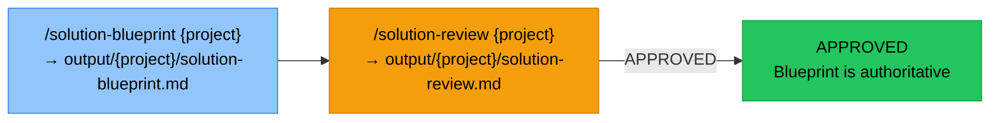

# Solution Architect Agent Template

Cross-template solution blueprint generation for multi-domain Microsoft platform projects.
Reads specs and plans from sibling d365-ce, d365-fo, integration, power-apps, data-migration, and reporting templates and
synthesises them into a single authoritative architecture document.

## Full Workflow

### Inputs → Output

| Domain Agent | Artefacts consumed |
|---|---|
| D365 CE | `specs/{f}/spec.md`, `plans/{f}/plan.md`, `docs-generated/{f}/solution-blueprint.md` |
| D365 F&O | `docs/{f}/fdd.md`, `docs/{f}/tdd.md`, `plans/{f}/plan.md` |
| Integration | `specs/{f}/spec.md`, `plans/{f}/plan.md`, `docs-generated/{f}/solution-blueprint.md` |
| Power Apps | `specs/{f}/spec.md`, `plans/{f}/plan.md`, `docs-generated/{f}/solution-blueprint.md` |
| Data Migration | `specs/{f}/spec.md`, `plans/{f}/plan.md`, `docs-generated/{f}/solution-blueprint.md` |
| Reporting | `specs/{f}/spec.md`, `plans/{f}/plan.md`, `docs-generated/{f}/solution-blueprint.md` |

### Command Chain



### Optional — Brownfield Overlay

Set `brownfield.enabled: true` in `constitution/10-project-configuration.md` and point `docs-path` to the brownfield agent's `docs-generated/` folder. When enabled, `/solution-blueprint` reads the As-Is architecture as a baseline layer and incorporates it throughout all blueprint sections (Section 0 baseline sources, Section 3.2 existing vs new components, Section 4.2 existing entities, Section 8 backward compatibility risks).

## Command Reference

| Command | Pre-condition | Output |
|---|---|---|
| `/solution-blueprint {project}` | At least one sibling template feature has `spec.md` + `plan.md` | `output/{project}/solution-blueprint.md` |
| `/solution-review {project}` | `solution-blueprint.md` exists | `output/{project}/solution-review.md` |

## Brownfield Configuration

Set in `constitution/10-project-configuration.md`:

```ini
[brownfield]
enabled:   false
docs-path: ../d365-ce-brownfield/docs-generated
```

When `enabled: true`, `/solution-blueprint` reads brownfield architecture docs as an As-Is Baseline
and incorporates the existing system view throughout the blueprint (Section 0 Baseline Sources,
Section 3.2 existing vs new components, Section 4.2 existing entities, Section 8 backward compatibility risks).

## Rules

All commands must read `constitution/` before generating output. The constitution overrides all other instructions.
All output paths (`output/`) are relative to this template's root directory — never relative to the location of the input requirements file, regardless of where the source requirements come from.
