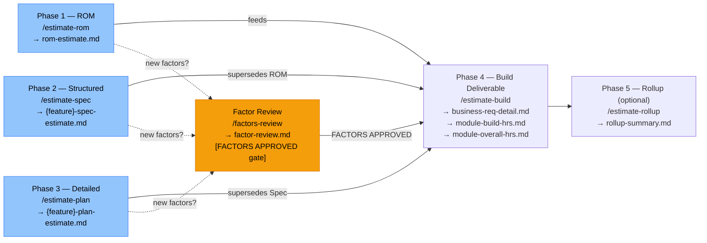

# Solution Estimate Agent

Factor-based estimation for Microsoft technology delivery projects.
Produces ROM, structured, and detailed estimates at any stage of the delivery lifecycle.

## Full Workflow

> Brownfield mode applies automatically to rom/spec/plan when `brownfield.enabled: true`.
> All estimate commands read brownfield docs / impact-analysis.md and adjust rates per classification.

## Command Reference

| Command | Pre-condition | Output |
|---|---|---|
| `/estimate-rom {project} {input}` | None | `estimates/{p}/rom-estimate.md` |
| `/estimate-spec {project} {feature}` | Spec APPROVED in domain agent | `estimates/{p}/{f}-spec-estimate.md` |
| `/estimate-plan {project} {feature}` | TASK-READY or PLAN APPROVED in domain agent | `estimates/{p}/{f}-plan-estimate.md` |
| `/factors-review {project}` | `proposed-factors.md` exists | `estimates/{p}/factor-review.md` (sets FACTORS APPROVED) |
| `/estimate-build {project}` | At least one estimate exists; FACTORS APPROVED if new factors | 3 formal output files |
| `/estimate-rollup {project}` | `estimate-build` complete | `estimates/{p}/rollup-summary.md` |

## Gates

| Gate | Set by | Blocks |
|---|---|---|
| FACTORS APPROVED | `/factors-review` | `/estimate-build` will not run if `proposed-factors.md` exists and this gate is not set |

## Rules

- Always read all files in `constitution/` before generating any output.
- All output paths (`estimates/`) are relative to this template's root directory — never relative to the location of the input requirements file, regardless of where the source requirements come from.
- Always read `20-factor-definitions.md` and `21-factor-rates.md` before assigning any factor or hour value.
- If a requirement needs a factor not in `20-factor-definitions.md`: write `proposed-factors.md` and halt. Continue other rows.
- Factor **counts** in inventory are always whole integers. **Hours** = Count × Rate from `21-factor-rates.md`.
- Requirement Level is always set per the L1–L5 scale in `22-estimation-rules.md`.
- Phase multipliers are always sourced from `22-estimation-rules.md` — never hardcode them.
- Brownfield adjustments apply only when `brownfield.enabled: true` in `10-project-configuration.md`.
- Do not generate the formal 3-part deliverable during rom/spec/plan runs — that is `/estimate-build`'s job.
