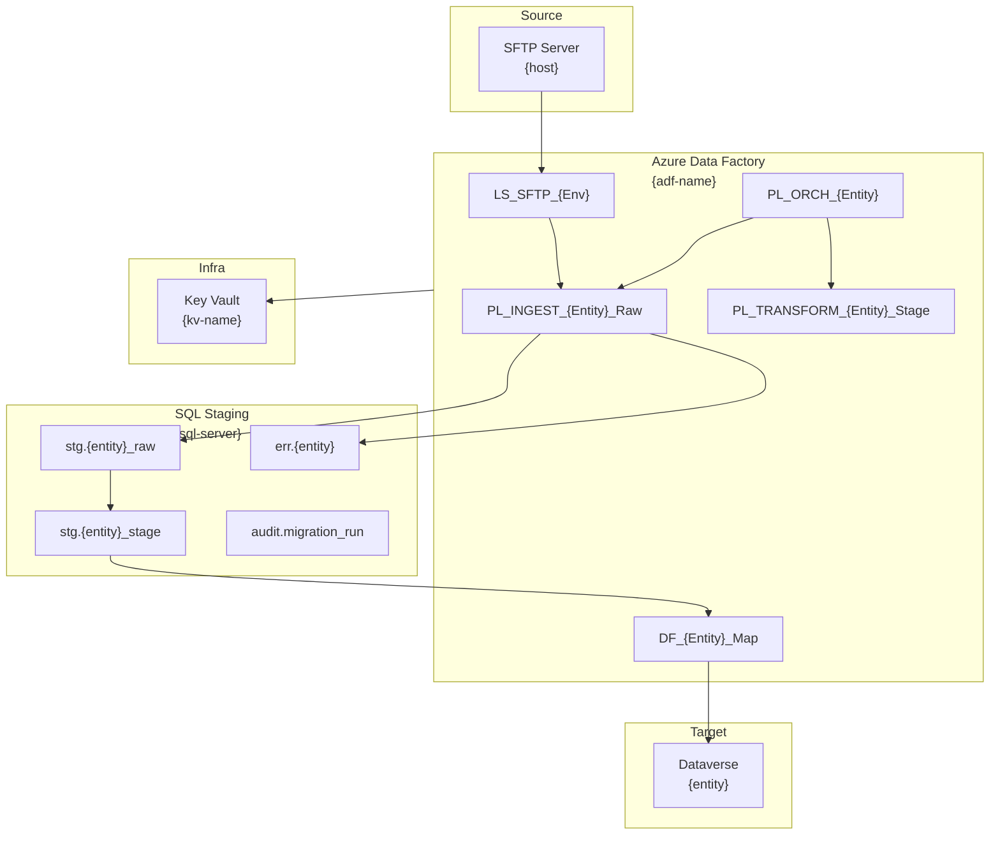

Generate the Solution Blueprint for a migration.

## Usage

```
/blueprint {migration-id}
```

## Pre-condition

`plans/{migration-id}/clarify.md` must be **TASK-READY**.

## Steps

1. Read ALL files in `constitution/`.
2. Verify clarify is TASK-READY.
3. Read spec, TDD, pipeline design, and field mapping.
4. Generate `docs-generated/{migration-id}/solution-blueprint.md`.

## solution-blueprint.md Structure

### Header

```markdown
# Solution Blueprint — {migration-id}

**Version:** 1.0
**Date:** {today}
**Author:** Data Migration Agent
**Status:** DRAFT

---
```

### Section 1 — Solution Summary

One-page overview:
- Migration direction and purpose
- Technology choices and justification
- Key design decisions
- Total artefact count

### Section 2 — Component Map

Visual map (Mermaid) of all components and their relationships:



### Section 3 — ADF Artefact Inventory

Complete inventory of every file that will be created in `output/{migration-id}/adf/`:

```
output/{migration-id}/adf/
  linkedServices/
    LS_SFTP_{Env}.json
    LS_SQL_Staging_{Env}.json
    LS_Dataverse_{Env}.json
    LS_KeyVault.json
  datasets/
    DS_SFTP_{Entity}_CSV.json
    DS_SQL_{Entity}_Raw.json
    DS_SQL_{Entity}_Stage.json
    DS_DV_{Entity}.json
  pipelines/
    PL_ORCH_{Entity}.json
    PL_INGEST_{Entity}_Raw.json
    PL_TRANSFORM_{Entity}_Stage.json
    PL_NOTIFY_{Entity}.json
  dataflows/
    DF_{Entity}_Map.json
  triggers/
    TR_{Entity}_Schedule_Daily.json
  arm-template.json
  arm-template-parameters.json
  deploy.ps1
```

### Section 4 — SQL Artefact Inventory

```
output/{migration-id}/sql/
  schema/
    00-schemas.sql
    01-stg_{entity}_raw.sql
    02-stg_{entity}_stage.sql
    03-err_{entity}.sql
    04-audit_migration_run.sql
    05-ref_*.sql            (one per lookup table)
  procedures/
    usp_{entity}_promote.sql
  deploy.sql                (master deployment script)
```

### Section 5 — Test Artefact Inventory

```
output/{migration-id}/tests/
  data/
    {entity}_test_happy_{YYYYMMDD}.csv
    {entity}_test_partial_{YYYYMMDD}.csv
    {entity}_test_allinvalid_{YYYYMMDD}.csv
    {entity}_test_empty_{YYYYMMDD}.csv
  scripts/
    deposit-test-file.ps1   (upload test file to SFTP)
    validate-results.sql    (query staging + Dataverse post-run)
```

### Section 6 — Design Decisions

| Decision | Choice | Rationale | Alternative Considered |
|---|---|---|---|
| Authentication method | Service Principal | Supports non-interactive automation | Managed Identity (requires same VNet) |
| Staging approach | SQL Staging | Full visibility, retry-safe, auditable | ADF Staging Blob (less observable) |
| Write method | Upsert via alternate key | Idempotent | Insert only (would cause duplicates) |
| Trigger type | Schedule + Manual | Predictable, controllable | Event-based only (harder to test) |
| Data Flow engine | Memory Optimized | Handle large volumes | General Purpose (slower for high volume) |

### Section 7 — Constraints and Assumptions

List all assumptions made and constraints that shaped the design.

### Section 8 — Delivery Checklist

Pre-implementation checklist (the same checklist validated by `/validate`):

- [ ] Field mapping document complete and approved
- [ ] Pipeline design document complete and approved
- [ ] TDD complete
- [ ] SQL DDL templates ready
- [ ] ADF linked service connection strings available in Key Vault
- [ ] Test SFTP accessible with test credentials
- [ ] Dataverse sandbox environment accessible

---

## Output

Write `docs-generated/{migration-id}/solution-blueprint.md`.

Print:

```
BLUEPRINT WRITTEN — {migration-id}
════════════════════════════════════════
File          : docs-generated/{migration-id}/solution-blueprint.md
ADF Artefacts : {N} total ({N} pipelines, {N} datasets, {N} flows)
SQL Artefacts : {N} tables, {N} SPs
Test Artefacts: {N}

Next step: /task {migration-id}
```
