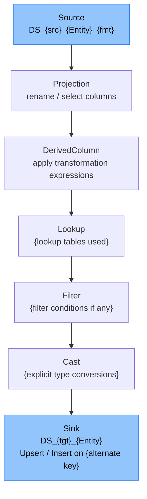

Generate the Technical Design Document for a migration.

## Usage

```
/tdd {migration-id}
```

## Pre-condition

`plans/{migration-id}/clarify.md` must be **TASK-READY**.

## Steps

1. Read ALL files in `constitution/`.
2. Verify clarify is TASK-READY.
3. Read spec, field mapping, pipeline design, and plan.
4. Generate `docs-generated/{migration-id}/technical-design-document.md`.

## TDD Structure

### Header

```markdown
# Technical Design Document — {migration-id}

**Version:** 1.0
**Date:** {today}
**Author:** Data Migration Agent
**Status:** DRAFT
**Direction:** {direction}

---
```

### Section 1 — Overview

Purpose, direction, entities, technology stack summary.

### Section 2 — Architecture

#### 2.1 — High-Level Architecture

Mermaid `graph LR` diagram showing:
- Source system
- SFTP server (if applicable)
- ADF instance
- SQL Staging database
- Dataverse environment
- Key Vault
- Monitoring / Log Analytics

#### 2.2 — Azure Resource List

| Resource | Type | Resource Group | Notes |
|---|---|---|---|
| `{adf-name}` | Azure Data Factory | `{rg}` | |
| `{sql-server}` | Azure SQL Server | `{rg}` | |
| `{sql-db}` | Azure SQL Database | `{rg}` | Staging DB |
| `{kv-name}` | Azure Key Vault | `{rg}` | |

### Section 3 — ADF Component Catalogue

List all ADF artefacts to be created with their full names and purpose.

#### 3.1 Linked Services

| Name | Type | Env Variants | Secret Reference |
|---|---|---|---|
| `LS_SFTP_{Env}` | Sftp | dev, test, prod | `kv-sftp-{env}-*` |

#### 3.2 Datasets

Full list with parameter definitions.

#### 3.3 Pipelines

Full list with activity counts and dependencies.

#### 3.4 Data Flows

Full list with transformation steps for each.

#### 3.5 Triggers

Full list with schedule/event configuration.

### Section 4 — SQL Staging Schema

#### 4.1 Schema Layout

```sql
-- Schemas
CREATE SCHEMA [stg];
CREATE SCHEMA [err];
CREATE SCHEMA [audit];
CREATE SCHEMA [ref];
```

#### 4.2 Table Definitions

Full DDL for each table (raw, stage, error, audit).

#### 4.3 Stored Procedure Design

For each SP:
- Name
- Parameters
- Logic summary (bullet points)
- Validation rules applied
- Error handling approach

### Section 5 — Data Flow Design

For each ADF Data Flow (`DF_{Entity}_Map` etc.), document the transformation pipeline with a Mermaid `graph TD`:



### Section 6 — Security Design

- Managed Identity usage map
- Service Principal permissions
- Key Vault secrets catalogue
- Network architecture (IR type, firewall rules)
- PII field handling in ADF logs

### Section 7 — Error Handling Design

- Error category → pipeline response matrix (from `constitution/07-error-handling.md`)
- Threshold configuration for this migration
- Alert routing and webhook payload
- Error table query for triage

### Section 8 — Deployment Design

#### 8.1 ARM Template Approach

How the ARM template is structured and parameterised.

#### 8.2 Environment Promotion

Dev → Test → Prod promotion flow.
Which parameters change per environment (linked service URLs, Key Vault references, integration runtime).

#### 8.3 Deployment Order

1. Key Vault secrets
2. SQL schema (DDL)
3. SQL stored procedures
4. ADF linked services
5. ADF datasets
6. ADF data flows
7. ADF pipelines
8. ADF triggers (last — enable only after smoke test)

### Section 9 — Rollback Procedure

Steps to roll back a failed deployment or a bad migration run.

### Section 10 — Open Items

| # | Item | Owner | Due |
|---|---|---|---|

---

## Output

Write `docs-generated/{migration-id}/technical-design-document.md`.

Print:

```
TDD WRITTEN — {migration-id}
════════════════════════════════════════
File    : docs-generated/{migration-id}/technical-design-document.md
Sections: 10

Next step: /blueprint {migration-id}
```
