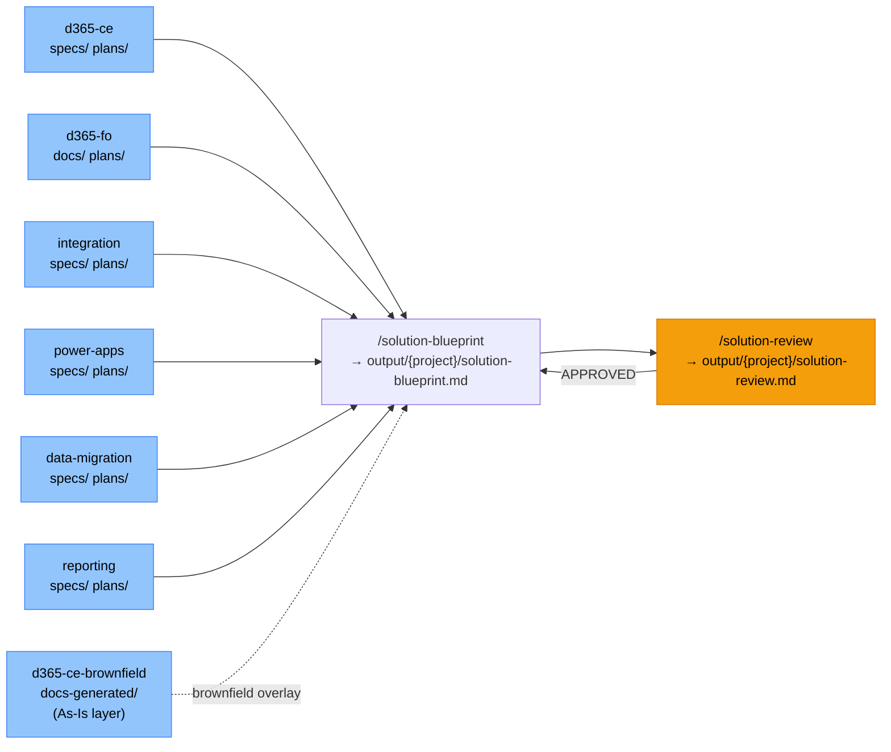
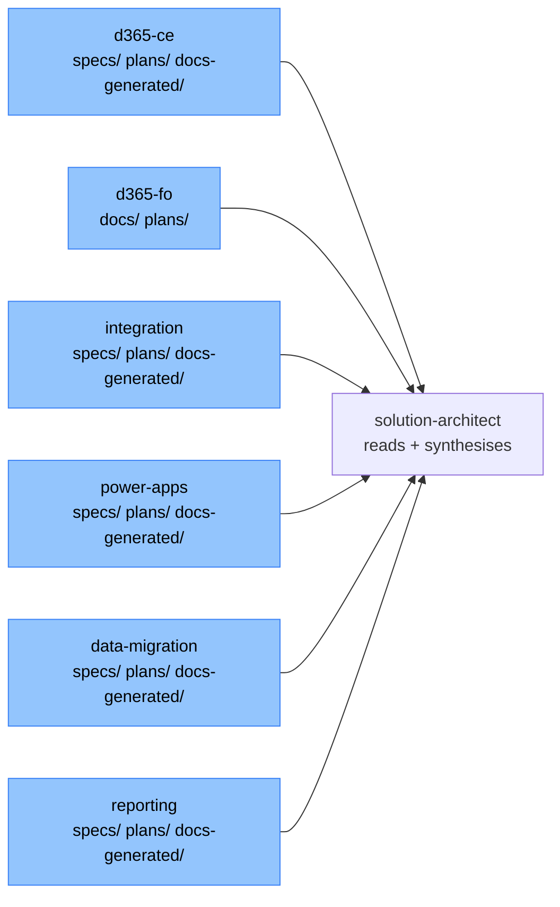

# Solution Architect Agent Template

Cross-template solution blueprint generation for multi-domain Microsoft platform projects using Claude Code.
This template reads specs, FDDs, plans, and TDDs from sibling d365-ce, d365-fo, integration, power-apps, data-migration, and reporting templates and
synthesises them into a single authoritative architecture document covering all platforms in scope.

---

## Table of Contents

- [1. What Is It](#1-what-is-it)
- [2. How It Works](#2-how-it-works)
  - [The process](#the-process)
  - [Gates](#gates)
  - [Phase 1 — Generate the Blueprint](#phase-1--generate-the-blueprint)
    - [/solution-blueprint](#solution-blueprint--generate-the-cross-platform-solution-blueprint)
  - [Phase 2 — Review the Blueprint](#phase-2--review-the-blueprint)
    - [/solution-review](#solution-review--validate-the-blueprint-against-the-constitution)
- [Brownfield Mode](#brownfield-mode)
- [3. Structure and Outputs](#3-structure-and-outputs)
- [4. Relationship to Sibling Templates](#4-relationship-to-sibling-templates)
- [5. Configuration](#5-configuration)

---

## 1. What Is It

### The problem it solves

Each delivery template (d365-ce, d365-fo, integration, power-apps, data-migration, reporting) produces per-feature design artefacts.
When a project spans multiple platforms — a D365 F&O process pushing events through Azure Integration
to a D365 CE workflow surfaced in a Power Apps portal, with Power BI reports consuming the resulting data — there is no single document that shows how everything
fits together. This template fills that gap.

### What the agent produces

| Document | When | Audience |
|---|---|---|
| Solution Blueprint | After at least one feature has an approved spec and plan | Solution Architect, Tech Lead, Business Stakeholder, Delivery Manager |
| Solution Review Report | After blueprint is generated | Architecture review board, Tech Lead |

### What the blueprint covers

- All features across all templates in one unified view
- Cross-template dependency map — exactly where D365 F&O, D365 CE, Power Platform, Azure Integration, Data Migration, and Reporting touch
- D365 F&O integration patterns — how F&O interface classes connect to Azure, and how Azure writes back via Data Entities
- Reporting dependencies — Power BI datasets consuming Dataverse or ADF staging tables; RLS mapped to D365 security roles
- Unified Dataverse data model (deduplicated across all features)
- Unified integration architecture — all external systems, patterns, error handling
- Security architecture across all platforms
- Full deployment pipeline and environment strategy including cross-template sequencing
- Complete requirement-to-component traceability across all features

---

## 2. How It Works

### The process



### Gates

| Gate | Set by | Blocks |
|---|---|---|
| APPROVED | `/solution-review` writes `status: APPROVED` in solution-review.md | Blueprint is not authoritative until approved — re-run after any significant architectural change |

---

### Phase 1 — Generate the Blueprint

#### `/solution-blueprint` — Generate the Cross-Platform Solution Blueprint

Reads specs, plans, FDDs, and TDDs from all in-scope sibling templates and synthesises them into a single authoritative architecture document.

```
/solution-blueprint {project-name}
```

Auto-discovers all features from all sibling templates (d365-ce, d365-fo, integration, power-apps, data-migration, reporting).

```
/solution-blueprint {project-name} --features d365-ce:account-loyalty,d365-fo:qms-validation,integration:order-events,power-apps:agent-portal
```

Explicit feature list — use when you only want to include specific features. D365 F&O features are identified by template key `d365-fo`.

Output: `output/{project}/solution-blueprint.md`

What it does:
1. **Discovers inputs** — scans sibling template `specs/` folders (d365-ce, integration, power-apps, data-migration, reporting) and `docs/` folder (d365-fo) automatically, or uses the `--features` list
2. **Reads artefacts** — for d365-ce / integration / power-apps / data-migration / reporting: `spec.md`, `plan.md`, TDD, blueprint; for d365-fo: `fdd.md`, `tdd.md`, `test-plan.md`, `plan.md` (all optional — skipped silently if absent)
3. **Reads sibling constitutions** — extracts publisher prefix, Azure resource prefix, Managed Identity names, Key Vault name for naming consistency
4. **Identifies cross-template dependencies** — any point where one template's output is consumed by another, including D365 F&O INT classes → Azure and Azure → D365 F&O Data Entities
5. **Synthesises** — deduplicates shared Dataverse tables, merges integration patterns, unifies security roles
6. **Generates** — all 10 sections and all mandatory Mermaid diagrams in a single pass

Contains:
- §0 Input Sources — templates and features read; cross-template dependencies identified
- §1 Executive Summary — solution overview, key capabilities, business value
- §2 Solution Overview — business capabilities, scope, feature map across all templates
- §3 Solution Blueprint — logical architecture tiers, feature dependency diagram, component responsibilities
- §4 Technical Architecture — platform coverage, data model, automation, security, NFRs
- §5 Integration Architecture — all external systems, cross-template integration points, patterns, error handling
- §6 Environment & Deployment — environment strategy, release pipelines, cross-template ALM sequencing
- §7 Observability — logging, monitoring, alerting strategy
- §8 Risks & Constraints — cross-template coupling risks, anti-pattern violations, platform constraints
- §9 Assumptions — platform provisioning, licensing, upstream team responsibilities
- §10 Traceability — FR → component mapping across all features and templates; cross-feature dependency matrix

Run `/solution-blueprint` after the first round of `/plan` (and `/tdd` for d365-fo) commands have been completed across all in-scope features — and before `/implement` so architecture decisions are locked before coding begins. Re-run whenever a new feature is added or a significant architectural decision changes.

---

### Phase 2 — Review the Blueprint

#### `/solution-review` — Validate the Blueprint Against the Constitution

Validates the generated blueprint against the architecture constitution checklist and assigns APPROVED or NEEDS REWORK.

```
/solution-review {project-name}
```

Output: `output/{project}/solution-review.md`

Contains:
- BLOCKER — architecture violations (e.g., missing cross-template dependency, unsupported integration pattern, diagram absent)
- REQUIRED — missing information that prevents sign-off
- RECOMMENDED — best practice gaps
- **Status: APPROVED / NEEDS REWORK**

If NEEDS REWORK: fix the issues in the blueprint and re-run `/solution-review`.

---

## Brownfield Mode

Use brownfield mode when the solution blueprint should reflect an **existing implemented system** alongside the new features being added — not just the new development in isolation.

### What changes in the blueprint

When `brownfield.enabled: true`, `/solution-blueprint` reads the documentation produced by the `d365-ce-brownfield` agent and incorporates the existing system as an **As-Is Baseline** layer:

| Blueprint section | Brownfield addition |
|---|---|
| Section 0 — Input Sources | Adds a **Brownfield Baseline Sources** table listing each existing system doc read |
| Section 3.2 — Logical Architecture | Existing components shown in grey; new components in standard colours; legend added |
| Section 4.2 — Data Architecture | Existing entities marked `[EXISTING]`; only the delta (new columns, new relationships) documented |
| Section 5 — Integration Architecture | Existing integration patterns referenced rather than re-documented |
| Section 8 — Risks | Adds backward compatibility risk entries (R-BF-xxx) for the existing system |

### How to enable

**Step 1 — Run the brownfield agent first:**

```
[open templates/d365-ce-brownfield in Claude Code]
/scan
/document all
/fdd
/tdd
/blueprint
/index
```

**Step 2 — Enable brownfield mode in this template:**

Open `constitution/10-project-configuration.md` and set:

```ini
[brownfield]
enabled:   true
docs-path: ../d365-ce-brownfield/docs-generated
```

**Step 3 — Run the solution blueprint as normal:**

```
/solution-blueprint {project-name}
```

The command reads the brownfield docs automatically before synthesis and incorporates the existing system view.

---

## 3. Structure and Outputs

### Folder structure

```
solution-architect/
│
├── .claude/
│   ├── commands/
│   │   ├── solution-blueprint.md   ← input discovery, synthesis, generation
│   │   └── solution-review.md      ← validates blueprint against constitution
│   └── settings.json
│
├── constitution/                   ← architecture rules read by every command
│   ├── CLAUDE.md                   ← auto-loaded; command reference
│   ├── 00-index.md
│   ├── 01-architecture-principles.md   ← scope rules, synthesis rules, completeness gate
│   ├── 02-cross-platform-patterns.md   ← approved integration patterns D365↔Azure↔PowerApps
│   ├── 03-diagram-standards.md         ← required Mermaid diagrams per section, colour coding
│   └── 10-project-configuration.md     ← optional brownfield baseline configuration
│
├── doc-templates/
│   └── solution-blueprint-template.md  ← 10-section generation prompt with mandatory diagrams
│
└── output/{project-name}/
    ├── solution-blueprint.md       ← written by /solution-blueprint
    └── solution-review.md          ← written by /solution-review (APPROVED / NEEDS REWORK)
```

### Blueprint sections

| Section | What it covers |
|---|---|
| 0. Input Sources | Which templates and features were read; cross-template dependencies identified |
| 1. Executive Summary | Solution overview, key capabilities, business value |
| 2. Solution Overview | Business capabilities, scope, feature map across all templates |
| 3. Solution Blueprint | Logical architecture tiers, feature dependency diagram, component responsibilities |
| 4. Technical Architecture | Platform coverage, data model, automation, security, NFRs |
| 5. Integration Architecture | All external systems, cross-template integration points, patterns, error handling |
| 6. Environment & Deployment | Environment strategy, release pipelines, cross-template ALM sequencing |
| 7. Observability | Logging, monitoring tools, alerting strategy |
| 8. Risks & Constraints | Cross-template coupling risks, anti-pattern violations, platform constraints |
| 9. Assumptions | Platform provisioning, licensing, upstream team responsibilities |
| 10. Traceability | FR → component mapping across all features and templates; cross-feature dependency matrix |

### Mandatory Mermaid diagrams

| Diagram | Section | Type |
|---|---|---|
| Input Sources | 0 | `flowchart LR` |
| Logical Architecture | 3.2 | `flowchart TB` |
| Feature Dependency Map | 3.3 | `flowchart LR` |
| Data Architecture (ERD) | 4.2 | `erDiagram` |
| Automation Lifecycle | 4.3 | `flowchart TD` |
| Security Layers | 4.4 | `flowchart LR` |
| Integration Overview | 5.1 | `flowchart LR` |
| Primary Integration Sequence | 5.2 | `sequenceDiagram` |
| Environment & Deployment Pipeline | 6.1 | `flowchart LR` |
| Observability Flow | 7 | `flowchart LR` |

---

## 4. Relationship to Sibling Templates

This template does not run its own spec-to-implement workflow. It is a read-only consumer of the other templates' outputs.



> **D365 F&O produces different artefact paths.** The `d365-fo` template stores its FDD and TDD under `docs/{req}/` (not `specs/`), and its plan under `plans/{req}/plan.md` (same as other templates). When scanning for d365-fo inputs, look for `docs/{req}/fdd.md` and `docs/{req}/tdd.md` instead of `specs/{req}/spec.md`.

The solution blueprint is best run:
- **After** the first round of `/plan` (and `/tdd` for d365-fo) commands have been run across all in-scope features
- **Before** `/implement` — so architecture decisions are locked before coding begins
- **Re-run** whenever a new feature is added or a significant architectural decision changes

---

## 5. Configuration

Before first use:
1. Confirm all in-scope sibling templates (d365-ce, d365-fo, integration, power-apps, data-migration, reporting) are in the same parent folder.
2. Set your project-specific values in each sibling template's constitution as described in their READMEs.
3. To enable brownfield mode, set `brownfield.enabled: true` in `constitution/10-project-configuration.md` (see [Brownfield Mode](#brownfield-mode) above). Otherwise no configuration is required — all naming and prefix values are read from sibling constitutions.

