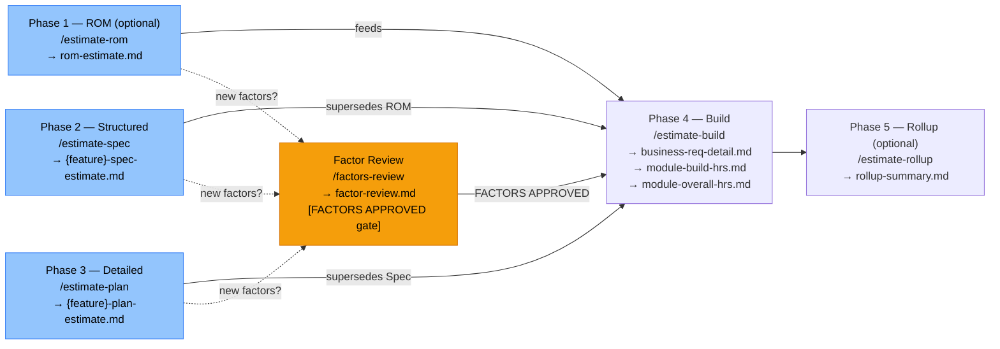

# Solution Estimate — Agent Template

Factor-based estimation for Microsoft technology delivery projects using Claude Code.
Produces ROM, structured, and detailed estimates at any stage of the delivery lifecycle,
reading outputs directly from sibling domain agents (D365 CE, Integration, Power Apps, D365 F&O, Data Migration, Reporting).

---

## Table of Contents

- [1. What Is It](#1-what-is-it)
- [2. How It Works](#2-how-it-works)
- [3. Structure and Outputs](#3-structure-and-outputs)
- [Brownfield Mode](#brownfield-mode)
- [Configuration](#configuration)

---

## 1. What Is It

The Solution Estimate agent turns requirements — at any stage of definition — into a formal,
factor-based estimate using 26 standard Microsoft technology delivery factors.

**Three estimation levels, one progressive workflow:**

| Level | Input | Confidence | When to Use |
|---|---|---|---|
| **ROM** | Unstructured requirements doc, HLR sheet, or plain text | ±40% (L1/L2) | Pre-sales, initial scoping, early go/no-go |
| **Structured** | Approved spec.md from a domain agent | ±20% (L3/L4) | Design phase, statement of work |
| **Detailed** | Approved plan from a domain agent | ±10% (L4/L5) | Contract, sprint planning, resource allocation |

All three levels feed into a single formal deliverable: a 3-part estimation inventory
(Business Req Detail, Module Build Hours, Module Overall Hours) matching the standard
Microsoft delivery estimation format.

---

## 2. How It Works



> Brownfield mode applies automatically at all estimation levels when `brownfield.enabled: true`.

**How each level refines the previous:**
- ROM data is used for modules where no spec or plan exists yet.
- Spec data supersedes ROM data for the same feature.
- Plan data supersedes spec data for the same feature.
- `/estimate-build` always uses the most detailed data available per module.

### Gates

| Gate | Set by | Blocks |
|---|---|---|
| FACTORS APPROVED | `/factors-review` | `/estimate-build` will not run if `proposed-factors.md` exists without this gate |

### Smart Factor Addition

When a requirement needs a factor not in the standard 26, the agent:
1. Writes a proposed factor card to `estimates/{project}/proposed-factors.md`.
2. Marks the inventory row `[FACTOR PENDING]` and continues.
3. Prints a notice to run `/factors-review` before building.

`/factors-review` evaluates each proposed factor — approves, remaps to an existing factor, or rejects. On approval, the new factor and its rates are appended to the constitution files so all future runs pick them up.

### Requirement Level (L1–L5)

Every inventory row carries a Requirement Level showing how confident the estimate is:

| Level | Meaning | Assigned by |
|---|---|---|
| L1 | Placeholder — title-only, must revisit | `/estimate-rom` (no detail) |
| L2 | Low Confidence — significant ambiguity | `/estimate-rom` or incomplete FR |
| L3 | Medium Confidence — open questions documented | `/estimate-spec` (open questions present) |
| L4 | High Confidence — minor gaps | `/estimate-plan` or `/estimate-spec` (no open questions) |
| L5 | Fully Detailed — signed off, no open questions | `/estimate-plan` (ideal path) |

The rollup pie chart shows the L1–L5 distribution across all requirements — giving stakeholders an instant confidence view of the entire estimate.

---

## 3. Structure and Outputs

```
templates/solution-estimate/
├── .claude/commands/
│   ├── estimate-rom.md          /estimate-rom command
│   ├── estimate-spec.md         /estimate-spec command
│   ├── estimate-plan.md         /estimate-plan command
│   ├── factors-review.md        /factors-review command (FACTORS APPROVED gate)
│   ├── estimate-build.md        /estimate-build command (formal deliverable)
│   └── estimate-rollup.md       /estimate-rollup command (rollup + confidence chart)
├── constitution/
│   ├── CLAUDE.md                Agent rules and full workflow
│   ├── 00-index.md              Constitution file index
│   ├── 10-project-configuration.md   Project settings and domain paths
│   ├── 20-factor-definitions.md      26 standard factors (editable)
│   ├── 21-factor-rates.md            Hour rates per factor (editable)
│   └── 22-estimation-rules.md        Phase multipliers, L1–L5, brownfield adjustments
├── doc-templates/
│   ├── business-req-detail-template.md
│   ├── module-build-hrs-template.md
│   └── module-overall-hrs-template.md
└── README.md
```

**Outputs written to `estimates/{project}/`:**

| File | Generated by | Description |
|---|---|---|
| `rom-estimate.md` | `/estimate-rom` | ROM estimate — module summaries, L1/L2 inventory |
| `{feature}-spec-estimate.md` | `/estimate-spec` | Structured estimate per feature, L3/L4 |
| `{feature}-plan-estimate.md` | `/estimate-plan` | Detailed estimate per feature, L4/L5 |
| `proposed-factors.md` | Any estimate run | Proposed new factors awaiting review |
| `factor-review.md` | `/factors-review` | Factor verdicts — sets FACTORS APPROVED |
| `business-req-detail.md` | `/estimate-build` | Full consolidated inventory with Req Level column |
| `module-build-hrs.md` | `/estimate-build` | Factor counts and hours per module |
| `module-overall-hrs.md` | `/estimate-build` | Phase breakdown (Build × 2.30 total) |
| `rollup-summary.md` | `/estimate-rollup` | Cross-feature summary + L1–L5 pie chart |

### Command Reference

| Command | Pre-condition | Output |
|---|---|---|
| `/estimate-rom {project} {input}` | None | `estimates/{p}/rom-estimate.md` |
| `/estimate-spec {project} {feature}` | Spec APPROVED in domain agent | `estimates/{p}/{f}-spec-estimate.md` |
| `/estimate-plan {project} {feature}` | TASK-READY or PLAN APPROVED in domain agent | `estimates/{p}/{f}-plan-estimate.md` |
| `/factors-review {project}` | `proposed-factors.md` exists | `estimates/{p}/factor-review.md` |
| `/estimate-build {project}` | At least one estimate; FACTORS APPROVED if new factors | 3 formal output files |
| `/estimate-rollup {project}` | `estimate-build` complete | `estimates/{p}/rollup-summary.md` |

---

## Brownfield Mode

Use when estimating features being added to an **existing system** — rather than a greenfield build.
The brownfield overlay adjusts hour rates per component based on how much existing code can be reused.

### Rate Adjustments

| Classification | Rate | Rationale |
|---|---|---|
| NEW | Standard × 1.00 | Full build — nothing exists |
| EXTEND | Standard × 0.60 | Existing code reduces effort by ~40% |
| REPLACE | Standard × 1.15 | Backward-compatibility overhead added |
| REFERENCED | 0 hrs | Read-only dependency — no build |
| CONFLICT | Excluded | Cannot estimate until conflict resolved |

### How to Enable

1. In `constitution/10-project-configuration.md`, set:
   ```
   [brownfield]
   enabled:    true
   docs-path:  ../d365-ce-brownfield/docs-generated
   ```

2. Run the brownfield agent first (`/scan` → `/document all` → `/blueprint` → `/index`) to generate component documentation.

3. For spec and plan estimates: run `/impact {feature}` in the domain agent before estimating — this stamps `brownfield-action` on every component, which the estimate commands read directly.

4. Run estimate commands as normal — brownfield adjustments are applied automatically.

### Brownfield in ROM mode

For ROM estimates, the agent reads the brownfield component inventory directly (no impact-analysis.md needed) and classifies components based on whether they appear in the existing inventory.

---

## Configuration

### 1. Factor definitions (`constitution/20-factor-definitions.md`)

Lists all 26 standard factors with S/M/C/VC complexity descriptions (19 core Microsoft delivery factors + 7 Reporting factors). Edit to refine descriptions for your technology context. New factors approved via `/factors-review` are appended here automatically.

### 2. Factor rates (`constitution/21-factor-rates.md`)

Hour rates per factor per complexity level. **Edit these to match your project's delivery velocity and market rates.** All estimate commands derive hours from this file — changing a rate here updates all future estimates automatically.

### 3. Estimation rules (`constitution/22-estimation-rules.md`)

Controls phase multipliers (Plan & Design, Test Creation, Test Execution, Dev Fix, Deployment), L1–L5 definitions, brownfield rate adjustments, and smart factor addition rules. Edit phase multipliers to match your project's delivery model.

### 4. Project configuration (`constitution/10-project-configuration.md`)

Set project name, domain agent paths, and brownfield toggle. Domain paths tell the agent where to find specs, plans, and impact analyses from sibling domain agents.
